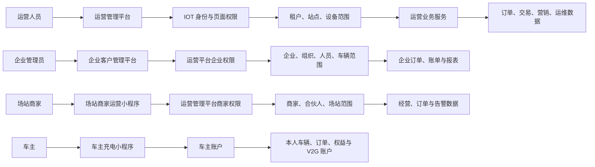
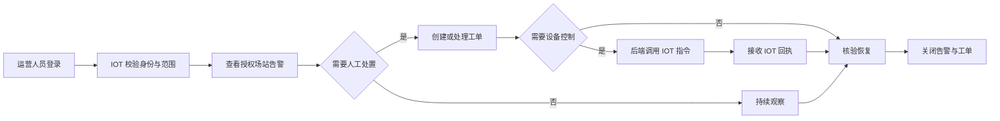
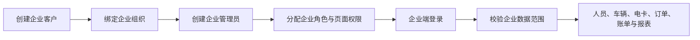
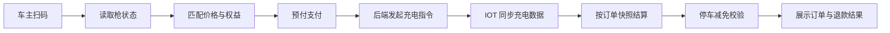

# 项目现状与需求适配评估

> 已归档（2026-08-06）：该评估基于早期“三个小程序”等范围假设，不能作为当前设计依据。当前需求请使用《[菜单架构 v4.1](../../docs/requirements/充电运营平台菜单架构-v4.1.md)》与《[业务规则基线 v4.1](../../docs/requirements/充电运营平台业务规则基线-v4.1.md)》。

## 1. 结论

项目工程目录**具备承载后续文档、代码与交付物的能力**，但内容仍处于骨架阶段；两份来源文档能覆盖泰安项目的业务范围，却不能直接作为最终需求基线。原因是它们都没有按当前“**IOT 管运营管理平台 Web 端权限，运营管理平台管场站商家小程序及企业子系统权限**”的前提重新划分职责。

应先完成权限主数据归属、终端范围、数据边界和第三方依赖四项 P0 决策，再形成可验收的通用平台需求基线。泰安需求表是已验证的客户需求输入；既有 V10 文档是能力库；二者均不能单独决定产品边界。

## 2. 资料格式与内容评估

| 资料 | 格式与规模 | 优点 | 是否可直接作为 PRD |
|---|---|---|---|
| 《山东泰安项目运营平台需求（私有化部署）》 | Excel；1 个工作表；3 列“模块/功能/需求”；有效内容集中在 25 行 | 明确两个 Web 平台、三个小程序、停车/门禁/闸机/银盛等客户范围 | 否，只适合作为客户范围输入 |
| 《充电桩运营管理平台功能矩阵清单 V10》 | Markdown；2,799 行；含版本历史、功能规则、菜单与待决项 | 订单、计费、交易、告警、V2G 等规则细，适合作为能力字典 | 否，需按项目范围和新边界裁剪 |
| 当前 `ev-charging-operations/` | 目录结构完整；除菜单清单和结构说明外，绝大多数文档仅 4-6 行占位 | 已有需求、设计、集成、代码、测试、交付的正确归档位 | 否，尚未具备实施所需内容 |

### 2.1 泰安客户需求表

| 发现 | 影响 | 后续处理 |
|---|---|---|
| 一个单元格列出多个页面、字段、规则与统计项 | 无法直接估算、排期或验收 | 拆成业务目标、用户场景、功能、规则、接口依赖、异常与验收标准 |
| 模块/功能/需求层级混用菜单、字段、按钮和第三方接口 | 信息架构不稳定 | 统一为一级菜单、二级菜单、三级菜单和页面功能规格 |
| 未标注 P0/P1/P2、范围和依赖 | 容易把所有条目误列为一期承诺 | 建立版本范围基线和依赖清单 |
| 未定义权限、刷新频率、数据来源和异常处理 | 交付验收会产生争议 | 为每项功能补充角色、数据来源、权限和验收场景 |
| 只描述“云快充、海康、银盛”等目标 | 无法制定联调和风险计划 | 单列集成需求、甲方前置、测试环境、失败兜底和验收条件 |

**判断**：该表是一期范围的首要依据，但不是可开发 PRD。

### 2.2 既有 V10 功能矩阵

| 发现 | 与当前需求的关系 | 后续处理 |
|---|---|---|
| V9/V10/V10.1/V10.2 与已替代章节共存 | 历史内容易被误认为当前范围 | 只抽取有效能力，建立新的泰安范围基线 |
| 假定运营平台自管租户、角色、菜单和数据权限 | 与“运营端权限在 IOT”冲突 | 删除运营平台内的运营人员权限管理，改为消费 IOT 权限 |
| 包含 IOT API 配置、接口资源、授权与调用日志 | 用户明确不需要平台侧配置 | 移除 UI 需求；仅保留后台适配与业务数据消费 |
| 引用浙江监管协议 | 不等同于泰安项目监管要求 | 按山东/泰安最终规范另立集成需求，不复用浙江字段作为基线 |
| V2G、会员、积分、合伙人、复杂营销范围较大 | 部分不在客户一期明确承诺中 | 作为条件化或二期候选，不自动进入一期 |

**判断**：V10 是能力库；可复用订单快照、交易、告警、模板版本等规则，不可直接作为泰安一期的需求、权限和集成方案。

### 2.3 当前项目目录

| 当前资产 | 评估 | 建议 |
|---|---|---|
| `docs/`、`frontend/`、`backend/`、`platform/`、`tests/`、`delivery/` | 分类正确，已满足后续产物归档的基础条件 | 按 `docs/standards/文档与代码输出归档规则.md` 固定使用 |
| `frontend/web-admin` | 可承载运营管理平台 | 接入 IOT 的运营端身份、页面权限和资产范围 |
| `frontend/operations-dashboard` | 独立运营大屏应用 | 独立部署；大屏指标、布局、主题与轮播统一在运营管理平台配置 |
| `frontend/enterprise-web`、`enterprise-miniapp` | 与企业客户子系统匹配 | 复用运营管理平台管理的企业用户、角色与页面权限 |
| `frontend/charge-miniapp`、`merchant-miniapp` | 与车主、运营商（场站商家）小程序匹配 | 保留；运营商小程序的用户、角色、页面权限与场站范围由运营管理平台统一管理，IOT 提供租户主档和资产同步 |
| `frontend/maintenance-miniapp` | 泰安只明确三个小程序，不含独立运维小程序 | 标记为后续可选，不进入一期 |
| `backend/platform-adapter` | 可承载 IOT、支付、停车、门禁、闸机、监管等适配 | 只做后端集成和转换，不提供 IOT 配置 UI |
| 其他后端服务 | 仅有目录名，没有数据主责定义 | 编码前完成领域边界、服务职责和数据归属设计 |

## 3. P0 权限与主数据模型

### 3.1 归属矩阵

| 身份/终端 | 身份、角色与页面权限主责 | 数据范围主责 | 运营平台职责 |
|---|---|---|---|
| 运营管理平台 Web 用户 | IOT 平台 | IOT 租户、站点、设备、枪范围 | 校验并消费 IOT 权限，不重复建运营端 RBAC |
| 运营大屏用户 | IOT 平台 | IOT 平台 | 仅展示 IOT 授权范围的业务数据 |
| 企业客户管理平台用户 | 运营管理平台 | 企业、组织、人员、车辆、电卡、账务与企业资产运维范围 | 集中维护企业用户、企业角色和企业页面权限 |
| 企业客户小程序用户 | 运营管理平台 | 同一企业客户范围及被授权企业资产 | 企业管理员为主要用户，复用企业 Web 权限模型并支持数据、配置、运维 |
| 车主小程序用户 | 运营管理平台的车主账户域 | 本人车辆、订单、权益与 V2G 账户 | 仅本人资源访问，不使用后台 RBAC |
| 运营商（场站商家）小程序用户 | 运营管理平台 | 运营商、合伙人、场站与设备范围 | 集中维护运营商用户、角色、页面权限与场站范围；IOT 仅提供租户主档与资产同步，M2 仅执行授权 |

### 3.2 不可重复建设的边界

1. 运营管理平台不新建运营人员、运营角色、运营菜单权限和 IOT 租户/场站/设备/枪主档。
2. IOT 平台不管理企业客户组织、企业用户、企业角色、企业页面权限、企业账户、企业订单、发票和营销。
3. 运营商（场站商家）小程序不自行创建角色或管理员；其控制入口统一在运营管理平台“客户与企业 - 运营商（租户）”。
4. 企业客户管理平台不自行创建企业角色或企业管理员；其控制入口统一在运营管理平台“客户与企业 - 企业用户与权限”。
5. IOT API 地址、密钥、Topic、Schema、接口日志、设备协议和原始告警规则不进入任何运营平台菜单。

### 3.3 权限流程图

## 4. 平台职责建议

### IOT 平台

- 多租户、运营人员身份、角色、运营端页面权限、站点/设备/枪数据范围。
- 设备接入、协议、遥测、实时状态、原始告警、远程指令执行与回执。
- 向运营平台提供身份令牌、范围声明及资产/运行数据。

### 运营管理平台

- 订单、价格策略、交易、对账、发票、营销、客户服务、告警处置、工单和报表。
- 企业客户控制平面：企业客户、企业组织、企业用户、企业角色、企业页面权限和企业数据范围。
- 场站商家小程序控制平面：商家、合伙人、现场人员、角色、页面权限和场站数据范围。
- 运营端接口消费 IOT 权限；企业端接口消费本平台企业权限。

### 企业客户子系统

- 企业 Web 与企业小程序共享企业账户、组织、人员、车辆、电卡、订单、账单、发票和报表。
- 不管理站点、设备、枪、设备接入、价格模板或支付商户。

## 5. 关键使用场景

### 场景 A：运营人员处理设备故障

运营人员登录运营管理平台后，由 IOT 校验页面及资产范围。IOT 推送设备故障或恢复事件；运营平台形成业务告警、保护受影响订单、创建工单并记录处置。受控指令由后端发往 IOT，回执回写到运营平台业务记录。

### 场景 B：运营人员开通企业客户管理员

运营人员创建企业客户及企业组织，创建企业管理员并分配企业角色、企业页面权限和企业数据范围。企业管理员登录企业 Web 或企业小程序后，只能管理其授权的人员、车辆、电卡，查询订单、账单、发票和报表，不能访问运营端或 IOT 资产控制页面。

### 场景 C：车主扫码充电与停车减免

车主扫码后，运营平台读取 IOT 同步的枪状态，匹配场站价格、权益和商户。支付成功后后端发起 IOT 启动指令；充电结束按订单快照结算、退款，并在符合规则时进行停车减免。

### 场景 D：第三方设备接入后的运营使用

实施人员在 IOT 平台或项目集成层完成云快充 1.6 等设备接入和协议适配；IOT 将场站、设备、枪与状态同步给运营平台。运营人员只补充运营配置、价格、商户、小程序展示和营销权益，不配置设备 API、鉴权、协议或 Topic。

## 6. 通用平台版本拆解建议

| 优先级 | 范围 |
|---|---|
| P0 | IOT 运营管理平台 Web 权限对接；运营平台商家/企业权限；多渠道支付与监管适配框架；订单/价格/权益快照；监管漏推补推机制 |
| P1 | 场站/设备同步与监控、充电订单、个人预付/余额/营销支付、企业电卡/余额充电、价格策略、企业客户、两个 Web 平台、三个小程序、独立运营大屏、个人/企业发票、停车/门禁/闸机等适配能力 |
| P2 | V2G、授信月结、积分抽奖、复杂营销、合伙人分账、独立运维小程序和高级数据智能；按商业规则、合规与设备能力启用 |

## 7. 必须确认的问题

| 编号 | 问题 |
|---|---|
| D3 | 企业账户是预存、授信、月结还是仅统计展示？ |
| D4 | V2G 是否纳入泰安一期？ |
| D5 | 山东/泰安监管的最终接口规范、测试环境和验收要求是什么？ |
| D6 | 云快充、海康、银盛、门禁、闸机的文档、测试环境和甲方责任人何时提供？ |

## 8. 后续文档最小集

1. `docs/requirements/`：范围基线、术语表、权限矩阵、五端菜单、功能规格、验收清单、版本计划。
2. `docs/design/`：领域边界、权限模型、系统上下文、流程、数据模型、状态机、技术决策。
3. `docs/integrations/`：IOT、支付、停车、门禁、闸机、监管、第三方设备的边界、字段映射、联调和验收。
4. `docs/api/`：运营平台内部 API、企业子系统 API、三个小程序 API 契约；不复刻 IOT API 配置。
5. `delivery/acceptance/`：验收用例、测试证据、客户确认和遗留问题。
