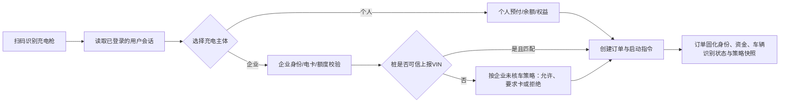

# 充电身份识别与企业车辆核验规则 v1

> 已归档（2026-08-06）：本文件采用个人/企业同一充电小程序的旧前提，不能作为开发依据。当前资料请使用《[菜单架构 v3](../../../docs/requirements/充电运营平台菜单架构-v3.md)》与《[业务规则基线 v2](../../../docs/requirements/充电运营平台业务规则基线-v2.md)》。

> 状态：需求基线草案。目标是在公共充电体验与企业用车管控之间建立可配置、可追溯的规则，不能把车辆 VIN 识别当作所有充电的强制前提。

## 1. 四类对象必须分离

| 对象 | 含义 | 主要来源 | 是否必需 |
| --- | --- | --- | --- |
| 充电枪 | 本次服务发生在哪个枪 | 二维码、设备编号、IOT 实时状态 | 是 |
| 登录用户 | 谁发起了本次充电 | 微信/支付宝授权、手机号、企业账号、卡认证 | 扫码模式下是 |
| 资金承担主体 | 谁为订单付款 | 个人预付/余额、企业账户、电卡、企业授信 | 是 |
| 实际车辆 | 正在充电的车辆 | 用户选择、VIN 读取、车牌、RFID/车机认证 | 公共充电可选；企业受控用能时可强制 |

结论：扫码只能可靠识别“哪把枪”；登录会话识别“谁在发起”；VIN 只能在设备或车机确实上报时识别“哪辆车”。三者不能互相假定。

## 2. 公共充电规则

个人用户在公共充电站**不必先认证、绑定或新增车辆**。最小闭环是：登录用户 + 扫码枪 + 支付资金来源 + 启动确认。

| 场景 | 是否要求车辆绑定 | 支付方式 | 备注 |
| --- | --- | --- | --- |
| 普通扫码预付 | 否 | 微信、支付宝、银联、第三方支付 | 只需确认枪、价格、预付金额和用户授权。 |
| 个人充值余额 | 否 | 个人余额 | 用户存在于“个人用户”台账，不等于会员。 |
| 券/红包/积分活动 | 否 | 个人余额或外部渠道 + 权益 | 只校验权益适用范围，不以 VIN 为前提。 |
| 即插即充/车机认证 | 视能力而定 | 已绑定支付或企业策略 | 必须由设备/车机支持 VIN、ISO 15118、RFID 等可信识别方式。 |

车辆绑定是可选增强能力，用于默认车辆展示、企业授权、车队分析、预约、V2G、即插即充和风控，不得阻断普通公共充电。

## 3. 个人用户与会员的关系

“个人用户”是用户主体；“会员”是可选的权益层，二者不能混为一个菜单或一张台账。

| 平台对象 | 应记录的内容 |
| --- | --- |
| 个人用户档案 | 手机号/第三方身份、注册来源、状态、订单、余额、支付、发票、反馈与隐私授权。 |
| 会员档案 | 等级、购买记录、折扣和有效期；无会员时为空。 |
| 个人余额账户 | 可为零；充值、冻结、扣款、退款和流水。 |
| 预付交易 | 每次扫码预付、渠道回调、结算、差额退款和失败记录。 |

因此，即使用户从未充值或办理会员，运营平台仍可在“客户与企业 - 车主管理”查看其订单、预付支付、退款、发票和客服记录；“营销中心 - 会员管理”只负责有会员权益的用户。

## 4. 企业充电与 VIN 不一致处理

企业资金支付必须先识别“企业身份/资金资格”，再根据车辆识别能力执行策略；不能因为某台设备没有 VIN 上报而错误地假定车辆合规。

| VIN 情况 | 建议默认策略 | 可配置的严格策略 | 必须留痕 |
| --- | --- | --- | --- |
| 设备可信上报 VIN，且与企业绑定车辆一致 | 允许使用企业余额、电卡或额度 | 无需额外校验 | VIN 来源、车辆、企业策略版本、订单快照。 |
| 设备可信上报 VIN，但与企业绑定车辆不一致 | 不使用企业资金，提示改为个人支付或切换正确企业身份 | 直接拒绝启动；或只允许指定白名单车辆 | VIN、比对结果、拒绝/降级原因、操作人。 |
| 设备未上报 VIN | 可使用司机选择的企业身份和电卡/额度，但标记为“未核车” | 要求电卡 + 司机绑定，或禁止企业资金启动 | 无 VIN 标识、身份凭证、车辆选择、策略版本。 |
| 用户手工选择车辆 | 仅作声明和展示，不视为可信 VIN | 可要求二次认证或现场核验 | 选择记录与后续核验结果。 |

企业可按组织、车辆组、场站、时间段配置四种模式：`宽松`（允许未核车）、`卡控`（要求企业电卡或司机凭证）、`VIN 严格`（必须可信 VIN 匹配）、`白名单`（仅指定车辆可用）。企业资金扣款前，应校验企业状态、司机/卡、可用额度、预算、时段、站点和该模式。

### 4.1 VIN 延迟上报或充电中发现不匹配

VIN 有可能在插枪握手后、订单已启动后才由设备上报。因此企业策略必须区分“启动前核验”和“启动后发现异常”：

| 时点 | 推荐处理 | 不建议处理 |
| --- | --- | --- |
| 启动前发现可信 VIN 不匹配 | 不允许使用企业资金；提示切换正确企业车辆或改为个人支付。VIN 严格模式可直接拒绝启动。 | 仅凭用户手工选择车辆即放行企业资金。 |
| 启动后首次上报 VIN 且不匹配 | 将订单标记为“车辆核验异常”，冻结最终企业结算，通知企业管理员；按策略改为个人补缴、企业异常审批承担或事后追偿。 | 为资金问题直接强制停止正在充电的车辆；除非企业已明确启用严格停充策略并完成安全评估。 |
| VIN 缺失或来源不可信 | 保持“未核车”状态，按企业宽松/卡控策略结算，并纳入考核例外报表。 | 把缺失 VIN 误判为车辆匹配。 |

## 5. 设备不识别 VIN 时，平台如何识别身份

当桩不支持 VIN 读取时，平台仍能识别“用户身份”和“资金承担身份”：

1. 用户扫码后，服务端以已登录的小程序会话识别个人账号；二维码/桩号只用于定位枪。
2. 用户在启动前选择“个人充电”或“企业充电”；企业场景再选择企业、成本中心、车辆（可选）或刷/输入企业电卡。
3. 服务端校验企业权限、额度和用能策略后，以订单号绑定用户会话、资金主体和枪，并向 IOT 下发启动指令。
4. 若无可信 VIN，不把“手选车辆”当作车辆真实识别；根据企业策略允许、要求卡认证或拒绝企业资金，订单标记为未核车供报表和考核使用。

## 6. 页面与验收补充

| 端 | 需补充页面/字段 | 验收要点 |
| --- | --- | --- |
| P1 | 车主管理、个人余额、预付交易、企业用能策略、VIN 核验记录 | 能区分普通个人、会员、余额用户、预付用户和企业未核车订单。 |
| M1 | 启动确认、支付方式、企业身份选择、可选车辆选择 | 不绑定车辆的个人可完成预付充电；不得强制新增 VIN。 |
| M3 | 企业用能策略、未核车订单、VIN 异常、车辆白名单 | 企业管理员可按授权配置严格度并追踪异常。 |
| 后端 | 订单身份快照、资金冻结/扣款、VIN 来源可信度、策略版本 | 后续修改车辆、会员、企业额度或策略不得重算历史订单。 |
