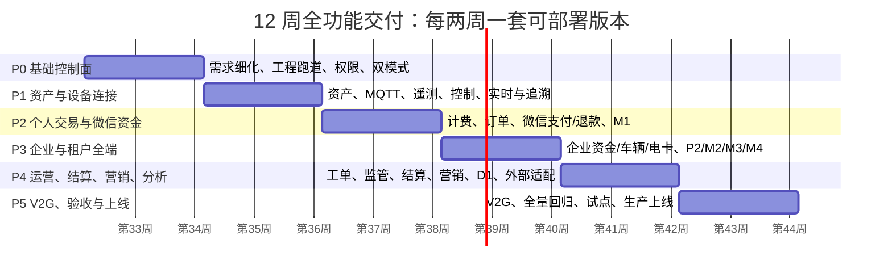

# 充电运营平台 12 周全功能交付实施计划

> 归档状态：已替代，不得作为开发、验收或排期依据。
> 归档日期：2026-08-13
> 归档原因：已由经用户确认的单人主导、AI 辅助、模块严格串行交付计划替代；v2 的并行机制与现行门禁不一致。
> 现行替代：[充电运营平台12周全功能交付实施计划-v3.md](../../../docs/requirements/充电运营平台12周全功能交付实施计划-v3.md)。
> 版本：v2.0（完整交付计划）
> 周期：12 周，自项目启动日记为 `W1`；每周 5 个工作日。
> 目标：在既定 6 服务、7 端、双模式与单机部署架构不变的前提下，完成 v4.1 全部**平台内部功能范围**的开发、测试、部署与验收。微信支付及原路退款必须前置；对公转账、银联、银盛、门禁/道闸等外部适配器后置并以对方联调条件决定是否启用。
> 适用基线：`docs/requirements` v4.1、`docs/design` 现役架构、8 核 32 GB 单机 Docker Compose。

## 1. 计划口径与诚实边界

本计划不再采用“仅 P1 + M1 首发闭环”的范围，而是将 P1、P2、M1–M4、D1 和 6 个后端服务全部纳入 12 周交付。所谓“完成”必须同时具备页面、权限、API/MQTT/事件契约、数据库迁移、自动化测试、异常闭环和可部署版本；仅有页面或接口不算完成。

但第三方接口是否能在某天真正上线，不只由本平台决定。为避免把不可控事项写成虚假承诺，外部能力按以下等级管理：

| 等级 | 能力 | 12 周承诺 | 启用前置条件 |
| --- | --- | --- | --- |
| A：必须 | 微信支付、支付回调、原路退款；至少一类合规 MQTT 上游/真实桩。 | W6 前完成测试环境端到端，W11 前完成上线联调。 | 测试/生产商户、证书、回调地址、测试桩/网关。 |
| B：计划接入 | 支付宝、监管、省市接口、IOT 管理同步。 | 适配器与平台业务闭环在 W10 前完成；按对方联调窗口启用。 | 协议、样例、签名规则、测试环境、对方技术支持。 |
| C：条件接入 | 对公转账、银联、银盛、门禁、道闸、停车、开票。 | W10–W11 完成统一适配框架、业务配置、模拟器与已具备条件的真实联调。未具备条件的连接器保持关闭。 | 客户明确采购/使用该能力，并提供渠道资料和联调窗口。 |

若公司将任一 C 类能力列为“首批客户必须真实启用”，则它自动升为 A 类，必须在 W1 书面确认资料、测试环境和对方责任人；否则 W12 只能交付已测试的适配器实现，不能承诺真实渠道上线。

## 2. 总体交付节奏

| 阶段 | 周期 | 阶段部署版本 | 业务结果 | 领导阶段决策 |
| --- | --- | --- | --- | --- |
| P0 | W1–W2 | `R0-foundation` / 开发环境 | 可启动平台、统一登录、权限、双模式初始化与全链路契约底座。 | 确认范围、外部渠道分级、试点站与验收责任人。 |
| P1 | W3–W4 | `R1-connectivity` / Alpha | 完成资产、设备接入、实时状态、分钟遥测、控制和追溯。 | 允许真实设备/IOT 接入测试。 |
| P2 | W5–W6 | `R2-consumer-charge` / Beta | 完成个人找站、扫码充电、微信支付/退款、订单/资金异常闭环。 | 允许限定用户与站点进行交易试运行。 |
| P3 | W7–W8 | `R3-enterprise-tenant` / Beta+ | 完成企业、车辆、电卡、企业资金、P2/M2/M3/M4 与租户协同。 | 确认企业试点数据与权限验收。 |
| P4 | W9–W10 | `R4-operations` / Pilot | 完成运维、结算、票据、营销、分析、监管、D1 与条件适配器。 | 审核外部渠道联调结果与上线清单。 |
| P5 | W11–W12 | `R5-release-candidate` → `R6-production` | 完成 V2G、全量回归、性能/安全/恢复、UAT、试点与生产发布。 | 生产 Go / No-Go。 |

## 3. 全菜单与服务覆盖矩阵

为避免在不支持 Markdown 表格的导出环境中丢失结构，以下按平台与服务列出各阶段交付内容；“—”表示该阶段不新增范围。

### 运营与客户触点

#### P1 运营管理 Web

- P0：权限、基础设置、应用/渠道安全配置。
- P1：资产、实时监控、协议追溯、告警基础。
- P2：计费、订单、售后、个人资金。
- P3：租户/企业、企业资金、结算基础。
- P4：运营、工单、营销、票据、监管、分析、大屏配置。
- P5：V2G、全量验收与优化。

#### P2 企业 Web

- P0：登录框架与权限投影。
- P1–P2：—。
- P3：企业组织、车辆、电卡、资金、订单、发票、报表。
- P4：完整权限/审计与结算查询。
- P5：UAT 与体验修复。

#### M1 个人小程序

- P0：登录/公共组件。
- P1：找站、站点详情、实时枪口状态。
- P2：扫码充电、微信支付、订单、钱包/退款。
- P3：权益入口、客服/认证/收藏。
- P4：营销、发票、停车协同入口。
- P5：V2G、全量回归。

#### M2 企业充电小程序

- P0：登录框架。
- P1：可用站点与实时状态。
- P2：—。
- P3：企业扫码/VIN/电卡、订单、额度、帮助。
- P4：数据与异常体验完善。
- P5：V2G、全量回归。

#### M3 租户运营小程序

- P0：登录/工作空间框架。
- P1：场站/设备实时只读。
- P2：订单协办框架。
- P3：工作台、场站运营、订单/工单、空间切换。
- P4：数据、结算协同、通知。
- P5：全量回归。

#### M4 企业管理小程序

- P0：登录框架。
- P1：场站实时只读。
- P2：—。
- P3：工作台、成员/车辆/电卡轻管理、订单。
- P4：数据、发票、费用与异常。
- P5：全量回归。

#### D1 运营大屏

- P0：—。
- P1：实时数据接口。
- P2：订单/营收接口。
- P3：企业/租户指标接口。
- P4：专题、布局、发布、监管/运维。
- P5：V2G 专题与压测。

### 后端服务

#### `api-gateway`

- P0：路由、鉴权、限流、TraceId。
- P1：WebSocket 与设备/查询网关策略。
- P2：支付回调隔离。
- P3：多端应用路由与工作空间。
- P4：导出/大屏限流。
- P5：压测/安全加固。

#### `platform-service`

- P0：`iam`、`master` 基线。
- P1：`master`、`operations` 基础。
- P2：`trade`、计费、售后。
- P3：`customer`、租户、企业协作。
- P4：`marketing`、运营、监管、分析编排。
- P5：`v2g`、全量缺陷修复。

#### `finance-service`

- P0：账本框架与迁移。
- P1：—。
- P2：个人资金、冻结、结算、退款。
- P3：企业资金、卡/分组额度。
- P4：租户结算、付款、对账、票据。
- P5：V2G 收益与全量对账。

#### `device-connectivity-service`

- P0：协议/同步 API 契约、初始化模式。
- P1：MQTT、命令、回执、原文、IOT 同步。
- P2：订单上报、离线补报。
- P3：企业 VIN/电卡关联输入校验。
- P4：固件/定时控制、适配器联动。
- P5：V2G 指令/计量与恢复演练。

#### `telemetry-service`

- P0：指标目录与存储模型。
- P1：Redis、分钟归并、ClickHouse、WebSocket。
- P2：订单关联指标。
- P3：企业/租户投影。
- P4：报表、大屏、导出、指标聚合。
- P5：V2G 指标、容量验证。

#### `integration-service`

- P0：适配框架、凭据引用、模拟器。
- P1：—。
- P2：微信支付/退款。
- P3：支付宝与企业渠道框架。
- P4：监管、开票、对公/银联/银盛、门禁道闸（条件启用）。
- P5：渠道联调、对账、故障演练。

## 4. 12 周逐周计划

### P0：基础控制面与工程跑道（W1–W2）

| 周 | 详细需求与菜单 | 开发与部署工作 | 验收和汇报 |
| --- | --- | --- | --- |
| W1 | 冻结全功能范围并按本计划建立任务清单；完成 P1「系统与配置」「权限管理」、P1 租户/企业权限、双模式、7 端登录与数据范围的详细需求；确认 A/B/C 类外部渠道。 | 建立 Maven/pnpm workspace、6 服务骨架、10 schema Flyway 入口、OpenAPI/MQTT/事件契约、Compose、CI、初始化脚本；实现部署模式锁定、平台管理员、菜单和角色种子数据。 | **M0 开工评审**：领导签范围、试点与渠道优先级；环境可一键启动；所有服务健康检查通过。 |
| W2 | 完成 P1「基础设置、应用与内容、支付渠道与路由、结算渠道配置」的详细需求，但敏感凭据只作受控引用；完成 P1 资产、M1 找站、设备协议的 W3–W4 需求。 | 实现网关鉴权/限流/TraceId、IAM、菜单/角色/数据范围、租户授权上限、独立/IOT 模式写入拦截、审计日志；前端完成 P1、P2、M1–M4、D1 的登录壳和公共包。 | **R0 部署**：登录、角色、菜单、模式锁定演示；CI 编译、迁移、契约、安全基线通过。 |

### P1：资产、设备连接、实时与追溯（W3–W4）

| 周 | 详细需求与菜单 | 开发与部署工作 | 验收和汇报 |
| --- | --- | --- | --- |
| W3 | 完成 P1「场站管理、设备管理、资产字段模板、服务配置、实时监控、远程操作记录」及 M1/M2/M3/M4 场站实时页详细需求。 | `master` 完成租户、场站、设备、枪口、能力、字段来源规则；独立模式资产配置；协同模式 IOT HTTP/HTTPS 同步收件箱、Outbox 与只读投影；MQTT 客户端、设备编号/签名/Schema 校验。 | P1 资产增删改查（协同模式只读）、设备注册和拒绝未登记设备；P1/M1–M4 可查看站点和枪口状态。 |
| W4 | 完成 P1「设备数据分析、场站数据分析、设备协议追溯、告警管理」及设备控制/离线订单的详细需求。 | 遥测 Kafka 链路、Redis 最后有效值、ClickHouse 分钟归并/核心指标、WebSocket；命令/回执、原文对象归档、告警事件、协议证据链、查询权限与审计。 | **R1 / Alpha**：真实或模拟设备 MQTT 上报、乱序/重复处理、控制回执、原文—分钟—实时追溯、分钟曲线、IOT 同步的完整演示。 |

### P2：个人充电、微信支付、退款与订单资金闭环（W5–W6）

| 周 | 详细需求与菜单 | 开发与部署工作 | 验收和汇报 |
| --- | --- | --- | --- |
| W5 | 完成 P1「充电计费管理、企业协议价、充电订单、占位提醒、退款与补差、个人资金管理」和 M1「找站、扫码充电、订单」详细需求。 | 费率/价格版本、启动校验、充电会话、订单状态机、价格快照、占位提醒；M1 地图/搜索/站点详情/扫码/选枪/启动；设备订单上报与控制编排。 | 在模拟桩完成找站—扫码—启动—实时充电—结束的非支付订单链路；价格变更不影响历史订单。 |
| W6 | 完成 M1「钱包与充值、订单售后、发票入口、个人资料」和微信支付/退款异常规则的详细需求。 | `finance-service` 个人账户、分录、冻结/释放/结算；`integration-service` 微信下单、回调验签、原路退款、渠道原文审计；支付/订单/资金幂等与对账；M1 支付、充电中、结束、订单、钱包/退款页面。 | **R2 / Beta**：真实测试商户完成支付、重复回调、退款、设备离线→异常待处理→订单补报→自动结算/释放冻结；领导审批限定站点试运行。 |

### P3：企业、租户与四个管理端（W7–W8）

| 周 | 详细需求与菜单 | 开发与部署工作 | 验收和汇报 |
| --- | --- | --- | --- |
| W7 | 完成 P1「个人用户、企业管理、企业成员账户、企业车辆/电卡、租户管理、合作方」和 P2/M2/M4 企业管理全部页面的详细需求。 | 企业档案、组织/成员、车辆与分组、电卡与分组、额度/可用站点、VIN/电卡鉴权；企业用户与 P2/M2/M4 数据范围；P2 企业总览/组织/车辆电卡/订单/发票，M2 企业充电，M4 轻量企业管理。 | 企业管理员可维护授权范围内企业资料；员工以 VIN 或电卡发起企业订单；P2/M2/M4 无越权数据与个人钱包混用。 |
| W8 | 完成 P1「企业资金账户、企业充值明细、结算账户、场站结算方案、租户结算账单、付款与回单」和 M3「工作台、场站运营、订单、我的」详细需求。 | 企业资金账本、分组资金/卡余额、冻结扣款、企业订单结算；租户结算方案/账单/对账/付款状态机；M3 平台/租户工作空间、待办、订单协办、工单入口；P2/M4 企业费用与数据报表。 | **R3 / Beta+**：个人、企业 VIN、电卡三类订单均可对账；租户无法读取个人/企业资金；M3 空间切换重新鉴权；企业 P2/M2/M4 UAT。 |

### P4：运营深化、营销、分析、监管与条件接入（W9–W10）

| 周 | 详细需求与菜单 | 开发与部署工作 | 验收和汇报 |
| --- | --- | --- | --- |
| W9 | 完成 P1「运维工单、场站定时充电策略、停车/出入口/园区协同、应用内容、消息公告、营销全域」及 M1 权益、M3/M4 数据页详细需求。 | 告警—工单—SLA、策略执行与控制审计；会员、券、红包、积分、活动、预算、精准营销、消息；停车/门禁/道闸业务映射；小程序内容、发布/灰度、公告通知；多维实时/历史分析与导出。 | 运营人员可从告警建工单、按策略控制；M1 可领取/核销权益；M3/M4 可看授权数据；所有批量/高风险操作保留审批与审计。 |
| W10 | 完成 P1「渠道与账务对账、用户/租户票据、监管档案/报送/补推/对账、经营/收益/资产分析、大屏配置与发布」以及 D1 全部专题详细需求。 | 监管任务/回执/补推、开票与对账、收益/成本/电量指标、D1 专题与发布；接入支付宝、对公、银联、银盛、门禁/道闸、停车、开票等适配器：有联调条件即真实接入，无条件则以模拟器和关闭的连接器交付。 | **R4 / Pilot**：运营、营销、结算、监管、大屏完整演示；提交外部渠道“已启用/待联调/不适用”清单给领导决策。 |

### P5：V2G、全量质量、试点与生产上线（W11–W12）

| 周 | 详细需求与菜单 | 开发与部署工作 | 验收和汇报 |
| --- | --- | --- | --- |
| W11 | 完成 P1「V2G 运营」、M1/M2「V2G 放电」、D1 V2G 专题及所有跨端异常/帮助/设置的详细需求。 | V2G 授权、策略、放电会话/订单、独立收益账户、放电价格、结算、提现、计量、风控、监管数据；全量 E2E、权限、安全、性能、积压恢复、备份恢复和回滚演练。 | **R5 / Release Candidate**：全菜单走查；P1/P2/M1–M4/D1 的角色和数据范围验收；资产/订单/资金/遥测/监管/V2G 的一致性报告。 |
| W12 | 不再新增需求；只处理缺陷、客户数据导入、部署、培训和上线决策。 | UAT 缺陷闭环、真实设备/IOT/支付/必需渠道终验、发布签名、离机备份、监控告警、上线与回滚 Runbook、试点数据迁移。 | **R6 / Production**：生产 Go/No-Go；试点上线、值守与日报；未具备外部资料的 C 类连接器维持关闭并进入后续变更单。 |

## 5. 详细需求与开发并行机制

菜单 v4.1 已定义“做什么”，但不足以直接编码。每个阶段按**提前一周细化、当周开发、周末验收**滚动：

| 时点 | 必须产物 | 责任结论 |
| --- | --- | --- |
| 阶段前一周 | 《阶段详细需求包》：页面字段、角色/数据范围、操作、审批、正常/异常流程、验收用例。 | 业务负责人确认“做什么、不做什么”。 |
| 开发第 1 天 | OpenAPI、MQTT Schema、事件、数据库迁移、错误码与 Mock。 | 后端、前端、测试以同一契约开工。 |
| 开发中 | 后端、前端、测试并行；每个菜单同时完成权限、审计、迁移、自动化测试。 | 禁止“后端全做完才做前端”。 |
| 周四 | 集成测试、演示录屏、缺陷分级和外部联调状态。 | 不通过即滚入下一周并显示影响。 |
| 周五 | 领导演示/周报和阶段 Go/No-Go。 | 未验收功能不得标记完成。 |

## 6. 分阶段部署、试点和领导汇报

| 节点 | 部署内容 | 可见成果 | 领导必须决策 |
| --- | --- | --- | --- |
| W1（M0） | 计划、范围、依赖责任表。 | 全功能地图、12 周路径、外部渠道分级。 | 试点客户/站、A 类渠道、外部接口责任人。 |
| W2（M1） | R0 到 `dev`。 | 可启动架构、登录权限、模式锁定、CI。 | 是否进入真实设备开发。 |
| W4（M2） | R1 到 `alpha`。 | 资产、MQTT、实时、遥测、控制、追溯。 | 是否允许真实桩/IOT 接入。 |
| W6（M3） | R2 到 `beta`。 | M1 微信支付/退款和订单资金闭环。 | 是否开放白名单用户交易试运行。 |
| W8（M4） | R3 到 `beta+`。 | 企业、租户、P2/M2/M3/M4 全端功能。 | 是否导入企业试点数据。 |
| W10（M5） | R4 到 `pilot`。 | 运营、营销、分析、监管、大屏、外部接入状态。 | 确认 C 类渠道启用清单和剩余风险。 |
| W11（M6） | R5 到 `pilot`。 | V2G、全量回归、性能/恢复/安全报告。 | 生产上线 Go/No-Go 预审。 |
| W12（M7） | R6 到 `production`。 | UAT、部署、回滚、培训与值守。 | 正式上线批准。 |

每周五固定提交一页实施周报：已验收菜单与版本、计划偏差、P0/P1 缺陷、设备/支付/IOT/监管联调状态、性能与备份恢复结果、需要领导协调的事项。只报告已验证事实，不以代码行数或页面数量替代进度。

## 7. 完整交付验收标准

### 7.1 功能与终端

- P1、P2、M1、M2、M3、M4、D1 菜单 v4.1 均有已验收的页面、对应 API 与权限；未启用的外部能力必须有明确“未配置/不可用”状态，不允许展示假功能。
- 独立模式允许平台维护租户、资产与权限；IOT 协同模式仅接收 IOT 主数据同步并禁止平台越权修改；企业充电客户成员、角色与页面权限两模式均由平台维护。
- 所有设备数据和控制统一经 MQTT；IOT 主数据同步仅经 HTTP/HTTPS API；设备未登记不得接入。

### 7.2 关键正确性

- 个人、企业 VIN、企业电卡、V2G 四类订单拥有独立且可追溯的状态、价格、资金/收益与计量事实。
- 微信支付与原路退款通过真实测试环境；重复回调、重复报文、乱序、设备离线、补单、Kafka 积压、服务重启均不造成重复扣款或数据静默丢失。
- Redis 仅为实时投影，ClickHouse 永久保存分钟最后有效值，原始 MQTT/API 报文按规则归档且 P1 可受控追溯。
- 支付、对账、结算、监管、控制与 V2G 的失败均有告警、重试/补偿、审计和人工处置入口。

### 7.3 交付与运行

- 单机 Compose 包、初始化脚本、部署/回滚、备份/恢复、配置模板、监控告警、用户培训、运维手册完整。
- 所有 A 类能力和客户指定为必须的 B/C 类能力均完成真实联调与 UAT；未具备对方资料的条件能力必须关闭、明确记录并从本次上线验收范围排除。
- 通过权限隔离、安全扫描、契约测试、全端 E2E、目标环境性能测试、Kafka 积压恢复和空环境恢复演练后，方可生产上线。

## 8. 12 周成立的必要投入与风险

12 周覆盖全部功能的前提，是项目采用并行推进，而不是一人串行开发七端和所有集成。AI 可以承担代码、测试、文档、脚本和缺陷修复的主要执行工作，但以下事项必须由公司或合作方在时限内提供：

| 必要条件 | 最晚时间 | 未满足的直接影响 |
| --- | --- | --- |
| 每日可确认业务规则的产品/业务负责人 | W1 起持续 | 需求无法冻结，后续每周都会顺延。 |
| MQTT 协议样例、模拟器、至少一种真实桩/网关 | W2 | P1/P2 只能完成模拟，不能验收设备链路。 |
| 微信测试商户、退款权限、回调环境 | W3 | W6 无法完成支付/退款验收，不能开放交易试运行。 |
| IOT 同步签名、资产样例、重复/乱序样例与联调窗口 | W3 | 协同模式只能实现模拟接口。 |
| 企业/租户试点数据和验收人员 | W7 | W8 无法完成企业端 UAT。 |
| 监管与 C 类渠道的技术资料、沙箱、证书、对方负责人 | W1 确认，W8 前到位 | 只能保持连接器关闭，不能把对应真实接口列入生产启用。 |
| Linux 服务器、独立数据盘、离机备份目标、域名/TLS、告警通道 | W8 | W11 无法完成恢复演练，W12 不应生产上线。 |

严肃的反对意见是：如果上述外部条件不按时提供，却仍要求“所有真实渠道都上线”，12 周计划必然失真。正确做法不是压缩测试，而是将渠道启用与平台功能完成分开管理，并在每个里程碑明确 Go/No-Go。
