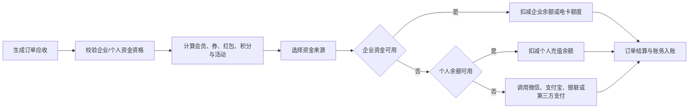
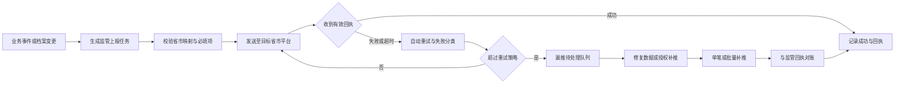

# 通用充电运营平台全场景功能规划 v1

> 已归档（2026-08-06）：本文件早于“四个小程序、企业受控授信、车队锁定资金、电卡资金池”决策，不能作为开发依据。当前资料请使用《[菜单架构 v3](../../../docs/requirements/充电运营平台菜单架构-v3.md)》与《[业务规则基线 v2](../../../docs/requirements/充电运营平台业务规则基线-v2.md)》。

**状态**：草案  
**定位**：面向多运营商、多客户、多省市、多支付渠道的产品能力基线。泰安需求是已验证的客户场景之一，不再作为产品边界。  
**前提**：IOT 平台负责多租户、站点设备接入与运营管理平台 Web 端页面权限；运营管理平台负责充电运营业务、运营商（租户）运营小程序及企业客户子系统的用户、角色、页面权限。

## 1. 产品化原则

1. **一套核心能力，多套策略配置**：不同客户、城市、运营商、支付渠道、企业规则和小程序品牌采用配置、模板、适配器和开关实现，不为单一客户复制业务代码。
2. **资产与运营分离**：IOT 是租户、站点、设备、枪、遥测、原始告警和运营端权限的主责；运营平台是订单、价格、资金、客户、企业、营销、监管业务的主责。
3. **客户模型分层**：个人车主、企业客户、场站商家、合伙人、运营商是不同业务主体，账户、权限、资金和发票不能混用。
4. **价格、支付、结算分离**：价格策略决定应收；支付方式决定资金来源；结算决定订单完成、退款、企业归集和开票。
5. **监管适配产品化**：省市监管按“协议适配器 + 省市参数档案 + 字段映射 + 上报任务 + 回执/补推记录”建设，不将单省协议硬编码进订单逻辑。
6. **全链路可追溯**：订单、价格、权益、资金、监管报文、指令和审计都拥有唯一标识、状态、时间线、操作者和历史快照。

## 2. 核心可配置对象

| 对象 | 适用差异 | 典型内容 |
|---|---|---|
| 运营商档案 | 不同运营主体和监管身份 | 法人/运营商名称、统一标识、所属省市、监管资质、商户与开票主体关联 |
| 省市监管档案 | 不同省市协议和环境 | 协议版本、测试/生产地址、开通能力、运营商参数引用、字段映射版本、频率与补传规则 |
| 站点运营策略 | 不同场站和客户 | 价格模板、支付渠道、可用小程序、停车/门禁、预约、占位费、展示和营销范围 |
| 价格策略 | 不同地区、时段、客户 | 充电电价、服务费、V2G 用户收益、购电成本、上网电价、占位费、企业协议价 |
| 支付渠道适配器 | 不同支付服务商 | 微信、支付宝、银联、第三方支付的商户、能力、回调、退款、对账与风控能力 |
| 企业用能策略 | 不同企业的用车管理 | 企业预付账户、余额分配、电卡、车辆/司机限额、部门成本中心、考核与账期 |
| 营销策略 | 不同用户和活动 | 会员、余额、券、红包、积分、活动、白名单、企业优惠和使用优先级 |
| 小程序品牌档案 | 不同运营商/客户品牌 | 微信/支付宝主体、品牌、主题、内容、可展示场站、支付可用范围 |

## 3. 运营管理平台功能域

| 一级功能域 | 二级能力 | 关键功能 |
|---|---|---|
| 工作台 | 运营总览、待办、经营大屏配置 | 经营指标、异常待办、经营趋势、独立大屏主题/指标/轮播/刷新策略配置 |
| 场站设备 | 场站运营、设备视图、配套设施 | IOT 同步资产只读、场站运营配置、商户/小程序关联、停车/门禁/闸机、固件任务与设备经营概况 |
| 订单运营 | 充电、V2G、预约、异常 | 订单全生命周期、分时明细、补单、异常订单、预约、远程控制业务编排 |
| 客户运营 | 个人车主、企业客户、场站商家、企业权限 | 车主、车辆、企业档案、商家档案、企业组织、商家/企业用户、角色、页面权限和数据范围 |
| 产品营销 | 会员、账户产品、营销活动 | 会员等级/权益、个人充值余额、优惠券、红包、积分、活动、白名单、企业优惠与核销统计 |
| 价格策略 | 用户价格、企业价格、成本价格 | 充电价、服务费、企业协议价、V2G 价、购电/上网价、占位费、版本与场站应用 |
| 资金财务 | 交易、账户、对账、发票、结算 | 多渠道交易、个人/企业账户、退款、渠道对账、企业账单、个人/企业开票、合伙人结算 |
| 运维管理 | 告警、工单、设备控制 | IOT 告警业务处置、工单、指令编排、设备安全、运行日志和审计 |
| 数据报表 | 运营、财务、客户、企业、设备 | 充电/放电、交易/对账、营销、企业费用、设备/站点历史和导出 |
| 监管合规 | 运营商、协议、上报、补推、审计 | 运营商监管身份、省市监管档案、数据映射、上报任务、回执、漏推监控、补推和对账 |
| 系统管理 | 商户、小程序、全局参数、隐私 | 多支付商户、多个微信/支付宝小程序、业务参数、协议隐私、私有化部署与备份 |

### 3.1 权限与终端归属

| 终端 | 用户与页面权限来源 | 说明 |
|---|---|---|
| 运营管理平台 | IOT 平台 | IOT 下发/校验运营人员的租户、站点、设备与页面范围；运营平台不自建第二套运营管理 Web 端 RBAC |
| 运营商运营小程序（场站商家端） | 运营管理平台 | 运营管理平台维护运营商用户、角色、页面权限和运营商/场站范围；IOT 仅提供租户主档与资产范围同步，M2 仅执行授权 |
| 运营大屏独立应用 | IOT 平台 | 独立部署、独立展示；指标、布局、主题与轮播由运营管理平台配置 |
| 企业客户管理平台/小程序 | 运营管理平台 | 企业管理员为主要使用者；运营平台集中管理企业用户、企业角色、页面权限和企业/组织数据范围 |
| 车主小程序 | 运营管理平台车主账户域 | 仅访问本人车辆、订单、余额、权益、发票和 V2G 账户 |

## 4. 五端功能规划

### 4.1 运营管理平台

1. 对运营人员开放 IOT 授权的菜单与数据范围；企业用户、企业角色和企业页面权限在“客户运营 - 企业客户”集中维护。
   场站商家小程序的商家用户、角色、页面权限和场站范围在“客户运营 - 场站商家”集中维护。
2. 大屏设置只在本平台配置：指标库、筛选维度、看板布局、刷新间隔、轮播方案、主题、告警阈值和大屏访问白名单；独立大屏应用只读取已发布配置。
3. 监管合规模块支持多运营商、多省市、多环境、多协议版本并行；敏感参数仅保存密钥库引用、版本、状态和轮换日期，不显示明文。

### 4.2 企业客户管理平台与企业客户小程序

| 能力 | 企业 Web | 企业小程序 |
|---|---|---|
| 企业组织、人员、车辆、电卡 | 完整维护、批量导入导出 | 查询、维护与按授权配置 |
| 企业账户、余额分配、预算、考核 | 完整配置与审批 | 查询、确认、提醒与按授权配置 |
| 企业订单、账单、报表、发票 | 全量查询、汇总与导出 | 查询、查看进度、导出申请 |
| 企业场站运维 | 企业自有/被授权资产的监控、告警、工单与验收 | 现场查看、告警处置、工单与验收；不管理 IOT 接入 |
| 企业权限 | 不提供自建入口，仅使用运营平台授予权限 | 同企业 Web |

### 4.3 车主充电小程序

同一车主小程序必须基于“当前充电主体/资金来源”支持个人与企业两种场景，而不是建设两套扫码页。

| 场景 | 充电主体 | 资金来源 | 主要校验 | 订单与发票归集 |
|---|---|---|---|---|
| 普通个人预付 | 个人车主 | 微信/支付宝/银联/第三方支付 | 场站、枪、支付渠道、最低预付额 | 个人订单；按订单商户申请个人发票 |
| 个人余额支付 | 个人车主 | 会员充值余额 | 余额可用性、余额冻结、权益适用性 | 个人账户流水、订单、个人开票 |
| 个人营销支付 | 个人车主 | 现金/余额 + 券/红包/积分/活动 | 券品可用性、叠加规则、核销次数和权益快照 | 个人订单、营销核销和个人开票 |
| 企业电卡充电 | 企业车辆/司机 | 企业预分配电卡 | 卡状态、车辆/司机绑定、企业额度、站点范围和考核规则 | 企业订单、企业成本中心、企业发票池 |
| 企业余额充电 | 企业车辆/司机 | 企业预付账户的个人/车辆配额 | 企业账户、司机/车辆配额、日月限额、预算和余额 | 企业订单、企业账户扣减、企业账单与企业开票 |
| 企业后结算 | 企业车辆/司机 | 企业授信/账期 | 企业合同、授信额度、账期、超额规则 | 企业应收账单、企业发票与对账 |

### 4.4 运营商运营小程序（场站商家端）

- 场站商家在产品上等同于运营商/租户。M2 的用户、角色、页面权限和运营商/场站范围由运营管理平台维护；IOT 仅提供租户主档、资产和实时数据同步。
- 覆盖经营概览、实时场站/枪状态、告警待办、订单查询、收入/电量/利用率趋势、合伙人账单、消息与帮助。
- 不提供价格、支付商户、企业权限、监管参数或 IOT API 配置；高风险操作跳转运营管理平台或经后端受控执行。

## 5. 价格、支付与营销结算

### 5.1 支付渠道与商户模型

| 类别 | 需要支持的能力 |
|---|---|
| 微信支付 | 多商户、多小程序主体、JSAPI/小程序支付、退款、转账（如 V2G）、回调验签、对账 |
| 支付宝 | 多商户、多小程序主体、支付、退款、转账（如 V2G）、回调验签、对账 |
| 银联 | 商户接入、支付、退款、回调、对账；具体载体按银联合作模式确定 |
| 第三方支付 | 适配器注册、商户档案、能力声明、支付/退款/回调/对账、限额与风控；例如银盛 |
| 企业内部资金 | 企业预付账户、企业卡、个人/车辆余额配额、授信/账期和成本中心归集 |

**路由规则**：支付渠道不是固定在小程序上，而是由“场站可用渠道 + 场站绑定商户 + 用户当前资金来源 + 订单类型 + 企业规则”共同决定。每笔订单固定记录渠道、商户、资金账户、营销抵扣、费率和路由版本。

### 5.2 扣款与优惠优先级

建议按可配置的支付编排执行，而非硬编码；默认顺序如下：

**规则要求**：

- 营销抵扣的可叠加性、先后顺序、封顶金额和退还策略由营销规则配置；订单保存权益快照。
- 企业资金先校验企业、组织、车辆、司机、电卡、额度、预算、站点和时间窗口，再创建冻结/扣减记录。
- 企业可按车辆、司机、部门、成本中心、项目、班组配置日/月次数、度数、金额、时段、站点范围和超额处理；考核报表按同一规则归集。
- 退款必须按原资金来源拆分返还：企业账户退企业、个人余额退个人余额、外部渠道原路退回；已核销券/红包/积分的返还规则可配置并留审计。

### 5.3 发票规划

| 发票场景 | 规则 |
|---|---|
| 个人发票 | 车主按本人订单申请；按订单所属收款商户自动拆分，使用对应开票主体 |
| 企业发票 | 企业管理员按企业账户/电卡/企业订单申请；支持按账期、成本中心、部门或订单归集，仍按实际开票主体和商户边界拆分 |
| 混合支付订单 | 按实际付款与企业结算规则确定可开票金额和抬头；不得把个人承担部分自动计入企业发票 |
| 红冲/重开 | 保留原发票、作废/红冲原因、重开版本、关联订单和审计记录 |

## 6. 省市监管接入与数据可靠性

### 6.1 省市监管档案

新增省级平台入网参数表证明监管对接至少需要运营商识别、对端与本方的认证/加密/签名材料、测试/生产环境地址和已开通功能。平台只记录下列**脱敏元数据**，密钥原文存放密钥管理系统：

| 配置项 | 内容 |
|---|---|
| 运营商监管身份 | 运营商名称、组织/运营商标识、所属省市、资质状态和生效期 |
| 平台档案 | 省市、平台名称、协议版本、测试/生产环境、启停状态、对接责任人 |
| 安全材料引用 | 认证、加密、签名、初始化向量等密钥的密钥库引用、版本、轮换时间、脱敏状态 |
| 开通能力 | 档案查询/上报、状态推送、订单推送、控制能力、安全数据等，按对端实际开通项配置 |
| 数据映射 | 接口版本、字段/枚举映射、必填校验、批量大小、频率、幂等键和顺序规则 |
| 运行策略 | 超时、自动重试、补推窗口、人工补推权限、告警阈值、保存期限和对账周期 |

### 6.2 监管上报能力清单

1. 运营商、站点、价格、设备、枪口等档案的首次上报、变更上报、撤销/停运上报。
2. 站点、设备、枪状态、功率、告警与安全数据的实时或准实时推送。
3. 充电订单创建、开始、进行中、结束、补单、退款及订单明细上报；按省市规范扩展 V2G 等数据。
4. 接口调用、回执、业务错误、签名/加密失败、字段校验失败和对账差异的完整记录。
5. 漏推检测、自动重试、失败队列、批量/单笔补推、补推审批、重放审计和监管侧回执对账。

### 6.3 漏推、补推与对账流程

**可靠性要求**：

- 每条监管任务有内部任务 ID、业务主键、目标省市、接口版本、幂等键、序号/版本、创建时间、发送次数、最后错误、回执和操作审计。
- 业务订单和监管上报解耦：监管失败不能回滚已完成支付或充电订单，但必须触发待处理告警并允许合规补推。
- 补推前校验订单/档案当前状态、目标接口版本、重复上报风险与补推权限；补推记录不得覆盖原失败记录。
- 支持按运营商、省市、接口、业务类型、时间、状态查询漏推；支持监管侧查询/账单或回执导入后的差异对账。

## 7. 独立运营大屏

运营大屏为独立应用 `frontend/operations-dashboard/`，但其配置归运营管理平台。

| 能力 | 归属 |
|---|---|
| 大屏认证与数据范围 | IOT 平台运营端权限 |
| 指标、布局、主题、轮播、刷新周期、告警阈值配置 | 运营管理平台 |
| 运行展示 | 独立运营大屏应用 |
| 资产、状态和遥测来源 | IOT 平台同步数据 |
| 订单、资金、营销和监管指标来源 | 运营管理平台业务数据 |

## 8. 建议交付优先级

| 优先级 | 目标 |
|---|---|
| P0 | 权限边界、运营商与监管档案、监管可靠性框架、支付渠道适配框架、订单/价格/权益快照、企业账户与分配模型 |
| P1 | 两个 Web 平台、三个小程序、独立运营大屏、个人预付/余额/营销支付、企业电卡/余额充电、个人/企业发票、核心监管上报、漏推补推、停车/门禁/闸机适配 |
| P2 | V2G、授信月结、复杂考核、积分抽奖、合伙人分账、跨运营商结算、高级数据智能；按商业和合规前置条件启用 |

## 9. 安全提示

来源的省级平台入网参数表含认证、加密、签名等明文敏感材料以及环境地址。该文件不得提交到仓库、不得复制到需求/代码文档、不得用于测试环境之外；应由项目安全负责人立即确认密钥轮换、保管系统和访问审计。
