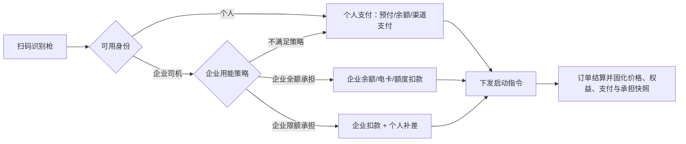
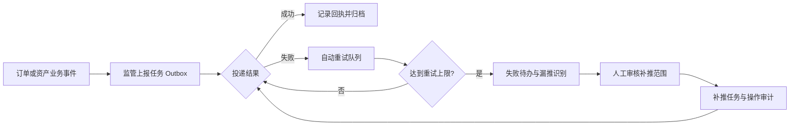

# 通用充电运营平台菜单架构 v2

> 已归档（2026-08-06）：本文件与“个人/企业合并充电小程序”“企业管理小程序含充电”“企业资金无/有授信的旧规则”存在冲突，不能作为开发依据。当前资料请使用《[菜单架构 v3](../../../docs/requirements/充电运营平台菜单架构-v3.md)》与《[业务规则基线 v2](../../../docs/requirements/充电运营平台业务规则基线-v2.md)》。

> 状态：需求基线草案；适用对象：多运营主体、多租户、多省市监管、多支付渠道的充电运营产品。
>
> 本文替代旧版五端菜单清单作为后续评审基线。泰安需求是已覆盖的客户场景，不是一级菜单和产品能力的边界。

## 1. 产品边界与命名规则

| 产品编号 | 统一名称 | 主要使用者 | 权限归属 |
| --- | --- | --- | --- |
| P1 | 运营管理平台 | 运营、客服、财务、运维、合规人员 | IOT 平台的运营组织、角色、页面权限与数据范围；本平台仅做业务鉴权校验 |
| P2 | 企业客户管理平台 | 企业管理员，以及被授权的车队、能源、财务、运维人员 | 运营管理平台集中维护企业用户、角色、页面权限和数据范围 |
| M1 | 车主充电小程序 | 个人车主、企业司机 | 车主账号及企业授权范围 |
| M2 | 运营商运营小程序（场站商家端） | 运营商/租户管理员、合伙人、现场负责人 | 运营管理平台集中维护运营商用户、角色、页面权限与场站数据范围；租户主档来自 IOT 平台 |
| M3 | 企业客户小程序 | 企业管理员，以及被授权的车队、能源、财务、运维人员 | 运营管理平台集中维护企业用户、角色、页面权限和数据范围 |
| D1 | 运营大屏应用 | 指挥中心、展示屏 | 独立部署、只读展示；配置由 P1 发布 |

命名约束：一级菜单是稳定业务域；二级菜单是独立工作区；三级菜单是可直接访问的页面或页签。按钮、弹窗、筛选项和接口参数均不作为菜单。设备接入协议、IOT API、Topic、Token 与调用日志不属于运营平台菜单。

## 2. 运营管理平台（P1）

### 2.1 一级菜单总览

| 序号 | 一级菜单 | 业务归属 |
| --- | --- | --- |
| 1 | 运营工作台 | 经营总览、待办与大屏配置 |
| 2 | 场站与设备 | 运营资产与配套服务 |
| 3 | 订单中心 | 订单生命周期与异常处置 |
| 4 | 客户与企业 | 车主、企业、车辆、企业权限 |
| 5 | 营销中心 | 会员、券、积分、活动与触达 |
| 6 | 价格中心 | 计费、占位、企业结算价格规则 |
| 7 | 财务与结算 | 交易、账户、支付对账、发票、分润 |
| 8 | 运维中心 | 告警、工单、业务控制与安全巡检 |
| 9 | 数据中心 | 经营、客户、财务、设备及企业分析 |
| 10 | 监管合规 | 省市监管档案、上报、补推与对账 |
| 11 | 平台设置 | 业务参数、支付应用、展示、审计、私有化配置 |

### 2.2 菜单明细

| 一级菜单 | 二级菜单 | 三级菜单 | 范围与关键规则 |
| --- | --- | --- | --- |
| 运营工作台 | 经营总览 | 核心指标 | 场站、设备枪、订单、电量、收入、毛利、在线率、告警与待办。 |
| 运营工作台 | 经营总览 | 趋势分析 | 日/周/月及分时订单、电量、收入、支付、用户趋势。 |
| 运营工作台 | 待办中心 | 业务待办 | 异常订单、退款、开票、企业余额、营销预算与客户反馈。 |
| 运营工作台 | 待办中心 | 运维与合规待办 | 告警、工单超时、监管失败、待补推与对账差异。 |
| 运营工作台 | 大屏管理 | 大屏配置 | 配置主题、布局、指标、地图、轮播、刷新和告警阈值。 |
| 运营工作台 | 大屏管理 | 发布记录 | 大屏配置的草稿、发布、回滚和审计；D1 只读取已发布版本。 |
| 场站与设备 | 场站管理 | 场站档案 | 编码、地址/GPS、营业、服务设施、图片、运营主体和场站标签。 |
| 场站与设备 | 场站管理 | 场站运营配置 | C 端展示、停车说明、订单退款、服务时间、成本与租金等运营属性。 |
| 场站与设备 | 场站管理 | 场站经营概况 | 电量、收入、成本、毛利、利用率和回收周期，只读汇总。 |
| 场站与设备 | 设备台账 | 设备与枪档案 | IOT 同步的设备/枪主数据、二维码、型号、功率、安装、质保与关联场站。 |
| 场站与设备 | 设备台账 | 设备运行状态 | IOT 同步的在线、功率、SOC、遥测和告警摘要；不配置接入协议。 |
| 场站与设备 | 设备版本 | 固件版本库 | 固件版本、适配型号、发布说明和状态。 |
| 场站与设备 | 设备版本 | 升级任务与历史 | OTA 任务、回执、失败原因和版本追溯。 |
| 场站与设备 | 场站配套服务 | 停车减免 | 停车规则、减免订单、结果与异常。 |
| 场站与设备 | 场站配套服务 | 门禁与闸机 | 通行规则、开门/起杆记录、异常处置；兼容第三方设备。 |
| 订单中心 | 充电订单 | 订单列表 | 多维检索、导出、订单状态、支付与结算状态。 |
| 订单中心 | 充电订单 | 订单详情 | 设备、用户/企业、分时电量、价格与优惠快照、支付和监管上报状态。 |
| 订单中心 | 充电订单 | 异常订单处置 | 离线、跳枪、故障、超时、少计费等人工处理及完整审计。 |
| 订单中心 | 预约与排队 | 预约任务 | 预约、排队、取消、超时和执行结果。 |
| 订单中心 | V2G订单（可选） | 放电订单与收益 | 仅在启用 V2G 时提供放电订单、分时收益、入账和异常处置。 |
| 客户与企业 | 车主管理 | 车主档案 | 登录身份、车辆、订单、会员、权益和隐私授权概览。 |
| 客户与企业 | 车主管理 | 数据权利申请 | 导出、注销、授权撤回和处理审计。 |
| 客户与企业 | 企业客户 | 企业档案与合同 | 企业、联系人、服务状态、合同/客户资料和所属运营主体。 |
| 客户与企业 | 企业客户 | 企业组织与成本中心 | 部门、项目、成本中心、负责人及费用归属。 |
| 客户与企业 | 企业用户与权限 | 企业用户 | 企业管理员、员工、司机账号及其企业/组织归属。 |
| 客户与企业 | 企业用户与权限 | 企业角色与页面权限 | P2/M3 的角色、菜单、按钮、组织/场站/车辆/账单数据范围；企业端不可自行配置。 |
| 客户与企业 | 运营商管理 | 运营商用户 | 运营商、合伙人、现场人员账号及其 IOT 租户/场站归属；租户主档只读同步。 |
| 客户与企业 | 运营商管理 | 运营商小程序权限 | M2 的角色、菜单、操作权限和运营商/场站数据范围；由 P1 维护，M2 不可自行配置。 |
| 客户与企业 | 车辆与驾驶员 | 个人车辆 | 车牌、VIN、车型、默认车辆与认证。 |
| 客户与企业 | 车辆与驾驶员 | 企业车辆与司机 | 车辆分组、司机绑定、导入导出、认证及组织归属。 |
| 客户与企业 | 企业充电权益 | 企业用能策略 | 企业可用场站、用能时段、预付/挂账、单次/日/月限额和越限策略。 |
| 客户与企业 | 企业充电权益 | 考核规则 | 按组织、车辆、司机、成本中心的预算、目标、超额与考核周期。 |
| 营销中心 | 会员管理 | 会员等级与权益 | 等级、折扣、购买、有效期及适用场站。 |
| 营销中心 | 券与红包 | 权益模板 | 代金券、折扣券、红包、兑换券的面额、库存、适用范围和互斥规则。 |
| 营销中心 | 券与红包 | 发放与核销 | 新人、邀新、定向、批量、活动发放及核销流水。 |
| 营销中心 | 积分管理 | 积分规则 | 获取、扣减、过期、兑换和风控规则。 |
| 营销中心 | 活动管理 | 充值活动 | 充值赠送、预算、次数、适用对象和效果。 |
| 营销中心 | 活动管理 | 充电活动 | 充电有礼、时段活动、站点活动、拉新及效果归因。 |
| 营销中心 | 用户触达 | 消息与反馈 | 订阅消息、短信/站内信、公告、客服反馈及满意度。 |
| 价格中心 | 充电计费 | 充电计费模板 | 分时电费、服务费、版本、生效时间、适用场站与历史快照。 |
| 价格中心 | 占位收费 | 占位费规则 | 免费时长、提醒、阶梯费率、封顶与适用场站。 |
| 价格中心 | 企业价格 | 企业结算方案 | 企业专属服务费折扣、协议价格、结算周期与适用企业/场站。 |
| 价格中心 | 价格应用 | 场站价格总览 | 查询场站生效规则与未来生效计划。 |
| 价格中心 | 价格应用 | 批量发布任务 | 版本校验、冲突检查、批量应用、发布结果与回滚。 |
| 财务与结算 | 交易中心 | 交易流水 | 预付、余额、企业账户、优惠、退款、占位费和渠道回调。 |
| 财务与结算 | 支付管理 | 支付渠道与商户 | 多微信、多支付宝、银联及其他第三方支付的商户、应用、可用区域和启停；凭据仅保存密钥引用。 |
| 财务与结算 | 支付管理 | 支付路由规则 | 按运营主体、场站、应用、用户类型、企业策略选择商户与渠道；订单固化路由快照。 |
| 财务与结算 | 对账管理 | 渠道日对账 | 各支付渠道支付、退款、手续费、回调和账单导入。 |
| 财务与结算 | 对账管理 | 差异处理 | 差异下钻、补单、重对账、核销及审计。 |
| 财务与结算 | 账户中心 | 个人余额账户 | 会员充值、余额、冻结、扣款、退款和流水。 |
| 财务与结算 | 账户中心 | 企业预存与结算账户 | 充值、授信/账期、余额、可用额度、扣费、退款和流水。 |
| 财务与结算 | 企业资金分配 | 余额分配 | 企业总账户向组织、车辆、司机或电卡分配额度/余额，支持回收与冻结。 |
| 财务与结算 | 企业资金分配 | 电卡与限额 | 电卡发放、绑定、失效、额度、次数、时段和场站限制。 |
| 财务与结算 | 发票中心 | 个人开票 | 按订单、开票主体拆分的个人发票申请、开具、交付和红冲。 |
| 财务与结算 | 发票中心 | 企业开票与结算票据 | 企业账期/订单聚合开票、抬头税号、交付、红冲与关联账单。 |
| 财务与结算 | 分润结算 | 合伙人与场站结算 | 分润规则、账单、结算单、确认、付款与结算报表。 |
| 运维中心 | 业务控制 | 设备控制台 | 对 IOT 已接入设备发起启动、停止、重启、限功率、OTA 等业务指令。 |
| 运维中心 | 业务控制 | 指令记录 | 指令、操作人、回执、失败原因与审计；不展示 IOT 通信调用日志。 |
| 运维中心 | 告警中心 | 实时与历史告警 | IOT 同步告警的查看、分派、恢复、复发分析和业务影响。 |
| 运维中心 | 工单中心 | 运维工单 | 建单、派单、SLA、现场记录、配件、验收、关闭。 |
| 运维中心 | 运维策略 | 响应与升级策略 | 业务告警通知、订单保护、限制服务、工单升级；原始阈值仍由 IOT 管理。 |
| 运维中心 | 安全巡检 | 安全检查 | 电池/设备/场站检查、整改、附件、复核与台账。 |
| 数据中心 | 经营分析 | 运营与场站报表 | 订单、电量、收入、成本、毛利、利用率和分时分析。 |
| 数据中心 | 财务分析 | 交易与结算报表 | 渠道、对账、账户、退款、发票、分润和结算。 |
| 数据中心 | 客户分析 | 会员与营销报表 | 用户、会员、券、红包、积分、活动和转化。 |
| 数据中心 | 企业分析 | 企业用能与考核报表 | 企业/组织/车辆/司机/电卡的电量、费用、预算、限额和考核。 |
| 数据中心 | 设备分析 | 设备与运维报表 | 在线率、故障率、启动成功率、工单和配套服务。 |
| 监管合规 | 监管档案 | 省市监管主体 | 按省、市、运营主体维护协议版本、编码、环境、启用能力和密钥引用；不展示明文密钥。 |
| 监管合规 | 上报中心 | 上报任务 | 站点、设备、状态、订单、交易等监管消息的待发、成功、失败与归档。 |
| 监管合规 | 上报中心 | 失败与补推 | 自动重试、人工补推、补推范围、原因、审批与完整操作记录。 |
| 监管合规 | 监管对账 | 数据完整性核查 | 以业务事件与监管回执比对漏推、重复、字段不完整和状态不一致。 |
| 监管合规 | 监管对账 | 差异处置记录 | 修正、重新上报、豁免、对方确认和证据归档。 |
| 平台设置 | 业务参数 | 通用业务参数 | 预付、退款、订单超时、碳因子、通知、风控等非价格业务规则。 |
| 平台设置 | 应用与品牌 | 小程序与品牌 | 微信/支付宝小程序应用、品牌、主题、内容、版本和发布记录。 |
| 平台设置 | 展示设置 | 站点展示内容 | 站点图片、服务标签、停车说明、服务电话和内容审核。 |
| 平台设置 | 审计与隐私 | 数据访问审计 | 敏感数据访问、导出、关键操作、保留期与脱敏策略。 |
| 平台设置 | 私有化配置 | 租户与部署参数 | 域名、Logo、主题、环境参数、备份恢复和应用启停；不录入 IOT API。 |

## 3. 企业客户管理平台（P2）

| 一级菜单 | 二级菜单 | 三级菜单 | 范围与关键规则 |
| --- | --- | --- | --- |
| 企业工作台 | 企业概览 | 用能概览 | 账户、余额、订单、电量、费用、车辆、预算和待办。 |
| 企业工作台 | 待办中心 | 余额与异常待办 | 余额不足、越限、异常订单、开票和车辆认证。 |
| 企业资源 | 组织与人员 | 组织与成本中心 | 组织、负责人、费用归属；按 P1 授权范围维护。 |
| 企业资源 | 组织与人员 | 员工与司机 | 人员档案、批量导入、状态、组织归属和车辆关联。 |
| 企业资源 | 车辆与电卡 | 企业车辆 | 车辆、分组、司机关联、认证和导入导出。 |
| 企业资源 | 车辆与电卡 | 企业电卡 | 发放、绑定、停用、余额/额度及使用记录。 |
| 企业资金 | 企业账户 | 余额与账期 | 预存余额、可用额度、账期、充值记录和余额提醒。 |
| 企业资金 | 分配与限额 | 余额分配 | 向组织、车辆、司机、电卡分配或回收额度/余额。 |
| 企业资金 | 分配与限额 | 用能策略 | 场站、时段、次数、电量、金额、超额和审批规则。 |
| 企业订单 | 充电订单 | 订单列表 | 组织、人员、车辆、卡、场站、时间、状态与费用检索。 |
| 企业订单 | 充电订单 | 订单详情 | 分时明细、优惠、支付来源、结算状态和异常处理进度。 |
| 企业账务 | 企业账单 | 费用账单 | 按账期、组织、车辆、场站聚合费用、优惠、退款和结算状态。 |
| 企业账务 | 发票中心 | 企业发票 | 企业抬头/税号、开票申请、电子发票、红冲及交付状态。 |
| 企业分析 | 用能分析 | 用能与费用报表 | 组织、车辆、司机、卡、场站、时段维度分析和导出。 |
| 企业分析 | 考核分析 | 预算与考核报表 | 预算、目标、超额、节约、排名与周期归档。 |
| 企业设置 | 企业资料 | 基本资料与通知 | 企业资料、联系人、通知订阅和操作日志。 |
| 企业设置 | 授权信息 | 当前角色与范围 | 仅展示 P1 授予的角色、菜单和数据范围；不提供用户/角色/页面权限配置。 |

## 4. 车主充电小程序（M1）

底部导航仅保留“首页、订单、我的”；扫码后的充电流程是业务页，避免与导航重复。

| 一级菜单 | 二级菜单 | 三级菜单 | 范围与关键规则 |
| --- | --- | --- | --- |
| 首页 | 找站 | 地图与列表找站 | 附近站、空闲枪、距离、价格、服务标签、筛选与导航。 |
| 首页 | 场站服务 | 场站与枪详情 | 营业、停车、设施、优惠、枪状态、分时价格、占位说明与收藏。 |
| 首页 | 扫码充电 | 扫码识别与启动确认 | 校验枪状态、个人/企业身份、价格、优惠、支付方式与车辆。 |
| 首页 | 扫码充电 | 支付与预授权 | 个人预付、余额、企业余额/电卡/额度、微信/支付宝/银联/第三方支付。 |
| 首页 | 充电服务 | 充电中 | 功率、电量、时长、费用、SOC、异常提醒与停止。 |
| 首页 | 充电服务 | 结算结果 | 电费、服务费、占位费、营销抵扣、企业承担金额、个人实付与退款。 |
| 首页 | 营销权益 | 券红包积分 | 可用权益、核销提示、积分兑换、活动入口和会员权益。 |
| 订单 | 充电订单 | 订单列表与详情 | 分时明细、支付、企业结算、退款、异常反馈和个人开票入口。 |
| 订单 | 预约服务 | 预约与排队记录 | 预约、取消、排队、过期和结果。 |
| 我的 | 车辆与身份 | 我的车辆 | 个人车辆、默认车辆、企业车辆授权及切换。 |
| 我的 | 账户与权益 | 充值余额与会员 | 余额充值、流水、会员、券、红包、积分。 |
| 我的 | 发票服务 | 个人开票与记录 | 订单选择、抬头、税号、邮箱、按开票主体拆分及电子票。 |
| 我的 | 服务与隐私 | 客服、协议与数据权利 | 反馈、收藏、协议、导出、注销和授权管理。 |

## 5. 运营商运营小程序（M2，场站商家端）

| 一级菜单 | 二级菜单 | 三级菜单 | 范围与关键规则 |
| --- | --- | --- | --- |
| 首页 | 经营概览 | 今日与本月经营 | 本运营商/租户范围内的收入、电量、订单、在线枪、故障枪、利用率和趋势。 |
| 首页 | 运营待办 | 告警与异常待办 | 授权场站的告警、异常订单、工单、反馈和公告。 |
| 场站 | 授权场站 | 场站切换与概况 | 仅显示 P1 授权的场站、营业状态、实时功率和经营摘要。 |
| 场站 | 实时监控 | 设备与枪监控 | 在线状态、功率、SOC、温度、告警摘要与详情。 |
| 场站 | 现场服务 | 停车与门禁记录 | 减免、通行、异常记录与客服协助入口。 |
| 订单 | 订单查询 | 充电与异常订单 | 授权范围内订单的脱敏查询、详情和受限处置。 |
| 分析 | 经营分析 | 收入、电量与时段 | 场站、设备、时段和支付/优惠影响分析。 |
| 分析 | 设备分析 | 利用率与故障 | 使用率、启动成功率、离线率、故障与工单分析。 |
| 我的 | 身份与服务 | 账号、权限与通知 | 展示 P1 授权角色/站点范围、消息订阅、帮助和客服。 |

## 6. 企业客户小程序（M3）

企业管理员是 M3 的主要使用者；企业可按授权将数据查看、配置、现场运维等能力授予车队、能源、财务或运维人员。

| 一级菜单 | 二级菜单 | 三级菜单 | 范围与关键规则 |
| --- | --- | --- | --- |
| 首页 | 用能概览 | 企业与个人待办 | 余额、额度、订单、电量、费用、越限、异常和开票提醒。 |
| 首页 | 快捷充电 | 企业身份充电 | 选择个人、企业余额、企业电卡或企业额度后扫码充电。 |
| 企业配置 | 组织与人员 | 组织、车辆、司机与电卡 | 受授权范围内查询、维护、绑定、批量导入与使用记录。 |
| 企业配置 | 用能配置 | 组织额度与用能策略 | 查询或按授权维护组织/车辆/司机/电卡额度、预算、站点与时段策略。 |
| 企业配置 | 企业资料 | 基本资料与通知 | 企业资料、联系人、通知订阅和操作日志。 |
| 企业订单 | 订单查询 | 企业订单与详情 | 企业承担、个人补差、优惠、分时明细、异常和结算状态。 |
| 企业资金 | 账户与分配 | 企业账户、余额分配 | 余额、账期、充值记录、可用额度、分配与回收记录。 |
| 企业账务 | 账单与发票 | 费用账单、企业发票 | 账期账单、对账、企业开票进度、电子票下载。 |
| 企业分析 | 用能与考核 | 统计、预算与考核 | 组织、车辆、司机、电卡维度电量、费用、预算和考核。 |
| 企业运维 | 场站监控 | 授权场站与设备 | 企业自有或被授权场站的设备状态、枪状态、实时功率与告警摘要。 |
| 企业运维 | 告警与工单 | 企业运维待办 | 告警查看、工单提交、处理进度、现场记录与验收；仅限 P1 授权资产。 |
| 我的 | 企业身份 | 当前企业与授权 | 展示当前企业、组织、角色、页面与数据范围；由 P1 管理。 |
| 我的 | 服务设置 | 消息、帮助与隐私 | 通知、客服、协议、退出和版本信息。 |

## 7. 独立运营大屏（D1）

| 应用页面 | 页面模块 | 展示内容 | 配置来源 |
| --- | --- | --- | --- |
| 运营总览大屏 | 全局经营 | 站点分布、设备状态、订单、电量、收入、告警、碳减排。 | P1「运营工作台 - 大屏管理」。 |
| 场站指挥大屏 | 场站实时态势 | 地图、功率、空闲枪、告警、排队与订单。 | P1 已发布的场站和指标配置。 |
| 专题大屏 | 企业/活动/监管专题 | 企业用能、营销活动、监管上报健康度等。 | P1 按租户与数据范围发布。 |

D1 是独立应用，不提供业务配置和写入能力；登录、访问范围与展示数据均按已发布配置和 IOT/P1 授权校验。

## 8. 跨域流程规则

### 8.1 扫码充电与企业支付

### 8.2 监管漏推与补推

## 9. 明确不纳入菜单的能力

| 能力 | 归属与处理方式 |
| --- | --- |
| IOT 协议、设备接入、Topic、API 地址、鉴权、Schema 与调用日志 | IOT 平台、部署层或集成层配置与留存；运营平台仅使用同步结果。 |
| IOT 原始告警阈值、通信重试与接入凭据 | IOT 平台维护；P1 仅维护业务响应、工单和业务审计。 |
| 运营管理平台 Web 端的用户、角色、页面权限、数据范围 | IOT 平台统一管理，P1 不重复建设运营人员权限配置。 |
| 运营商运营小程序（场站商家端）的用户、角色、页面权限、场站数据范围 | P1 的「客户与企业 - 运营商（租户）」集中管理，M2 仅执行授权；租户主档仍从 IOT 同步。 |
| 企业端用户、角色、页面权限、数据范围 | P1 的「客户与企业 - 企业用户与权限」集中管理，P2/M3 仅执行授权。 |

## 10. 来源与后续拆解

- 泰安需求表用于校验两个平台、三个小程序、停车门禁闸机、扩展支付、企业资源与账务需求均被覆盖。
- 既有功能矩阵用于补全设备、订单、价格、营销、运维、V2G、统计等能力候选项。
- 省级入网参数表用于抽象省市监管档案、环境、能力开通与密钥引用，不复制其中的任何真实凭据。

下一步按本菜单拆分为：业务规则说明、页面原型清单、角色-权限矩阵、数据对象清单、监管字段映射和版本验收标准。
