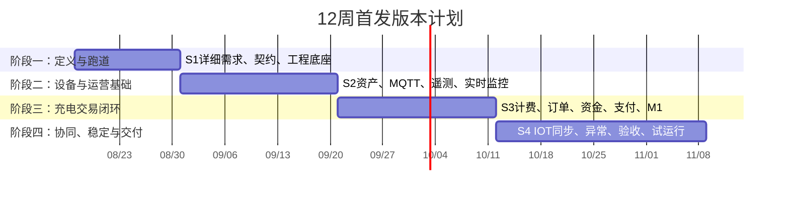

# 充电运营平台 12 周首发实施计划

> 归档状态：2026-08-12 归档。原因：该版本仅承诺 P1 + M1 的首发闭环，不满足“12 周完成全部 v4.1 平台功能”的计划目标。现行计划为《[充电运营平台12周全功能交付实施计划-v2](../../../docs/requirements/充电运营平台12周全功能交付实施计划-v2.md)》。

> 版本：v1.0（管理评审稿）  
> 计划周期：12 周（约 3 个月）  
> 目标：交付可在 8 核 32 GB 单机上部署、可完成“建资产—设备接入—启动充电—支付/结算—订单异常恢复—实时监控”的首发运营版本。  
> 基线：菜单与规则采用 v4.1；服务与数据边界采用《工程架构与数据分库设计 v1.3》；本计划不改变既定 6 服务、7 端与双模式边界。

## 1. 管理结论

12 周**不等于**全部菜单生产上线。现有范围包括 7 端、企业资金、租户结算、多渠道支付、监管、营销、V2G、门禁/道闸等；其中支付、银行、监管和设备厂商联调受外部环境制约，不能以开发速度替代验收。

本计划以“首发可运营闭环”为一期目标，固定完成 P1、M1 的核心路径和设备/资金核心服务，并提供 IOT 协同模式的最小资产同步能力。P2、M2/M3/M4、营销、租户结算、监管深化、D1 与 V2G 在首发后按已冻结菜单继续实施，不通过临时删菜单或创建空服务来假装完成。

## 2. 首发范围与延期范围

| 分类 | 12 周必须完成 | 首发后排期，不作为 12 周上线承诺 |
| --- | --- | --- |
| 端 | P1 运营管理 Web；M1 车主充电小程序最小闭环。 | P2、M2、M3、M4、D1。 |
| 权限与模式 | 平台登录、平台管理员/租户角色、菜单与数据范围；`independent`/`iot-collaborative` 初始化锁定；协同模式资产只读。 | 企业管理员在 P2 配置企业角色与权限的完整界面。 |
| 资产与设备 | 场站、充电设备、枪口、设备编号校验；独立模式本地维护；协同模式 IOT 最小资产同步。 | 资产字段模板、停车/门禁/道闸、复杂经营属性。 |
| 设备数据 | 统一 MQTT 遥测、控制、回执、原始报文追溯、Redis 实时状态、ClickHouse 分钟记录。 | 厂商长尾功能点、全量固件升级编排、复杂指标/大屏专题。 |
| 交易与资金 | 基础费率、个人启动、订单状态机、冻结/释放/结算、一个真实支付渠道、退款与异常待处理。 | 企业资金/电卡、租户结算、对公付款、开票、全渠道路由。 |
| 运营 | 实时监控、设备协议追溯、远程操作记录、最小告警与异常订单处置。 | 工单 SLA、场站策略、监管对账、营销、经营分析、V2G。 |

## 3. 四个实施阶段

### 阶段一：需求定稿与工程跑道（第 1–2 周）

**目的**：把菜单从“目录”转为可开发、可测试、可验收的需求包，同时让 6 服务的最小工程可启动。

| 周次 | 菜单/业务范围 | 后端与数据工作 | 前端工作 | 本周交付与验收门槛 |
| --- | --- | --- | --- | --- |
| W1 | P1：平台管理员、租户权限分配、基础设置；P1：场站管理、设备管理；M1：登录/找站/扫码的需求定义。 | 固化 S1 业务状态机；定义初版 OpenAPI、MQTT JSON Schema、Kafka 事件、10 schema 的迁移清单；确认一类设备和一个支付渠道。 | P1、M1 原型、字段字典、页面状态、权限矩阵；准备 Mock 数据。 | 《S1 详细需求包》：每个页面有字段、操作、权限、异常、验收案例；未确认项不得进入开发。 |
| W2 | 无新增菜单，以 S1 需求冻结为主。 | Maven parent、6 服务最小骨架、Flyway、Compose、Nginx、健康检查、配置模板、审计/TraceId、初始化脚本、CI 与契约校验。 | pnpm workspace、7 端空工程与 P1/M1 公共组件/登录框架；仅 P1/M1 开始页面实现。 | 本地一键启动；6 服务健康检查通过；MySQL/Redis/Kafka/ClickHouse/EMQX/MinIO 可用；迁移、OpenAPI、MQTT 契约检查通过。 |

**阶段门禁**：未完成设备编号、订单状态、支付冻结/退款、数据权限和 MQTT 报文的需求确认，不进入 W3；禁止边编码边重写核心规则。

### 阶段二：资产、设备接入与实时可视化（第 3–5 周）

**目的**：先让“平台知道自己有哪些资产、设备能安全接入、运营人员能看见真实状态”。

| 周次 | 菜单交付 | 服务与数据交付 | 前端交付 | 验收案例 |
| --- | --- | --- | --- | --- |
| W3 | P1：平台管理员、租户管理最小集；P1：场站管理、设备管理的基础资料。 | `platform-service.iam/master`：用户、角色、菜单、数据范围、租户、场站、设备、枪口；`api-gateway` 鉴权与路由；`evco_iam`、`evco_master` 首批迁移。 | P1 登录、租户/场站/设备列表与详情、权限控制。 | 独立模式下创建资产、仅授权用户可查看；未登记设备不能接入。 |
| W4 | P1：实时监控、远程操作记录的基础视图。 | `device-connectivity-service`：EMQX 客户端认证、统一 MQTT 遥测/控制/回执、原文清单、命令审计；`telemetry-service`：Kafka 消费、Redis 最后有效状态。 | P1 实时设备/枪口状态、设备详情；WebSocket “快照 + 增量”更新。 | 合法设备上报可更新实时状态；乱序/重复报文不覆盖最后有效值；命令可追踪回执。 |
| W5 | P1：设备协议追溯、设备数据分析（仅核心指标曲线）。 | 分钟归并、ClickHouse `CORE` 指标、原报文对象归档、受控证据查询；接口限流与查询审计。 | P1 设备协议追溯、功率/电压/电流/累计电量等核心曲线。 | 按设备/订单/命令查到原文—校验—分钟记录—实时版本链路；浏览器不直连 Redis/Kafka/数据库。 |

**阶段门禁**：MQTT 协议、遥测顺序裁决、Redis 重放限速、ClickHouse 分钟数据正确性与断线恢复必须通过自动化测试；否则不接入真实设备。

### 阶段三：个人充电交易与资金闭环（第 6–8 周）

**目的**：完成真实用户可使用的充电订单闭环；资金和订单以正确性优先，不为赶进度跳过对账与异常处理。

| 周次 | 菜单交付 | 服务与数据交付 | 前端交付 | 验收案例 |
| --- | --- | --- | --- | --- |
| W6 | P1：充电计费管理、充电订单；M1：找站、扫码、启动确认。 | `platform-service.trade`：费率版本、启动请求、充电会话、订单状态机、价格快照；设备控制意图通过 Kafka 到设备互联服务。 | P1 费率与订单列表/详情；M1 找站、扫码、订单启动。 | 订单固化费率；无权限/离线/能力不满足设备拒绝启动；控制命令全程可追溯。 |
| W7 | P1：个人资金管理、退款与补差；M1：支付、充电中、订单详情。 | `finance-service`：账户、不可变分录、冻结/释放/结算；`integration-service`：一期支付渠道下单、回调验签、退款；订单—资金事件幂等。 | M1 支付/充电实时页/订单；P1 退款与资金只读流水。 | 支付回调重复不重复记账；订单结束自动结算；退款原路处理并形成完整审计。 |
| W8 | P1：异常待处理、远程操作记录完善；M1：结束页、异常提示、历史订单。 | 设备充电中离线→异常待处理→设备订单补报→自动结算/退款/释放冻结；资金与订单定时对账；Kafka 积压的分片、批处理恢复。 | P1 异常订单处置；M1 订单状态与异常说明。 | 充电中掉线按规则异常；补单可恢复；Kafka 重放不以 Redis 全局锁逐条处理、不造成雪崩。 |

**阶段门禁**：真实支付沙箱/测试商户、模拟桩与至少一种真实设备联调通过；订单、资金、设备命令三方不一致时可定位、可告警、可人工处置。

### 阶段四：IOT 协同、稳定性与首发交付（第 9–12 周）

**目的**：补齐双模式最小可用、生产运行保护和交付材料；不是在最后一周堆叠新功能。

| 周次 | 菜单交付 | 服务与数据交付 | 前端交付 | 验收案例 |
| --- | --- | --- | --- | --- |
| W9 | P1：协同模式下的只读租户/资产视图、同步审计。 | IOT HTTP/HTTPS 管理同步 API：验签、收件箱、Outbox、`evco.master.sync-command.v1`、幂等结果回执；协同模式禁止本地写 IOT 主数据。 | P1 同步状态、失败原因、资产来源只读标识。 | IOT 重复/乱序推送不产生重复资产；协同模式本地修改被拒绝；独立模式不接受 IOT 主数据写入。 |
| W10 | P1：待办与预警最小集、告警管理最小集。 | Prometheus/Grafana/Alertmanager、备份任务、磁盘水位、Kafka lag、EMQX 会话、支付/命令/订单对账告警；降级策略。 | P1 待办与预警、基础告警处置。 | 停止遥测/支付回调/消息消费者后告警出现；恢复后数据无静默丢失。 |
| W11 | 无新增核心菜单，修复与试运行。 | 性能、故障、备份恢复、安全、权限、契约回归；导入首批资产与设备；发布/回滚 Runbook。 | P1/M1 体验修复、兼容性与错误提示；演练培训材料。 | 模拟目标规模压力、MQTT 断连重连、Kafka 积压恢复、从空环境恢复备份通过。 |
| W12 | 首发版本验收与上线准备。 | 发布候选冻结、镜像/配置签名、变更单、验收证据、监控阈值、值守手册。 | P1/M1 UAT 问题闭环。 | 公司验收：核心 E2E、支付测试、真实设备、权限隔离、恢复演练、回滚演练全部通过。 |

## 4. 菜单分批策略

| 菜单组 | 首发处理方式 | 原因 |
| --- | --- | --- |
| P1 系统与配置/权限 | W1–W3 首先完成最小集。 | 没有身份、角色、数据范围，任何资产和订单页面都无法安全验收。 |
| P1 场站与运维 | W3–W5 完成资产、实时监控、协议追溯、基础远程操作。 | 这是设备和订单闭环的前置条件。 |
| P1 交易与售后、计费、个人资金 | W6–W8 完成基础费率、订单、退款、资金流水。 | 是首发“可运营、可收费”的核心。 |
| M1 | W3 起并行搭建，W6–W8 交付找站—扫码—支付—订单。 | 首发只承诺个人充电最小用户链路。 |
| P1 协同模式同步与运行维护 | W9–W10 完成最小审计、同步状态、告警待办。 | 依赖资产、协议和订单事实已稳定。 |
| P2、M2/M3/M4 | 完成详细需求后进入第二发布批次。 | 企业权限、资金、车辆、电卡、空间切换都是独立复杂闭环。 |
| 营销、租户结算、监管深化、D1、V2G | 进入第三发布批次。 | 涉及资金、合规或复杂分析，必须先有稳定订单/计量事实。 |

## 5. 详细需求如何跟开发衔接

每个阶段开始前一周，按菜单生成对应的“阶段需求包”。每个三级菜单或用户流程至少包含：

1. 页面入口、角色、数据范围、字段、查询条件、按钮与批量操作；
2. 新增/编辑/删除/导入规则，及双模式下可写/只读差异；
3. API、MQTT、事件、数据库事实归属与幂等键；
4. 正常、重复、乱序、离线、超时、失败、人工补偿等异常路径；
5. 单元、契约、集成、E2E、安全与性能验收案例；
6. 明确的“不做什么”，防止需求在开发中无限扩张。

工作节奏固定为：**周一冻结本周需求与验收 → 后端先提交契约、迁移与 Mock → 前端并行开发 → 周四联调 → 周五演示、测试与范围复盘**。未通过验收的功能不计入完成量，滚入下一周并明确影响范围。

## 6. 分阶段部署与领导里程碑

不能等第 12 周才部署。每个阶段均产出可重复部署的版本、演示结论和风险清单；但只有通过相应门禁的版本才能向下一环境推进。

| 里程碑 | 时间 | 部署环境与版本 | 领导可看到的成果 | Go / No-Go 门禁 |
| --- | --- | --- | --- | --- |
| M0：方案开工会 | W1 周末 | 不部署业务版本；发布需求、架构、风险基线。 | 12 周范围、首发与延期菜单、双模式边界、外部依赖责任人。 | 设备类型、一期支付渠道、试点客户/场站、验收负责人未确认则不进入核心开发。 |
| M1：工程跑道演示 | W2 周末 | `dev`：Compose 全组件与 6 服务最小版本。 | 一键启动、健康检查、权限登录样例、部署资源预算、CI 结果。 | 契约/迁移/启动失败、无备份目标、无测试环境时，不允许开始真实接入。 |
| M2：设备可见 Alpha | W5 周末 | `sit`/`alpha`：资产、MQTT、实时状态、分钟遥测、协议追溯。 | 从模拟/真实桩上报到 P1 实时状态和历史曲线的完整演示；异常报文被隔离的证据。 | 未登记设备接入、乱序覆盖、遥测重放导致 Redis/Kafka 异常，均为 No-Go。 |
| M3：交易可用 Beta | W8 周末 | `beta`：计费、订单、冻结、支付测试、退款、异常订单恢复、M1。 | 用户扫码到订单结算/退款的演示；离线订单补报与重复支付回调演示。 | 订单、资金、设备控制任一事实不可追溯或对账不平，禁止试点。 |
| M4：协同与试点准入 | W10 周末 | `pilot`：IOT 管理同步、告警待办、监控、备份。 | 独立/IOT 协同两模式演示；IOT 推送资产后平台只读；监控告警和恢复报告。 | 未完成真实设备/IOT/支付联调、离机备份或安全检查，不进入客户试点。 |
| M5：首发上线决策 | W12 周末 | `production`：首发发布候选。 | UAT 报告、压测与恢复演练、上线/回滚方案、遗留范围和下阶段计划。 | 核心 E2E、权限隔离、支付测试、备份恢复、回滚演练任一失败即延期上线。 |

### 6.1 环境边界

| 环境 | 用途 | 数据与访问约束 |
| --- | --- | --- |
| `dev` | 开发者与自动化测试持续部署。 | 只用模拟设备、脱敏数据和测试支付。 |
| `sit` | 服务、MQTT、支付/IOT 模拟集成。 | 可使用测试桩或网关，不使用真实生产资金。 |
| `alpha` | 内部业务验收。 | 固定演示数据，保留演示录屏和测试证据。 |
| `beta` | 业务方试运行与首轮 UAT。 | 限定人员、限定设备/场站、测试商户或受控小额试验。 |
| `pilot` | 客户试点。 | 限定试点站和白名单用户；资金、告警、备份、回滚必须先通过。 |
| `production` | 首发生产。 | 仅部署已签字验收的能力；延期功能保持关闭，不以隐藏入口替代验收。 |

### 6.2 每周领导周报与红黄绿规则

每周五演示后，发布一页《实施周报》，不报告“代码写了多少”，只报告可验收事实：

| 维度 | 必报内容 | 红黄绿判定 |
| --- | --- | --- |
| 范围 | 本周已验收菜单、未完成菜单、变更请求及对 M0/M5 的影响。 | 未经批准的范围变更为红。 |
| 进度 | 当前里程碑、计划/实际偏差、下周可演示事项。 | 偏差超过 1 周为黄；影响首发日期为红。 |
| 质量 | 单元/契约/E2E 结果、缺陷分级、生产阻断缺陷。 | 存在未闭环 P0/P1 为红。 |
| 集成 | 设备、支付、IOT、监管等联调状态与对方责任人。 | 外部依赖逾期且无替代方案为黄/红。 |
| 运行 | CPU/内存、Kafka lag、数据正确性、备份恢复、告警。 | 核心链路未演练或恢复失败为红。 |
| 决策 | 需要领导确认的范围、预算、外部协调或上线 Go/No-Go 项。 | 未决事项超过约定时限为黄。 |

领导只需在 M0、M2、M3、M4、M5 做阶段性决策；日常技术取舍由项目组按已冻结架构执行。每一里程碑均应附可访问演示地址/录屏、版本号、测试摘要、风险与决策单，确保无法参加演示的领导也能掌握真实状态。

## 7. 资源、外部依赖与风险

| 项目 | 首发最低条件 | 不具备时的影响 |
| --- | --- | --- |
| 业务决策 | 一名可在 1 个工作日内确认规则和验收的产品/业务负责人。 | 需求反复会直接挤占开发周期。 |
| 研发与测试 | 后端、前端、测试/实施并行；AI 可协助生成和维护代码、文档、测试与脚本，但真实支付、设备和上线验收仍需人和环境。 | 单人串行完成 7 端和全部外部集成不具备 12 周可信度。 |
| 设备 | 至少一种支持统一 MQTT 协议的模拟器和一套真实桩/网关测试环境。 | W4–W8 只能完成模拟验收，不能承诺现场可用。 |
| 支付 | 一期渠道的测试商户、回调公网/专线与退款能力。 | 只能交付支付适配骨架，不能验收真实收款/退款。 |
| IOT | 协同模式的 API 签名、资产样例、顺序/重复推送样例和联调窗口。 | W9 只能做协议实现与模拟联调。 |
| 基础设施 | Linux 服务器、独立数据盘、离机备份目标、域名/TLS、告警接收渠道。 | 无法完成备份恢复和上线演练。 |

### 7.1 不可压缩的风险

- **不要把全量 P2/M2/M3/M4、企业资金、营销、监管、租户结算、V2G 一起塞进首发。** 这样会导致订单、资金和设备三个高风险链路都没有足够测试。
- **不要把“接口写完”视为完成。** 设备、支付、IOT 与监管均需要对方真实环境和异常演练。
- **不要为了 12 周部署 K8s/Nacos 集群或额外微服务。** 当前单机约束下会减少而非增加可交付性。

## 8. 首发完成定义

首发上线仅在下列条件同时满足时成立：

- P1 和 M1 核心菜单及对应角色、数据范围可用；
- 独立模式可配置资产，IOT 协同模式可安全同步资产且本地不可越权修改；
- 合法 MQTT 设备可上报、实时显示、分钟归并、控制回执与原始证据追溯；
- 用户可完成支付/冻结、充电、结算、退款；设备离线与订单补报有可验证闭环；
- Kafka 积压、服务重启、设备断连、支付回调重复、备份恢复均通过演练；
- 监控、告警、回滚、部署、备份恢复和交付手册齐全。

后续版本以首发稳定性数据和实际客户接入优先级排定，而不是预先承诺某个无法验证的全菜单日期。
