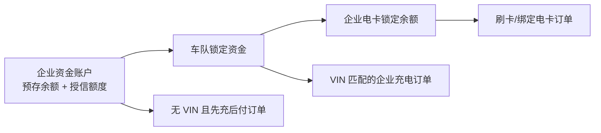

# 通用充电运营平台完整功能与规则基线 v3

> 已归档（2026-08-06）：该草案将菜单架构与业务规则合并，未获采纳。当前资料请使用《[菜单架构 v3](../../../docs/requirements/充电运营平台菜单架构-v3.md)》与《[业务规则基线 v2](../../../docs/requirements/充电运营平台业务规则基线-v2.md)》。

> 状态：当前需求基线。本文按完整产品闭环设计；研发排期可在此基线稳定后另行划分阶段，但不得以分期删除本文件中的菜单、角色或异常规则。

## 1. 已确认的产品边界

| 编号 | 终端 | 主要使用者 | 核心定位 |
| --- | --- | --- | --- |
| P1 | 运营管理平台 | 平台超级管理员、运营商/租户运营人员、平台运营/财务/客服/运维人员 | 多租户运营、企业与运营商管理、资金、监管、运营配置、权限控制平面 |
| P2 | 企业客户管理平台 | 企业管理员、被授权的车队/财务/运维人员 | 企业完整管理 Web：数据、车队、车辆、资金、账务、配置、运维 |
| M1 | 个人充电小程序 | 个人用户 | 微信手机号授权登录；个人找站、扫码充电、个人支付、订单和发票 |
| M2 | 企业用户充电小程序 | 企业管理员创建并分配账号的员工/司机 | 企业账号登录；仅企业用车充电、企业电卡、订单查看；不混入个人支付 |
| M3 | 运营商运营小程序（场站商家端） | 运营商/租户管理员、合伙人、现场负责人 | 租户范围内的场站经营、订单、告警、现场运营和数据查看 |
| M4 | 企业客户管理小程序 | 企业管理员、被授权的车队/财务/运维人员 | 企业数据查看、企业功能管理和现场运维；**不提供扫码或启动充电** |
| D1 | 运营大屏应用 | 指挥中心、展示终端 | 独立部署的只读展示应用；配置、发布与回滚在 P1 完成 |

### 1.1 权限与主数据归属

| 对象 | 主责系统 | 规则 |
| --- | --- | --- |
| 平台超级管理员 | IOT 平台 | 由 IOT 统一管理并授予全页面、全租户、全数据范围。 |
| P1 单租户运营用户 | IOT 平台 | IOT 仅下发该租户的页面权限与数据范围；P1 后端必须强制按租户过滤。 |
| IOT 租户、站点、设备、枪、遥测、原始告警 | IOT 平台 | P1 同步消费主数据及实时数据，不复制设备接入、协议、API、Topic、鉴权配置页面。 |
| M3 运营商小程序用户/角色/页面/场站范围 | P1 运营管理平台 | 场站商家即运营商/租户；P1 维护 M3 的业务授权，IOT 仅同步租户与资产。 |
| P2/M2/M4 企业用户、角色、页面与数据范围 | P1 运营管理平台 | 企业管理员创建员工/司机账号；企业端只执行权限，不自建权限体系。 |
| 企业、车队、车辆、电卡、企业资金 | P1 运营管理平台 | 以企业为资金与票据主体，车队承担费用归集与资金控制。 |

## 2. 运营管理平台（P1）完整菜单

| 一级菜单 | 二级菜单 | 三级菜单 | 关键范围 |
| --- | --- | --- | --- |
| 运营工作台 | 经营总览 | 核心指标、趋势分析 | 多租户/租户范围内的站点、订单、电量、收入、告警、资金、监管健康度。 |
| 运营工作台 | 待办中心 | 业务待办、资金待办、合规待办 | 异常订单、退款、余额不足、授信预警、VIN 异常、监管失败与工单。 |
| 运营工作台 | 大屏管理 | 大屏配置、发布记录 | 配置 D1 指标、地图、布局、轮播、主题、刷新和发布回滚。 |
| 场站与设备 | 场站管理 | 场站档案、场站运营配置、场站能力 | 站点展示、支付、配套服务；展示 IOT 同步资产。 |
| 场站与设备 | 设备台账 | 设备与枪档案、设备状态、设备能力 | 设备能力包含“可获取 VIN”“支持按金额启动/停充”“屏幕强制启动”“屏幕 VIN 鉴权”“屏幕刷卡启动”，由 P1 运营配置维护并与 IOT 实际能力校验。 |
| 场站与设备 | 配套服务 | 停车减免、门禁与闸机 | 第三方服务规则、记录和异常处理。 |
| 订单中心 | 充电订单 | 个人订单、企业订单、订单详情 | 固化价格、权益、资金、车辆核验、启动方式、监管上报快照。 |
| 订单中心 | 异常订单 | VIN 异常订单、未结算订单、人工结算 | 未识别企业的屏幕强制订单进入未结算队列，由人工指定结算主体并审计。 |
| 订单中心 | 订单控制 | 启动/停止指令记录、订单修复 | 仅业务指令与回执；不展示 IOT API 日志。 |
| 客户与企业 | 个人用户 | 个人用户档案、车辆档案、数据权利申请 | 个人用户独立于会员；未入会、未充值的预付用户也完整管理。 |
| 客户与企业 | 企业管理 | 企业档案、企业组织、企业管理员 | 企业资料、合同、企业状态、账号创建/停用。 |
| 客户与企业 | 车队与车辆 | 车队档案、企业车辆、车辆 VIN 维护 | 一个企业可有多个车队；一辆车同时只能属于一个车队。所有企业用户可使用本企业所有车队车辆，不按用户限制车队。 |
| 客户与企业 | 企业账号权限 | 企业用户、企业角色与页面权限 | 企业管理员创建员工/司机账号；P2/M2/M4 按角色与数据范围授权。 |
| 客户与企业 | 运营商（租户） | 运营商档案、运营商小程序权限 | M3 用户、角色、页面和场站范围由 P1 维护；租户主档只读同步 IOT。 |
| 营销中心 | 会员与权益 | 会员等级、优惠券/红包、积分 | 会员是权益层，不是个人用户台账。 |
| 营销中心 | 活动与触达 | 充值活动、充电活动、消息与反馈 | 个人营销核销、预算和审计。 |
| 价格中心 | 充电计费 | 充电计费模板、占位费规则、价格发布 | 历史订单固化价格版本，不因改价重算。 |
| 价格中心 | 企业价格 | 企业协议价、车队价格规则 | 企业/车队可适用专属价格，但资金与车辆核验规则独立处理。 |
| 财务与结算 | 支付管理 | 支付渠道与商户、支付路由 | 多微信、多支付宝、银联与其他第三方支付；凭据仅存密钥引用。 |
| 财务与结算 | 个人资金 | 个人余额账户、预付交易、退款 | 余额冻结/扣款，外部预付、差额退款与对账。 |
| 财务与结算 | 企业资金 | 企业资金账户、企业充值、授信管理 | 企业充值入账、余额流水、授信额度、已用授信、授信还款；充值先自动偿还已用授信，余款才进入可用预存余额。 |
| 财务与结算 | 车队资金 | 车队资金分配、车队用能限额、资金回收 | 从企业预存余额锁定资金给车队；修改分配金额后原子重算锁定/释放。限额支持金额、可用场站范围、日/月周期。 |
| 财务与结算 | 企业电卡 | 电卡档案、卡余额分配、卡冻结与流水 | 企业资金所有权不变；卡在任一时刻只归属一个车队，卡余额是从企业资金池经车队锁定的真实子余额。卡可授权多名企业用户使用。 |
| 财务与结算 | 对账与发票 | 渠道对账、企业对账、个人发票、企业发票 | VIN 异常、未核车、未结算、授信占用均可在企业账单和对账中追踪。 |
| 运维中心 | 告警与工单 | 实时告警、运维工单、现场记录 | IOT 原始告警同步后进行业务分派、处理、验收。 |
| 运维中心 | 业务控制 | 远程控制、指令记录 | 高风险控制需权限、二次确认、审计；设备协议由 IOT 管理。 |
| 数据中心 | 经营与财务 | 运营/财务/支付/结算报表 | 支持运营商、企业、车队、站点、设备维度。 |
| 数据中心 | 企业与车辆 | 企业用能、车队资金、电卡、VIN 异常报表 | 能追踪企业用户、VIN、车辆、车队、订单、资金来源与异常原因。 |
| 监管合规 | 监管档案 | 省市监管主体、映射与校验规则 | 多运营商、多省市、多协议版本、环境与密钥引用。 |
| 监管合规 | 上报与对账 | 上报任务、漏推补推、监管对账 | Outbox、重试、补推审批、回执和差异闭环。 |
| 平台设置 | 业务与应用 | 业务参数、小程序与品牌、审计与隐私 | 业务参数、发布、脱敏、私有化配置；不录入 IOT API。 |

## 3. 企业客户管理平台（P2）完整菜单

P2 面向企业管理员的完整 Web 管理场景；企业用户、角色、页面权限及数据范围的创建和调整仍统一在 P1 完成，P2 仅执行并展示授权结果。

| 一级菜单 | 二级菜单 | 三级菜单 | 关键范围 |
| --- | --- | --- | --- |
| 企业工作台 | 企业总览 | 用能概览、资金概览、待办中心 | 企业余额、已用授信、车队、电卡、订单、电量、VIN 异常、告警和待办。 |
| 企业配置 | 企业资料 | 基本资料、联系人、通知订阅 | 企业资料、资料变更申请和通知。 |
| 企业配置 | 组织与人员 | 组织/成本中心、企业用户、司机 | 在 P1 授权的数据范围内维护业务资料；角色与页面权限只读展示。 |
| 企业配置 | 车队与车辆 | 车队档案、企业车辆、VIN 维护 | 建立多个车队；车辆只能归属一个车队；所有企业用户可使用所有车队车辆。 |
| 企业配置 | 企业电卡 | 电卡档案、授权使用人、挂失换卡 | 电卡归属单一车队，可授权多名企业用户；不允许多车队同时归属。 |
| 企业资金 | 资金账户 | 账户余额、充值记录、授信使用明细 | 企业充值、余额流水、已用/可用授信、充值自动还授信。 |
| 企业资金 | 车队资金 | 资金分配、用能限额、资金回收 | 车队锁定资金、金额/站点/日月周期控制和额度调整审计。 |
| 企业资金 | 电卡资金 | 卡余额分配、卡冻结、卡流水 | 资金锁定、冻结、扣款、解冻、卡异常处理。 |
| 企业订单 | 企业订单 | 订单列表、订单详情、异常订单 | 用户、VIN、车辆、车队、卡、启动方式、资金与价格快照。 |
| 企业账务 | 企业账单 | 费用账单、资金对账、VIN 异常对账 | 预存扣款、授信占用、未结算与人工结算跟踪。 |
| 企业账务 | 发票中心 | 企业开票、电子发票、红冲记录 | 企业抬头、税号、订单/账单归集与交付。 |
| 企业运维 | 资产监控 | 授权场站、设备与枪状态 | 企业自有或获授权资产的状态、实时功率和告警摘要。 |
| 企业运维 | 告警与工单 | 告警处置、工单、现场验收 | 仅在授权资产范围内操作；高危远程控制按 P1/IOT 权限与审计执行。 |
| 企业分析 | 用能与财务 | 车队报表、车辆报表、电卡报表、预算与考核 | 费用、金额限额、站点范围、日/月周期、VIN 异常和资金使用分析。 |
| 企业设置 | 授权信息 | 当前角色、页面范围、数据范围 | 仅查看 P1 授权结果，不提供角色和页面权限配置。 |

## 4. 两类充电小程序：严格分离

### 4.1 M1 个人充电小程序

| 一级菜单 | 二级菜单 | 三级菜单 | 说明 |
| --- | --- | --- | --- |
| 首页 | 找站与场站服务 | 地图找站、场站详情、枪与价格 | 个人用户按微信手机号授权登录；无需绑定或认证车辆。 |
| 首页 | 扫码充电 | 扫码识枪、启动确认、个人预付/余额支付、充电中、结算 | 仅个人资金：外部支付、个人余额、会员权益、券/红包/积分。余额模式显示默认预充金额，允许用户在可用余额内手改。 |
| 订单 | 充电订单 | 订单列表、订单详情、发票申请 | 展示价格、权益、支付、退款和个人发票。 |
| 我的 | 个人资产 | 个人资料、车辆（可选）、余额与会员、权益 | 车辆是可选资料，不能阻断公共充电。 |
| 我的 | 服务与隐私 | 客服、收藏、协议、数据导出与注销 | 个人服务闭环。 |

### 4.2 M2 企业用户充电小程序

| 一级菜单 | 二级菜单 | 三级菜单 | 说明 |
| --- | --- | --- | --- |
| 首页 | 企业充电 | 扫码识枪、企业充电启动、充电中、结算结果 | 企业员工/司机使用 P1 创建的企业账号登录；不出现个人支付、个人余额或个人营销入口。 |
| 首页 | 企业电卡 | 已绑定电卡、刷卡/卡码说明、卡余额与冻结提示 | 电卡可被多名已授权企业用户使用，卡余额不足不得启动。 |
| 订单 | 我的企业订单 | 订单列表、订单详情、VIN/车辆核验状态 | 显示企业、车队、VIN、车辆、启动方式、资金来源、异常与结算状态。 |
| 我的 | 企业身份 | 企业资料、账号状态、可用站点 | 企业用户可使用企业所有车队车辆；不要求先选择车队或手工选择车辆。 |
| 我的 | 服务 | 消息、异常说明、客服 | 余额/限额不足时提示联系企业管理员充值或调整配置，不提供个人付款降级。 |

M2 启动页不展示、也不允许员工修改预充金额。设备已识别 VIN 并匹配某车队时，按该车队的固定单笔启动金额下发；无 VIN 时仅在企业开启先充后付并满足资金校验时，按企业配置的“无 VIN 先充后付默认单笔金额”下发。

## 5. 两类管理小程序与运营商小程序

| 终端 | 一级菜单 | 二级/三级功能 | 明确边界 |
| --- | --- | --- | --- |
| M3 运营商运营小程序 | 首页、场站、订单、分析、我的 | 经营概览、场站/枪状态、告警待办、订单查询、收入/电量/利用率、现场服务、运营商账单与消息。 | 运营商/租户范围；不管理 IOT 接入，不配置企业权限或监管密钥。 |
| M4 企业客户管理小程序 | 首页、企业配置、企业资金、企业账务、企业运维、企业分析、我的 | 企业/车队/车辆/电卡管理，企业充值与资金分配，账单发票，场站设备监控、告警、工单、数据与考核。 | 主要用户为企业管理员；**无扫码、无启动、无充电中页面、无个人支付**。 |
| D1 运营大屏 | 运营总览、场站指挥、专题大屏 | 地图、实时功率、订单、收入、告警、企业/营销/监管专题。 | 独立应用、只读；P1 配置并发布。 |

## 6. 企业资金、车队与电卡模型

| 对象 | 定义 | 关键规则 |
| --- | --- | --- |
| 企业资金账户 | 企业真实资金与票据主体 | 维护预存余额、冻结金额、已用授信、可用授信、充值与还款流水。企业充值先冲减已用授信，再增加预存可用余额。 |
| 企业授信 | 信用良好企业可配置的受控后付能力 | **仅用于企业用户扫码后设备未获取 VIN 的场景**；不得用于个人、小程序个人支付或电卡预充值。 |
| 车队 | 企业车辆、费用归集、资金控制单元 | 企业有多个车队；车辆只能属于一个车队；企业用户可使用所有车队车辆。车队配置固定单笔启动金额、金额限额、可用站点范围和日/月周期。 |
| 车队锁定资金 | 从企业预存余额划拨并锁定给车队的真实子余额 | 修改分配额度时重新计算锁定金额；不得释放已被订单/电卡冻结部分。 |
| 企业电卡 | 企业资金的实体/虚拟消费凭证 | 卡在任一时刻只能归属一个车队；卡余额为该车队锁定资金中的独立子余额，可授权多人使用；支持单笔启动金额、冻结、挂失、换卡、流水和并发防重。 |
| 用能限额 | 非资金的消费控制规则 | 仅支持金额、可用场站范围、日/月周期；与资金余额同时校验，不产生透支。 |

### 6.1 企业充值与授信

1. 企业充值到账先自动抵扣已用授信本金；剩余部分才增加企业预存可用余额。
2. 企业预存余额用完时，正常 VIN 匹配的企业余额充电不可启动；仅“无 VIN + 企业已开启先充后付”的例外可使用可用授信。
3. 无 VIN 先充后付启动前，必须原子校验：`企业预存可用余额 + 剩余授信额度 ≥ 企业无 VIN 默认单笔金额`；不足即拒绝启动。
4. 最终结算一律先扣企业预存余额，不足部分占用授信额度；VIN 缺失或不属于该企业车队时，订单标记车辆核验异常，但不改变此扣款顺序。

### 6.2 余额类启动资金保障

所有余额类启动均必须先锁定/冻结启动金额，冻结成功才可向设备下发启动：个人余额、车队锁定资金、企业电卡余额均适用。

| 模式 | 启动金额 | 启动前校验 | 结算 |
| --- | --- | --- | --- |
| 个人余额 | 平台/场站默认金额，个人可在余额内修改 | 个人可用余额 ≥ 启动金额 | 冻结金额内按实际扣款，余款解冻。 |
| VIN 匹配企业扫码 | 匹配车队的固定单笔启动金额 | 企业/车队可用资金、车队金额限额、日/月限额、可用站点均满足 | 按实际金额从企业预存及该车队资金结算，余冻释放。 |
| 无 VIN 企业先充后付 | 企业无 VIN 默认单笔金额 | 企业开启先充后付，且预存可用余额 + 可用授信足额 | 订单上报后先扣预存、不足占用授信；车辆核验结果决定正常/异常标记。 |
| 电卡刷卡或小程序电卡启动 | 电卡配置的单笔启动金额 | 电卡可用余额、所属车队资金/限额、企业账户状态和站点范围均满足 | 卡余额先冻结并按实际扣款，余冻释放；卡余额不足、企业资金异常或限额不足均拒绝。 |

设备必须具备并经 P1 配置验证“按金额启动/自动停充”能力后，才可使用余额、电卡或固定金额模式。无法保障金额上限的设备不得放行该类启动方式，避免结算时余额不足。

## 7. VIN 与六种启动方式

| 启动方式 | 身份/车辆识别 | 启动规则 | 结算与异常 |
| --- | --- | --- | --- |
| M1 个人扫码 | 小程序登录识别个人；车辆非必需 | 外部预付成功或个人余额冻结成功才启动 | 正常个人订单。 |
| M2 企业扫码且获取 VIN | 企业账号 + 设备可信 VIN | VIN 在企业任一车队车辆中则匹配该车队，按车队固定金额启动。 | 正常企业订单；记录企业用户、车队、车辆与 VIN。 |
| M2 企业扫码未获取 VIN | 企业账号，无 VIN | 仅企业开启先充后付且资金校验通过时，按企业无 VIN 默认金额启动；未开启则拒绝。 | 订单后有 VIN 则补校验；缺失/不匹配标记异常，先扣预存、不足占授信。 |
| 桩屏强制启动 | 设备无用户会话；订单可能后报 VIN | 不在 P1 自动指定企业资金主体。 | 上报 VIN 后，按站点可服务企业检查车队车辆，匹配则扣该企业账户；无 VIN/不匹配则形成异常未结算订单，人工配置结算主体。 |
| 桩屏 VIN 鉴权启动 | 设备可信 VIN | VIN 必须命中站点可服务企业的某车队车辆，才按车队固定金额下发启动。 | 未命中立即鉴权失败，不允许启动；维护车辆资料后可重试。 |
| 桩屏刷卡启动 / M2 电卡启动 | 企业电卡 | 读取电卡并校验卡余额、卡状态、所属车队限额和站点范围，按卡单笔金额下发。 | 订单上报后扣卡余额；冻结/扣款/解冻完整留痕。 |

VIN 来源必须记录为“设备可信上报、设备缺失、人工维护、不可用”，不能将手工选择车辆当作可信 VIN。VIN 异常订单必须能在订单、企业账单、企业对账、车辆报表中关联到企业用户、VIN、车辆（如有）、车队与资金流水。

## 8. 订单、资金与异常闭环

必须具备下列一致性保障：

1. 资金冻结、启动指令、订单回执、扣款、解冻均有业务唯一键和幂等处理，避免多人共用电卡造成重复冻结或超额消费。
2. 启动失败、超时、取消、设备未启动必须自动解冻；停止/订单上报延迟时保持“待结算”而不能重复扣款。
3. 车队资金或电卡额度修改、回收、挂失时，不能侵占充电中订单已冻结金额。
4. 强制启动无可归属企业、VIN 缺失或 VIN 不匹配且无法自动认定资金主体时，只能形成异常未结算订单；人工结算必须记录操作者、依据、结算主体和资金流水。
5. 价格、固定启动金额、限额、企业先充后付开关、设备 VIN 能力与资金路由均在订单创建时固化快照。

## 9. 外部参考与采用的处理方式

公开资料显示，国内充电运营产品已普遍将企业账户、个人/司机账号、企业车辆/VIN、刷卡与多种支付方式分别建模；例如[闪象新能源 SaaS](https://www.shanxiangxny.com/platform/saas/)公开说明企业账户可绑定多个个人账户并由企业统一结算，也支持扫码、刷卡、车辆身份识别及微信/支付宝/银联；[奥升充电](https://orise.trytowish.cn/functions/)公开展示企业账户、企业车辆/VIN 与电卡能力；[星星充电车队管理系统](https://saas-fleet.starcharge.com/)提供车队与车队运营机构的独立登录入口。

本平台采用的最终处理是：**企业是资金所有者，车队是资金锁定与费用归集单元，电卡是归属单一车队、可授权多人使用的消费凭证**。这既满足临时换班下“所有企业用户可用所有车队车辆”，又确保资金、车辆、VIN、订单与异常对账均有唯一归集路径；电卡不得同时横跨多个车队，但可通过受审计的“转卡/重归属”流程迁移。

## 10. 明确不纳入平台菜单的能力

IOT API 地址、Topic、设备协议、鉴权密钥、Schema、通信重试和原始调用日志由 IOT/部署/集成层管理。P1 只配置并消费业务层设备能力（如可获取 VIN、金额控制能力、屏幕启动模式）及同步后的状态、告警、指令回执，不承载 IOT 接口配置页面。
