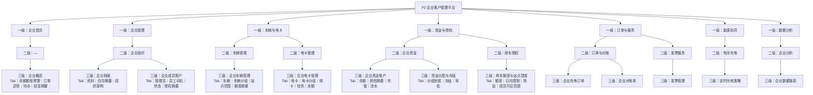
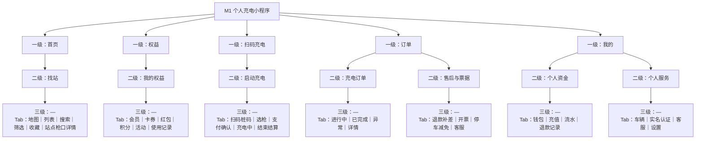
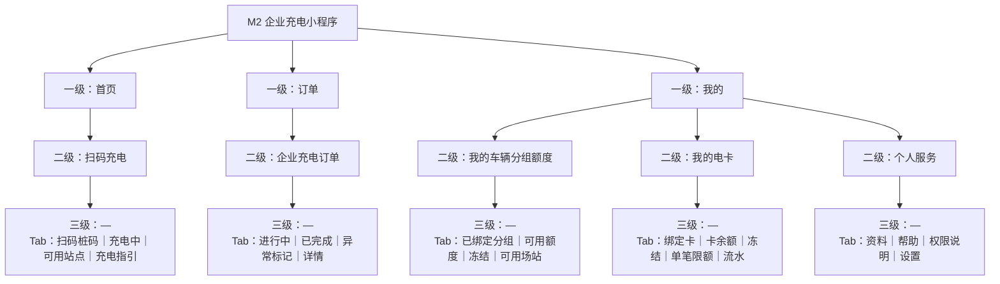
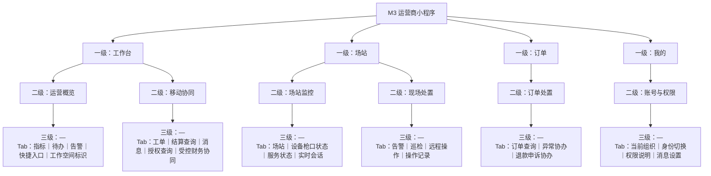
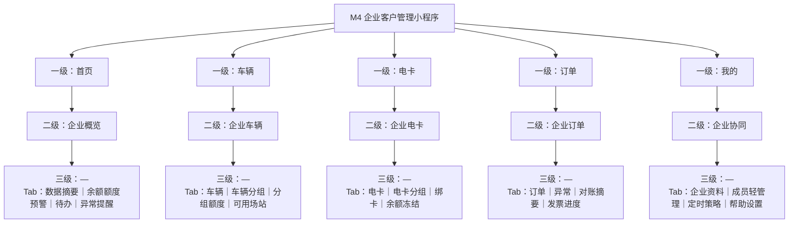
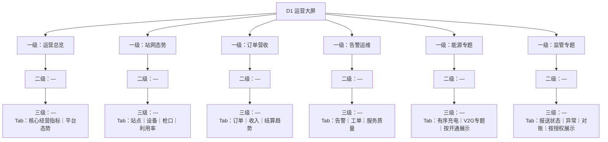

# 七应用菜单目录架构图

> 版本：v4.2（评审提案）  
> 阅读规则：实线仅表示菜单隶属关系；节点内“Tab：”后的内容不是独立菜单。每张图仅对应一个应用，不绘制 IOT、资金、外部系统或流程连线。

## 1. P1 运营管理平台

```mermaid
flowchart TB
    P1["P1 运营管理平台"]

    P1 --> A["一级：运营总览"]
    A --> A1["二级：—"]
    A1 --> A11["三级：综合态势\nTab：经营指标｜实时充电｜站网态势"]
    A1 --> A12["三级：待办与预警\nTab：审批｜订单异常｜资金预警｜监管失败"]

    P1 --> B["一级：站网运营"]
    B --> B1["二级：资产管理"]
    B1 --> B11["三级：场站档案\nTab：基础资料｜经营属性｜扩展字段｜变更记录"]
    B1 --> B12["三级：设备档案\nTab：设备｜枪口｜IOT只读能力｜运营属性"]
    B1 --> B13["三级：站点生命周期\nTab：建站｜上架｜暂停｜改造｜退出"]
    B --> B2["二级：场站服务"]
    B2 --> B21["三级：场站服务配置\nTab：营业时间｜开放对象｜服务标签｜公告"]
    B2 --> B22["三级：停车与出入口协同\nTab：停车场｜车位｜道闸｜减免｜核销｜异常"]
    B2 --> B23["三级：园区便民服务协同\nTab：门禁服务｜权益授权｜使用记录｜异常"]
    B --> B3["二级：运行维护"]
    B3 --> B31["三级：实时监控\nTab：场站｜设备枪口｜会话｜远程操作"]
    B3 --> B32["三级：告警管理\nTab：确认｜升级｜屏蔽｜恢复｜统计"]
    B3 --> B33["三级：运维工单\nTab：工单｜巡检｜派工｜验收｜SLA"]
    B3 --> B34["三级：运营安全与计量\nTab：计量异常｜安全预警｜处置记录"]

    P1 --> C["一级：交易运营"]
    C --> C1["二级：交易管理"]
    C1 --> C11["三级：充电订单\nTab：进行中｜已完成｜异常｜人工结算"]
    C --> C2["二级：售后管理"]
    C2 --> C21["三级：退款与补收\nTab：预付差额｜充值退款｜原路退款｜补收"]
    C2 --> C22["三级：客服与申诉\nTab：咨询｜投诉｜占位申诉｜评价｜回访"]

    P1 --> D["一级：客户运营"]
    D --> D1["二级：个人客户"]
    D1 --> D11["三级：个人用户\nTab：资料｜车辆｜订单摘要｜权益摘要"]
    D1 --> D12["三级：会员体系\nTab：等级｜权益规则｜开通续费｜会员记录"]

    P1 --> E["一级：企业服务"]
    E --> E1["二级：企业管理"]
    E1 --> E11["三级：企业档案\nTab：企业资料｜合同摘要｜组织｜服务状态"]
    E1 --> E12["三级：企业成员账户\nTab：管理员｜员工司机｜账号状态｜授权摘要"]
    E --> E2["二级：企业用车管理"]
    E2 --> E21["三级：企业车辆管理\nTab：车辆｜车辆分组｜可用场站｜额度摘要"]
    E2 --> E22["三级：企业电卡管理\nTab：电卡｜电卡分组｜绑卡｜挂失｜余额摘要"]

    P1 --> F["一级：计费与营销"]
    F --> F1["二级：计费管理"]
    F1 --> F11["三级：充电计费管理\nTab：电价｜服务费｜时段价格｜版本发布"]
    F --> F2["二级：营销管理"]
    F2 --> F21["三级：营销活动\nTab：规则｜预算｜承担方｜适用范围｜效果"]
    F2 --> F22["三级：优惠资产与核销\nTab：卡券｜红包｜积分｜冻结｜核销"]

    P1 --> G["一级：财务清结算"]
    G --> G1["二级：个人交易资金"]
    G1 --> G11["三级：个人账户与充值\nTab：钱包｜充值订单｜批次｜流水"]
    G1 --> G12["三级：预付冻结与退款\nTab：预付｜冻结解冻｜差额退款"]
    G1 --> G13["三级：支付渠道与交易路由\nTab：商户引用｜状态｜能力｜对账"]
    G --> G2["二级：企业资金"]
    G2 --> G21["三级：企业资金账户\nTab：预存余额｜授信摘要｜扣款记录"]
    G2 --> G22["三级：资金分配与冻结\nTab：车辆组资金｜卡组资金｜划拨审批"]
    G2 --> G23["三级：企业授信管理\nTab：额度｜启停｜占用｜调整｜审批"]
    G2 --> G24["三级：企业资金流水\nTab：充值｜划拨｜冻结｜扣款｜退款"]
    G --> G3["二级：租户结算"]
    G3 --> G31["三级：结算主体与合同\nTab：主体｜合同｜税率｜分成｜有效期"]
    G3 --> G32["三级：结算账户管理\nTab：对公｜银联｜第三方账户｜审核"]
    G3 --> G33["三级：场站结算方案\nTab：场站绑定｜账户｜分成｜版本"]
    G3 --> G34["三级：结算账单\nTab：月度账单｜明细｜确认｜锁单"]
    G3 --> G35["三级：付款与回单\nTab：付款申请｜执行｜重试｜补付｜回单"]
    G --> G4["二级：对账与调账"]
    G4 --> G41["三级：支付渠道对账"]
    G4 --> G42["三级：订单与计费对账"]
    G4 --> G43["三级：资金与结算对账"]
    G4 --> G44["三级：差异与调账"]
    G --> G5["二级：发票管理"]
    G5 --> G51["三级：用户充电发票"]
    G5 --> G52["三级：租户来票管理"]
    G5 --> G53["三级：平台服务费发票"]

    P1 --> H["一级：能源运营"]
    H --> H1["二级：有序充电"]
    H1 --> H11["三级：定时充电策略\nTab：时间规则｜适用范围｜分批参数"]
    H1 --> H12["三级：策略执行监控\nTab：批次｜启动停止结果｜策略订单"]
    H1 --> H13["三级：执行异常\nTab：VIN｜资金｜额度｜设备能力失败"]
    H --> H2["二级：双向充放电（V2G）"]
    H2 --> H21["三级：放电主体授权"]
    H2 --> H22["三级：放电策略与计划"]
    H2 --> H23["三级：放电订单"]
    H2 --> H24["三级：放电价格与计费"]
    H2 --> H25["三级：放电结算与对账"]
    H2 --> H26["三级：放电监控与异常"]
    H --> H3["二级：需求响应（预留）"]
    H3 --> H31["三级：响应事件"]
    H3 --> H32["三级：资源聚合与申报"]
    H3 --> H33["三级：执行与考核"]
    H3 --> H34["三级：响应收益结算"]

    P1 --> I["一级：合作生态"]
    I --> I1["二级：运营商管理"]
    I1 --> I11["三级：运营商管理\nTab：租户资料｜服务范围｜状态｜结算摘要"]
    I --> I2["二级：渠道与合作方管理"]
    I2 --> I21["三级：渠道与合作方管理\nTab：合作主体｜协议｜授权｜合作站点"]
    I --> I3["二级：应用与服务市场"]
    I3 --> I31["三级：应用与服务市场\nTab：服务订购｜授权｜版本｜使用记录"]

    P1 --> J["一级：数据中心"]
    J --> J1["二级：经营分析"]
    J1 --> J11["三级：经营分析与报表"]
    J --> J2["二级：运营分析"]
    J2 --> J21["三级：资产与运维分析"]
    J --> J3["二级：财务分析"]
    J3 --> J31["三级：财务经营分析"]

    P1 --> K["一级：监管接入"]
    K --> K1["二级：监管运营"]
    K1 --> K11["三级：监管业务档案"]
    K1 --> K12["三级：监管报送与补推"]
    K1 --> K13["三级：监管对账与异常"]

    P1 --> L["一级：平台治理"]
    L --> L1["二级：应用与内容"]
    L1 --> L11["三级：小程序内容配置"]
    L1 --> L12["三级：运营大屏配置与发布"]
    L --> L2["二级：组织与权限"]
    L2 --> L21["三级：业务组织与权限"]
    L2 --> L22["三级：权限同步与授权审计"]
    L --> L3["二级：流程与消息"]
    L3 --> L31["三级：审批流配置"]
    L3 --> L32["三级：消息与公告配置"]
    L --> L4["二级：基础与审计"]
    L4 --> L41["三级：数据模型与扩展"]
    L4 --> L42["三级：基础设置"]
    L4 --> L43["三级：操作与安全审计"]

    classDef app fill:#173B6C,stroke:#173B6C,color:#FFFFFF;
    classDef l1 fill:#DCEBFF,stroke:#2D6AB3,color:#173B6C;
    classDef l2 fill:#EAF6EF,stroke:#3B8A61,color:#1F593B;
    classDef l3 fill:#FFFFFF,stroke:#8AA7C8,color:#243B53;
    class P1 app;
    class A,B,C,D,E,F,G,H,I,J,K,L l1;
    class A1,B1,B2,B3,C1,C2,D1,E1,E2,F1,F2,G1,G2,G3,G4,G5,H1,H2,H3,I1,I2,I3,J1,J2,J3,K1,L1,L2,L3,L4 l2;
    class A11,A12,B11,B12,B13,B21,B22,B23,B31,B32,B33,B34,C11,C21,C22,D11,D12,E11,E12,E21,E22,F11,F21,F22,G11,G12,G13,G21,G22,G23,G24,G31,G32,G33,G34,G35,G41,G42,G43,G44,G51,G52,G53,H11,H12,H13,H21,H22,H23,H24,H25,H26,H31,H32,H33,H34,I11,I21,I31,J11,J21,J31,K11,K12,K13,L11,L12,L21,L22,L31,L32,L41,L42,L43 l3;
```

## 2. P2 企业客户管理平台

## 3. M1 个人充电小程序

## 4. M2 企业充电小程序

## 5. M3 运营商小程序

## 6. M4 企业客户管理小程序

## 7. D1 运营大屏

> D1 仅为只读展示应用。其布局、指标、专题和发布版本在 P1“平台治理 → 应用与内容 → 运营大屏配置与发布”中维护。
