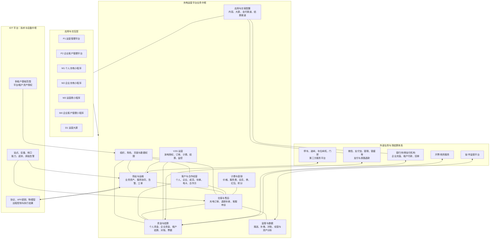
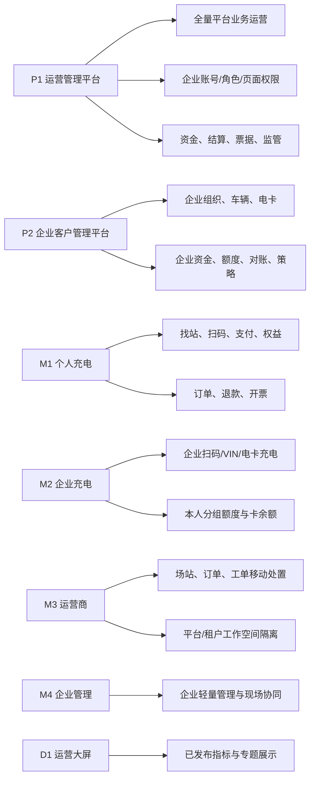
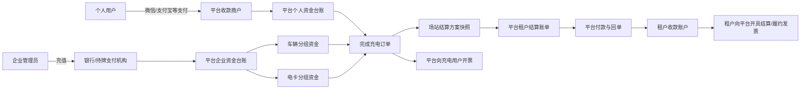
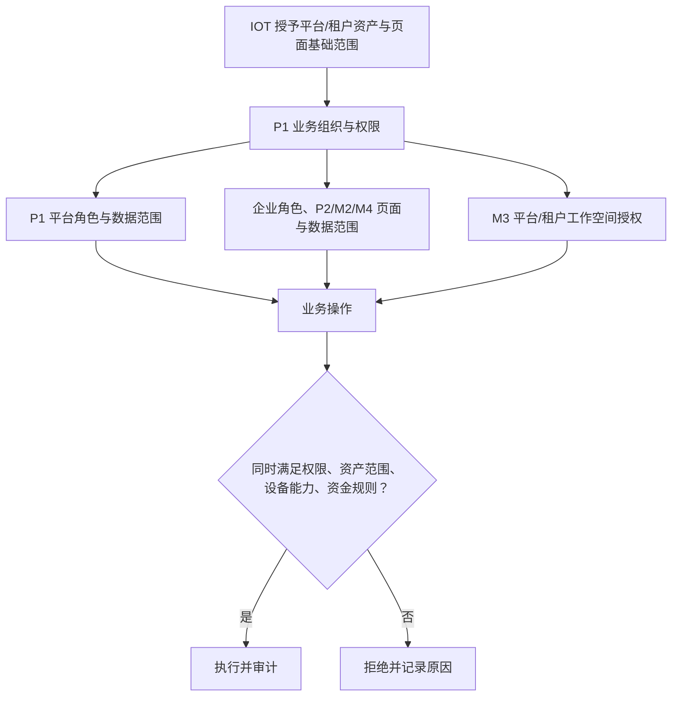

# 充电运营平台总体框架架构图

> 版本：v4.1（评审基线）  
> 依据：`充电运营平台菜单架构-v4.1.md`、`充电运营平台业务规则基线-v4.1.md`

## 1. 架构结论

当前菜单架构适合采用“多应用入口 + 平台业务中枢 + IOT/资金/外部服务边界”的平台框架，而不是把每个菜单视为独立系统。

- **P1 是业务中枢**：负责客户、订单、计费、资金台账、租户结算、发票、监管、运营配置和业务权限。
- **IOT 是设备中枢**：负责多租户基础范围、站点/设备/枪口接入、协议与密钥、能力、遥测、设备控制和原始告警。
- **资金域必须独立**：个人资金、企业资金、平台对租户结算、放电收益分别建账，不能通过一个“余额”或一个“订单金额”混算。
- **停车、道闸、车位闸机、门禁属于场站服务协同**：P1 管业务映射、权益、记录和异常；物理设备接入和控制不复制到 P1。
- **P2/M1/M2/M3/M4/D1 是场景化入口**：复用平台业务能力与统一权限，不能各自维护独立规则或资金账。

## 2. 总体平台框架图

## 3. 应用与能力归属图

## 4. 资金与结算边界图

关键约束：企业预存资金由平台统一管理台账，企业拥有使用权，租户无权管理；个人收款商户不随场站改变；场站绑定的是平台向租户结算的方案和收款账户。

## 5. 当前菜单架构评估

| 维度 | 结论 | 建议 |
|---|---|---|
| 菜单层级 | 已形成“一级业务域—二级子域—三级独立对象—Tab 并列视图”的合理结构。 | 后续新增功能先判断是否具备独立对象、权限或生命周期；不满足则进入 Tab。 |
| 资产与 IOT 边界 | 场站业务资产、服务协同在 P1；接入、协议和控制在 IOT，边界正确。 | P1 所有 IOT 同步字段标记来源和只读状态，避免运营人员误以为可配置接入。 |
| 资金架构 | 个人资金、企业资金、租户结算、V2G 收益已分离，方向正确。 | 坚持以总账、子账、冻结、调整单和方案快照追溯，不以订单金额直接替代账务。 |
| 企业模型 | 已用车辆分组、电卡分组替代车队，能覆盖乘用车与重卡的基础运营场景。 | 不新增复杂车队层；重卡通过车辆类型、站点/设备适配标签和分组规则支持。 |
| 外部服务 | 停车、出入口、车位、门禁已进入场站服务协同。 | 每项对接都须明确服务主体、收款主体、发票主体、数据责任与异常补偿。 |
| 监管 | 已包含报送、漏推、补推和对账，不将协议配置暴露在 P1。 | 用待报记录与状态机保证可追溯；省市差异以参数映射和适配器处理。 |
| 菜单命名 | “客户与权益”同时容纳合作运营，语义略宽。 | 建议评审时将一级菜单正式命名为“客户与合作经营”，并将“会员与权益”在目录上归入“计费与营销 > 营销权益”，避免营销资产出现两处入口。 |

## 6. 核心权限与数据流

任何设备控制、资金操作、结算付款或敏感数据访问，都必须同时满足业务权限、IOT 资产范围、设备能力及对应资金/审批规则。
