# 充电运营平台菜单分层架构图集

> 版本：v4.2（菜单架构优化提案，待评审）  
> 目的：替代不可读的“大杂烩总体图”。本图集只表达菜单层级；资金流、设备控制流、外部接口流在业务流程图中单独表达。

## 1. 图集阅读规则

- 所有菜单树固定从上到下阅读：**平台 / 应用 → 一级菜单 → 二级菜单 → 三级菜单**。
- 实线只表示菜单隶属关系，不代表 API 调用、资金流、数据流或设备控制。
- Tab、详情页、列表状态不作为菜单节点；在三级菜单说明中定义。
- 一张图只表达一个评审问题，避免跨域连线。跨域依赖仅在 IA-09 表达。
- 本提案以站网、交易、企业、资金、能源、生态、监管和治理为责任域，参考头部运营平台按站点、订单、营销、账务、角色分域的公开做法。[华为超充联盟运营商手册](https://support.huawei.com/enterprise/zh/doc/EDOC1100393434) [星星充电开放平台](https://open-energy.starcharge.com/) [奥升运营平台功能说明](https://doc.trytowish.cn/guide/intro.html)

## IA-00 产品应用与 P1 一级菜单总览

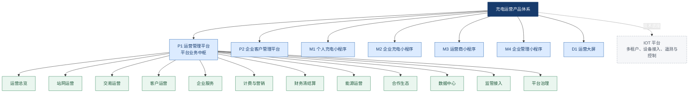

## IA-01 P1 站网运营菜单树

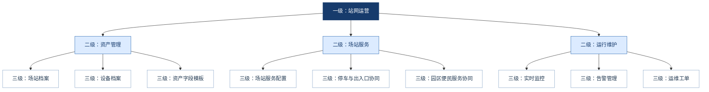

说明：枪口、IOT 只读能力、远程操作记录属于设备档案或实时监控的 Tab/详情审计，不单列三级菜单；停车场、车位、道闸均收敛在“停车与出入口协同”内。

## IA-02 P1 交易运营菜单树

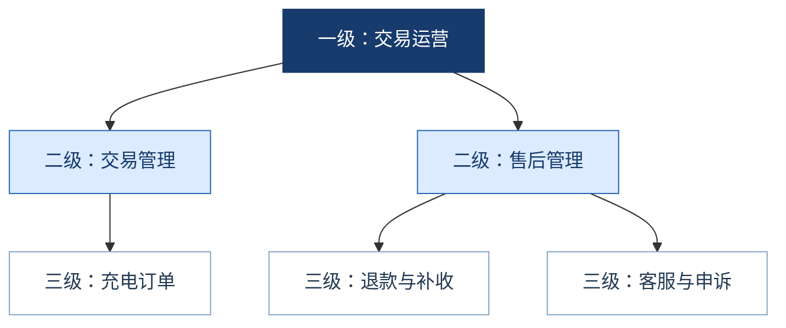

说明：订单负责交易事实与售后入口；退款完成后的账务、调账、对账和结算影响进入“财务清结算”，不在交易域重复维护。

## IA-03 P1 客户运营与计费营销菜单树

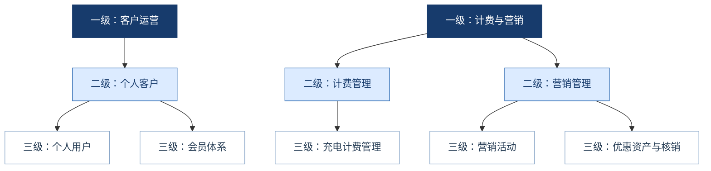

说明：会员是客户运营关系；券、红包、积分、活动和核销属于营销资产，不在“客户运营”重复建入口。

## IA-04 P1 企业服务菜单树

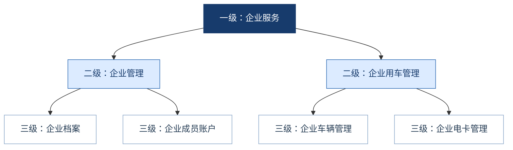

说明：车辆分组、可用站点、额度摘要作为“企业车辆管理”Tab；电卡分组、绑卡、挂失、余额摘要作为“企业电卡管理”Tab。企业预存、冻结和授信只在财务域维护。

## IA-05 P1 财务清结算菜单树

```mermaid
flowchart TB
    A["一级：财务清结算"]

    A --> A1["二级：个人交易资金"]
    A1 --> A11["三级：个人账户与充值"]
    A1 --> A12["三级：预付冻结与退款"]
    A1 --> A13["三级：支付渠道与交易路由"]

    A --> A2["二级：企业资金"]
    A2 --> A21["三级：企业资金账户"]
    A2 --> A22["三级：资金分配与冻结"]
    A2 --> A23["三级：企业授信管理"]
    A2 --> A24["三级：企业资金流水"]

    A --> A3["二级：租户结算"]
    A3 --> A31["三级：结算主体与合同"]
    A3 --> A32["三级：结算账户管理"]
    A3 --> A33["三级：场站结算方案"]
    A3 --> A34["三级：结算账单"]
    A3 --> A35["三级：付款与回单"]

    A --> A4["二级：对账与调账"]
    A4 --> A41["三级：支付渠道对账"]
    A4 --> A42["三级：订单与计费对账"]
    A4 --> A43["三级：资金与结算对账"]
    A4 --> A44["三级：差异与调账"]

    A --> A5["二级：发票管理"]
    A5 --> A51["三级：用户充电发票"]
    A5 --> A52["三级：租户来票管理"]
    A5 --> A53["三级：平台服务费发票"]

    classDef l1 fill:#173B6C,stroke:#173B6C,color:#FFFFFF;
    classDef l2 fill:#DCEBFF,stroke:#2D6AB3,color:#173B6C;
    classDef l3 fill:#FFFFFF,stroke:#8AA7C8,color:#243B53;
    class A l1;
    class A1,A2,A3,A4,A5 l2;
    class A11,A12,A13,A21,A22,A23,A24,A31,A32,A33,A34,A35,A41,A42,A43,A44,A51,A52,A53 l3;
```

说明：个人交易资金、企业资金、租户应付结算是三本独立业务账；支付渠道仅展示商户引用、能力、状态和对账结果，证书/密钥由安全配置中心管理。

## IA-06 P1 能源运营菜单树

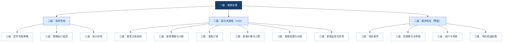

说明：原“企业定时充电策略”更名为“定时充电策略”，由能源运营统一管理；场站、设备、企业和车辆分组只是策略适用范围。V2G 不得以负数充电订单或企业电卡余额建模。

## IA-07 P1 合作生态、数据中心与监管接入菜单树

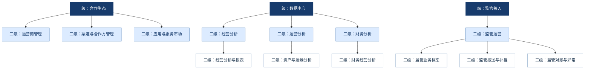

说明：停车、道闸、车位、门禁的站内业务配置仍在“站网运营 > 场站服务”，不在合作生态重复建菜单；合作生态只管理运营商、渠道、合作关系和未来应用市场。

## IA-08 P1 平台治理菜单树

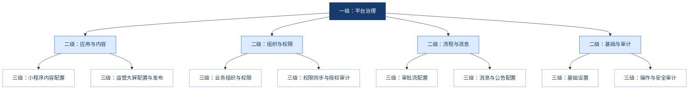

说明：IOT 仍是平台/租户基础页面、资产范围、设备接入和控制权限的主来源；P1 仅管理企业成员及业务授权，并保留授权同步审计。

## IA-09 其他应用入口树

```mermaid
flowchart TB
    A["P2 企业客户管理平台"]
    A --> A1["企业首页"]
    A --> A2["企业管理"]
    A --> A3["车辆与电卡"]
    A --> A4["资金与授权"]
    A --> A5["订单与服务"]
    A --> A6["能源协同"]
    A --> A7["数据分析"]

    B["M1 个人充电小程序"]
    B --> B1["首页"]
    B --> B2["权益"]
    B --> B3["扫码充电"]
    B --> B4["订单"]
    B --> B5["我的"]

    C["M2 企业充电小程序"]
    C --> C1["首页充电"]
    C --> C2["订单"]
    C --> C3["我的额度与电卡"]

    D["M3 运营商小程序"]
    D --> D1["工作台"]
    D --> D2["场站"]
    D --> D3["订单"]
    D --> D4["我的"]

    E["M4 企业管理小程序"]
    E --> E1["首页"]
    E --> E2["车辆"]
    E --> E3["电卡"]
    E --> E4["订单"]
    E --> E5["我的"]

    F["D1 运营大屏"]
    F --> F1["运营总览"]
    F --> F2["站网态势"]
    F --> F3["订单营收"]
    F --> F4["告警运维"]
    F --> F5["能源专题"]
    F --> F6["监管专题"]
```

## IA-10 核心业务域关联图

> 本图不是菜单图，只用于说明责任域关联；不画外部系统、不画 API、不画资金明细。

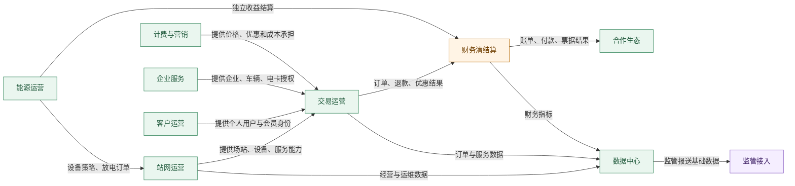

## 2. 本次架构优化结论

1. 删除“客户与权益”这种混合一级域：个人客户归客户运营，会员关系归客户运营，营销资产归计费与营销。
2. 企业服务独立：企业、成员、车辆/车辆分组、电卡/电卡分组为一个 B2B 责任域；企业资金和订单分别保留在财务、交易域。
3. 将定时充电迁入“能源运营 > 有序充电”：其本质是能源调度，而非场站服务配置；V2G 与需求响应保持独立模型。
4. 财务按资金责任拆分：个人交易资金、企业资金、租户结算、对账调账、发票管理；结算主体与合同必须成为独立三级菜单。
5. 停车、道闸、车位收敛为“停车与出入口协同”；厕所门禁归“园区便民服务协同”，只维护业务映射和权益，不维护设备协议/API。
6. IOT 不在菜单树内作为普通菜单：其提供多租户、设备接入、遥测、控制与基础范围；P1 只引用能力并管理运营业务规则。

> 本文件为 v4.2 待评审提案。确认后，再将其菜单命名和层级同步至 v4.2 菜单架构、功能说明、规则基线、流程图集与版本清单。
