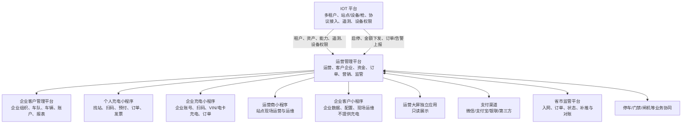
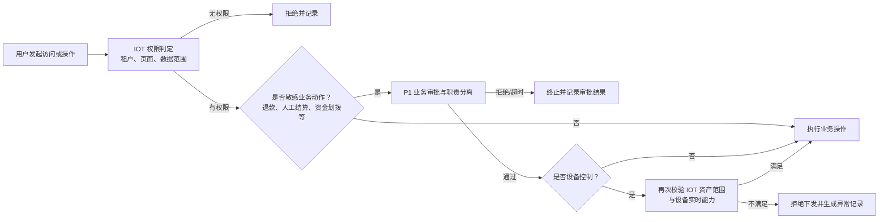
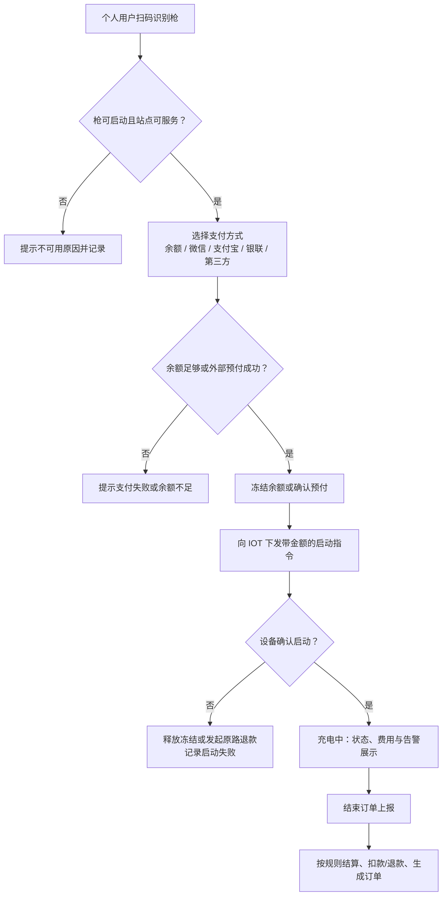
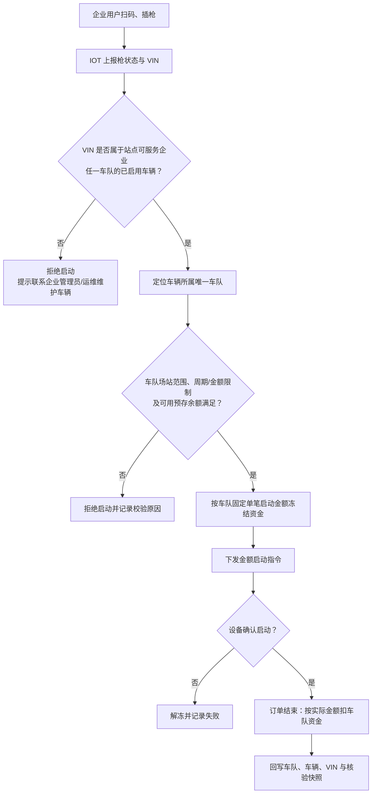
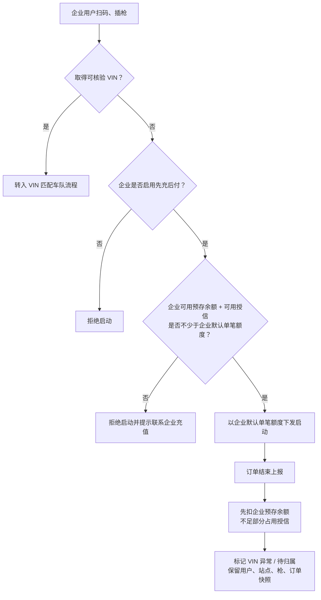
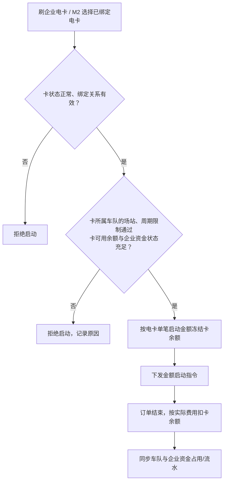
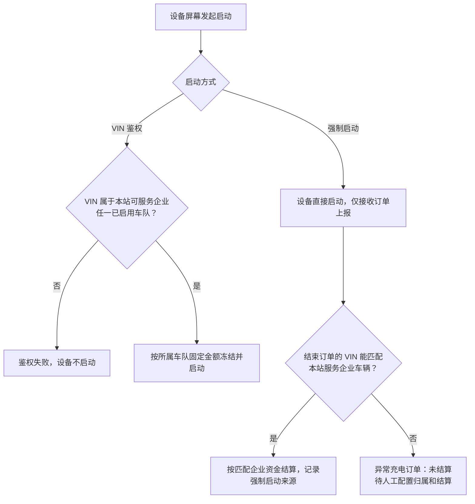
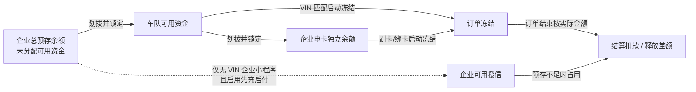
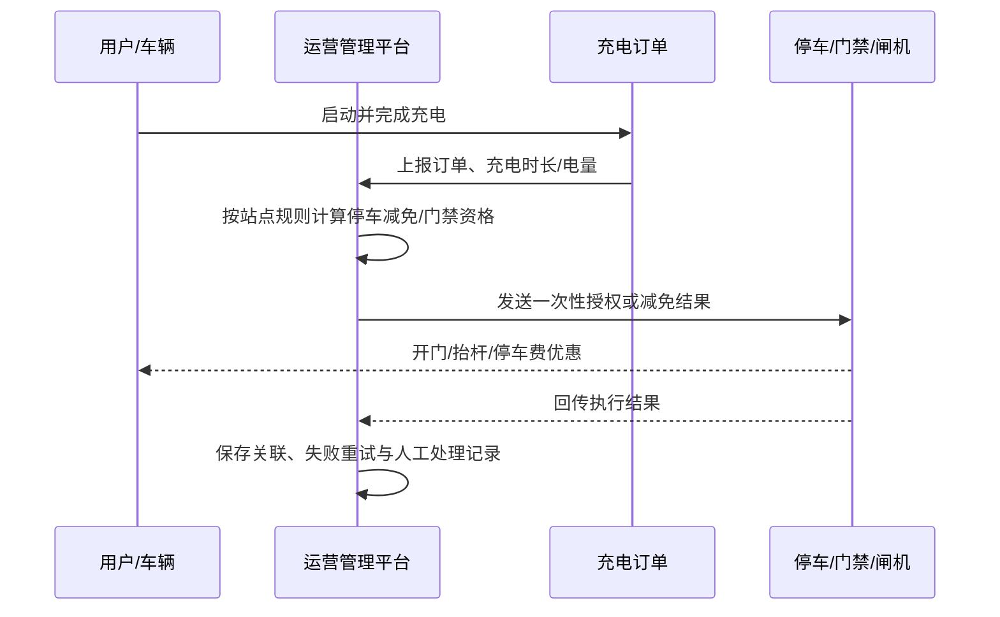
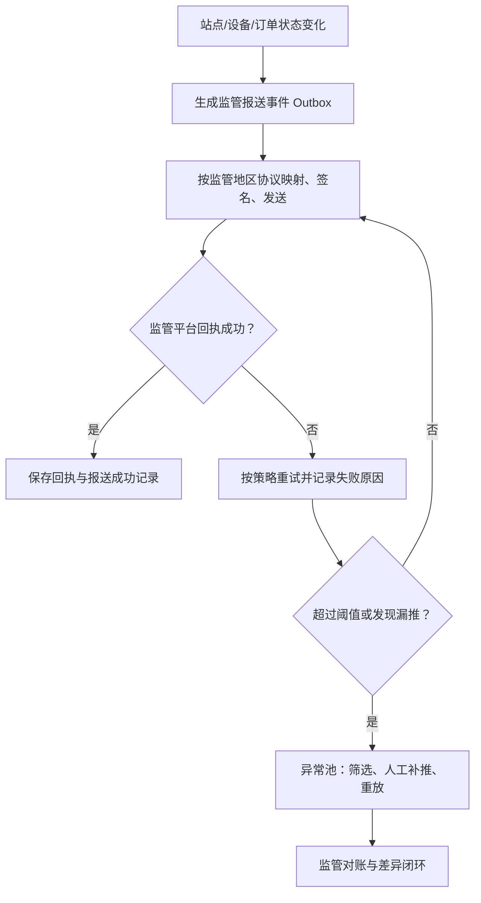

# 充电运营平台场景与流程图集

| 项目 | 内容 |
| --- | --- |
| 需求基线 | 2026.08-V4.0 |
| 文档版本 | V4.0 |
| 文档状态 | 内部评审稿 |
| 关联文档 | [版本清单](需求基线版本清单-v4.0.md) · [菜单架构](充电运营平台菜单架构-v4.0.md) · [功能详细说明](充电运营平台功能详细说明-v4.0.md) · [业务规则基线](充电运营平台业务规则基线-v4.0.md) |

## 1. 使用说明

本图集只描述当前菜单架构已经承载的业务闭环。流程中的规则编号以《业务规则基线》为准；页面与角色说明以《功能详细说明》为准。V2G 不属于当前版本菜单与流程，后续可行性结论见《下一阶段优化清单》。

## 2. 总体应用与职责架构

边界：IOT 平台负责设备协议、设备接入与设备权限；运营管理平台不配置 IOT 接口/API。企业客户子系统的用户、角色、页面与数据范围由运营管理平台管理。运营大屏为独立应用，展示项由运营管理平台配置并发布。

## 2.1 权限与敏感操作审批

适用：运营管理平台 Web、场站商家小程序、企业客户子系统。关联：P1-SET-03、P1-CUST-06、R-AUTH-01～06。

说明：IOT 是运营端 Web 页面与数据权限的唯一来源；P1 的审批只约束高风险业务动作，不能替代或绕过 IOT 权限。P1 管理的是企业客户子系统及场站商家小程序的业务账号、角色、页面和数据范围。

## 3. 个人用户扫码预付充电

适用：公共站个人用户，不要求预先绑定或认证车辆。关联：P1-ORD-01、M1-CHG-01、R-PERSON-01～04、R-START-01。

## 4. 企业小程序：VIN 匹配车队的扫码充电

适用：企业员工/司机使用企业账号扫码；设备已配置“可获取 VIN”，插枪后上报 VIN。关联：M2-CHG-01、P1-CUST-05、P1-FIN-04、R-FLEET-01～04、R-START-02、R-ORDER-02。

## 5. 企业小程序：设备未获取 VIN 的先充后付

适用：仅限企业开启先充后付，且设备“不可获取 VIN”或本次未取得 VIN 的企业小程序扫码场景。关联：P1-CUST-04、P1-CUST-05、R-FUND-04～06、R-START-03、R-ORDER-03。

说明：后续若订单补报 VIN 并与该企业车队车辆匹配，可由授权人员完成归属修正；资金流水不得覆盖重写，必须保留调整流水与审计记录。

## 6. 企业电卡与屏幕刷卡启动

适用：企业电卡刷卡，或企业用户在 M2 绑定电卡后以电卡方式启动。关联：P1-FIN-05、M2-CARD-01、R-CARD-01～05、R-START-04。

## 7. 设备屏幕 VIN 鉴权与强制启动

适用：具备屏幕 VIN 输入/读取或强制启动能力的设备。关联：P1-ASSET-02、P1-ORD-03、R-ASSET-03、R-START-05～06、R-ORDER-04。

## 8. 企业资金分配、冻结与结算

适用：企业预存余额、车队资金、电卡余额与可选授信的资金一致性控制。关联：P1-FIN-04～05、P2-FIN-01～02、R-FUND-01～06、R-CARD-01～05。

资金原则：车队与电卡的“余额”均是企业总预存余额的已锁定子余额，不能重复可用；订单启动只冻结，不直接最终扣款；订单结束才按实际费用结算，释放未使用冻结金额。

## 9. 停车、门禁、闸机协同

适用：泰安等具有停车收费、充电减免、充电用户开门或出场抬杆需求的站点。关联：P1-ASSET-05、P1-PRICE-03、P1-ORD-04、R-SERVICE-01～03。

## 10. 省市监管报送、补推与对账

适用：不同省市监管协议、入网参数及订单漏推治理。关联：P1-REG-01～04、R-REG-01～05。

