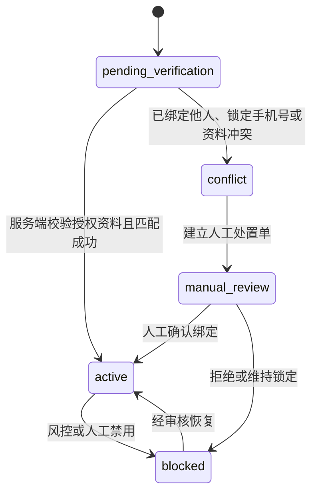

# W1 工程跑道技术设计与契约包

> 模块：W1 工程跑道 / Step 2「契约、DDL 与技术设计」
>
> 状态：待用户审核；本包不是生产实现或上线证明。
>
> 版本：v1.0
>
> 编制日期：2026-08-16
>
> 上游批准：[W1 工程跑道需求与验收包](../../delivery/acceptance/W1-工程跑道需求与验收包.md)、[W1 工程跑道最终决策表](../../delivery/acceptance/W1-工程跑道最终决策表.md)。

## 1. 审核结论范围

本包把 W1 已批准的工程要求转换为可实施的服务/Schema、迁移、契约、状态和测试设计。它仅新增通用契约草案与设计资料；没有业务 API、业务页面、Flyway 脚本、运行时 Kafka Topic、生产者、消费者、MQTT ACL 或真实外部配置。

用户审核通过后，才可进入 Step 3，建立工程底座、质量门禁、可执行 Flyway 入口和无业务的通用基础能力。业务领域的实际迁移、端点、Topic 与消费者仍按各自 W2–W11 模块的已审核 Step 2 设计创建。

## 2. 服务、数据与跨服务责任

| 服务 | 受本次设计约束的 Schema / 事实 | 只允许承担的责任 | 明确禁止 |
| --- | --- | --- | --- |
| `api-gateway` | 无业务 Schema | TraceId、请求大小/限流、安全响应头、令牌预校验和路由 | 对象级授权、订单编排、资金决策。 |
| `platform-service` | `evco_iam`、`evco_master`、`evco_customer`、`evco_trade`、`evco_marketing`、`evco_operations`、`evco_v2g` | 个人主档、渠道映射、订单/结算快照、售后、V2G 业务意图与模拟事实 | 账本、可用余额、支付渠道 I/O、跨 Schema 写。 |
| `finance-service` | `evco_finance` | 现金资金批次、资金分配/冻结、支付和退款规范化结果、独立 V2G 收益账户、结算调整与账本 | 外部回调原文、订单状态修改、设备控制。 |
| `device-connectivity-service` | `evco_device_connectivity` | MQTT 认证、协议校验、控制/原始报文证据和 IOT 同步收件箱 | 主数据、订单、资金或遥测分析事实写入。 |
| `integration-service` | `evco_integration` | 支付、银行、门禁、开票、通知适配；请求和回调的原始执行证据 | 余额、账本、退款资格、订单状态和监管适配。 |
| `telemetry-service` | ClickHouse `evco_telemetry`、受控 Redis key | 遥测投影、实时状态、分析查询和 WebSocket 扇出 | 订单、权限、资金或资产主事实写入。 |
| `ecosystem-service` | `evco_ecosystem` | 国内省市监管目标、映射、任务、尝试、回执、补推和对账 | 设备控制、MQTT 直连、订单/用户/资金事实写入；虚拟电厂或第三方外部协议。 |

每一个产生跨服务副作用的拥有 Schema 都有本地 `outbox_event` 与 `inbox_event`：业务事实与 Outbox 同一事务提交；消费者将 Inbox、自己的事实和处理结果同一事务提交后才提交 Kafka offset。`api-gateway`、Redis 和 MinIO 不作为任何业务事实的最终所有者。

## 3. 前向迁移清单（设计，不创建脚本）

迁移均将在拥有 Schema 的目录按独立版本序列新增，采用 `VyyyyMMddHHmm__lower_snake_case_description.sql`。任何表均须包含 `id`、`created_at`、`updated_at`、适用的 `tenant_id`、`version`、数据分类、保留/删除策略、唯一约束和查询索引；时间为 UTC `DATETIME(3)`，金额/电量使用整数最小单位。不会有 down migration；修复通过补偿迁移、代码回退或恢复演练。

| 后续周 | 拟创建路径和名称 | 归属 / 核心表 | 必须冻结的字段与约束 |
| --- | --- | --- | --- |
| W2 | `database/mysql/evco_customer/migration/V202608240001__create_personal_user_and_channel_identity.sql` | `platform-service`；`personal_user`、`channel_identity`、`identity_conflict_case` | 渠道身份以 `channel_type + application_instance_id + external_subject_fingerprint` 唯一；`personal_user_id`、经过验证的规范化手机号指纹、状态、隐私同意版本、来源、审计时间显式保存。外部主体原文与手机号均为 L3，加密存储且日志只留脱敏值。 |
| W5 / W8 | `database/mysql/evco_trade/migration/V202609140001__create_charging_order_settlement_snapshot.sql` | `platform-service`；`charging_order`、`station_settlement_snapshot`、`settlement_adjustment_request` | 每个订单保存启动时的场站、结算方案版本、结算主体、费率/税率/分成和快照哈希；退款、补差、修正只引用原订单与快照生成追加调整请求。 |
| W6 | `database/mysql/evco_finance/migration/V202609210001__create_cash_funding_lot.sql` | `finance-service`；`cash_funding_lot`、`funding_lot_allocation`、`payment_channel_transaction`、`refund_transaction` | 每笔现金批次固化原支付交易、渠道、应用实例、商户引用、路由版本、实收/已消费/已冻结/已退款/可退款金额；非现金权益独立账本，不能成为现金退款来源。原支付交易及退款按唯一键串行。 |
| W8 | `database/mysql/evco_finance/migration/V202610160001__create_tenant_settlement_adjustment.sql` | `finance-service`；`tenant_settlement_adjustment`、`tenant_settlement_bill` | 调整引用原订单、原结算快照和原因；`LOCKED`、`PAID` 账单不允许原地重算，只允许新增调整、追补或追收记录。未消费充值退款没有该调整记录。 |
| W10 | `database/mysql/evco_ecosystem/migration/V202610300001__create_regulatory_delivery_task.sql` | `ecosystem-service`；`regulatory_target`、`regulatory_mapping_version`、`regulatory_task`、`regulatory_attempt`、`regulatory_receipt`、`regulatory_reconciliation` | 以 `target_id + business_type + business_id + business_version + mapping_version` 去重；任务、尝试、回执和对账分别保存，不能由覆盖更新替代证据。只面向国内监管。 |
| W11 | `database/mysql/evco_v2g/migration/V202611060001__create_v2g_simulation_fact.sql` 与 `database/mysql/evco_finance/migration/V202611060001__create_v2g_earning_account.sql` | `platform-service` 的 `v2g_session`/`v2g_order`；`finance-service` 的 `v2g_earning_account`/`v2g_earning_ledger` | V2G 订单与充电订单分开；模拟记录带 `SIMULATED` 并绝不进入收益余额、账本、监管或设备控制。真实收益账户独立于钱包、企业预存和电卡，提现表/接口不创建。 |
| W2–W11 | 每个拥有 Schema 的 `...__create_outbox_and_inbox.sql` | 各事实拥有服务 | `outbox_event` 以 `event_id` 唯一，记录载荷摘要、分类、发布状态和尝试；`inbox_event` 以消费者服务 + `event_id` 唯一，记录处理结果、失败原因和人工处置引用。 |

上述名称是经审核后在对应工作周创建的前向脚本清单，不是已执行迁移。`external_subject_fingerprint` 只用于受控匹配，由受控密钥服务生成；不得使用可被枚举的裸哈希替代加密原文或访问审计。

## 4. 字段级事实边界与状态机

### 4.1 个人身份与渠道映射

`personal_user` 是跨微信/支付宝共享的个人主档；`channel_identity` 是渠道、应用实例到主档的映射。渠道登录的幂等范围为“渠道 + 应用实例 + 外部主体 + 请求摘要”；验证手机号只能作为匹配线索，不能由客户端直接信任。

`CONFLICT`、解绑/重绑和人工合并都必须留下审计，但 M1 不提供自助绑定、解绑或账户合并。重复成功请求返回同一 `personalUserId`；同一渠道身份绑定到不同主档则返回 `IAM_CHANNEL_IDENTITY_CONFLICT`，不可自动合并。

### 4.2 资金批次、结算调整与 V2G

| 事实 | 正常状态 | 不可变规则 | 补偿 / 人工处置 |
| --- | --- | --- | --- |
| `cash_funding_lot` | `PENDING_PAYMENT → AVAILABLE → PARTIALLY_CONSUMED / FULLY_CONSUMED`；可进入 `REFUNDING → REFUNDED` | 余额由分配、冻结、退款分录计算；退款只针对原交易、原商户、原路由的可退款金额。 | 渠道超时保持待对账；失败/重复回调由 `refund_transaction` 唯一键和原交易流水吸收。 |
| `station_settlement_snapshot` | `CAPTURED` 后只读 | 订单开始即固化；个人收款商户、钱包资金批次均不能改变租户结算归属。 | 订单退款/补差创建 `settlement_adjustment_request`。 |
| `tenant_settlement_adjustment` | `PENDING → POSTED → RECONCILED` | 已锁定或已付款账单不回写；未消费充值退款绝不生成调整。 | 失败进入 `MANUAL_REVIEW`，只允许追加更正记录。 |
| `v2g_earning_account` | `DISABLED` 或未来真实启用后的 `ACTIVE` | 只能保存独立 V2G 收益；不得和钱包、企业预存或电卡互抵；提现业务事实未定义。 | 本期只返回关闭态；模拟收益不记入账户。 |

### 4.3 监管与消息可靠性

监管任务状态使用已冻结 Schema：`PENDING_VALIDATION → PENDING_SEND → SENDING → SUCCEEDED`，失败仅能进入 `RETRYABLE_FAILURE` 或 `MANUAL_REVIEW`；`CANCELLED` 需审计原因。监管服务仅在 W10 创建实际任务/事件；真实省市目标接入另走 C3-R。

Outbox 状态为 `PENDING → PUBLISHED` 或 `RETRYABLE_FAILURE → MANUAL_REVIEW`；Inbox 处理结果为 `APPLIED`、`DUPLICATE`、`RETRYABLE_FAILURE` 或 `DLQ`. 连续不可重试的业务失败由事实拥有模块的已登记 DLQ 接收，保留事件 ID、失败码、脱敏诊断、原 Topic/partition/offset 和授权重放审计。未发布的 Outbox 不是 DLQ 成功。

## 5. HTTP、Kafka 与 MQTT 通用契约

本 Step 2 新增的机器可读草案是可复用公共组件，不声明任何业务资源、Topic、消费者组或生产 ACL：

| 载体 | 草案 | 设计结论 |
| --- | --- | --- |
| HTTP | [`platform-foundation-v1.yaml`](../../contracts/openapi/platform-foundation-v1.yaml) | 固化 `ApiResponse`、分页、错误详情、TraceId 和幂等请求头；具体资源由后续模块 OpenAPI 追加。 |
| HTTP | [`error-codes-v1.yaml`](../../contracts/openapi/error-codes-v1.yaml) | 固化通用及本次高风险边界错误码，禁止用异常文本做接口合同。 |
| Kafka | [`event-envelope.v1.schema.json`](../../contracts/events/schemas/event-envelope.v1.schema.json)、[`event-envelope-v1.yaml`](../../contracts/events/asyncapi/event-envelope-v1.yaml) | 固化公共信封和 schema 组件；`channels: {}` 明确表示 W1 不创建业务 Topic。 |
| MQTT | [`message-envelope.v1.schema.json`](../../contracts/mqtt/schemas/message-envelope.v1.schema.json) | 固化认证设备报文的公共元数据；具体上/下行 Topic 与业务 payload 仍在 W4 逐项登记。 |

### 5.1 HTTP 规则

- 路径统一为 `/api/v{major}/{resource}`；所有响应外观遵循 [API 通用接口规范](../api/API通用接口规范-v1.md)。具体业务端点尚未创建。
- 有副作用的请求使用 `X-Idempotency-Key`。通用记录的默认生存期为 24 小时；支付、退款、结算、监管和控制还必须用原业务唯一引用持久去重，不能依赖 TTL 防重复。
- 重复且请求摘要一致时返回原结果；同键不同摘要返回 `IDEMPOTENCY_CONFLICT`；版本或状态不满足分别返回 `VERSION_CONFLICT`、`STATE_CONFLICT`。
- `traceId` 由入口生成或透传；`scope`、操作者、数据范围版本和审计关联 ID 通过受控上下文传播，日志/错误体不得包含 L3/L4/L6 原文。

### 5.2 Kafka 规则

- 投递语义为至少一次，端到端以 `eventId`、消费者 Inbox、业务唯一键和幂等键吸收重复；不得宣称 exactly-once。
- `eventType` 的大版本、`eventVersion` 和 `schemaVersion` 必须一致：例如 `trade.charging-order.created.v1`、`eventVersion: "1"`、`schemaVersion: "1.0"`。破坏性变化升级 Topic/事件大版本；同大版本内的兼容增加升级 `schemaVersion`。
- Kafka key 与 `partitionKey` 必须相同，且按受影响聚合的局部顺序键选择。实际分区数、保留期和 `max.poll.records` 由 W4 压测冻结，W1 不设置业务值。
- 仅 Testcontainers 中可创建隔离测试 Topic；不得由 Compose 启动脚本、应用代码或人工预创建业务 Topic。实际 Topic、发布者、消费者组、DLQ 责任以 `contracts/events/README.md` 为唯一入口。

### 5.3 MQTT 规则

- 平台 MQTT 为 MQTT 5、QoS 1、mTLS/来源签名/资产 ACL；控制报文 `retain=false`，过期、低序号、来源或状态版本不匹配均拒绝并审计。
- MQTT 设备接入由 `device-connectivity-service` 唯一负责；设备、外部平台和监管目标不能直连 Kafka、数据库或设备控制接口。
- 消息公共信封只是 W4 的报文校验组件，不能视为已开通设备接入。GB/T 27930 车—桩通信也不被此契约替代。

## 6. 工程底座、前后端边界与安全

### 6.1 Step 3 的工程目录与运行设计

| 范围 | Step 3 将创建的工程资产 | 本阶段的设计约束 |
| --- | --- | --- |
| 后端 | `.mvn/`、Maven Wrapper、质量插件、各服务业务域包直挂（如 `platform/iam/`）、共享库（contracts/testkit；starter 为 W2 期间新增，承载 web 通用能力：基础层追踪/全局异常/MyBatis 拦截器 + 管理端层 Bearer 鉴权/两档权限，`evco.web.security.enabled` 开关控制） | Java 21；业务域包直挂传统分层；全量中文注释；无跨服务 Maven 依赖。 |
| 前端 | `frontend/` pnpm workspace，`apps/`、`packages/types`、`packages/api-client`、`packages/design-tokens`、`modules/<module>/<feature>` | Web 使用 Vue 3/Vite/Pinia/Element Plus/ECharts；M1–M4 使用 uni-app；共享包不含业务 UI、权限或状态。 |
| 基础设施 | `compose` 的 `core`、`iot`、`telemetry`、`observability` profiles | `core`：MySQL/Redis/Kafka KRaft；`iot`：EMQX；`telemetry`：ClickHouse/MinIO；`observability`：OTel/Prometheus/Grafana。镜像 digest、资源限制和健康检查在 Step 3 验证后回填。 |
| 测试 | unit、integration、contract、e2e、security、performance 路径与 Testcontainers Testkit | 确定性 Mock 只服务内部验证；不得伪造 C1/C2/C3-R 或真实 V2G 门禁完成。 |

### 6.2 前端边界和关闭态

W1 只建立 Token、主题和测试骨架，不创建业务页面。主题 `energy-green`、`graphite-night`、`command-deep` 必须共享同一语义 Token 和信息架构；1920 主视口最大内容宽度 1440px、24 栅格、8px 间距、210/64px 侧栏、64px 顶栏以及六组响应式视口继续按 Step 1 设计。主题切换不能改变状态语义、权限、数据范围或布局逻辑。

未来页面只能在 API Step 4 通过后调用稳定端点，并必须覆盖加载、空、错误、无权限、禁用和渠道关闭态。M1 访客可浏览公开营业站点；身份、支付、退款、权益、发票和 V2G 资格由服务端业务规则决定，绝不由 P1 页面权限或主题前端判断替代。

### 6.3 安全和数据处理

- L3 身份映射/手机号、L4 支付/回调原文、L5 监管/控制证据、L6 密钥按照《[数据治理与密钥管理矩阵](../standards/数据治理与密钥管理矩阵-v1.md)》分别存储、脱敏、留存和导出；新增字段在实现前补充目的、地域、访问和删除路径。
- P1 只能维护应用、内容、已批准开关和运营资料，不能配置 M1 个人用户的页面/功能权限；渠道密钥只由受控密钥注入，P1 仅显示脱敏引用和校验状态。
- API、事件、MQTT 与审计均传播 `traceId`；跨租户、IDOR、越权导出、重放、幂等冲突和敏感日志泄露必须是自动化失败用例。

## 7. 验收用例清单

| 编号 | 层级 | 场景与预期 |
| --- | --- | --- |
| W1-D-01 | 迁移设计 | 每张拟建表都能定位单一 Schema/服务、主键、唯一键、索引、数据分类、审计和前向修复策略；无跨 Schema 写入。 |
| W1-D-02 | 身份契约 | 同一渠道身份重复登录返回同一主档；已绑定他人、锁定手机号、解绑/重绑返回稳定冲突结果并留审计；M1 无自助合并路径。 |
| W1-D-03 | 资金/结算设计 | 非现金资产不可现金退款；原路由/原商户保持；未消费充值退款无结算调整；锁单/付款后只能追加调整。 |
| W1-D-04 | V2G 关闭态 | `SIMULATED` 记录不进入收益余额/账本/监管/设备控制；真实服务和提现请求均被稳定拒绝。 |
| W1-D-05 | 监管边界 | 国内监管任务按目标/业务/版本/映射版本幂等；无设备控制权、无 VPP/第三方 Topic、消费者或外部协议。 |
| W1-D-06 | Kafka 契约 | 信封缺字段、错误大版本、重复事件、乱序、过期和不可重试失败分别被拒绝、幂等处理或送入登记的 DLQ；offset 在本地事务后提交。 |
| W1-D-07 | HTTP 契约 | `ApiResponse`、TraceId、分页、稳定错误码和 `X-Idempotency-Key` 的同键重放/异载荷冲突均可自动验证。 |
| W1-D-08 | MQTT 契约 | 设备来源、ACL、签名、顺序、过期、状态版本、QoS 及 `retain=false` 均可由契约/集成测试验证。 |
| W1-D-09 | 租户与数据保护 | 跨租户读取、IDOR、越权导出、日志明文 PII/支付数据和密钥泄露必须失败或被扫描阻断。 |
| W1-D-10 | 前端工程边界 | Web 与 uni-app 均能构建；共享包不引用 Element Plus、浏览器 DOM 或业务状态；六个视口主题切换不改变布局语义。 |

## 8. 设计自检与待审核结论

- [x] 服务、Schema 与跨服务写入禁令已与《架构基线与服务边界 v2》一致。
- [x] 个人身份、资金批次、订单结算快照、锁账后调整、V2G 独立收益和监管任务均有明确所有者、字段方向、状态/补偿和后续迁移清单。
- [x] OpenAPI、Kafka/AsyncAPI、MQTT 均提供公共草案；没有业务 Topic、消费者、页面、端点或迁移脚本。
- [x] API/消息幂等、Outbox/Inbox、DLQ、人工处置、数据分类、前端/API 串行门禁和测试用例均已定义。
- [x] 国内监管仍在 W10 `ecosystem-service`；虚拟电厂与其他外部生态能力仍在 W12 后另批批准；真实 V2G 和提现仍关闭。

请审核本包中的数据归属、状态机、迁移清单和通用契约。通过后可回复：`设计通过，进入第 3 步`；若需调整，请指出表、字段、状态或边界。未经该结论，不创建 Step 3 工程资产或任何业务实现。
