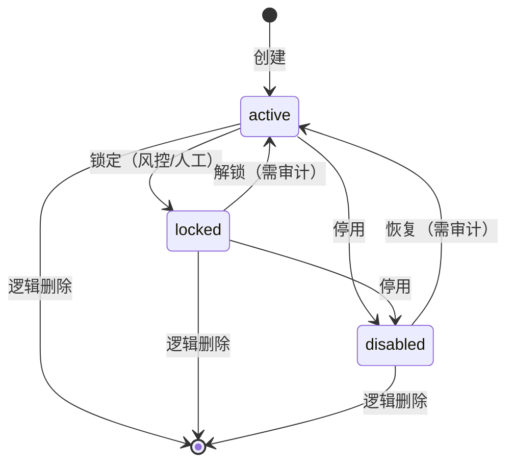
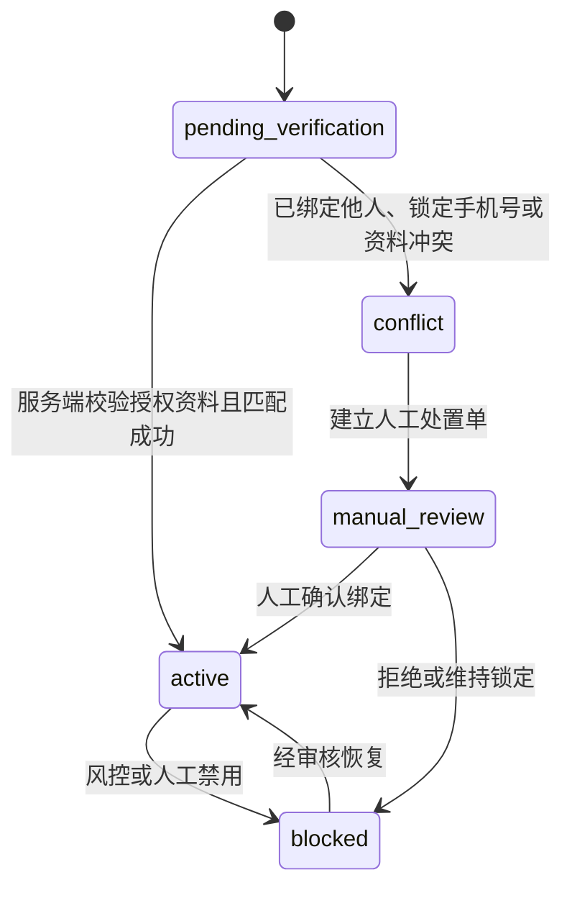
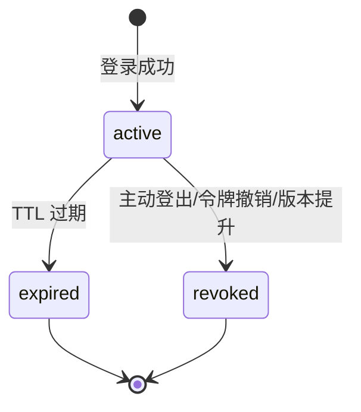
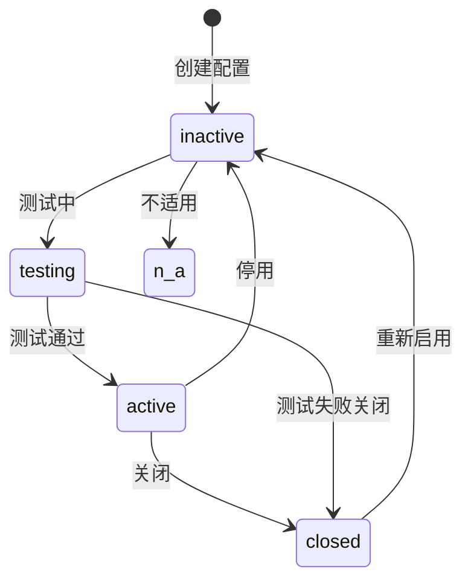

# W2 IAM、个人身份与配置技术设计与契约包

> 模块：W2 IAM、个人身份与配置 / Step 2「契约、DDL 与技术设计」
>
> 状态：待用户审核；本包不是生产实现或上线证明。
>
> 版本：v1.5
>
> 编制日期：2026-08-18
>
> 上游批准：[W2 需求与验收包](../../delivery/acceptance/W2-IAM个人身份与配置需求与验收包.md) v1.3、[W2 最终决策表](../../delivery/acceptance/W2-IAM个人身份与配置最终决策表.md) v1.2。
>
> 上游引用：[W1 工程跑道技术设计与契约包](W1-工程跑道技术设计与契约包.md) v1.0（已冻结的服务边界、迁移路径、个人身份状态机、通用契约）。

## 1. 审核结论范围

本包把 W2 Step 1 已批准的要求转换为可实施的服务/Schema、迁移、契约、状态和测试设计。本包新增 W2 范围内的 OpenAPI 契约草案、API 规范、Flyway 迁移清单和字段级事实边界。

用户审核通过后，才可进入 Step 3，开始后端/迁移/契约实现、API 自动化与人工验证。Step 2 审核前不写生产代码、不创建业务 Topic/消费者、不创建页面。

### 1.1 W1 已冻结可直接引用的结论

| 结论 | 出处 | 本包引用方式 |
| --- | --- | --- |
| 服务边界与跨服务写入禁令 | [W1 §2](W1-工程跑道技术设计与契约包.md) | 直接引用，不重复定义 |
| personal_user/channel_identity/identity_conflict_case 表字段与约束 | [W1 §3 W2 行](W1-工程跑道技术设计与契约包.md) | 本包 §3 细化为实际迁移脚本 |
| 个人身份状态机 pending_verification → active/blocked/conflict → manual_review | [W1 §4.1](W1-工程跑道技术设计与契约包.md) | 本包 §4.2 引用，不重新定义 |
| HTTP/Kafka/MQTT 通用契约 | [W1 §5](W1-工程跑道技术设计与契约包.md) | 本包 §5 追加 W2 业务端点 |
| Outbox/Inbox 规则 | [W1 §3](W1-工程跑道技术设计与契约包.md) | 本包 §3 追加 W2 事件 |
| IAM_CHANNEL_IDENTITY_CONFLICT 错误码 | [error-codes-v1.yaml](../../contracts/openapi/error-codes-v1.yaml) | 直接引用 |

## 2. 服务、数据与跨服务责任

W2 范围内受本次设计约束的服务与 Schema：

| 服务 | 受本次设计约束的 Schema / 事实 | 只允许承担的责任 | 明确禁止 |
| --- | --- | --- | --- |
| `api-gateway` | 无业务 Schema | TraceId 注入、限流、安全响应头、令牌预校验、路由、关闭态规则、双模式路由 | 对象级授权、IAM 决策、业务规则校验 |
| `platform-service` | `evco_iam`、`evco_customer` | IAM 管理用户与角色 CRUD、认证令牌签发/撤销、RBAC 授权、个人用户主档、渠道身份映射、P1 渠道/支付/结算配置 | 账本、可用余额、支付渠道 I/O、跨 Schema 写 |
| `finance-service` | 无 W2 新增 Schema | 无 W2 责任（W6 资金批次） | — |
| `device-connectivity-service` | 无 W2 新增 Schema | 无 W2 责任（W4 设备/遥测） | — |
| `integration-service` | 无 W2 新增 Schema | 无 W2 责任（W6 支付/退款 I/O） | — |
| `telemetry-service` | 无 W2 新增 Schema | 无 W2 责任（W4 遥测） | — |
| `ecosystem-service` | 无 W2 新增 Schema | 无 W2 责任（W10 监管） | — |

W2 范围内，`platform-service` 是唯一新增业务事实的服务。`api-gateway` 承担网关层职责（TraceId、限流、令牌预校验、路由、关闭态规则），不承担对象级授权。

## 3. 前向迁移清单

迁移在拥有 Schema 的目录按独立版本序列新增，采用 `VyyyyMMddHHmm__lower_snake_case_description.sql`。任何表均须包含 `id`、`created_at`、`updated_at`、适用的 `tenant_id`、`version`、数据分类、保留/删除策略、唯一约束和查询索引；时间为 UTC `DATETIME(3)`，金额/电量使用整数最小单位。不会有 down migration。

### 3.1 evco_iam 迁移清单

| 迁移路径 | 核心表 | 必须冻结的字段与约束 |
| --- | --- | --- |
| `database/mysql/evco_iam/migration/V202608240001__create_iam_user_and_role.sql` | `iam_user`、`iam_role`、`iam_user_role` | `iam_user.username` 租户范围内唯一；`iam_user.iot_user_id`（IOT 用户 ID，SSO 免登录定位键，唯一，source=IOT_PUSH 时必填）；`iam_user.source` 枚举 `PLATFORM`/`IOT_PUSH`；`iam_user.status` 枚举 `active`/`locked`/`disabled`；`iam_user.version` 乐观锁；`iam_user.tenant_id` 数据范围；`iam_role.tenant_id` 所属租户（平台级角色使用系统租户 ID，对齐 IOT `t_role`），`tenant_id + code` 唯一；`iam_user_role` 多对多，`user_id + role_id` 唯一，含 `source` 字段（`PLATFORM`/`IOT_PUSH`）；逻辑删除 `deleted_at`；审计字段完整 |
| `database/mysql/evco_iam/migration/V202608240002__create_auth_session_and_token.sql` | `auth_session`、`refresh_token` | `auth_session.user_id` 关联 `iam_user`；`auth_session.auth_type` 枚举 `PASSWORD`/`SSO`（SSO 免登录会话标记）；`auth_session.status` 枚举 `active`/`expired`/`revoked`；`auth_session.expires_at` TTL；`refresh_token.token_hash` 唯一；`refresh_token.status` 枚举 `active`/`used`/`revoked`；`refresh_token.expires_at` TTL；审计字段完整 |
| `database/mysql/evco_iam/migration/V202608240003__create_iam_audit_log.sql` | `iam_audit_log` | `iam_audit_log.actor_id` 操作者；`iam_audit_log.action` 枚举（`create`/`update`/`delete`/`status_change`/`role_replace`/`login`/`logout`/`token_revoke`）；`iam_audit_log.target_type` + `target_id`；`iam_audit_log.trace_id`；`iam_audit_log.summary` 脱敏摘要；`iam_audit_log.tenant_id`；按时间索引 |
| `database/mysql/evco_iam/migration/V202608240004__create_outbox_and_inbox.sql` | `outbox_event`、`inbox_event` | `outbox_event.event_id` 唯一；`outbox_event.event_type` 大版本；`outbox_event.payload_summary` 脱敏摘要；`outbox_event.status` 枚举 `PENDING`/`PUBLISHED`/`RETRYABLE_FAILURE`/`MANUAL_REVIEW`；`inbox_event.consumer_service + event_id` 唯一；`inbox_event.result` 枚举 `APPLIED`/`DUPLICATE`/`RETRYABLE_FAILURE`/`DLQ` |
| `database/mysql/evco_iam/migration/V202608240005__create_permission_and_role_permission.sql` | `iam_permission`、`iam_permission_policy`、`iam_permission_policy_item`、`iam_role_permission`、`iam_role_policy`、`iam_org_data_scope`、`iam_tenant_data_scope`、`iam_tenant_grant` | `iam_permission.code` 全局唯一（格式 `resource:action`，仅 `read`/`write` 两档）；`iam_permission.resource` + `action`；`iam_permission.scope` 枚举 `PLATFORM`/`TENANT`/`ENTERPRISE`；`iam_permission.source` 枚举 `PLATFORM`/`IOT_PUSH`；`iam_permission.status` 枚举 `ACTIVE`/`INACTIVE`（关闭态功能初始化为 `INACTIVE`）；`is_builtin` 内置不可删除；`phase` 标记首次交付周；`iam_role_permission`（`role_id + permission_id` 唯一）与 `iam_role_policy`（`role_id + policy_id` 唯一）为纯关联表，无 `role_type`/`data_scope`/`status` 字段；`iam_permission_policy` 以 `tenant_id_key + active_code` 生成列实现平台级策略（`tenant_id=NULL`）与软删后编码释放；`iam_org_data_scope`（`org_id + station_id` 唯一）、`iam_tenant_data_scope`（`tenant_id + station_id + access` 唯一）、`iam_tenant_grant`（`tenant_id + permission_id` 唯一）实现站点级数据授权；W2 初始化 18 条两档权限与预置策略 `POLICY_SYSTEM_CONFIG`（16 条明细），W3-W11 按交付周追加（详见 §7） |

### 3.2 evco_customer 迁移清单

| 迁移路径 | 核心表 | 必须冻结的字段与约束 |
| --- | --- | --- |
| `database/mysql/evco_customer/migration/V202608240001__create_personal_user_and_channel_identity.sql` | `personal_user`、`channel_identity`、`identity_conflict_case` | 渠道身份以 `channel_type + application_instance_id + external_subject_fingerprint` 唯一；`personal_user_id`、经过验证的规范化手机号指纹、状态、隐私同意版本、来源、审计时间显式保存。外部主体原文与手机号均为 L3，加密存储且日志只留脱敏值。`personal_user.status` 枚举 `pending_verification`/`active`/`blocked`/`conflict`/`manual_review`；`channel_identity.status` 枚举 `pending_verification`/`active`/`blocked`/`conflict`；`identity_conflict_case.status` 枚举 `pending`/`resolved_merge`/`resolved_block`/`rejected` |
| `database/mysql/evco_customer/migration/V202608240002__create_personal_user_audit_log.sql` | `personal_user_audit_log` | `personal_user_audit_log.actor_id`；`personal_user_audit_log.action` 枚举（`login`/`bind`/`unbind`/`merge`/`block`/`unblock`/`conflict_resolve`/`privacy_consent`）；`personal_user_audit_log.target_type` + `target_id`；`personal_user_audit_log.trace_id`；`personal_user_audit_log.summary` 脱敏摘要；按时间索引 |
| `database/mysql/evco_customer/migration/V202608240003__create_outbox_and_inbox.sql` | `outbox_event`、`inbox_event` | 同 §3.1 evco_iam Outbox/Inbox 规则 |

### 3.3 evco_master 迁移清单

| 迁移路径 | 核心表 | 必须冻结的字段与约束 |
| --- | --- | --- |
| `database/mysql/evco_master/migration/V202608240001__create_channel_payment_settlement_config.sql` | `mini_program_app`、`payment_channel`、`payment_route`、`settlement_channel`、`platform_setting`、`data_dictionary`、`feature_switch`、`approval_flow_template`、`operation_log` | `mini_program_app.app_id` 唯一；`mini_program_app.subject_type` 主体/类型；`mini_program_app.status` 枚举 `active`/`inactive`/`testing`/`closed`/`n_a`；`payment_channel.channel_type` 枚举 `wechat`/`alipay`/`unionpay`/`yinteng`；`payment_channel.status` 枚举 `active`/`inactive`/`testing`/`closed`/`n_a`；银联/银盛等条件渠道默认 `closed`；`settlement_channel.status` 枚举同上；`settlement_channel.limit_amount`、`risk_control_rules` JSON、`health_status` 枚举 `healthy`/`degraded`/`down`；`platform_setting.key` 唯一；`feature_switch.key` 唯一；`approval_flow_template.code` 唯一；`operation_log.trace_id`；审计字段完整 |

### 3.4 W2 事件清单

| 事件类型 | 生产者 | Topic（W4 冻结分区数/保留期前不创建） | 事件载荷摘要 |
| --- | --- | --- | --- |
| `iam.user.created.v1` | platform-service | `evco-iam-user-events` | userId、username（脱敏）、tenantId、roleIds、traceId |
| `iam.user.status_changed.v1` | platform-service | `evco-iam-user-events` | userId、fromStatus、toStatus、actorId、traceId |
| `iam.user.deleted.v1` | platform-service | `evco-iam-user-events` | userId、version、actorId、traceId |
| `iam.role.replaced.v1` | platform-service | `evco-iam-user-events` | userId、roleIds（新增/移除）、actorId、traceId |
| `auth.session.revoked.v1` | platform-service | `evco-auth-session-events` | sessionId、userId、reason、actorId、traceId |
| `personal_user.created.v1` | platform-service | `evco-customer-identity-events` | personalUserId、channelType、applicationInstanceId、status、traceId |
| `personal_user.status_changed.v1` | platform-service | `evco-customer-identity-events` | personalUserId、fromStatus、toStatus、reason、traceId |
| `personal_user.conflict_detected.v1` | platform-service | `evco-customer-identity-events` | conflictCaseId、channelType、fingerprint（脱敏）、traceId |
| `config.channel.changed.v1` | platform-service | `evco-config-events` | configType、configId、changeType、actorId、traceId |

Topic 名称是设计引用，不在 W2 创建实际 Kafka Topic。Topic 的分区数、保留期、消费者组、DLQ 责任在 W4 压测后冻结。

## 4. 字段级事实边界与状态机

### 4.1 IAM 用户状态机

**状态迁移规则**：
- `active → locked`：锁定，需审计，记录 actorId 和 reason
- `locked → active`：解锁，需审计，记录 actorId
- `active/locked → disabled`：停用，需审计；最后管理员保护：不得停用最后一个可用平台超级管理员
- `disabled → active`：恢复，需审计，记录 actorId
- 逻辑删除：保留审计与历史业务关联；禁止物理删除；删除后不可见但审计可追溯

**并发控制**：`iam_user.version` 乐观锁；冲突返回 `VERSION_CONFLICT`。

### 4.2 个人身份与渠道映射（引用 W1 §4.1）

引用 [W1 §4.1](W1-工程跑道技术设计与契约包.md)。`CONFLICT`、解绑/重绑和人工合并都必须留下审计，但 M1 不提供自助绑定、解绑或账户合并。重复成功请求返回同一 `personalUserId`；同一渠道身份绑定到不同主档则返回 `IAM_CHANNEL_IDENTITY_CONFLICT`，不可自动合并。

### 4.3 认证服务状态机

**令牌策略**：
- access_token：短 TTL（建议 15-30 分钟）；JWT 或平台令牌
- refresh_token：长 TTL（建议 7-30 天）；`refresh_token.token_hash` 唯一；支持撤销
- 会话失效：主动登出、被动失效（令牌撤销/版本提升）、TTL 过期
- 多端会话策略：同一用户多端登录策略由 `platform_setting` 配置

### 4.4 授权服务

**RBAC 模型**：
- 角色多对多：`iam_user_role` 关联表
- 权限校验中间件：网关层令牌预校验 + 服务层对象级授权
- 数据范围：资产数据按站点级授权过滤（`iam_org_data_scope`/`iam_tenant_data_scope`，见 §7.5）；企业数据按 `enterprise_id` 天然隔离；平台超管（`user_type=PLATFORM_SUPER`）不受限
- 可授予角色集合：按操作者所属租户与租户功能授权上限（`iam_tenant_grant`）决定；操作者不可授予超出可授予范围的角色

**越权失败用例**：
- 跨租户读写：返回 `FORBIDDEN`
- IDOR（直接对象引用）：返回 `RESOURCE_NOT_FOUND`（不暴露资源存在）
- 越权导出：返回 `FORBIDDEN`
- 重放：返回 `IDEMPOTENCY_CONFLICT`
- 幂等冲突：返回 `IDEMPOTENCY_CONFLICT`
- 敏感日志泄露：扫描阻断

### 4.5 渠道/支付/结算配置状态机

**关闭态规则**：
- `closed`：渠道已关闭，不可执行真实交易
- `n_a`：不适用（如银联/银盛等条件渠道未接入）
- 银联、银盛等条件渠道默认 `closed`（[12 周计划 §5 条件功能](../requirements/充电运营平台12周全功能交付实施计划-v3.md)）
- 真实支付/退款交易在 W6 资金批次、C2-W/C2-A 独立门禁

## 5. OpenAPI 契约与错误码

### 5.1 OpenAPI 契约清单

| 契约文件 | 覆盖范围 | 状态 |
| --- | --- | --- |
| [`iam-v1.yaml`](../../contracts/openapi/iam-v1.yaml) | IAM 管理用户与角色 CRUD（8 个端点） | 新增 |
| [`personal-identity-v1.yaml`](../../contracts/openapi/personal-identity-v1.yaml) | 个人用户主档与渠道身份映射（6 个端点） | 新增 |
| [`auth-v1.yaml`](../../contracts/openapi/auth-v1.yaml) | 认证服务（图形验证码、登录、登出、刷新、撤销、SSO 免登录、profile）（9 个端点） | 新增 |
| [`channel-config-v1.yaml`](../../contracts/openapi/channel-config-v1.yaml) | P1 渠道/支付/结算配置（CRUD）（8 个端点） | 新增 |
| [`platform-foundation-v1.yaml`](../../contracts/openapi/platform-foundation-v1.yaml) | 公共组件（ApiResponse、分页、错误、幂等） | W1 已建立，引用 |

### 5.2 IAM 管理用户与角色端点（引用 [IAM 接口规范 v1](../api/IAM用户与角色接口规范-v1.md)）

| 方法与路径 | 请求模型 | 响应模型 | 中文语义与约束 |
| --- | --- | --- | --- |
| `GET /api/v1/iam/users` | `UserPageQuery` | `ApiResponse<PageResponse<UserListVO>>` | 按用户名、姓名、状态、角色分页查询 |
| `GET /api/v1/iam/users/{userId}` | 路径参数 `userId` | `ApiResponse<UserDetailVO>` | 查询单一可见用户及受控角色摘要 |
| `POST /api/v1/iam/users` | `CreateUserRequest` + `X-Idempotency-Key` | `ApiResponse<UserDetailVO>` | 新增管理用户并绑定初始角色；用户名租户范围内唯一 |
| `PUT /api/v1/iam/users/{userId}` | `UpdateUserRequest` | `ApiResponse<UserDetailVO>` | 编辑允许维护的资料与版本 |
| `PUT /api/v1/iam/users/{userId}/roles` | `ReplaceUserRolesRequest` | `ApiResponse<UserRoleBindingVO>` | 以完整角色集合替换绑定 |
| `PATCH /api/v1/iam/users/{userId}/status` | `ChangeUserStatusRequest` | `ApiResponse<UserStatusVO>` | 启用、停用或锁定用户；最后管理员保护 |
| `DELETE /api/v1/iam/users/{userId}` | 路径参数 `userId` + `version` | `ApiResponse<Void>` | 逻辑删除；保留审计 |
| `GET /api/v1/iam/roles/options` | 可选范围参数 | `ApiResponse<List<RoleOptionVO>>` | 仅返回当前操作者可授予的角色 |

### 5.3 个人用户主档与渠道身份映射端点

| 方法与路径 | 请求模型 | 响应模型 | 中文语义与约束 |
| --- | --- | --- | --- |
| `GET /api/v1/personal-users` | `PersonalUserPageQuery` | `ApiResponse<PageResponse<PersonalUserListVO>>` | 按状态、渠道、来源、创建时间分页查询；不返回 L3 原文 |
| `GET /api/v1/personal-users/{personalUserId}` | 路径参数 | `ApiResponse<PersonalUserDetailVO>` | 查询单一个人用户主档与渠道身份摘要；L3 字段脱敏 |
| `POST /api/v1/personal-users` | `CreatePersonalUserRequest` + `X-Idempotency-Key` | `ApiResponse<PersonalUserDetailVO>` | 渠道登录幂等创建；重复请求返回同一 `personalUserId` |
| `PUT /api/v1/personal-users/{personalUserId}` | `UpdatePersonalUserRequest` | `ApiResponse<PersonalUserDetailVO>` | 编辑允许维护的资料与版本；M1 不提供自助绑定/解绑 |
| `GET /api/v1/personal-users/{personalUserId}/conflicts` | 路径参数 | `ApiResponse<List<IdentityConflictCaseVO>>` | 查询该用户的渠道身份冲突列表 |
| `PATCH /api/v1/identity-conflicts/{conflictCaseId}` | `ResolveConflictRequest` | `ApiResponse<IdentityConflictCaseVO>` | 人工处置冲突（合并/阻断/拒绝）；需审计 |

### 5.4 认证服务端点（引用 [认证与 SSO 接口规范 v1](../api/认证与SSO接口规范-v1.md)）

| 方法与路径 | 请求模型 | 响应模型 | 中文语义与约束 |
| --- | --- | --- | --- |
| `GET /api/v1/auth/captcha` | 无 | `ApiResponse<CaptchaResponse>` | 获取图形验证码；Redis TTL 120 秒，一次性校验 |
| `POST /api/v1/auth/login` | `LoginRequest`（含 `captchaId`+`captchaCode`）+ `X-Idempotency-Key` | `ApiResponse<LoginResponse>` | 平台管理端登录；图形验证码校验 + 5 次失败锁定；签发 access_token + refresh_token，响应含 `deploymentMode` |
| `POST /api/v1/auth/sso/tickets` | `SsoTicketPushRequest`（服务间凭证） | `ApiResponse<Void>` | IOT 推送一次性 SSO ticket；仅 IOT 协同模式启用 |
| `POST /api/v1/auth/sso/login` | `SsoLoginRequest` | `ApiResponse<LoginResponse>` | SSO 免登录：ticket 换会话；仅识别已推送用户，直接进入平台 |
| `GET /api/v1/auth/profile` | 无 | `ApiResponse<ProfileResponse>` | 当前用户档案：权限码 + deploymentMode + 父级自动推导的可见菜单树 |
| `POST /api/v1/auth/logout` | `LogoutRequest` | `ApiResponse<Void>` | 主动登出；撤销会话与 refresh_token |
| `POST /api/v1/auth/refresh` | `RefreshRequest` | `ApiResponse<LoginResponse>` | 刷新 access_token；refresh_token 一次性使用 |
| `POST /api/v1/auth/revoke` | `RevokeRequest` | `ApiResponse<Void>` | 被动撤销（管理员强制下线）；需审计 |

**M1 微信登录 Mock**：`POST /api/v1/auth/m1/wechat-mock` + `X-Idempotency-Key` → `ApiResponse<LoginResponse>`；C1-Mock 通过不等于 C1-W 真实门禁通过。

### 5.5 P1 渠道/支付/结算配置端点

| 方法与路径 | 请求模型 | 响应模型 | 中文语义与约束 |
| --- | --- | --- | --- |
| `GET /api/v1/mini-program-apps` | `MiniProgramAppPageQuery` | `ApiResponse<PageResponse<MiniProgramAppListVO>>` | 按主体/类型、环境、状态分页查询；密钥只返回脱敏引用 |
| `POST /api/v1/mini-program-apps` | `CreateMiniProgramAppRequest` + `X-Idempotency-Key` | `ApiResponse<MiniProgramAppDetailVO>` | 新增小程序应用档案；AppID 唯一 |
| `PUT /api/v1/mini-program-apps/{appId}` | `UpdateMiniProgramAppRequest` | `ApiResponse<MiniProgramAppDetailVO>` | 编辑应用档案、版本发布、灰度/回滚 |
| `GET /api/v1/payment-channels` | `PaymentChannelPageQuery` | `ApiResponse<PageResponse<PaymentChannelListVO>>` | 按渠道类型、状态分页查询；银联/银盛等条件渠道关闭态 |
| `POST /api/v1/payment-channels` | `CreatePaymentChannelRequest` + `X-Idempotency-Key` | `ApiResponse<PaymentChannelDetailVO>` | 新增支付渠道配置；凭据受控录入 |
| `GET /api/v1/settlement-channels` | `SettlementChannelPageQuery` | `ApiResponse<PageResponse<SettlementChannelListVO>>` | 按状态分页查询；限额、风控、执行健康度 |
| `POST /api/v1/settlement-channels` | `CreateSettlementChannelRequest` + `X-Idempotency-Key` | `ApiResponse<SettlementChannelDetailVO>` | 新增结算渠道配置 |
| `GET /api/v1/platform-settings` | `PlatformSettingPageQuery` | `ApiResponse<PageResponse<PlatformSettingListVO>>` | 按分类查询基础参数、字典、特征开关、审批流模板、操作日志 |

### 5.6 W2 新增错误码

在 [`error-codes-v1.yaml`](../../contracts/openapi/error-codes-v1.yaml) 追加：

| 错误码 | HTTP 状态 | 可重试 | 描述 |
| --- | --- | --- | --- |
| `IAM_USER_NOT_FOUND` | 404 | false | 管理用户不存在或对调用方不可见 |
| `IAM_USERNAME_DUPLICATE` | 409 | false | 用户名在租户范围内已存在 |
| `IAM_LAST_ADMIN_PROTECTED` | 409 | false | 不得停用最后一个可用平台超级管理员 |
| `IAM_ROLE_OUT_OF_SCOPE` | 403 | false | 操作者不可授予超出可授予范围的角色 |
| `AUTH_TOKEN_INVALID` | 401 | false | 令牌无效或已撤销 |
| `AUTH_TOKEN_EXPIRED` | 401 | false | 令牌已过期 |
| `AUTH_REFRESH_TOKEN_USED` | 401 | false | refresh_token 已使用或已撤销 |
| `CONFIG_CHANNEL_CLOSED` | 422 | false | 渠道已关闭，不可执行真实交易 |
| `CONFIG_CONDITIONAL_CHANNEL_N_A` | 422 | false | 条件渠道不适用（如银联/银盛未接入） |

## 6. 前后端边界与关闭态

### 6.1 API 网关业务路由

| 范围 | W2 必须实现 | 验收口径 |
| --- | --- | --- |
| 网关层职责 | TraceId 注入、限流、安全响应头、令牌预校验、路由、关闭态规则 | 网关层职责自动化用例通过 |
| 服务层职责 | 对象级授权、IAM 决策、业务规则校验 | 服务层职责自动化用例通过 |
| 网关关闭态 | 渠道未配置、测试中、待联调、已关闭、不适用 | 关闭态在网关层可区分；不同关闭态返回稳定响应 |
| 限流与防重放 | 限流规则、防重放校验、幂等冲突处理 | 限流/防重放/幂等冲突自动化用例通过 |
| 双模式路由 | 独立/IOT 协同模式在网关层路由切换（定义见 [双模式独立部署与IOT协同架构决策-v1.md](双模式独立部署与IOT协同架构决策-v1.md)） | 模式切换有审计；跨模式数据隔离可验证 |

### 6.2 后端目录

| 范围 | 后端目录 | 设计约束 |
| --- | --- | --- |
| IAM 用户与角色 | `iam/{controller,dto,vo,entity,mapper,service,service/impl,cache,util}`（域包直挂，实际现状；`convert`/`exception`/`validator`/`statemachine`/`policy` 为规模化后演进方向，不预建空包） | 角色替换/状态迁移/越权校验在 `service` 编排；Controller 不直连 Mapper |
| 认证服务 | `auth/{controller,dto,vo,service,service/impl,mapper,entity,cache}`（域包直挂；令牌生成与校验按需进入 `token` 子包） | 令牌签发/撤销/刷新在 `service` 编排 |
| 授权服务 | `authz/{interceptor,aspect,evaluator,context}`（域包直挂） | 权限校验中间件；对象级授权在服务层；网关层只做令牌预校验 |
| 个人用户主档 | `customer/{controller,dto,vo,service,service/impl,mapper,entity,cache,util}`（域包直挂；冲突处置按需进入 `conflict` 子包；L3 字段加密/脱敏在 `util`） | 渠道身份映射在 `service` 编排 |
| P1 配置 | `config/{controller,dto,vo,service,service/impl,mapper,entity,cache}`（域包直挂） | 渠道/支付/结算配置 CRUD；凭据受控录入与脱敏引用 |

### 6.3 前端目录

| 范围 | 前端目录 | 设计约束 |
| --- | --- | --- |
| IAM 用户与角色 | `views/iam/user/`、`api/iam/user.ts`、`stores/iam-user.ts` | 列表/编辑/绑定角色/停用/删除处理加载、空、失败、无权限、版本冲突与关闭态 |
| 认证 | `views/auth/login/`、`api/auth.ts`、`stores/auth.ts` | 登录/登出/会话失效处理 |
| P1 配置 | `views/config/mini-program/`、`views/config/payment-channel/`、`views/config/settlement-channel/`、`views/config/platform-setting/`、`api/config/*.ts`、`stores/config-*.ts` | 配置可保存；关闭态用例通过 |
| 各端应用壳 | `apps/p1/`、`apps/p2/`、`apps/d1/`、`apps/m1/`、`apps/m2/`、`apps/m3/`、`apps/m4/` | 登录、布局、侧栏/顶栏、路由守卫、加载/空/失败/无权限 |

### 6.4 关闭态矩阵

| 端 | 关闭态场景 | 表现 |
| --- | --- | --- |
| P1/P2/运营 Web/大屏 | 渠道未配置、测试中、待联调、已关闭、不适用 | 配置页面显示关闭态标签；不可执行真实交易 |
| M1 | 微信登录 C1-Mock 通过；C1-W 独立门禁；支付宝关闭态 | 微信登录可用；支付宝入口关闭；访客可浏览公开营业站点 |
| M2/M3/M4 | 测试身份壳；M3 工作空间切换（平台空间与租户空间隔离） | 测试身份壳登录；工作空间切换有审计；真实企业/租户业务身份 W7/W8 |

## 7. 权限表结构与初始化数据

> 本章权限模型与 IOT linkos（`database/mysql/iot/linkos.sql`）完全对齐，采用「资源 + 读/写两档」模型。IOT 参照表：`t_permission`、`t_role`、`t_role_permission`、`t_role_policy`、`t_permission_policy`、`t_permission_policy_item`、`t_org_data_scope`、`t_tenant_data_scope`、`t_tenant_grant`。

### 7.1 权限模型总览（对齐 IOT linkos）

- **两档动作**：每个资源仅设 `read`（只读）与 `write`（读写）两个动作；不再区分菜单/按钮/API 三级权限。
- **按钮不单独设权限**：拥有 `resource:write` 即显示该页面的全部写操作按钮（新增/编辑/删除/导出/审批/资金操作均归入 write，高危操作不例外）。
- **API 鉴权规则**：读接口（GET）校验 `resource:read`；写接口（POST/PUT/PATCH/DELETE）校验 `resource:write`。
- **数据范围不在 permission 维度**：资产数据可见性按站点级授权控制（见 §7.5）；企业数据按 `enterprise_id` 天然隔离。
- **IOT 共用编码**：IOT 协同模式下 IOT 推送的权限与平台预置权限共用同一套 `resource:action` 编码，平台不维护映射表。

### 7.2 权限表结构（iam_permission）

| 字段 | 类型 | 约束 | 说明 |
| --- | --- | --- | --- |
| `id` | `BIGINT` | 主键 | 独立模式下平台雪花 ID；IOT 模式下沿用 IOT 推送的雪花 ID |
| `code` | `VARCHAR(128)` | 唯一，NOT NULL | 权限编码，格式 `resource:action`，如 `iam_user:write` |
| `name` | `VARCHAR(64)` | NOT NULL | 权限中文名称 |
| `resource` | `VARCHAR(64)` | NOT NULL | 资源标识，如 `iam_user`、`station` |
| `action` | `VARCHAR(16)` | NOT NULL | 动作枚举：`read`/`write` |
| `scope` | `VARCHAR(16)` | NOT NULL | 权限层级：`PLATFORM`（平台级，P1/M3）/ `TENANT`（租户级，P1/M3）/ `ENTERPRISE`（企业级，P2/M2/M4） |
| `menu_path` | `VARCHAR(128)` | NULL | 对应三级菜单路由；平台扩展字段，用于 P1/P2 前端菜单渲染（IOT 无此字段，IOT 推送时由平台按编码补充映射） |
| `description` | `VARCHAR(256)` | NULL | 权限描述 |
| `is_builtin` | `TINYINT` | NOT NULL DEFAULT 1 | 内置权限不可删除 |
| `status` | `VARCHAR(16)` | NOT NULL DEFAULT 'ACTIVE' | `ACTIVE`/`INACTIVE`；关闭态功能初始化为 `INACTIVE` |
| `phase` | `VARCHAR(8)` | NULL | 首次交付工作周，如 `W2`/`W3`/`W7` |
| `source` | `VARCHAR(16)` | NOT NULL DEFAULT 'PLATFORM' | 数据来源：`PLATFORM`（平台预置）/ `IOT_PUSH`（IOT 推送） |
| `created_at` | `DATETIME(3)` | NOT NULL | 创建时间（UTC） |
| `updated_at` | `DATETIME(3)` | NOT NULL | 更新时间（UTC） |
| `deleted_at` | `DATETIME(3)` | NULL | 逻辑删除；内置权限不可删除 |

**唯一约束**：`code` 全局唯一（对齐 `uk_permission_code`）。
**索引**：`(resource)`、`(scope)`、`(status)`、`(menu_path)`。

### 7.3 权限策略表（iam_permission_policy / iam_permission_policy_item）

策略是权限的集合，用于批量授权；角色可绑策略（`iam_role_policy`）或直接绑权限（`iam_role_permission`）。

**iam_permission_policy**：

| 字段 | 类型 | 约束 | 说明 |
| --- | --- | --- | --- |
| `id` | `BIGINT` | 主键 | 雪花 ID |
| `tenant_id` | `BIGINT` | NULL | NULL=平台级预置策略；非空=租户级自定义策略 |
| `code` | `VARCHAR(64)` | NOT NULL | 策略编码，租户内唯一，软删后可复用 |
| `name` | `VARCHAR(128)` | NOT NULL | 策略名称 |
| `description` | `VARCHAR(255)` | NULL | 策略描述 |
| `builtin` | `TINYINT` | NOT NULL DEFAULT 0 | 预置核心策略不可删 |
| `status` | `VARCHAR(16)` | NOT NULL DEFAULT 'ACTIVE' | `ACTIVE`/`DISABLED` |
| `source` | `VARCHAR(16)` | NOT NULL DEFAULT 'PLATFORM' | `PLATFORM`/`IOT_PUSH` |
| `created_at` / `updated_at` / `deleted_at` | — | 审计字段 | — |

**唯一约束**：`(tenant_id_key, active_code)`；`tenant_id_key = COALESCE(tenant_id, 0)` 生成列（平台级策略 `tenant_id=NULL` 归一为 0），`active_code` 为 `deleted_at IS NULL` 时取 `code` 的生成列（对齐 IOT 软删释放编码模式）。

**iam_permission_policy_item**：

| 字段 | 类型 | 约束 | 说明 |
| --- | --- | --- | --- |
| `id` | `BIGINT` | 主键 | 雪花 ID |
| `policy_id` | `BIGINT` | NOT NULL | 策略 ID |
| `permission_id` | `BIGINT` | NOT NULL | 权限 ID |

**唯一约束**：`(policy_id, permission_id)`。

### 7.4 角色与绑定表（iam_role / iam_role_permission / iam_role_policy）

**iam_role**：

| 字段 | 类型 | 约束 | 说明 |
| --- | --- | --- | --- |
| `id` | `BIGINT` | 主键 | 独立模式平台雪花 ID；IOT 模式沿用 IOT ID |
| `tenant_id` | `BIGINT` | NOT NULL | 所属租户（平台级角色用系统租户 ID） |
| `code` | `VARCHAR(64)` | NOT NULL | 角色编码 |
| `name` | `VARCHAR(64)` | NOT NULL | 角色名称 |
| `description` | `VARCHAR(255)` | NULL | 描述 |
| `source` | `VARCHAR(16)` | NOT NULL DEFAULT 'PLATFORM' | `PLATFORM`/`IOT_PUSH` |
| `created_at` / `updated_at` / `deleted_at` | — | 审计字段 | — |

**唯一约束**：`(tenant_id, code)`。

**iam_role_permission**（角色直接绑权限）：

| 字段 | 类型 | 约束 | 说明 |
| --- | --- | --- | --- |
| `id` | `BIGINT` | 主键 | 雪花 ID |
| `role_id` | `BIGINT` | NOT NULL | 角色 ID |
| `permission_id` | `BIGINT` | NOT NULL | 权限 ID |

**唯一约束**：`(role_id, permission_id)`。原设计的 `role_type`、`data_scope`、`status` 字段废弃：数据范围移至站点级授权表（§7.5），禁用通过解绑实现。

**iam_role_policy**（角色绑策略）：

| 字段 | 类型 | 约束 | 说明 |
| --- | --- | --- | --- |
| `id` | `BIGINT` | 主键 | 雪花 ID |
| `role_id` | `BIGINT` | NOT NULL | 角色 ID |
| `policy_id` | `BIGINT` | NOT NULL | 策略 ID |

**唯一约束**：`(role_id, policy_id)`。

用户角色绑定沿用 `iam_user_role`（`user_id + role_id` 唯一），增加 `source` 字段。

### 7.5 数据权限表（站点级授权，对齐 IOT）

数据范围不再使用 `all/tenant/org/self` 四档模型，改为与 IOT 一致的站点级授权：

**iam_org_data_scope**（组织→站点授权）：

| 字段 | 类型 | 约束 | 说明 |
| --- | --- | --- | --- |
| `id` | `BIGINT` | 主键 | 雪花 ID |
| `org_id` | `BIGINT` | NOT NULL | 组织 ID（iam_org） |
| `station_id` | `BIGINT` | NOT NULL | 站点 ID |
| `access` | `VARCHAR(8)` | NOT NULL | `READ`/`WRITE` |
| `include_sub_org` | `TINYINT` | NOT NULL DEFAULT 0 | 是否包含子组织 |
| `source` | `VARCHAR(16)` | NOT NULL DEFAULT 'PLATFORM' | `PLATFORM`/`IOT_PUSH` |
| `created_at` / `updated_at` / `deleted_at` | — | 审计字段 | — |

**唯一约束**：`(org_id, station_id)`。

**iam_tenant_data_scope**（租户→站点数据权限上限）：`tenant_id + station_id + access(READ/WRITE)` 唯一。

**iam_tenant_grant**（租户功能授权上限，对应「租户权限分配」菜单）：`tenant_id + permission_id` 唯一；租户管理员可授予的权限不得超出此上限。

**数据过滤规则**：
- 资产数据（站点/设备/枪）：按组织→站点授权过滤。
- 业务数据（订单/告警/工单/分析）：按其归属站点过滤，复用站点授权。
- 企业数据（车辆/电卡/资金/发票）：按 `enterprise_id` 天然隔离，不适用站点授权。
- 平台超管（`user_type=PLATFORM_SUPER`）不受数据范围限制。

### 7.6 权限编码规则

- **格式**：`resource:action`，如 `iam_user:read`、`iam_user:write`（对齐 IOT `t_permission.code` 如 `device:write`）。
- **resource 命名**：snake_case；P1/M3 共用的运营侧资源不加前缀（如 `order`、`station`）；P2/M4 企业端资源以业务名命名（如 `vehicle`、`card`、`enterprise_order`），与运营侧同名资源通过 `scope=ENTERPRISE` 区分。
- **scope 归属**：`PLATFORM`/`TENANT` → P1+M3；`ENTERPRISE` → P2+M2/M4。
- **M1 不维护权限**：个人充电小程序对外全部开放。
- **M2 复用 ENTERPRISE 权限**：企业充电小程序使用企业用户账号登录，不单独维护。
- **D1 不单独维护**：由 P1「运营大屏配置与发布」（`screen_config:write`）管理。

### 7.7 权限初始化数据（read/write 两档）

权限按 106 菜单整理为资源清单，每资源最多 `read`/`write` 两条，纯查看页面仅 `read`。合计 **153 条**（原 172 条按钮级权限归并后）。

#### 7.7.1 运营侧资源（scope=PLATFORM/TENANT，P1 + M3 共用）

| resource | name | menu_path | read | write | phase |
| --- | --- | --- | --- | --- | --- |
| `iam_user` | 平台管理员 | /system-config/permission-management/platform-admin | ✅ | ✅ | W2 |
| `iam_role` | 平台角色（Tab/角色下拉） | /system-config/permission-management/platform-admin | ✅ | — | W2 |
| `tenant_permission` | 租户权限分配 | /system-config/permission-management/tenant-permission | ✅ | ✅ | W2 |
| `mkt_permission` | 营销权限 | /system-config/permission-management/marketing-permission | ✅ | ✅ | W2 |
| `auth_audit` | 授权审计 | /system-config/permission-management/auth-audit | ✅ | — | W2 |
| `mini_program` | 小程序管理 | /system-config/app-content/mini-program | ✅ | ✅ | W2 |
| `payment_channel` | 支付渠道与路由 | /system-config/trade-config/payment-channel | ✅ | ✅ | W2 |
| `settlement_channel` | 结算渠道配置 | /system-config/trade-config/settlement-channel | ✅ | ✅ | W2 |
| `platform_setting` | 基础设置 | /system-config/base-setting/platform-setting | ✅ | ✅ | W2 |
| `personal_user` | 个人用户 | /customer-equity/personal-customer/personal-user | ✅ | ✅ | W2 |
| `enterprise` | 企业管理 | /customer-equity/enterprise-customer/enterprise | ✅ | ✅ | W7 |
| `enterprise_member` | 企业成员账户 | /customer-equity/enterprise-customer/enterprise-member | ✅ | ✅ | W7 |
| `enterprise_vehicle` | 企业车辆管理 | /customer-equity/enterprise-customer/enterprise-vehicle | ✅ | ✅ | W7 |
| `enterprise_card` | 企业电卡管理 | /customer-equity/enterprise-customer/enterprise-card | ✅ | ✅ | W7 |
| `tenant` | 租户管理 | /customer-equity/partner-operation/tenant | ✅ | ✅ | W7 |
| `partner` | 合作方管理 | /customer-equity/partner-operation/partner | ✅ | ✅ | W7 |
| `station` | 场站管理 | /asset-operation/site-management/station | ✅ | ✅ | W3 |
| `device` | 设备管理 | /asset-operation/site-management/device | ✅ | ✅ | W3 |
| `asset_template` | 资产字段模板 | /asset-operation/site-management/asset-template | ✅ | ✅ | W3 |
| `monitor` | 实时监控 | /operations-maintenance/realtime-monitor/monitor | ✅ | — | W4 |
| `station_analysis` | 场站数据分析 | /operations-maintenance/data-analysis/station-analysis | ✅ | — | W4 |
| `device_analysis` | 设备数据分析 | /operations-maintenance/data-analysis/device-analysis | ✅ | — | W4 |
| `protocol_trace` | 设备协议追溯 | /operations-maintenance/protocol-trace/protocol-trace | ✅ | — | W4 |
| `alarm` | 告警管理 | /operations-maintenance/alarm-workorder/alarm | ✅ | ✅ | W4 |
| `remote_record` | 远程操作记录 | /operations-maintenance/protocol-trace/remote-record | ✅ | — | W4 |
| `order` | 充电订单 | /trade-aftermarket/order-management/order | ✅ | ✅ | W5 |
| `occupancy` | 占位提醒 | /trade-aftermarket/order-management/occupancy | ✅ | ✅ | W5 |
| `billing_rule` | 充电计费管理 | /trade-aftermarket/billing/billing-rule | ✅ | ✅ | W5 |
| `personal_fund` | 个人资金管理 | /finance-settlement/personal-fund/personal-fund | ✅ | ✅ | W6 |
| `personal_trade` | 个人交易明细 | /finance-settlement/personal-fund/personal-trade | ✅ | — | W6 |
| `refund` | 退款与补差 | /trade-aftermarket/customer-service/refund | ✅ | ✅ | W6 |
| `customer_service` | 客服与申诉 | /trade-aftermarket/customer-service/customer-service | ✅ | ✅ | W6 |
| `ops_overview` | 运营概览 | /operations-overview/overview/ops-overview | ✅ | — | W9 |
| `ops_todo` | 待办与预警 | /operations-overview/overview/ops-todo | ✅ | ✅ | W9 |
| `service_config` | 服务配置 | /asset-operation/service-collaboration/service-config | ✅ | ✅ | W9 |
| `parking` | 停车服务协同 | /asset-operation/service-collaboration/parking | ✅ | ✅ | W9 |
| `site_access` | 出入口与车位协同 | /asset-operation/service-collaboration/site-access | ✅ | ✅ | W9 |
| `campus` | 园区便民服务协同 | /asset-operation/service-collaboration/campus | ✅ | ✅ | W9 |
| `timer_strategy` | 场站定时充电策略 | /asset-operation/service-collaboration/timer-strategy | ✅ | ✅ | W9 |
| `workorder` | 运维工单 | /operations-maintenance/alarm-workorder/workorder | ✅ | ✅ | W9 |
| `content_mini` | 小程序内容配置 | /system-config/app-content/content-mini | ✅ | ✅ | W9 |
| `message_config` | 消息与公告配置 | /system-config/app-content/message-config | ✅ | ✅ | W9 |
| `mkt_activity` | 营销活动 | /marketing-promotion/activity/mkt-activity | ✅ | ✅ | W9 |
| `mkt_coupon` | 发券活动 | /marketing-promotion/activity/mkt-coupon | ✅ | ✅ | W9 |
| `mkt_recharge` | 充值活动 | /marketing-promotion/activity/mkt-recharge | ✅ | ✅ | W9 |
| `mkt_charging` | 充电活动 | /marketing-promotion/activity/mkt-charging | ✅ | ✅ | W9 |
| `mkt_points` | 积分活动 | /marketing-promotion/activity/mkt-points | ✅ | ✅ | W9 |
| `mkt_precision` | 精准营销 | /marketing-promotion/activity/mkt-precision | ✅ | ✅ | W9 |
| `mkt_asset` | 优惠资产与核销 | /marketing-promotion/coupon-asset/mkt-asset | ✅ | ✅ | W9 |
| `enterprise_fund` | 企业资金账户 | /finance-settlement/enterprise-fund/enterprise-fund | ✅ | ✅ | W8 |
| `enterprise_recharge` | 企业充值明细 | /finance-settlement/enterprise-fund/enterprise-recharge | ✅ | — | W8 |
| `settle_account` | 结算账户管理 | /finance-settlement/settlement/settle-account | ✅ | ✅ | W8 |
| `settle_plan` | 场站结算方案 | /finance-settlement/settlement/settle-plan | ✅ | ✅ | W8 |
| `settle_bill` | 租户结算账单 | /finance-settlement/settlement/settle-bill | ✅ | ✅ | W8 |
| `payment` | 付款与回单 | /finance-settlement/settlement/payment | ✅ | ✅ | W8 |
| `enterprise_price` | 企业协议价 | /trade-aftermarket/billing/enterprise-price | ✅ | ✅ | W7 |
| `purchase_price` | 购售电价 | /trade-aftermarket/billing/purchase-price | ✅ | ✅ | W10 |
| `reconcile` | 渠道与账务对账 | /finance-settlement/reconcile/reconcile | ✅ | ✅ | W10 |
| `invoice_user` | 用户充电发票 | /finance-settlement/invoice/invoice-user | ✅ | ✅ | W10 |
| `invoice_tenant` | 租户来票管理 | /finance-settlement/invoice/invoice-tenant | ✅ | ✅ | W10 |
| `invoice_platform` | 平台服务费发票 | /finance-settlement/invoice/invoice-platform | ✅ | ✅ | W10 |
| `report` | 经营分析与报表 | /data-analytics/report-analysis/report | ✅ | ✅ | W10 |
| `revenue_analysis` | 收益分析 | /data-analytics/report-analysis/revenue-analysis | ✅ | — | W10 |
| `asset_analysis` | 资产与运维分析 | /data-analytics/report-analysis/asset-analysis | ✅ | — | W10 |
| `screen_config` | 运营大屏配置与发布 | /system-config/app-content/screen-config | ✅ | ✅ | W10 |
| `regulatory_profile` | 监管业务档案 | /regulatory-access/regulatory-profile/regulatory-profile | ✅ | ✅ | W10 |
| `regulatory_report` | 监管报送与补推 | /regulatory-access/regulatory-report/regulatory-report | ✅ | ✅ | W10 |
| `regulatory_reconcile` | 监管对账与异常 | /regulatory-access/regulatory-report/regulatory-reconcile | ✅ | ✅ | W10 |
| `v2g_authorize` | 放电授权与策略 | /v2g-operation/v2g-authorize/v2g-authorize | ✅ | ✅ | W11 |
| `v2g_order` | 放电订单 | /v2g-operation/v2g-order/v2g-order | ✅ | — | W11 |
| `v2g_price` | 放电价格与计费 | /v2g-operation/v2g-price/v2g-price | ✅ | ✅ | W11 |
| `v2g_settle` | 放电结算与对账 | /v2g-operation/v2g-settle/v2g-settle | ✅ | ✅ | W11 |
| `v2g_monitor` | 放电监控与分析 | /v2g-operation/v2g-monitor/v2g-monitor | ✅ | — | W11 |
| `workspace` | M3 工作台 | M3 移动端 | ✅ | — | W8 |
| `site_ops` | M3 场站运营 | M3 移动端 | ✅ | ✅ | W8 |
| `m3_data` | M3 数据 | M3 移动端 | ✅ | ✅ | W10 |
| `m3_order` | M3 订单 | M3 移动端 | ✅ | ✅ | W8 |

> 运营侧合计：75 个资源，其中纯 read 14 个（auth_audit、monitor、station_analysis、device_analysis、protocol_trace、remote_record、personal_trade、ops_overview、enterprise_recharge、revenue_analysis、asset_analysis、v2g_order、v2g_monitor、workspace），read+write 61 个，共 136 条。

#### 7.7.2 企业侧资源（scope=ENTERPRISE，P2 + M2/M4 共用）

| resource | name | 端 | read | write | phase |
| --- | --- | --- | --- | --- | --- |
| `enterprise_home` | 企业概览/工作台 | P2/M4 | ✅ | — | W7 |
| `enterprise_org` | 企业组织管理 | P2 | ✅ | ✅ | W7 |
| `vehicle` | 车辆管理 | P2/M4 | ✅ | ✅ | W7 |
| `card` | 电卡管理 | P2/M4 | ✅ | ✅ | W7 |
| `fund` | 资金账户 | P2 | ✅ | ✅ | W8 |
| `quota` | 用车额度与授权 | P2 | ✅ | ✅ | W7 |
| `enterprise_order` | 充电订单与对账 | P2/M4 | ✅ | ✅ | W8 |
| `invoice` | 发票管理 | P2/M4 | ✅ | ✅ | W10 |
| `analytics` | 数据报表 | P2/M4 | ✅ | ✅ | W10 |

> 企业侧合计：9 个资源，enterprise_home 纯 read，其余 read+write，共 17 条。

#### 7.7.3 权限统计汇总

| scope | 资源数 | 纯 read | read+write | 权限条数 |
| --- | --- | --- | --- | --- |
| PLATFORM/TENANT（P1+M3） | 76 | 15 | 61 | 137 |
| ENTERPRISE（P2+M2/M4） | 9 | 1 | 8 | 17 |
| **合计** | **85** | **16** | **69** | **154** |

> 权限按交付周分阶段初始化：W2 初始化 18 条（iam_user、tenant_permission、mkt_permission、auth_audit、iam_role（纯 read，角色下拉与平台角色 Tab）、mini_program、payment_channel、settlement_channel、platform_setting、personal_user）；W3-W11 按模块交付周追加。

### 7.8 预置权限策略

| 策略编码 | 名称 | scope | 包含权限 |
| --- | --- | --- | --- |
| `POLICY_SYSTEM_CONFIG` | 系统配置管理 | PLATFORM | iam_user、tenant_permission、mkt_permission、auth_audit、mini_program、payment_channel、settlement_channel、platform_setting 全部 read/write |
| `POLICY_ASSET_FULL` | 资产管理全量 | TENANT | station、device、asset_template、monitor、alarm、workorder、remote_record 对应权限 |
| `POLICY_TRADE_FULL` | 交易计费全量 | TENANT | order、occupancy、billing_rule、refund、customer_service 对应权限 |
| `POLICY_M3_OPS` | M3 运营商移动端 | TENANT | workspace、site_ops、m3_order、m3_data 对应权限 |
| `POLICY_ENTERPRISE_ADMIN` | 企业管理全量 | ENTERPRISE | 企业侧全部 read/write |
| `POLICY_ENTERPRISE_MEMBER` | 企业成员基础 | ENTERPRISE | 企业侧全部 read |

> `POLICY_SYSTEM_CONFIG` 为 builtin 预置策略；租户级自定义策略由租户管理员在授权上限（iam_tenant_grant）内创建。

### 7.9 角色绑定示例

| 角色 | 绑定方式 | 生效权限 | 数据过滤 |
| --- | --- | --- | --- |
| 平台超级管理员 | 不绑定 | `user_type=PLATFORM_SUPER` 短路放行全部权限 | 不受限 |
| 平台运营配置员（PLATFORM） | 绑策略 `POLICY_SYSTEM_CONFIG` | 系统与配置域全部 read/write | 全平台 |
| 租户管理员（TENANT） | 绑策略 `POLICY_ASSET_FULL` + `POLICY_TRADE_FULL` | 租户内资产/交易 read/write | `iam_tenant_data_scope` 授权站点 |
| 运维人员（TENANT） | 绑权限 `station:read`、`device:read`、`alarm:read/write`、`workorder:read/write` | 资产只读 + 告警工单处置 | 所属组织 `iam_org_data_scope` 授权站点 |
| 企业管理员（ENTERPRISE） | 绑策略 `POLICY_ENTERPRISE_ADMIN` | 企业侧全部 read/write | 本企业（enterprise_id 隔离） |
| 企业普通成员（ENTERPRISE） | 绑策略 `POLICY_ENTERPRISE_MEMBER` | 企业侧只读 | 本企业 |

### 7.10 平台场景对齐说明

1. **M1 个人充电小程序**：不维护权限。是否能交易由登录、账户状态、支付/余额、实名、V2G 授权等业务校验决定，不是页面/角色权限。
2. **M2 企业充电小程序**：使用 enterprise_user 账号登录，复用 ENTERPRISE scope 权限，不单独维护。
3. **M3 运营商小程序**：使用 iam_user 账号登录，权限与 P1 共用同一套 PLATFORM/TENANT 资源；IOT 协同模式下 M3 权限由 IOT 维护推送。
4. **D1 运营大屏**：由 P1「运营大屏配置与发布」（`screen_config:write`）管理，不单独维护操作权限。
5. **平台超级管理员**：`user_type=PLATFORM_SUPER` 短路放行，无需绑定 role_permission。
6. **权限分阶段初始化**：W2 初始化 18 条；W3-W11 按模块交付周逐步追加。
7. **关闭态权限**：银联/银盛等条件渠道、V2G 真实放电、提现等关闭态功能，权限初始化时即创建但标记 `status=INACTIVE`，经批准激活后才可用。
8. **IOT 模式权限来源**：IOT 协同模式下 P1/M3 的权限、角色、用户全部由 IOT 推送（`source=IOT_PUSH`），平台预置的同一编码权限被 IOT 推送数据覆盖维护。

## 8. 双模式设计（IOT 协同 / 独立部署）

### 8.1 模式定义与配置

| 模式 | 值 | 说明 |
| --- | --- | --- |
| IOT 协同模式 | `IOT_COLLABORATIVE` | 与既有 IOT linkos 平台协同部署；平台侧管理员/权限/租户/基础资产由 IOT 推送 |
| 独立部署模式 | `STANDALONE` | 平台独立完整部署；全部数据平台自维护 |

- 配置存储：`platform_setting` 表 `deployment_mode` 键，部署时初始化，运行期只读。
- **部署时二选一，终身不切换**；不支持运行时切换或混用。
- 全部服务通过配置中心读取该值，前端登录后由 `/api/v1/auth/profile` 返回，用于按钮显隐。

### 8.2 数据维护边界矩阵

| 数据域 | IOT 协同模式 | 独立部署模式 |
| --- | --- | --- |
| 平台管理员（iam_user + 密码哈希） | IOT 推送，只读 | 平台维护，可写 |
| 权限/角色/策略/绑定（iam_permission、iam_role、policy 系列） | IOT 推送完整模型，只读 | 平台维护，可写 |
| 租户 | IOT 推送，只读 | 平台维护，可写 |
| 组织（iam_org） | IOT 推送，只读 | 平台维护，可写 |
| 站点级数据授权（org/tenant_data_scope） | IOT 推送，只读 | 平台维护，可写 |
| 站点/设备/枪的基础资产信息 | IOT 推送，只读 | 平台维护，可写 |
| 站点/设备/枪的扩展资产字段 | **平台维护，可写** | 平台维护，可写 |
| 资产字段模板 | **平台维护，可写** | 平台维护，可写 |
| M3 运营商小程序权限 | IOT 维护 | 平台维护 |
| 企业全套（档案/用户/组织/车辆/电卡） | 平台维护，可写 | 平台维护，可写 |
| M1/M2/M4 小程序权限 | 平台维护 | 平台维护 |

### 8.3 IOT 推送镜像机制

- **推送范围**：iam_user（含 BCrypt 密码哈希、must_change_password）、iam_role、iam_permission、iam_permission_policy、iam_role_permission、iam_role_policy、iam_user_role、租户、组织、站点级数据授权、站点/设备基础资产、M3 权限。
- **ID 一致**：按 IOT 雪花 ID 直接落库，保持两侧 ID 一致，便于关联与幂等。
- **upsert 规则**：按 `id` upsert；只覆盖 IOT 管理字段；平台扩展字段（`locked_until`、`fail_window_start`、`expire_at` 账号到期日、`menu_path` 映射）不被推送覆盖。
- **来源标记**：推送数据 `source=IOT_PUSH`；平台预置数据 `source=PLATFORM`。
- **幂等**：按 `id + updated_at` 判断是否需更新；重复推送返回原结果。
- **推送契约**：接收端点、批量大小、失败重试策略在 Step 3 契约细化时与 IOT 侧对齐（基于 linkos 表结构映射）。
- **扩展资产**：站点/设备/枪的扩展资产字段与资产字段模板由平台维护，IOT 不推送、不覆盖。

### 8.4 写操作拦截

- **同一套代码按模式拦截**：全部写 API 照常实现；运行时按 `deployment_mode` 判断。
- **IOT 模式**：IOT 维护数据域（§8.2 前七行）的写 API 一律返回 `DEPLOYMENT_MODE_READONLY`(403)，message 提示「当前为 IOT 协同模式，该数据由 IOT 平台维护」。
- **前端表现**：登录后前端按 `deployment_mode` 隐藏 IOT 维护页面的新增/编辑/删除按钮；列表正常展示。
- **错误码**：`DEPLOYMENT_MODE_READONLY` 已登记 `contracts/openapi/error-codes-v1.yaml`。

### 8.5 登录认证

- **图形验证码**：登录页为图形验证码（`GET /api/v1/auth/captcha` 获取，4-6 位字母数字，Redis TTL 120 秒，一次性校验、大小写不敏感）；与 5 次失败锁定 30 分钟互补防爆破；不使用短信/滑块验证码。
- **IOT 模式**：IOT 推送 BCrypt 哈希，平台本地验证登录；会话管理、登录锁定（`locked_until`/`fail_window_start` 为平台扩展字段）由平台侧实现。
- **改密**：IOT 模式下密码修改在 IOT 侧进行，IOT 推送新哈希；平台侧改密入口隐藏。`must_change_password` 标记随推送同步。
- **独立模式**：密码全生命周期（BCrypt + 密码历史 + 强制改密 + 重置令牌）由平台侧管理。

### 8.6 SSO 免登录（仅 IOT 协同模式）

IOT 平台用户免登录直接进入 P1 平台，采用**一次性 ticket 换会话**机制：

1. 用户在 IOT 平台点击「充电运营平台」入口；IOT 后端生成一次性 ticket（≥32 字符随机串），通过 `POST /api/v1/auth/sso/tickets`（服务间凭证 X-API-Key/mTLS）推送到 P1；P1 存 Redis（TTL 120 秒）。
2. IOT 前端重定向浏览器到 P1 前端 `/sso/login?ticket=xxx`；前端自动调用 `POST /api/v1/auth/sso/login` 完成换会话，直接进入平台首页，用户无感知。
3. **仅识别已推送用户**：按 `iam_user.iot_user_id`（source=IOT_PUSH、status=active）定位本地用户后签发与密码登录一致的令牌对；本地不存在或不可用返回 `SSO_USER_NOT_FOUND`(403)，提示联系 IOT 管理员；P1 不做 JIT 即时开户。
4. **防重放**（实现策略详见 [认证与SSO接口规范 §4.1](../api/认证与SSO接口规范-v1.md)）：Redis 键 `sso:ticket:{ticket}`（TTL 120 秒，`SET ... EX 120 NX` 唯一性写入）；校验用 `GETDEL` 原子读取并删除——并发携带同一 ticket 的请求有且仅有一个成功，其余返回 `SSO_TICKET_INVALID`(401)；失败不区分「不存在/已用/已过期」防探测；用户定位失败后 ticket 不回滚复活；ticket 原文不入日志（审计只记 SHA-256 指纹前 8 位）；Redis 故障时 fail-closed 整体拒绝。
5. **模式边界**：仅 IOT 协同模式启用；独立部署模式 `/api/v1/auth/sso/*` 入口关闭（返回 `FORBIDDEN`）。企业端/小程序不使用本机制。
6. **审计**：SSO 登录在 auth_session 记录 `auth_type=SSO`（密码登录为 `PASSWORD`）与来源 IP，写入操作日志。
7. 错误码 `SSO_TICKET_INVALID`、`SSO_USER_NOT_FOUND` 已登记 `contracts/openapi/error-codes-v1.yaml`。

### 8.7 菜单可见性推导（父级自动推导）

- **叶子菜单（页面）可见** = 用户拥有对应 `resource:read` 权限（permission.menu_path 映射页面路由）。
- **一级/二级父级菜单不单独授权**：其下存在任意可见叶子即显示；全部叶子不可见则父级整棵隐藏——**不会出现空菜单**。
- 菜单树配置存放于 `platform-service` 配置文件（对齐《充电运营平台菜单架构》v4.1），由 `GET /api/v1/auth/profile` 返回后端推导后的可见菜单树（`menus`）；前端仅渲染，不自行推导。
- **架构调整弹性**：菜单升降级（如三级并为二级）仅需调整菜单配置与 permission.menu_path 映射，权限码绑定资源不随层级变化；待前端骨架页确定后评估是否将菜单树入库（iam_menu 表）。
- 前端路由守卫：访问不在返回菜单树中的 `path` 时重定向 403 页。

## 9. 验收用例清单

| 编号 | 层级 | 场景与预期 |
| --- | --- | --- |
| W2-D-01 | IAM 用户 CRUD | 创建/编辑/删除/状态迁移均有审计；用户名租户唯一；逻辑删除不可见但审计可追溯 |
| W2-D-02 | IAM 状态机 | `active → locked → disabled` 状态迁移有审计；最后管理员保护失败用例通过；状态枚举与接口规范一致 |
| W2-D-03 | IAM 角色绑定 | 角色替换以完整集合替换；越权授予返回 `IAM_ROLE_OUT_OF_SCOPE`；操作者不可授予超出可授予范围的角色 |
| W2-D-04 | 认证服务 | 令牌签发/撤销/刷新有审计；会话失效后访问稳定失败；refresh_token 一次性使用 |
| W2-D-05 | 授权服务 | 跨租户读写返回 `FORBIDDEN`；IDOR 返回 `RESOURCE_NOT_FOUND`；越权导出返回 `FORBIDDEN` |
| W2-D-06 | 个人用户主档 | 渠道登录幂等创建返回同一 `personalUserId`；L3 字段加密存储且日志只留脱敏值 |
| W2-D-07 | 渠道身份冲突 | 同一渠道身份绑定到不同主档返回 `IAM_CHANNEL_IDENTITY_CONFLICT`；不可自动合并；人工处置有审计 |
| W2-D-08 | P1 配置 | 小程序应用档案、支付渠道、结算渠道配置可保存；银联/银盛等条件渠道关闭态；限额/风控/执行健康度 |
| W2-D-09 | API 网关 | TraceId 注入、限流、令牌预校验、关闭态规则在网关层可验证；对象级授权在服务层 |
| W2-D-10 | 双模式锁定 | 独立/IOT 协同模式切换有审计；跨模式数据隔离可验证 |
| W2-D-11 | 各端应用壳 | P1/P2/D1/M1/M2/M3/M4 登录、布局、路由守卫、加载/空/失败/无权限/关闭态用例通过 |
| W2-D-12 | M1 微信登录 Mock | C1-Mock 通过；访客可浏览公开营业站点但不得交易/退款/核销/发票/V2G |
| W2-D-13 | M3 工作空间切换 | 平台空间与租户空间隔离；切换有审计；测试身份壳不产生真实业务事实 |
| W2-D-14 | 数据保护 | 跨租户读取、IDOR、越权导出、日志明文 PII/支付数据和密钥泄露必须失败或被扫描阻断 |
| W2-D-15 | 幂等与并发 | 创建幂等返回原结果；同键不同摘要返回 `IDEMPOTENCY_CONFLICT`；乐观锁冲突返回 `VERSION_CONFLICT` |
| W2-D-16 | 图形验证码 | 验证码生成/过期/一次性校验通过；验证码错误登录失败；120 秒后失效；与 5 次失败锁定互补 |
| W2-D-17 | SSO 免登录 | IOT 协同模式 ticket 推送→跳转→换会话直接进入平台；ticket 重放返回 `SSO_TICKET_INVALID`；未推送用户返回 `SSO_USER_NOT_FOUND`；独立模式入口关闭；auth_session 记录 auth_type=SSO |
| W2-D-18 | 菜单推导 | profile.menus 父级自动推导正确：部分叶子可见时父级显示、全部不可见时父级整棵隐藏（无空菜单）；路由守卫拦截菜单外 path |

## 10. 设计自检与待审核结论

- [x] 服务、Schema 与跨服务写入禁令已与 W1 一致；W2 只在 `platform-service` 新增业务事实。
- [x] IAM 用户状态机、个人身份状态机、认证服务状态机、渠道配置状态机均有明确定义。
- [x] OpenAPI 契约草案覆盖 IAM 用户与角色、个人用户主档、认证服务、P1 配置 4 个资源域。
- [x] Flyway 迁移清单覆盖 evco_iam、evco_customer、evco_master 三个 Schema；iam_permission/策略/绑定/站点级数据授权 8 张表纳入 evco_iam 迁移 V202608240005。
- [x] W2 事件清单已登记；Topic 名称是设计引用，不在 W2 创建实际 Kafka Topic。
- [x] API/消息幂等、Outbox/Inbox、DLQ、人工处置、数据分类、前端/API 串行门禁和测试用例均已定义。
- [x] W1 已冻结的个人身份状态机、渠道身份唯一约束、`IAM_CHANNEL_IDENTITY_CONFLICT` 错误码直接引用，不重复定义。
- [x] 银联/银盛等条件渠道关闭态明确；真实支付/退款交易在 W6 资金批次、C2-W/C2-A 独立门禁。
- [x] M1 个人用户小程序对外全部开放，平台不维护页面/功能权限。
- [x] 权限模型已对齐 IOT linkos「资源 + 读/写两档」模型，废弃菜单/按钮/API 三级权限；106 菜单归并为 85 个资源共 154 条权限，W2 初始化 18 条、W3-W11 按交付周追加；站点级数据授权替代 all/tenant/org/self 四档 data_scope；新增 §8 双模式设计（IOT 协同/独立部署）。
- [x] 登录确认使用图形验证码（auth-v1.yaml 新增 captcha 端点）；IOT 协同模式 SSO 免登录采用一次性 ticket 换会话（仅识别已推送用户，auth_type 审计）；菜单可见性采用父级自动推导（profile 返回推导后菜单树，不出现空菜单），菜单树配置化支持架构调整。

请审核本包中的数据归属、状态机、迁移清单、OpenAPI 契约和验收用例。通过后可回复：`设计通过，进入第 3 步`；若需调整，请指出表、字段、状态或边界。未经该结论，不创建 Step 3 工程资产或任何业务实现。

## 11. 修订记录

| 时间 | 版本 | 修订内容 |
| --- | --- | --- |
| 2026-08-18 | v1.0 | 建立 W2 IAM、个人身份与配置技术设计与契约包草案；引用 W1 Step 2 已冻结的服务边界、迁移路径、个人身份状态机、通用契约；新增 IAM 用户状态机、认证服务状态机、渠道配置状态机、OpenAPI 契约清单、W2 事件清单、验收用例。 |
| 2026-08-18 | v1.1 | 追加 §7 权限表结构与初始化数据；新增 permission 与 role_permission 表结构定义；初始化 172 条内置权限，覆盖 P1/P2/M3/M4 四个 app_scope，对齐平台 106 菜单真实业务场景；权限按 W2-W11 分阶段初始化；补充 evco_iam 迁移 V202608240005；追加角色权限绑定示例与平台场景对齐说明。 |
| 2026-08-19 | v1.2 | 权限模型重构为与 IOT linkos 完全对齐的「资源 + 读/写两档」模型：废弃菜单/按钮/API 三级权限及 app_scope/resource_type/api_method/api_url 字段；iam_permission 采用 resource:action 编码 + scope（PLATFORM/TENANT/ENTERPRISE）+ source（PLATFORM/IOT_PUSH）；新增 iam_permission_policy/iam_permission_policy_item/iam_role_policy 策略批量授权表与 iam_org_data_scope/iam_tenant_data_scope/iam_tenant_grant 站点级数据授权表，替代 all/tenant/org/self 四档 data_scope；内置权限由 172 条按钮级归并为 84 资源 153 条两档权限（W2 初始化 17 条 + 预置策略 POLICY_SYSTEM_CONFIG）；新增 §8 双模式设计（模式定义、数据维护边界、IOT 推送镜像、写拦截 DEPLOYMENT_MODE_READONLY、登录认证）。 |
| 2026-08-19 | v1.3 | 认证与菜单三项决策落盘：①登录确认使用图形验证码（auth-v1.yaml 新增 `GET /api/v1/auth/captcha`，LoginRequest 增加 captchaId/captchaCode，Redis 120 秒一次性校验）；②新增 §8.6 SSO 免登录——IOT 协同模式一次性 ticket 换会话（IOT 推送 ticket → 跳转 /sso/login → 换会话直接进入平台，仅识别已推送用户，防重放，auth_session 记录 auth_type；新增错误码 SSO_TICKET_INVALID/SSO_USER_NOT_FOUND）；③新增 §8.7 菜单可见性父级自动推导——叶子可见=resource:read，父级不单独授权、其下全不可见则整棵隐藏，profile 返回推导后菜单树，菜单树配置化支持架构调整（待前端骨架后评估入库）；§5.4 认证端点表扩至 8 个，新增验收用例 W2-D-16/17/18，新增《认证与SSO接口规范-v1.md》。 |
| 2026-08-19 | v1.4 | 修复 iam_role:read 权限缺失（接口规范/roles/options 端点引用但未初始化）：§7.7.1 新增 iam_role 资源行（纯 read，平台角色 Tab 与角色下拉），统计调整为 85 资源 154 条权限、W2 初始化 18 条、POLICY_SYSTEM_CONFIG 16 条明细；同步迁移清单与 §7.9 表述。 |
| 2026-08-20 | v1.5 | 06-文档不一致清单 A-5：§6.2 后端目录表对齐 W2 代码实际现状——域包直挂（无 `module/` 中间层），IAM 域实际包为 `iam/{controller,dto,vo,entity,mapper,service,service/impl,cache,util}`；`convert`/`exception`/`validator`/`statemachine`/`policy` 保留为规模化后演进方向，不预建空包；其余未开工域同步改为域包直挂表述。 |
