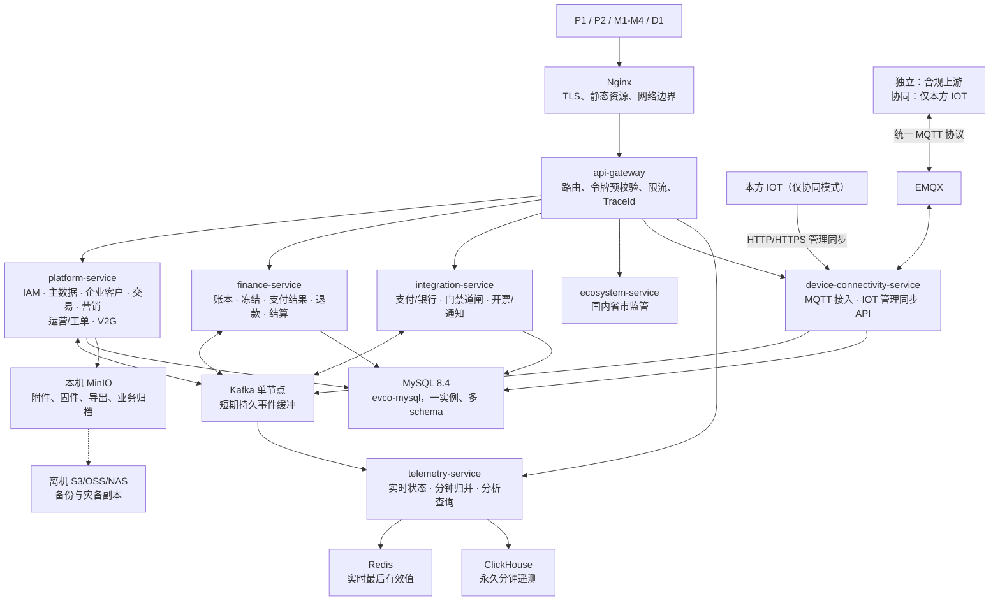

# 单机起步架构收敛与高可用演进决策

> 版本：v1.2
> 状态：单机容量、资源隔离与 HA 演进 ADR。服务、数据、支付退款、Kafka 和 WebSocket 的实施细节以《[架构基线与服务边界](充电运营平台架构基线与服务边界-v2.md)》及《[Kafka 事件目录](../../contracts/events/README.md)》为准；资源预算、降级和拆分阈值以本文为准。
> 适用基线：单台 Linux 服务器 8 核 CPU / 32 GB RAM、Docker Compose 的待验证起步形态；设备实际 MQTT 上报周期可变；分钟级最后有效遥测永久保存。真实设备、目标负载和恢复演练完成前，不设定或讨论“万台”容量、RPO/RTO 数值。
> 不承诺：一台服务器不具备跨主机高可用。当前交付目标是高性能、故障隔离、可降级、可备份和可恢复；真正 HA 是后续多故障域部署能力。

## 1. 最终决策

此前将业务按 14 个独立 Java 服务部署，适合未来较大规模、多团队和多节点，但不适合当前资源：每个 JVM、连接池、线程池、日志、健康检查和发布单元都会消耗内存、CPU 和运维注意力，并不能在同一台服务器上带来真正高可用。

当前采用 **7 个 Java 部署单元 + 模块化领域边界 + 独立逻辑 schema**：

1. `api-gateway`：前端唯一 API 入口；
2. `platform-service`：绝大多数管理和运营业务模块；
3. `finance-service`：资金账务、冻结、退款、结算和对账；
4. `device-connectivity-service`：MQTT 协议校验、标准化和控制收发，以及 IOT 协同模式的管理同步 API；
5. `integration-service`：支付、银行、门禁/道闸、开票等交易/运营外部适配器；
6. `ecosystem-service`：国内省市监管的协议适配、可靠上报、回执和对账；虚拟电厂等外部生态能力后续扩展；
7. `telemetry-service`：Kafka 消费、实时状态、分钟归并、ClickHouse 写入和受控分析查询。

这不是退回“无边界大单体”：模块、schema、表迁移、事件、权限和测试边界现在就冻结；只是将低频、强协作的业务模块放在同一 JVM 内运行。资金、设备 I/O、遥测计算仍保持独立进程和 cgroup 资源限制。

## 2. 7 个部署单元与模块边界

| 部署单元 | 必须包含的模块 | 为什么独立/合并 | 不得承担 |
|---|---|---|---|
| `api-gateway` | 路由、JWT 预校验、限流、CORS、请求大小、TraceId、统一错误外观 | 保持用户流量入口与业务进程隔离；Spring Cloud Gateway 仍满足既定网关要求。 | 对象级授权、订单编排、资金决策、MQTT。 |
| `platform-service` | IAM、主数据、企业客户、充电交易、营销、运营与内容、V2G、后台查询编排 | 这些低频且强协作的领域合并可避免把一个 8 核单机拆成大量 JVM；各模块仍有独立 schema、包结构、迁移和测试。 | 账本原子写入、外部协议 I/O、MQTT 长连接、分钟遥测写入。 |
| `finance-service` | 账户、不可变分录、冻结/释放、支付结果、退款、结算、出款、对账、发票事实 | 资金是独立风险与恢复边界；独立 cgroup、连接池、发布和审计，避免营销/查询故障影响资金处理。 | 直接控制设备、调用设备 MQTT、资产主数据写入。 |
| `device-connectivity-service` | EMQX MQTT 上下行、客户端/签名/Schema/模式/设备编号校验、标准化、控制投递、接入安全审计；仅协同模式开放 IOT HTTP/HTTPS 管理同步 API | MQTT I/O、重连风暴和外部 IOT 同步均处于设备互联边界，必须从 Web/交易线程池隔离。同步入口不取得资产表写权限，而是将已验签、幂等的命令交给主数据领域应用。 | 本地资产配置决策、账务、分钟遥测、订单结算。 |
| `integration-service` | 微信/支付宝/银联/银盛、对公转账、门禁/道闸、开票和通知等适配器；外部回调、重试、对账和协议审计 | 所有交易/运营渠道协议故障、慢调用、证书和升级集中在一个防腐层；独立进程、线程池、连接池和发布节奏，不能拖慢交易或资金。 | 资金账本写入、订单状态机、设备 MQTT、页面权限决策、监管适配。 |
| `ecosystem-service` | 国内省市监管的目标路由、协议映射、上报任务、回执、补推与对账 | 将省市监管协议、重试和合规证据与支付/银行适配隔离；虚拟电厂等外部生态后续在本服务扩展。 | 订单/资产/资金事实写入、设备 MQTT 直控或给监管控制权。 |
| `telemetry-service` | Kafka 分区消费、状态合并、Redis 投影、分钟归并、ClickHouse 批写、受限曲线/大屏查询 | 写入和分析负载独立隔离；读写使用独立执行器、连接池和限流，查询不得挤占归并。 | 订单、资金、权限和资产写入。 |

`platform-service` 内部强制包边界：`iam`、`master`、`customer`、`trade`、`marketing`、`operations`、`v2g`。模块间只通过应用服务接口和领域事件协作，禁止 Controller、Mapper 或数据库表相互绕过；ArchUnit 架构测试是合并部署后的硬门禁。

## 3. 数据、事件与一致性

当前一个 MySQL 物理实例 `evco-mysql`，但保留 11 个 schema：`evco_iam`、`evco_master`、`evco_customer`、`evco_trade`、`evco_finance`、`evco_marketing`、`evco_operations`、`evco_integration`、`evco_device_connectivity`、`evco_v2g`、`evco_ecosystem`。所有技术名称遵循《平台技术命名规范 v1》。

- `platform-service` 拥有 `evco_iam`、`evco_master`、`evco_customer`、`evco_trade`、`evco_marketing`、`evco_operations`、`evco_v2g`；同一服务内可使用受控本地事务，但不允许模块直接调用另一模块 Mapper。
- `finance-service` 只拥有 `evco_finance`；与交易模块通过 Outbox/Kafka 事件进行冻结、结算、退款状态协作，不采用 XA。
- `device-connectivity-service` 只拥有 `evco_device_connectivity`，接收 MQTT 和 IOT 管理同步 API；它持久化入口安全审计、同步收件箱与检查点，并以 Outbox/Kafka 发布 `evco.master.sync-command.v1`；`platform-service.master` 幂等应用并发布结果，**设备互联服务不直接写 `evco_master`**。同步 API 只在收件箱持久化后返回“已受理”，IOT 以结果查询/回执闭环确认。这样保持资产权威归属唯一，同时满足 IOT 同步接口和 MQTT 接入同属一个服务。
- `integration-service` 只拥有 `evco_integration`，统一隔离支付、银行、门禁/道闸、开票和通知等外部协议的凭据引用、请求/回调原文、重试、死信和映射；`ecosystem-service` 现行拥有独立 `evco_ecosystem` 用于监管，资金事实仍只由 `finance-service` 写入。
- `telemetry-service` 拥有 ClickHouse 数据库 `evco_telemetry` 和 Redis 实时 key；它不回写订单、资产或资金。
- 每个跨部署单元副作用必须是本地事务 + Outbox + 至少一次投递 + 幂等消费者；以 `event_id`、业务幂等键、设备/订单局部顺序键处理重复和乱序。Outbox 由所属服务内的独立发布线程以 `FOR UPDATE SKIP LOCKED` 小批轮询：Kafka 确认成功后才标记已发布；两步间宕机允许重复投递，消费者必须幂等。技术失败事件保留在 Outbox 重试并告警，业务消费者连续失败才进入所属领域 DLQ 和人工处置/对账，不能将待发布事件“转 DLQ 后当作成功”。

Kafka 仍保留，因为 MQTT 与内部可重放事件不是替代关系；但单机仅保留短期事件缓冲和恢复窗口，不能作为备份或 HA 机制。恢复时遥测按设备/枪口分片和批处理重建，禁止逐条抢 Redis 全局锁。

## 4. 8 核 32 GB 的起步资源预算

以下是 Compose 的**起步硬上限**，不是容量承诺。实际配置必须经目标报文大小、最短上报周期、连接数、订单量和查询并发压测校正；总量刻意保留约 6 GB 给操作系统、页缓存和故障突发。

| 单元 | 内存上限 | CPU 优先级/起步配额 | 运行策略 |
|---|---:|---:|---|
| 操作系统、页缓存、日志缓冲 | 6 GB 预留 | 至少 0.5 核余量 | 不纳入容器争抢；禁止内存超卖。 |
| MySQL | 4.5 GB | 1.30 核 | 独立 NVMe 卷；慢查询、连接、buffer pool、redo/binlog 与 I/O 延迟必须监控。 |
| ClickHouse | 5.5 GB | 1.60 核 | 限制 merge 与查询并发；分析查询优先降级。 |
| Kafka KRaft | 1.2 GB | 0.4 核 | 短期保留、磁盘水位告警；恢复限速。 |
| EMQX | 0.8 GB | 0.50 核 | 限制会话、最大报文、未确认消息和重连速率。 |
| Redis | 0.6 GB | 0.15 核 | `maxmemory` + 淘汰策略；不是事实源。 |
| `api-gateway` | 0.4 GB | 0.2 核 | 网关限流和连接上限先于后端过载。 |
| `platform-service` | 2.5 GB | 0.55 核 | IAM/交易使用保留线程池；营销、运营、V2G 使用可降级线程池和独立连接池。 |
| `finance-service` | 1.5 GB | 0.35 核 | 优先级高于后台任务和分析；保留 MySQL 连接额度。 |
| `device-connectivity-service` | 1.75 GB | 0.70 核 | MQTT 非阻塞 I/O 与 IOT 同步 API 使用隔离执行器、连接池和限流。 |
| `integration-service` | 1.25 GB | 0.35 核 | 每类外部适配器独立 bulkhead；严格超时、熔断、连接池和重试预算。 |
| `telemetry-service` | 2 GB | 0.85 核 | 摄取、归并、查询三个隔离执行器。 |
| `ecosystem-service` | 0.75 GB | 0.20 核 | 监管适配独立连接池、任务并发、重试预算和 DLQ；外部生态扩展另行容量评估。 |
| MinIO | 0.6 GB | 0.10 核 | 默认常驻，独立本地数据卷；存业务对象而非唯一灾备副本。 |
| Prometheus + Grafana + Alertmanager | 1.0 GB | 0.15 核 | 仅保留指标和告警；Loki/Tempo 默认不随单机包常驻。 |
| 合计容器硬上限 | 24.35 GB | 约 7.4 核 | 内存保留约 7.65 GB 给系统/页缓存/突发；CPU 是**权重而非所有关键链路的硬上限**，只对低优先级分析和批处理设硬限额，生产配额必须由压测校正。 |

MinIO 是默认常驻组件，优先使用本机独立数据卷存放附件、固件、回单、导出和业务归档；应用通过 S3 API 访问，不直接操作文件系统。**本机 MinIO 是主业务对象库，不是灾备库**：MySQL/ClickHouse 备份和 MinIO Bucket 的版本化备份仍须复制至服务器外的 S3/OSS/NAS。回单、发票证据和监管报文归档属于 `legal-evidence` 对象类，必须记录离机副本状态、最近一次复制时间和目标版本；离机副本逾期告警，恢复 Runbook 必须定义其 RPO/RTO 与从离机副本只读取证的操作。ClickHouse 本地热数据盘达到阈值时，先归档至本机 MinIO，再按计划复制至离机目标；本机磁盘空间不足时，优先暂停低优先级导出/历史查询，不能删除唯一副本。OpenSearch、Nacos、Service Mesh、Schema Registry、Loki、Tempo、XXL-JOB 一期不部署。

## 5. 性能与可用性策略

### 5.1 当前可承诺的能力

- 关键链路故障隔离：设备接入、遥测、资金、平台业务分别受独立进程和资源限制保护。
- 优先级降级：订单、资金、控制、登录、IOT 管理同步优先；大屏、历史导出、全量报表、低优先级通知和重算先限流或暂停。
- 可恢复：MySQL 全备 + binlog、ClickHouse 一致性备份和对象附件均复制到服务器外目标；从空白主机进行恢复演练。
- 可观测：Prometheus/Grafana/Alertmanager + 外部告警通道，覆盖 CPU、内存、磁盘、Kafka lag、EMQX 会话、MySQL 慢查询、ClickHouse merge、接口错误率和备份结果。

### 5.2 当前不能承诺的能力

一台服务器、单实例 MySQL/Redis/Kafka/ClickHouse/EMQX 在主机、磁盘、机房和宿主网络故障时都会中断。因此 Docker 自动重启、Kafka 持久化、同机 MinIO、容器副本或 Kubernetes 单节点都不是 HA。

### 5.3 未来拆分与 HA 的客观触发条件

| 触发条件（连续压测或生产趋势） | 优先动作 |
|---|---|
| `platform-service` 的 p95 持续超过已签 SLA | 先定位具体模块；交易与营销/运营互相影响时优先拆 `charging-trade-service`。 |
| `integration-service` 的重试、连接或外部调用占满本服务配额 | 按适配器类别拆出支付/资金通道；监管已固定为现行 `ecosystem-service`，不得重新并回业务服务。 |
| ClickHouse 查询与分钟归并争抢资源、归并 lag 持续超过一个分钟桶 | 拆 `analytics-query-service`，或迁查询到读副本/独立节点。 |
| 订单交易吞吐/发布节奏与主数据、营销、运营相互影响 | 拆 `charging-trade-service`，并保留现有 `evco_trade` schema。 |
| `ecosystem-service` 的监管模块因协议/合规团队独立、任务量或故障重试显著增长 | 从 `ecosystem-service` 拆出 `regulatory-service`；不得回迁 `integration-service`。 |
| 实际事件率、设备连接数或重连风暴超过单机压测安全线 | 先将 EMQX、Kafka、ClickHouse/MySQL 按瓶颈迁出；`device-connectivity-service` 再按 MQTT 与管理同步 API 的独立负载拆分，不要先盲目拆 Java。 |
| 需要主机故障不中断 | 建设至少 3 个独立故障域：负载均衡、至少双应用副本、MySQL 复制/受控切换、Redis/Kafka/EMQX/ClickHouse 的对应复制方案、外部对象存储，以及已演练的 RPO/RTO。 |

## 6. 开发与目录原则

当前固定目录为 7 个可部署 Java 服务。W0 只建立健康检查、外部化配置和服务 Maven 隔离，不冻结业务包结构；W1 再建立迁移、契约检查、镜像、Compose、CI 和质量门禁，阶段前不开放没有业务能力的路由或消费者。未来候选服务只预留在 ADR/契约中，不创建空 Maven 服务目录。每个阶段按“菜单/场景 → OpenAPI、MQTT Schema、事件、Flyway → 后端与契约测试 → API 门禁 → 前端 → E2E/性能/恢复验收”纵向交付。

前端不得在对应 API 自动化和人工门禁通过前开始实现；接口契约冻结可用于准备评审资料和测试夹具，但不得替代 API 门禁或提前提交页面、Mock 客户端业务实现。
