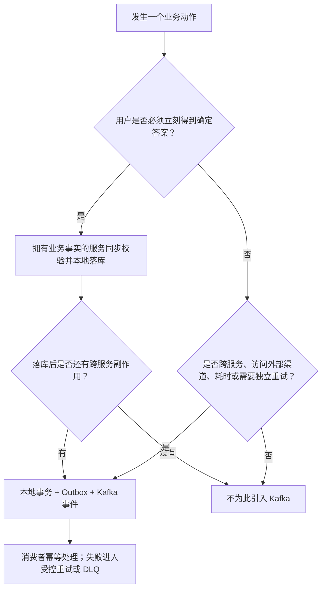

# 事件协作与 Kafka 通俗说明

> 状态：现役说明；Topic、字段、发布者和消费者组的唯一实施合同仍是《[Kafka 事件目录](../../contracts/events/README.md)》。
> 适用：产品、业务、研发、测试、实施和管理人员。
> 先读：先读本文，再读事件目录中与你要做的业务对应的一行；高风险操作再读《[高风险契约与状态机](高风险契约与状态机-v1.md)》。

## 1. 先说结论：Kafka 不是所有业务都要用

Kafka 可以把它理解为一条**可留痕、可重放的业务通知传送带**：一个服务已经把自己负责的事实安全写入本地数据库后，通知其他服务去做各自的后续工作。它适合“会慢、可能失败、需要隔离、需要重试、由另一个服务负责”的后续动作。

它不是数据库、不是前端接口，也不能代替一次必须立刻给用户答案的校验。余额是否够、退款是否有资格、订单能否启动、权限是否允许，都必须由拥有该业务事实的服务同步判定并落库；Kafka 只协调跨服务的后续步骤。

## 2. 看懂事件目录的八个词

| 术语 | 白话解释 | 本项目为什么需要它 |
|---|---|---|
| Topic（主题） | 一条按业务类型分开的传送带，例如“退款申请”。 | 防止遥测、退款和监管任务混在一起，便于分别限流、重放和审计。 |
| 发布者 | 唯一有资格把某类消息放上该传送带的服务。 | 避免两个服务同时“宣布”同一笔退款或订单，造成事实冲突。 |
| 消费者组 | 一支负责一类工作的队伍；同一组内多人分工，不同组各做一份自己的工作。 | 例如财务组处理冻结，监管组创建报送任务；同一组扩容不会重复处理全部消息。 |
| Kafka key / 分区键 | 同一业务对象的排队号码。相同 key 的消息按先后进同一队列。 | 同一枪的控制命令、同一原支付交易的退款必须保留局部顺序。 |
| Outbox（发件箱） | 业务事实与“待发送通知”在同一个本地事务里写入。 | 服务刚记完账就宕机，也不会丢掉本应发给其他服务的通知。 |
| Inbox（收件箱） | 消费者记录“这封通知已处理”。 | Kafka 可能重复投递；收件箱和业务幂等键让重复消息不重复扣款、不重复退款。 |
| DLQ（死信队列） | 多次失败且不能自动修复的消息待处理区。 | 让错误可见、可审计、可修复，不把失败静默丢掉或无限重试。 |
| 重放（replay） | 在受控范围内重新读取历史消息以重建投影或修复处理。 | 只能用于可重建的投影或受控补偿；不能用来重复创建支付、退款或设备控制。 |

**消费者组不是“一个用户组”**，也不是给浏览器用的。它是后台服务处理同一类消息的工作队列名字。例如 `evco.finance.refund-eligibility.v1` 表示“财务退款资格处理队伍”；多开一个财务实例时，它们会分摊工作，而不是每个实例都重复退款。

## 3. 每个业务先问这四个问题

这里的关键顺序是：**先由责任服务写事实，再发事件**。绝不能先发 Kafka、后记账；也不能让消费者根据一条消息直接改另一个服务的数据库。

## 4. 你列出的业务，分别该怎么用

| 业务 | 必须同步完成的事 | Kafka 是否合适 | 正确用法与禁止事项 |
|---|---|---|---|
| 企业充值 | `finance-service` 创建充值意图、充值流水和幂等键；企业余额只能在渠道成功结果后由财务入账。 | **适合跨服务/渠道**。 | 财务发布支付渠道命令，`integration-service` 调用银行/支付渠道，再把结果事件回给财务。不要让 Kafka 消费者直接“加余额”，也不要用消息代替支付回调验签。 |
| 个人用户单笔预付/冻结 | 交易服务创建订单启动意图；财务服务校验可用资金并创建冻结事实。 | **适合服务间编排，但不是即时扣款接口。** | `hold-request` → 财务冻结 → `hold-result` → 交易服务才可下发设备启动。设备启动前必须收到成功冻结结果；前端读取订单状态或订阅 WebSocket，不直接消费 Kafka。 |
| 充电订单上报 | 设备互联先持久化并验签、去重设备报文。 | **适合。** | 设备订单事件按 `chargingOrderId`（未知时稳定会话键）进入 Kafka；交易服务推进订单状态，遥测服务只做关联。设备服务不得直接改订单表。 |
| 充电订单退款/补差 | 财务按原支付交易串行核验累计可退额、原商户/原路由和结算调整资格。 | **适合。** | 退款申请到财务后创建唯一退款交易；需要原路渠道退款时，财务发命令给集成服务，渠道结果再回财务。按 `originalPaymentTransactionId` 排序，避免并发超退。 |
| 个人/企业余额充值 | 财务创建资金批次或企业充值事实，外部渠道成功后才确认余额。 | **适合。** | Kafka 用于财务与支付渠道之间的可靠异步执行及结果回传；余额、资金批次、账本仍只由财务本地事务写入。 |
| 未消费余额退款 | 财务核验原资金批次的可退额和原支付路由。 | **视退款去向而定。** | 退到外部原渠道：用 Kafka 驱动渠道退款；内部仅撤销尚未生效的本地入账：财务本地处理后发布状态通知。无论哪种，都不进入租户结算调整。 |
| 监管上报/退款上报 | 原领域服务已确认订单、退款或档案事实。 | **适合，但不阻塞交易。** | `ecosystem-service` 消费已登记事件创建监管任务，失败进入任务状态机、DLQ 和人工补推。W10 只能称“监管内部就绪”；真实目标接入须单列 C3-R 生产 Go。 |
| 通知、报表、搜索投影、实时大屏 | 原始业务事实已提交。 | **适合。** | 这些是可重建的派生结果；需要明确消费组、幂等、延迟指标和重放范围。 |

### 不该为了“看起来先进”而使用 Kafka 的场景

- 登录、鉴权、权限判断、前端查询、余额即时查询；这些需要立刻响应。
- 同一服务内的一次账本写入、资金批次变更或退款资格判定；它们应该是一个本地数据库事务。
- 浏览器消息推送；浏览器通过 HTTPS/WSS 使用 API 或 WebSocket，不能成为 Kafka 消费者。
- 设备真实控制的安全判定；Kafka 只传递已裁决的命令，设备互联服务仍要按枪顺序、版本、过期时间和能力再次校验。
- 把 Kafka 当备份、灾备或“恰好一次扣款”保证；当前单机 Kafka 仅是短期事件缓冲，资金安全来自账本、Outbox、幂等和对账。

## 5. 金额业务的最低安全规则

1. 金额、余额、冻结、资金批次、支付/退款交易和租户结算调整，只有 `finance-service` 可以写入。
2. 每笔支付和退款都有唯一业务幂等键；退款还必须按原支付交易串行，不能按“用户”或“订单列表”并发执行。
3. 支付渠道回调只是一份外部证据，必须验签、核对金额/商户/路由/状态，再由财务入账。
4. 订单退款与未消费现金充值退款是两回事：前者要生成订单结算调整，后者不进入租户结算。
5. Kafka 消息可以重复、延迟或乱序；消费者必须能识别重复，业务状态机必须拒绝非法跳转。

## 6. 设备、监管与 V2G 的额外边界

- 设备 MQTT 上报不是 Kafka 的替代物：设备先按 MQTT 契约接入、持久化和校验，才发布内部事件。
- 监管没有设备控制权。`ecosystem-service` 只能创建报送任务、处理回执和对账，不能直接下发 MQTT 控制。
- V2G 真实执行默认关闭。Kafka 中的 V2G 结算 Topic 也不得有生产者，除非用户另行批准一个真实现场试点并冻结现场安全、计量、停止/回退和 E2E 证据。

## 7. 落地时每一行合同至少要写清什么

任何新增 Topic、消费者组或事件，在《事件目录》与其 Schema 中至少说明：它解决什么业务问题、谁发布、谁消费、消费组为何存在、按什么 key 保序、哪个服务拥有业务事实、如何幂等、失败去哪、能否重放、包含什么数据分类，以及对应的自动化/E2E 证据。没有这些说明，不创建 Topic 或消费者组。
