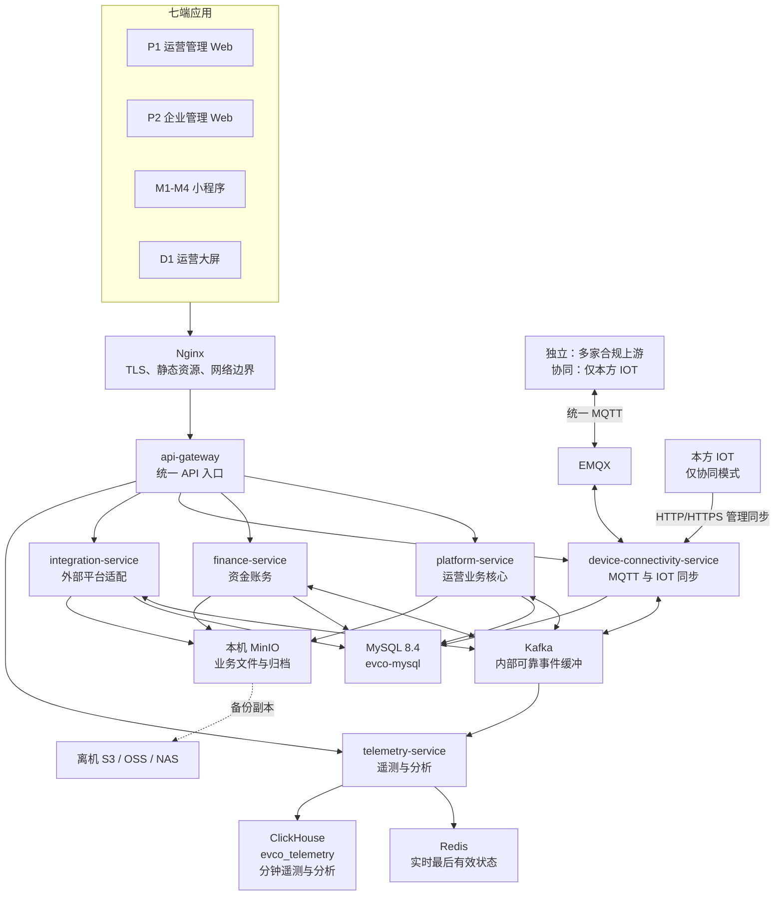

# 充电运营平台公司级总体架构说明

> 版本：v1.0  
> 读者：产品、业务、研发、测试、实施、运维与管理人员  
> 当前交付基线：10,000 台以内设备、单台 Linux 服务器 8 核 CPU / 32 GB RAM、Docker Compose。  
> 说明：这是统一沟通版；服务、数据库、协议和部署的可执行细节以《工程架构与数据分库设计》《万台单机架构收敛与高可用演进决策》为准。

## 1. 一句话说明

平台是一个可独立部署的充电运营系统：负责租户、场站、设备、充电订单、客户权益、资金、运维、监管和经营分析；设备运行数据通过统一 MQTT 协议进入，第三方支付、银行、监管和门禁等能力通过统一适配层接入。

平台有两种永久部署模式：

- **独立模式（`independent`）**：平台自己管理租户、用户、权限、场站和设备；任何符合统一 MQTT 协议的上游平台可接入设备运行数据。
- **IOT 协同模式（`iot-collaborative`）**：本方 IOT 通过管理同步 API 推送平台/租户/资产主数据；平台保存并使用这些投影，不允许本地修改该范围资产；设备运行数据和控制仍只走 MQTT，且只允许本方 IOT 接入。

企业充电客户的成员、角色和页面权限在两种模式下都由本平台管理。两种模式在安装初始化后锁定，不能在同一实例内切换。

## 2. 全局架构图



### 2.1 员工应这样理解边界

| 事情 | 谁负责 | 谁不负责 |
|---|---|---|
| 页面、菜单、用户、租户、资产、订单、营销、工单 | `platform-service` | 不直接处理支付协议、MQTT、长期遥测写入。 |
| 余额、冻结、扣款、退款、结算、出款、对账 | `finance-service` | 不直接发 MQTT 命令，也不接第三方 HTTP 回调。 |
| 设备上报、控制下发、IOT 资产同步接口 | `device-connectivity-service` | 不直接修改资产权威表、订单或资金。 |
| 微信/支付宝/银行/监管/门禁等外部协议 | `integration-service` | 不直接记账或改变订单状态。 |
| 实时状态、分钟遥测、曲线、大屏、指标统计 | `telemetry-service` | 不直接修改订单、资产、权限和资金。 |

这样分工的核心不是“多拆几个服务”，而是把**资金风险、高频设备 I/O、第三方慢调用和大数据查询**隔离开，避免其中任一类负载拖慢其他业务。

## 3. 七端应用与后端的关系

小程序是客户端，不是独立业务服务。M1-M4 与 P1/P2 通过网关调用同一套领域服务；只有前端工程、体验和发布节奏独立。

| 端 | 推荐工程英文名 | 面向对象 | 主要后端模块 |
|---|---|---|---|
| P1 | `operations-web` | 平台与租户运营人员 | 平台全部业务模块、资金、遥测查询。 |
| P2 | `enterprise-web` | 企业管理员 | 企业客户、订单、资金查询、发票、分析。 |
| M1 | `consumer-miniapp` | 个人充电用户 | 客户、交易、营销、资金、站点实时状态。 |
| M2 | `enterprise-miniapp` | 企业员工/司机 | 企业客户、订单、站点实时状态。 |
| M3 | `tenant-operations-miniapp` | 租户移动运营人员 | 运营、工单、订单、遥测。 |
| M4 | `enterprise-admin-miniapp` | 企业移动管理员 | 企业客户、成员、车辆/电卡、额度与订单。 |
| D1 | `operations-dashboard` | 只读展示 | 遥测聚合、经营分析、已发布大屏专题。 |

只有在移动端首页聚合、流量和发布节奏明显独立时，才增设 `mobile-bff-service`。它只能做接口聚合、缓存和降级，不复制用户、订单、资产或资金事实。当前不建设它。

## 4. 服务、模块和职责

### 4.1 `api-gateway` — API 网关

| 内部模块 | 做什么 |
|---|---|
| `routing` | 根据 API 路径将请求转发到正确服务。 |
| `security-filter` | 校验令牌、应用类型和基础访问条件；最终数据权限仍由业务服务判断。 |
| `rate-limit` | 按用户、IP、应用或接口保护系统免受突发流量影响。 |
| `observability` | 生成/透传 `traceId`，统一请求日志和错误外观。 |

### 4.2 `platform-service` — 平台运营业务核心

它是**模块化单体**：同一个部署进程中有七个清晰模块，不是无边界“大服务”。模块之间不能互相调用 Mapper 或直接写表；只能经过模块应用服务或领域事件协作。

| 模块英文名 | 面向的业务 | 主要内容 |
|---|---|---|
| `iam` | 身份与授权 | 平台/租户账号、角色、菜单、操作权限、数据范围、登录审计、会话失效。IOT 协同模式的账号凭据由 IOT 推送，但平台本地校验密码并签发令牌。 |
| `master` | 平台与资产主数据 | 租户、场站、充电桩、枪口、设备能力、设备生命周期、设备资源路由、接入来源、字段来源优先级、指标目录。独立模式本地配置；协同模式只应用 IOT 同步命令。 |
| `customer` | 个人与企业客户 | 个人资料、企业、企业成员、车辆、车辆分组、电卡、电卡分组、企业额度、企业协议。 |
| `trade` | 充电交易 | 费率、价格版本、启动请求、充电会话、充电订单、订单状态、计量/价格快照、异常订单、售后补差。 |
| `marketing` | 会员与权益 | 会员、积分、活动、券模板、用户优惠资产、核销、活动预算和效果。 |
| `operations` | 运营与内容 | 告警、工单、设备命令业务意图及审计、固件发布任务、远程操作记录；也包含小程序应用档案、发布、内容位、公告和通知任务。小程序不另建后端服务。 |
| `v2g` | 车网互动 | 放电授权、设备能力、策略、V2G 会话、放电订单和风险处置；与普通充电订单使用独立状态机。 |

### 4.3 `finance-service` — 资金账务

| 内部模块 | 做什么 |
|---|---|
| `ledger` | 不可变账本、账户余额投影、冲正和调整；不允许直接改余额。 |
| `funding` | 个人/企业充值、冻结、释放、扣款和退款业务事实。 |
| `payment-lifecycle` | 支付意图、渠道交易结果和原路退款结果；实际渠道通信由 `integration-service` 完成。 |
| `settlement` | 租户结算周期、账单、分成、出款申请与付款结果。 |
| `reconciliation` | 订单、支付渠道、账本、结算与发票之间的差异核对和处置。 |
| `invoicing` | 用户发票、租户来票、平台服务费票据的业务事实和状态。 |

### 4.4 `device-connectivity-service` — 设备互联

| 内部模块 | 做什么 |
|---|---|
| `mqtt-ingress` | 消费经 EMQX 接入的遥测、遥信、告警、订单上报与控制回执。 |
| `mqtt-egress` | 按资产配置的资源标识下发启停、功率控制、二维码、固件等控制命令。 |
| `protocol` | 校验统一 MQTT Topic、JSON Schema、签名、时间、序号、设备编号和版本。 |
| `access-security` | MQTT 客户端身份、mTLS/签名、来源白名单、限流、最小安全审计。 |
| `management-sync` | 仅协同模式接收 IOT 的 HTTP/HTTPS 管理同步；先写收件箱与 Outbox，再发布主数据同步命令。 |

它只“受理并标准化”IOT 资产同步，`platform-service.master` 才是资产权威数据的唯一写者。这样不会出现两个服务同时迁移、删除或修改同一设备。

### 4.5 `integration-service` — 外部集成适配

| 内部模块 | 做什么 |
|---|---|
| `payment-adapter` | 微信、支付宝、银联、银盛等收款、退款、回调验签和渠道对账适配。 |
| `banking-adapter` | 对公转账、付款回单、银行账户与出款渠道适配。 |
| `regulatory-adapter` | 省市监管数据映射、报送、回执、补推和监管对账。 |
| `facility-adapter` | 停车、门禁、道闸等权益校验、核销和结果协同。 |
| `invoice-adapter` | 外部开票服务、文件证据与回执适配。 |
| `execution` | 外部连接配置引用、签名/验签、超时、熔断、重试、原文脱敏审计与死信。 |

这是一个统一的**防腐层**，不是一个共享线程池：每类适配器必须独立线程池、连接池、超时和重试预算。

### 4.6 `telemetry-service` — 遥测与数据分析

| 内部模块 | 做什么 |
|---|---|
| `ingestion` | 消费经校验的 Kafka 设备事件，按设备/枪口确保局部有序。 |
| `state` | 以完整裁决键生成 Redis 中的设备/枪口最后有效实时状态与站点实时索引。 |
| `minute-aggregation` | 将不固定周期的原始遥测归并为每分钟最后有效值，批量写 ClickHouse。 |
| `metric-governance` | 使用主数据中的指标目录区分 `CORE`、`SPARSE`、`DERIVED` 指标，防止任意字段无治理落库。 |
| `analytics` | 站/租户功率、电量、利用率、设备健康、经营预聚合、曲线和大屏查询。 |
| `export` | 受权限和限流保护的历史导出任务。 |

## 5. 数据库与数据所有权

当前是一个 MySQL 物理实例 `evco-mysql`，内部按 10 个 schema 分开归属。schema 是代码、迁移和权限边界，不代表物理高可用隔离。

| 数据库/Schema | 责任服务 | 保存什么 |
|---|---|---|
| `evco_iam` | `platform-service` | 用户、角色、权限、数据范围、会话版本、登录审计。 |
| `evco_master` | `platform-service` | 租户、场站、设备/枪口、能力、生命周期、路由、指标定义。 |
| `evco_customer` | `platform-service` | 个人和企业客户、成员、车辆、电卡、额度与协议。 |
| `evco_trade` | `platform-service` | 计费、会话、订单、价格/计量快照、售后。 |
| `evco_marketing` | `platform-service` | 会员、积分、活动、券、核销和预算。 |
| `evco_operations` | `platform-service` | 告警、工单、设备命令审计、固件、应用发布、内容、通知。 |
| `evco_v2g` | `platform-service` | V2G 授权、策略、会话、订单和风控。 |
| `evco_finance` | `finance-service` | 账本、资金冻结、支付事实、结算、出款、对账、票据。 |
| `evco_device_connectivity` | `device-connectivity-service` | MQTT 接入配置、协议版本、安全审计、原始报文清单/隔离记录、IOT 同步收件箱/检查点。 |
| `evco_integration` | `integration-service` | 外部连接、请求/回调审计、监管任务/回执、死信。 |
| `evco_telemetry`（ClickHouse） | `telemetry-service` | 分钟遥测、稀疏指标、站/租户预聚合、日电量和月电量等分析数据。 |
| Redis | `telemetry-service` 为主 | 最后有效实时状态、会话、限流等可重建缓存；不是资金或永久事实源。 |
| MinIO | 多服务受控访问 | 固件、回单、发票文件、监管归档、附件、导出文件；数据库仅保存元数据和校验和。 |

每个产生跨服务事件的 schema 都各自维护 `outbox_event` 和 `inbox_event`。业务事实和 Outbox 在同一 MySQL 事务内提交；Kafka 确认后才标记消息已发布。消费者成功写入事实后才提交 Kafka offset，因此重复投递可以安全重放。

## 6. 三条关键业务链路

### 6.1 设备遥测

`上游平台/IOT → EMQX → device-connectivity-service → Kafka → telemetry-service → Redis + ClickHouse`

未知设备编号直接拒绝，只记录最小安全审计；不创建资产，也不保存原始报文。设备可按实际周期上报，平台按分钟永久保存最后有效值。实时页面读 Redis，历史曲线和分析读 ClickHouse。

### 6.1.1 原始数据保留与问题定位

已认证且已登记设备的 MQTT 原报文会被压缩、加密后归档到本机 MinIO；MySQL 仅保存 `event_id`、哈希、对象位置、归档状态和保留截止时间。这样可以从一条业务结果反查原始输入，而不会把大量原报文塞进交易库。

| 内容 | 保留规则 |
|---|---|
| 原始遥测/遥信/告警 | 默认保存 90 天，可按合同调整；分钟级最后有效值永久保存。 |
| 原始订单上报 | 与订单审计同周期长期保存。 |
| 平台控制请求、准确下发报文、ACK、执行回执 | 永久保存。 |
| IOT 管理同步请求/响应 | 与资产和权限审计同周期长期保存。 |
| 已认证但无效的协议报文 | 默认隔离保存 30 天，供排错或授权重放。 |
| 未认证或未知设备报文 | 不保存 payload，只保留最小拒绝审计，防止攻击流量耗尽存储。 |

排查时可按 `eventId`、`commandId`、订单号、设备编号和时间反查：原报文 → 校验结果 → 标准事件 → 分钟数据/实时版本 → 订单或控制结果。原始数据不进入普通日志和导出，只能经审计授权访问。

平台人员不需要直接查 Redis、Kafka、MySQL 或 MinIO 文件。P1 在“**场站与运维 → 运行维护 → 设备协议追溯**”提供受权限控制的检索页面：按设备、枪口、事件编号、命令编号、订单号和时间范围查询完整证据链；默认只显示脱敏原文和处理摘要。查看完整原文或下载证据包必须二次确认、记录操作者、理由、时间和查询范围。数据库命令行、对象存储客户端和 Kafka 管理工具只留给平台 SRE/DBA 的紧急只读处置，不能作为日常业务排查入口。

### 6.1.2 页面实时变化：快照 + 增量推送

设备管理、站点态势、充电中订单和运营大屏既需要首次打开时的完整数据，也需要随后自动变化。采用“**一次快照 + 持续增量**”模式：

```text
页面首次进入
  → platform-service：校验菜单/数据范围，返回资产与业务字段
  → telemetry-service：批量返回当前设备/枪口实时快照
  → 页面建立 WebSocket 订阅

设备状态变化
  → telemetry-service 合并为最后有效状态
  → Redis 更新实时快照
  → telemetry-service 经 api-gateway 推送状态增量给已授权页面
  → Vue/Pinia 仅更新变化的设备、枪口和指标
```

浏览器只能连接 `api-gateway` 暴露的 WebSocket 地址；网关把连接路由至 `telemetry-service`，浏览器不得直连 Redis、Kafka、EMQX 或内部服务。普通页面首次数据、分页资产和订单事实仍是 REST API；WebSocket 只推送实时字段的增量，不承担订单结算、权限修改或控制命令。

订阅前由 `platform-service` 校验租户、站点、设备和页面数据范围，签发短期、范围受限的 `telemetry_subscription_ticket`；遥测服务只按该票据允许的站点/设备/枪口过滤推送。票据包含授权版本和短有效期，用户被停用、切换租户或权限版本变化时连接必须断开并重新授权。这样不会因实时推送绕过对象级权限。

每条状态增量包含 `deviceId`、`connectorId`、`stateVersion`、`observedAt`、完整裁决键、变化字段和质量状态。前端只接受版本更大或裁决键更新的消息，忽略重复、迟到和乱序消息；断线重连后先重新获取快照，再恢复订阅，不能仅依赖丢失期间的推送。设备离线、数据陈旧或遥测服务降级时，页面应展示最后更新时间和“实时数据不可用”，不能把旧值伪装为实时值。

为防止大屏或列表订阅放大负载，推送频率按页面类型限制：设备详情可实时推送单设备变化；设备列表按 1–3 秒批量合并变化；全站/全平台大屏优先订阅站/租户聚合值而不是全部枪口明细。当前单机由 `telemetry-service` 维护连接和扇出；未来多副本时再增加共享订阅事件层或按站点一致性路由，客户端协议不变。

### 6.2 设备控制

`运营人员 → api-gateway → platform-service.operations → Kafka → device-connectivity-service → EMQX → 上游平台/IOT → 设备回执`

平台先保存命令意图、权限和审计，再发布控制命令。`ACKNOWLEDGED` 只表示上游收到，只有设备业务回执才可以进入 `EXECUTED` 或 `FAILED`。禁止使用 MQTT retained message 下发启停等命令。

### 6.3 订单与资金

`设备订单上报 → device-connectivity-service → Kafka → platform-service.trade → finance-service → integration-service（渠道）`

订单、资金和渠道结果由不同服务分别记录；通过领域事件协作，不能用跨服务事务或共享表强行锁在一起。长期未完成的冻结、退款或结算必须告警并进入订单—资金对账，不能假设“消息不重复”就一定正确。

## 7. 英文命名最终核查

当前命名可直接作为代码、镜像、Compose 服务和文档的标准，不建议在无代码阶段再改名：

| 名称 | 结论 | 说明 |
|---|---|---|
| `api-gateway` | 保留 | 行业标准术语，职责明确。 |
| `platform-service` | 保留 | 表示平台运营业务核心；比 `business-service` 更具体，也不会与某一菜单绑定。 |
| `finance-service` | 保留 | 覆盖资金、账务、结算和对账，清晰且通用。 |
| `device-connectivity-service` | 保留 | 覆盖“设备级 MQTT 互联”和“IOT 管理同步入口”；不误导为只接充电桩直连。 |
| `integration-service` | 保留 | 在当前服务清单中清楚表示外部系统适配；不使用含糊的 `adapter-platform`、`common-service` 或厂商名。 |
| `telemetry-service` | 保留 | 精确表示遥测接收后的状态、归并与分析职责。 |
| `evco_*` / `evco.*` | 保留 | 统一数据库与事件命名空间；数据库对象使用小写 `snake_case`，服务/目录使用小写 `kebab-case`。 |

Java 包名采用公司受控反向域名，例如 `com.<company>.evco.platform.domain.trade`；不得把文档中的 `com.example` 直接作为生产 groupId。表、字段、Topic、MQTT Topic、Bucket 和 API 的完整规则遵循《平台技术命名规范》。

## 8. 当前不应再调整的内容，以及必须验证的内容

当前不再建议增加“小程序业务服务”、Nacos、Schema Registry、XXL-JOB、Loki/Tempo、TDengine 双写或更多空微服务。它们在当前单机配置下增加复杂度，并不能解决核心风险。

上线前必须完成的不是“再选一个技术”，而是以下验证：

1. 用真实设备报文、最短上报周期、站点数、查询并发和订单量完成容量压测；
2. 演练 Kafka 积压、Redis 清空、ClickHouse 慢写、EMQX 重启和第三方回调重复；
3. 从离机备份恢复 MySQL、ClickHouse 与关键 MinIO 对象，并记录实际 RPO/RTO；
4. 每个上游 MQTT 接入方通过连接、遥测、订单、控制、补传、乱序和证书轮换互操作验收；
5. 每个服务具备 Runbook、结构化日志、指标、告警和明确负责人。

单台服务器可以做到故障隔离、限流降级、可备份和可恢复；不能承诺主机故障时持续服务。未来需要真正高可用时，先建设多故障域的 MySQL、Kafka、EMQX、ClickHouse、对象存储和应用副本，再引入 Kubernetes 或 Nacos 等运行治理组件。

## 9. 关联规范

- [工程架构与数据分库设计](充电运营平台工程架构与数据分库设计-v1.md)
- [万台单机架构收敛与高可用演进决策](万台单机架构收敛与高可用演进决策-v1.md)
- [技术选型与单机演进方案](充电运营平台技术选型与单机演进方案-v1.md)
- [双模式独立部署与 IOT 协同架构决策](双模式独立部署与IOT协同架构决策-v1.md)
- [平台技术命名规范](../standards/平台技术命名规范-v1.md)
