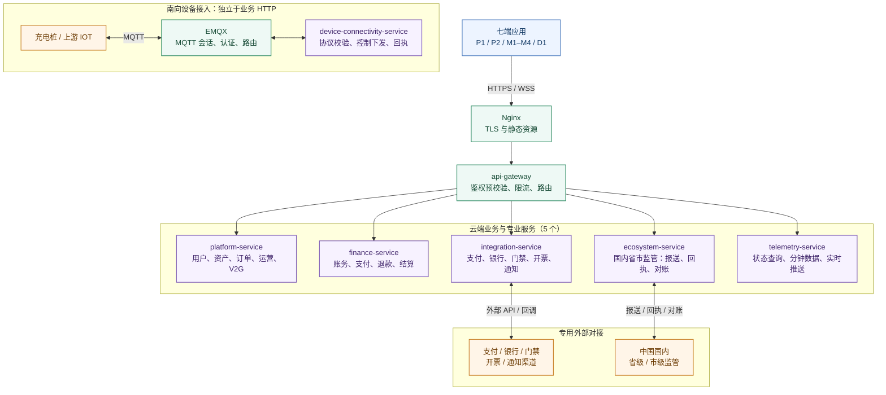
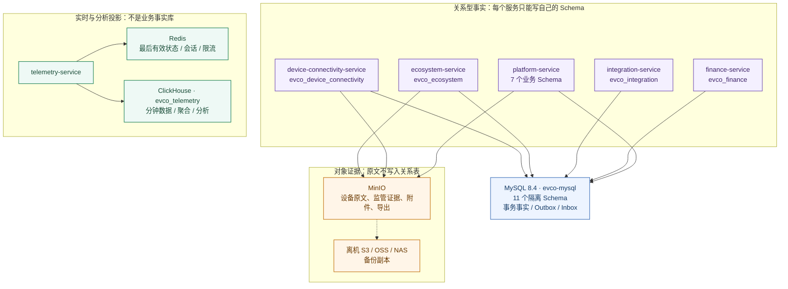
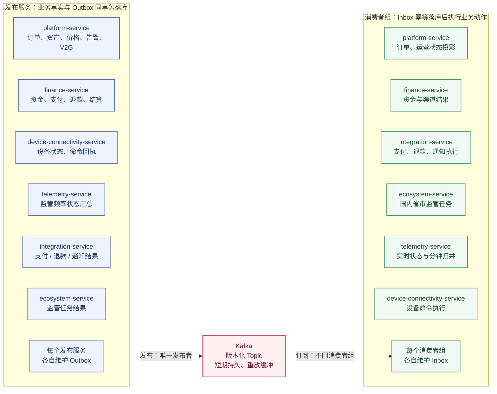
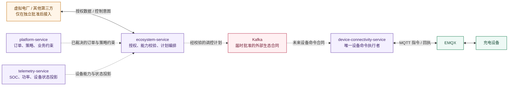

# 充电运营平台工程架构与数据分库设计

> 版本：v1.6（分层图示重构版）
> 状态：工程与数据实现参考；现行七服务单机包，外部能源能力为 W12 后扩展。
> 上位决策：[万台单机架构收敛与高可用演进决策 v1](万台单机架构收敛与高可用演进决策-v1.md)。后续分阶段开发不改变本文件的部署单元、模块和数据主责；达到量化阈值后才拆分服务。
> 事件权威入口：Topic、发布者、消费者组、分区键与 DLQ 以 [`contracts/events/README.md`](../../contracts/events/README.md) 为准；本文件不再维护第二份 Kafka 清单。

## 1. 工程结论

当前建立 **7 个 Java 可部署单元**，而非 14 个微服务。8 核 32 GB 只是待真实设备与目标负载验证的起步资源形态，不能据此推导“万台”、RPO 或 RTO；其上仍能保留 API 网关、资金隔离、监管协议隔离、交易/运营渠道适配隔离、MQTT/IOT 同步隔离和遥测隔离，同时避免大量 JVM、线程池、RPC、发布和监控实例争抢资源。

`ecosystem-service` 是现行第七服务：W10 达到中国国内省市监管内部就绪，真实目标接入另以 C3-R 生产 Go。虚拟电厂和其他第三方生态能力才是后续扩展；当前图不包含其外部协议或控制 Topic。

### 1.1 图示阅读规则

国内充电/物联网平台通常采用“云—管—端”分层：北向用户访问、南向设备接入和云端业务分开呈现；弱网设备可单列边缘/协议层，而不与订单、资金页面画在同一条线上。Kafka 图则把发布服务、Broker 与消费者组分开，避免在总图中绘制每个 Topic 的交叉箭头。这个画法参考了[华为云智慧充电桩参考架构](https://support.huaweicloud.com/productdesc-iothub/productdesc-iothub-pdf.pdf)、[腾讯云物联网业务数据流转](https://cloud.tencent.com/document/product/1081/134731)和[腾讯云 CKafka 技术架构](https://intl.cloud.tencent.com/zh/document/product/597/68855)，但不引入其产品或部署依赖。

- 一张图只回答一个问题：图 1 看入口和服务边界，图 2 看数据所有权，图 3 看 Kafka，图 4 只看后续外部生态的增量链路。
- 实线表示同步连接或协议会话；虚线只表示持久化后的 Kafka 领域事件。数据库所有权由后续表格和 Schema 章节说明，不在总图中重复连线。
- 所有 HTTP/WSS 外部入口逻辑上经 `api-gateway`；图中外部机构与专用服务的连线仅用于表达该服务的业务归属，不代表绕过网关。

### 1.2 现行总体架构：谁从哪里进入、由谁处理



此图刻意不画 Kafka、MySQL、Redis、ClickHouse 和 MinIO：它们不是用户请求路由节点。`api-gateway`、五个北向服务和 `device-connectivity-service` 合计为 7 个部署单元；设备 MQTT 永远只进入设备服务，监管永远只进入 `ecosystem-service`。

### 1.3 现行数据分库：事实与证据各自归属



图 2 的箭头是“唯一写入归属”，不是跨服务共用数据库授权：共享同一台 MySQL 只为节省单机资源，任何服务仍不得写另一服务的 Schema。`telemetry-service` 只管理 Redis/ClickHouse 投影；设备原文和监管证据进入 MinIO，保留索引与哈希才写各自 Schema。

### 1.4 现行事件总线：发布服务 → Kafka → 消费者组



图 3 只呈现 Kafka 的运行模型，不用服务到服务的交叉箭头暗示订阅关系。每一个实际 Topic、唯一发布者、消费者组、分区键、幂等键和 DLQ 责任以[Kafka 事件目录与消费组清单](../../contracts/events/README.md)为唯一准则；未登记的 Topic 或消费者组不得创建。

### 1.5 W12 后外部生态：只展示新增的受控调控链路



该图不包含国内监管：监管是图 1 的现行 `ecosystem-service` 能力，且没有设备控制权。图 4 只说明未来虚拟电厂等外部生态获批后的新增路径；第三方不能直连 Kafka、MySQL、EMQX 或设备 MQTT，实际 MQTT 下发和回执仍只由 `device-connectivity-service` 执行。

## 2. 服务、模块与阶段

| 部署目录 / 服务英文名 | 当前模块 | 主数据与职责 | 阶段 1 | 后续拆分条件 |
|---|---|---|---|---|
| `services/api-gateway` / `api-gateway` | 网关 | 前端统一入口、路由、令牌预校验、限流、CORS、TraceId、统一错误外观。 | 建立 | 不按菜单拆；仅因流量/地域入口需求扩副本。 |
| `services/platform-service` / `platform-service` | `iam`、`master`、`customer`、`trade`、`marketing`、`operations`、`v2g` | 平台经营业务、菜单权限与资产权威投影；独立模式本地配置，协同模式仅应用经过设备互联服务验证的 IOT 同步命令。 | IAM、主数据、交易、运营最小闭环；其余模块按菜单逐步启用。 | 交易与营销/运营资源相互影响时拆 `charging-trade-service`；V2G 仅在合规或负载明确时拆。 |
| `services/finance-service` / `finance-service` | `finance` | 账户、不可变账本、冻结/释放、支付/退款、结算、出款、对账、发票事实。 | 建立最小冻结、结算、退款、支付回调事实。 | 可独立扩副本；不会因菜单增加再拆成多个资金服务。 |
| `services/device-connectivity-service` / `device-connectivity-service` | `device-connectivity` | EMQX MQTT 上下行、客户端/签名/Schema/模式/设备编号校验、标准化、控制消息与回执、最小安全审计；协同模式的 IOT HTTP/HTTPS 管理同步 API。 | 建立 MQTT、资产同步收件箱和 `evco.master.sync-command.v1` Outbox 发布；API 在收件箱落库后返回已受理。 | EMQX 连接/报文/认证或 CPU 达阈值时先分离 EMQX 或扩接入副本；只有同步 API 与 MQTT 的实际资源画像显著不同才拆开。 |
| `services/integration-service` / `integration-service` | `integration` | 微信/支付宝/银联/银盛、对公转账、门禁/道闸、开票等交易/运营第三方适配器；凭据引用、回调验签、原文审计、重试、对账与防腐映射。 | 建立支付和一类物理设施适配器的通用骨架。 | 支付/银行方向占满独立资源池、发布节奏或合规团队独立后再拆；监管不回迁。 |
| `services/telemetry-service` / `telemetry-service` | `telemetry` | Kafka 消费、Redis 最后有效状态、分钟归并、ClickHouse 批写、站/租户聚合、受控历史查询和导出任务。 | 建立 | 查询挤占归并或 D1 压力显著时拆 `analytics-query-service`。 |
| `services/ecosystem-service` / `ecosystem-service` | 当前 `regulatory`；后续 `connector`、`data-sharing`、`energy-control`、`execution-orchestration` | 当前：国内省市监管目标路由/报送/回执/补推/对账。后续：虚拟电厂和其他第三方的连接、授权数据共享、控制意图、站点计划和执行编排。 | W1 建立监管目录、`evco_ecosystem`、契约与服务骨架；W10 达到监管内部就绪。真实目标接入须 C3-R；外部生态模块不创建。 | 监管协议/团队或外部能源调控资源独立到影响发布、容量或合规时，才从该服务拆出专用服务；不回迁 `integration-service`。 |

### 2.1 `platform-service` 的不可突破模块边界

同进程不等于可任意耦合。每个模块有自己的 package、Flyway schema、应用服务、事件和 ArchUnit 规则；禁止跨模块直接调用 Mapper、Repository 或读取/写入别的 schema 表。只有经应用服务接口的同步协作，或经 Outbox/Kafka 的异步协作，才允许跨模块。

| 模块 | Schema | 主要表 |
|---|---|---|
| `iam` | `evco_iam` | `iam_user`、`iam_password_credential`、`iam_role`、`iam_permission`、`iam_role_permission`、`iam_user_role`、`iam_data_scope`、`iam_session_version`、`iam_login_audit` |
| `master` | `evco_master` | `tenant`、`station`、`station_lifecycle`、`charger`、`charger_lifecycle`、`connector`、`device_capability`、`device_resource_route`、`access_source`、`field_source_rule`、`metric_definition`、`device_metric_binding` |
| `customer` | `evco_customer` | `consumer_profile`、`enterprise_customer`、`enterprise_member`、`enterprise_role_binding`、`vehicle`、`vehicle_group`、`charge_card`、`card_group`、`enterprise_quota`、`enterprise_tariff_agreement` |
| `trade` | `evco_trade` | `tariff_plan`、`tariff_rule_version`、`start_request`、`charging_session`、`charging_order`、`order_state_event`、`order_meter_snapshot`、`order_price_snapshot`、`after_sale_case` |
| `marketing` | `evco_marketing` | `membership_account`、`points_ledger`、`campaign`、`coupon_template`、`coupon_instance`、`promotion_rule_version`、`promotion_redemption`、`marketing_budget` |
| `operations` | `evco_operations` | `alarm_event`、`alarm_case`、`work_order`、`work_order_event`、`operation_rule`、`device_command`、`device_command_event`、`firmware_package`、`firmware_release_task`、`remote_operation_audit`、`application_profile`、`application_release`、`content_slot`、`announcement`、`notification_task` |
| `v2g` | `evco_v2g` | `v2g_authorization`、`v2g_capability`、`v2g_strategy`、`v2g_session`、`v2g_order`、`v2g_risk_case` |

`finance-service` 独占 `evco_finance`，关键表为 `ledger_account`、`ledger_entry`、`fund_hold`、`payment_intent`、`payment_channel_transaction`、`refund_transaction`、`settlement_period`、`tenant_settlement`、`payout_request`、`reconciliation_record`、`invoice_application`。`device-connectivity-service` 独占 `evco_device_connectivity`，关键表为 `mqtt_client_profile`、`protocol_schema_version`、`ingress_security_audit`、`raw_message_manifest`、`raw_message_quarantine`、`iot_management_sync_inbox`、`iot_management_sync_checkpoint`、`device_route_cache_snapshot`。其中 `raw_message_manifest` 保存原始 MQTT/API 报文的 `event_id`、对象键、分段偏移、哈希、归档状态和保留截止时间；原文对象存 MinIO，不存 MySQL。`integration-service` 独占 `evco_integration`，关键表为 `external_connection`、`integration_request`、`integration_callback_audit`、`channel_transaction_raw`、`integration_dead_letter`；不保存监管目标、监管任务或监管回执。每一个产生跨服务事件的 schema 都各自拥有 `outbox_event`、`inbox_event`；不得集中到一个共享 Outbox 表。

`ecosystem-service` 现行独占第 11 个 schema：`evco_ecosystem`。W1/W10 的监管表为 `ecosystem_connector`、`ecosystem_connector_credential_ref`、`regulatory_target`、`regulatory_mapping_version`、`regulatory_task`、`regulatory_attempt`、`regulatory_receipt`、`regulatory_reconciliation`、`ecosystem_dead_letter`。后续外部生态获批后才增加 `ecosystem_authorization`、`external_request`、`external_response`、`data_subscription`、`resource_capability_projection`、`control_intent`、`station_control_plan`、`station_control_plan_version`、`device_command_allocation`、`execution_receipt`。本服务只保存监管/外部执行与证据事实；订单、资产、设备主数据、遥测、资金和支付退款仍分别归原服务所有。

`platform-service.operations` 提供 P1 的“设备协议追溯”页面及其对象级授权、查询审计、证据访问审批和证据包任务；`device-connectivity-service` 提供按 `event_id`/设备/时间读取报文清单、校验过程和短期签名对象地址的内部受控接口；`telemetry-service` 提供分钟记录/实时状态版本关联查询；`trade`、`finance`、`operations` 分别提供订单、资金、命令的关联事实。`ecosystem-service` 在 W10 提供监管受控运营投影，后续才增加外部生态投影；页面禁止直连 Redis、Kafka、MySQL 或 MinIO。

## 3. 数据和事件边界

现行 MySQL 物理实例 `evco-mysql` 包含上述 11 个 schema，其中 `ecosystem-service` 独占 `evco_ecosystem`。单实例是单机节省资源的实现方式，**不是**允许任意跨库写表的理由。MySQL 用于交易、资金、权限、资产和任务的事实；Redis 只保存实时状态/会话/限流；ClickHouse `evco_telemetry` 永久保存分钟级遥测和聚合；Kafka 是短期持久事件缓冲；本机 MinIO 保存附件、固件、导出、监管证据和业务归档，离机对象存储只承接备份副本。

Kafka 不是抽象的“服务间总线”。每个 Topic 必须明确唯一发布服务、事件类型、消费者组、分区键、幂等键和 DLQ 责任；完整清单见 [Kafka 事件目录与消费组清单](../../contracts/events/README.md)。支付、退款、结算、通知和监管的当前 Topic 不得在本文件或服务 README 中另起同义名称；虚拟电厂/第三方 Topic 仅在 W12 后扩展启动时登记。

跨进程副作用一律使用本地事务 + Outbox + 至少一次投递 + 幂等消费者；Kafka offset 必须在对应事实成功持久化后提交。每个产生方在自己的 schema 中将业务事实和 `outbox_event` 同事务写入，专用发布线程每 500 ms 以内以小批 `FOR UPDATE SKIP LOCKED` 获取待发事件：Kafka 确认成功后才标记 `PUBLISHED`；确认与标记之间崩溃会重发，依赖 `event_id` 幂等，绝不丢失。消费者本地事务失败时不提交 offset，Kafka 会重投；超过受控重试预算后才进入领域 DLQ、告警和人工处置。资金链路另有“订单状态—资金冻结/结算状态”定时对账与超时未确认告警，幂等不被误当作最终成功保证。单进程模块可在受控应用服务中使用本地事务，但不能以“同 JVM”为由跳过幂等、审计或状态机。

### 3.1 遥测指标不是“功率和电量”两列

统一 MQTT 报文承载受治理的 `metrics[]`，而非把未来所有设备指标硬编码进协议。每个 `metricCode` 必须在 `evco_master.metric_definition` 中定义对象级别、值类型、单位/倍率、质量规则、语义（瞬时量、累计量、状态量、事件量）、分钟归并规则、存储等级和版本；`device_metric_binding` 约束某型号/设备实际允许哪些指标。未登记、单位不匹配或超量程的指标拒绝或隔离，不能悄悄写入 JSON。

| 存储等级 | 数据形态 | 适用指标 | 查询路径 |
|---|---|---|---|
| `CORE` | ClickHouse `telemetry_minute` 固定宽列 | 在线状态、功率、电压、电流、SOC、正/反向累计电量、连接/故障等高频且跨站常查的标准指标 | 曲线、全站/全租户聚合、预聚合大屏。 |
| `SPARSE` | ClickHouse `telemetry_metric_minute` 类型化窄表 | 厂商能力差异、低频诊断、环境/电池/通信等长尾指标；只在上报且分钟内有有效值时写入 | 以 `metric_code + object_id + minute` 排序，按选定指标查询；禁止用它承载所有高频核心指标。 |
| `DERIVED` | 物化视图/受版本控制计算结果 | 日/月电量差值、负荷率、利用率、告警率、健康评分、经营/能效统计等 | `telemetry_daily_metric`、`telemetry_monthly_metric` 和站/租户聚合表。 |

每个分钟桶均按完整裁决键 `(source_time, source_sequence, received_at, event_id)` 选择“最后有效值”；Redis Lua CAS 必须比较同一完整键，不能只比较 `source_time`。实时“某站全部设备当前状态”由 `telemetry-service` 维护的按站索引和设备最后有效值提供；历史与统计读 ClickHouse。指标目录新增或将 `SPARSE` 提升为 `CORE` 必须经过容量评估、JSON Schema/契约版本测试、DDL 迁移和回填方案评审。

### 3.2 实时页面推送边界

设备状态变化采用 REST 快照 + WebSocket 增量推送，而不是浏览器轮询 Redis。`platform-service` 对页面、租户、站点和设备范围完成对象级授权后签发短期 `telemetry_subscription_ticket`；浏览器仅经 `api-gateway` 建连，`telemetry-service` 校验票据、授权版本与订阅范围并按范围扇出已合并的状态增量。每条推送包含 `state_version`、`observed_at`、完整裁决键、变化字段和质量，前端按版本/裁决键拒绝重复或乱序数据。断线、切换租户或权限变化后必须重新获取快照并重新授权订阅。

推送只承载实时状态展示：设备详情可订阅单设备/枪口；设备列表按 1–3 秒聚合变化；大屏优先订阅站/租户汇总，不订阅所有枪口明细。订单、余额、结算和控制命令仍走受控 REST/事件业务链路；实时状态服务异常时，页面显示最后更新时间和降级状态，不把 Redis 旧值当作实时事实。

## 4. 目标目录结构（W1 起逐步创建）

本节是目标布局，不是当前文件系统清单；当前物理目录以 [`STRUCTURE.md`](../../STRUCTURE.md) 为唯一事实。尚未进入 W1 的 `pnpm-workspace.yaml`、MySQL/ClickHouse schema 目录、Compose/Helm 目录不得据此宣称已存在或已运行。

```text
ev-charging-operations/
├── backend/
│   ├── pom.xml
│   ├── services/
│   │   ├── api-gateway/
│   │   ├── platform-service/
│   │   ├── finance-service/
│   │   ├── device-connectivity-service/
│   │   ├── integration-service/
│   │   ├── telemetry-service/
│   │   └── ecosystem-service/
│   └── libraries/
│       ├── shared-kernel/        # ID、错误模型、审计上下文、时钟；无业务实体/Mapper
│       ├── contracts/            # 从根 contracts 生成的 Java 传输模型
│       └── testkit/              # Testcontainers、契约与架构测试基础能力
├── frontend/
│   ├── pnpm-workspace.yaml
│   ├── apps/                     # P1、P2、M1-M4、D1 七端
│   └── packages/                 # ui、api-client、types、design-tokens
├── database/
│   ├── mysql/<evco_schema>/migration/
│   └── clickhouse/evco_telemetry/{ddl,materialized-views,backup-restore}/
├── contracts/
│   ├── mqtt/                     # 统一 MQTT JSON Schema 与 Topic 清单
│   ├── openapi/                  # 前端和 IOT 管理同步 API
│   └── events/                   # Kafka/AsyncAPI 事件契约
├── platform/
│   ├── infrastructure/compose/   # 当前单机唯一交付编排
│   ├── infrastructure/helm/      # 仅未来 HA/Kubernetes
│   └── observability/
├── tests/{unit,integration,contract,e2e,performance,security}/
└── docs/{api,integrations,design,requirements,standards}/
```

W0 不冻结 Java 包分层。W1 架构选型批准后，传统分层候选方案使用根包启动类、`config`、`controller`、`dto`、`vo`、`service/impl`、`mapper`、`entity`、`convert`、`client`、`exception` 与 `src/test`；`platform-service` 的各层再按模块分包，例如 `controller/trade`、`service/trade`、`mapper/trade`。不得将模块页面、SQL 或第三方 DTO 放入 `shared-kernel`。传统方案的职责和依赖方向见《[全栈研发工程规范](../standards/全栈研发工程规范-v1.md)》；领域分层方案须在 W1 另行批准。

### 4.1 目录对齐与历史路径

现役后端入口为 `backend/services/` 的 7 个服务，现役前端入口为 `frontend/apps/` 的七端，`database/`、`contracts/` 与共享库入口均已建立。旧路径只包含 README 占位、没有业务源码，已按原名移至 `archive/code/legacy-placeholder-backend/`；`maintenance-miniapp` 不属于当前七端基线，已移至 `archive/code/legacy-placeholder-frontend/`。因此不存在需要拆分或迁移的既有 Java/Vue 代码。

W1 仍须补齐 pnpm workspace、CI、Docker Compose、Flyway 迁移与 API 契约校验；这些工程资产按 W1 出口统一验收。不得把归档旧路径恢复为新代码入口。

### 4.2 当前监管目录与后续外部生态目录

下列监管路径属于当前 W1/W10 实施；外部生态契约只在 W12 后扩展获批时追加：

```text
backend/services/ecosystem-service/             # 当前监管服务
database/mysql/evco_ecosystem/migration/        # 当前监管 schema
contracts/events/                                # 当前监管 Topic/消费者组已登记
contracts/openapi/                               # W10 P1 监管运营 API；后续生态 API 另行追加
contracts/mqtt/                                  # W1 冻结的平台设备 MQTT 契约；外部生态协议另经批准后追加
```

监管创建顺序为：W1 冻结 `evco_ecosystem` 迁移、监管 AsyncAPI/OpenAPI、Outbox/Inbox 和安全策略，再进入 W10 实现及 E2E。外部生态扩展必须先获得独立排期与验收批准，才可追加外部 MQTT/HTTP 契约、Topic 或消费者；不得预留空 Topic。

## 5. 单机运行和未来 HA

W1 的 Compose 目标默认启动 Nginx、7 个 Java 单元、MySQL、Redis、Kafka、ClickHouse、EMQX、MinIO、Prometheus、Grafana、Alertmanager；在 Compose 文件和环境验证实际完成前不得称为“当前运行态”。MinIO 使用独立本地数据卷承载业务对象和监管证据。Loki、Tempo、OpenSearch、Nacos、Service Mesh、XXL-JOB、Schema Registry 不作为一期常驻组件。

`ecosystem-service` 当前需为监管任务配置连接池、请求限流、任务并发、DLQ 告警和 `evco_ecosystem` 数据迁移门禁，不能与 `integration-service` 共用任务表或重试队列。W12 后外部生态扩展再单独增加外部连接和控制资源池。

8 核 32 GB 下应为 MySQL、ClickHouse、Kafka、EMQX、Redis、各 Java 服务设定内存上限、CPU 权重、独立数据卷、磁盘水位和 healthcheck。订单/资金/控制/登录优先；分析、导出、低优先级批处理和通知先降级。完整起步预算和未来拆分/HA 触发条件见上位决策。

未来 HA 不是简单地把当前 Compose 搬进 Kubernetes。先具备至少 3 个独立故障域、负载均衡、应用副本、MySQL/Redis/Kafka/EMQX/ClickHouse 对应复制方案、外部对象存储以及演练过的 RPO/RTO，才可承诺主机故障持续可用。

## 6. 分阶段开发

| 阶段 | 工作范围 | 完成定义 |
|---|---|---|
| W0：服务边界跑道 | 建立 7 服务的无业务骨架、外部化配置、健康检查与 Maven 服务隔离；不冻结包分层。 | 仅健康检查和服务边界门禁通过；不开放业务路由或消费者。 |
| W1：工程跑道 | 建立 11 schema 迁移入口、契约、Compose、资源限额、CI、指标和告警。 | 迁移/契约/运行门禁可重复执行；不开放无业务能力的空路由或消费者。 |
| 1：充电最小闭环 | IAM、独立/IOT 模式、资产、MQTT 遥测/控制、价格、订单、资金冻结/结算、基础支付、分钟遥测。 | 前端页面、权限、OpenAPI/MQTT、数据库、E2E 和积压恢复测试一起验收。 |
| 2：企业和运营 | 企业成员/车辆/电卡、工单告警、场站运营。 | 企业异常、补偿、审计、数据范围测试通过。 |
| 3：营销与分析 | 会员、券、积分、活动、大屏、经营分析、导出。 | 查询限流、分钟聚合正确性和营销/资金对账通过压测。 |
| 4：V2G 与演进 | V2G、按指标拆分服务、多节点 HA。 | V2G 合同、风控、容量、RPO/RTO、故障切换演练通过。 |
| W12 后：外部生态 | 在现有 `ecosystem-service` 增加虚拟电厂和其他第三方数据/调控能力。 | 独立排期、外部协议、权限、幂等、控制安全、设备实测和全链路 E2E 全部通过；不作为 11/20 上线完成条件。 |

每阶段执行“菜单/场景 → 契约与迁移 → 后端和测试 → API 门禁 → 前端 → 联调/E2E/性能/安全/恢复验收”。不允许先做完所有后端再做前端，也不允许为了未来阶段提前部署空服务。
