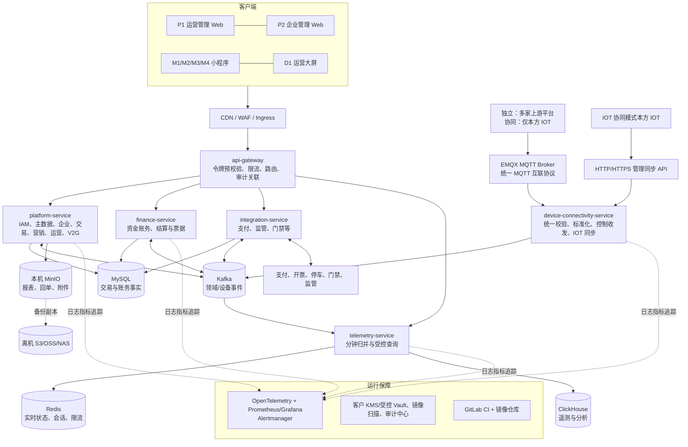

# 充电运营平台总体技术架构与实施蓝图

> 版本：v1.3（万台单机收敛版；双模式决策已纳入）  
> 状态：待内部评审  
> 依据：需求基线 v4.1、现有技术架构 v4.1、监管可靠上报设计 v1，以及工程目录与归档资料。  
> 范围：P1、P2、M1~M4、D1，及其后端、数据、中间件、运维、安全与测试。  
> 非事实声明：仓库目前只有工程骨架和文档，尚无 Java/Vue 源码、数据库脚本、容器编排或真实第三方接口；本文中的产品和容量指标均为推荐落点，实施前须用压测、合同和接口文档确认。
> 部署优先级说明：当前实施与交付必须以《万台单机架构收敛与高可用演进决策 v1.1》为准：10,000 台以内、8 核 32 GB、Docker Compose、6 个 Java 部署单元。技术组件见《充电运营平台技术选型与单机演进方案 v1.10》，服务/目录/schema 见《充电运营平台工程架构与数据分库设计 v1.3》。本文涉及 Redis Cluster、三 Broker、Kubernetes、Loki/Tempo 的内容均为未来条件化演进，不能作为一期现状或验收承诺。

## 1. 结论与设计原则

平台应建设为“**业务交易平台 + 统一设备互联边界 + 第三方适配边界 + 数据分析平台**”，而不是把 IOT、支付、监管和页面后台混为一个系统。当前推荐 Java 21、Spring Boot 3.5.x、Vue 3、MySQL 8.4 LTS、单实例 Redis、单节点 Kafka、ClickHouse 与单机运行包；当前将低频业务收敛为 `platform-service` 模块，资金、设备互联、第三方适配和遥测独立运行，合计 6 个 Java 部署单元。Redis Cluster、Kafka 多 Broker、Kubernetes 是未来容量和可用性演进目标。

1. 订单、计费、资金账务、租户结算、V2G 收益是不同账务事实；只能用不可变流水、快照、冲正和调整表达变更，不得覆盖历史订单或余额。
2. IOT 是设备协议、遥测、原始告警、远程命令执行和资产技术主数据的来源；运营平台消费其标准化数据，并维护经营属性、业务规则和处置闭环。
3. 同步请求只完成用户需要立即得到结果的动作；跨域、回调、分析、监管、通知和对账通过事件、Outbox 与可重试任务完成。
4. 每个写请求必须具备幂等键、操作者、授权范围、审计轨迹和可观测关联 ID；支付、资金、监管、远程控制另增加审批/复核与风险控制。
5. 先保证“下单—启动—计量—结算—退款/对账”闭环，再逐步开启复杂营销、V2G、数据智能和生态能力；不因目录中已预留服务而过早拆出大量独立部署单元。

## 2. 文档核查结论与待裁决项

### 2.1 已确认的系统边界

| 主题 | 当前基线结论 | 架构含义 |
|---|---|---|
| 七个应用 | P1、P2、M1~M4、D1 职责已清晰；D1 只读 | 七个独立前端产物，统一设计系统、登录与 BFF/API 契约。 |
| 设备数据 | 统一设备互联服务接收 MQTT，协同模式由 IOT API 同步管理主数据，设备数据存储为遥测优先来源 | 设备事件进入独立互联边界；业务库不保存原始高频遥测。 |
| 企业与资金 | 企业总资金、车辆分组、电卡分组、订单冻结和租户结算分离 | 必须建设独立账务域和余额投影，禁止用订单表实时加减余额。 |
| 监管 | 任务、状态机、重试、补推、回执和对账闭环 | 采用事务 Outbox + 监管任务库 + 可观测任务执行器。 |
| V2G | 放电订单、价格、收益、提现独立于充电与企业资金 | 单独的订单/账本/策略模型，默认按租户、站点、设备、车辆和合同逐级关闭。 |
| 私有化 | 目录预留环境、部署、观测和交付资产 | 所有组件均应提供 Helm/Kustomize、脱敏参数模板、离线镜像包和升级回滚说明。 |

### 2.2 已确认的权限与双模式收敛

平台采用实例级“独立模式 / IOT 协同模式”，安装后不可切换。平台始终本地校验密码并签发自身令牌；IOT 协同模式中 IOT 只同步账号、不可逆密码校验凭据、平台/租户权限和资产范围，平台 API 不直接信任 IOT 令牌，且不反向回写。企业充电客户成员、角色和页面权限始终由平台管理。详细决策见《双模式独立部署与 IOT 协同架构决策 v1》。

| 层次 | 权威来源 | 运营平台职责 |
|---|---|---|
| 独立模式的 P1 用户、登录会话、角色、租户/站点/设备范围 | 运营平台 | 初始化权限目录和本地管理；平台签发令牌并在网关/服务端执行授权。 |
| IOT 协同模式的 P1 上游账号、角色、租户/站点/设备范围 | IOT | 统一协议同步账号不可逆凭据及管理/资产投影；平台本地校验密码并签发令牌，不复制运行中 RBAC。 |
| P1 高风险业务动作 | 运营平台策略服务 | 定义“谁可审批/发布/补推/付款/远程控制”的动作策略、双人复核和审计。 |
| 租户的业务授权上限 | 运营平台权限中心 | 独立模式可维护；协同模式由 IOT 同步并只读展示，平台继续执行服务端范围校验。 |
| P2、M2、M4 企业用户 | 运营平台身份与权限中心 | 两种模式均由平台管理企业充电客户成员、角色和页面权限，逐级不得超出租户范围。 |
| M1 用户 | 运营平台消费者账户 | 仅访问本人资源；不使用后台角色模型。 |

## 3. 总体逻辑架构

## 4. 应用与前端架构

### 4.1 技术选型

| 层次 | 推荐 | 采用原因与约束 |
|---|---|---|
| Web | Vue 3 + TypeScript + Vite + Vue Router + Pinia | 适合 P1/P2/D1 的组合式开发与类型化 API；按路由懒加载，禁止前端承担权限判定。 |
| 管理端组件 | Element Plus；图表用 ECharts | 适合表单、复杂表格、审批、监控大屏与多曲线分析。统一封装表单、查询、导出、字典和状态组件。 |
| 小程序 | uni-app（Vue 3 + TypeScript） | M1~M4 共享基础能力、同时保留每个小程序独立发布包；支付、登录、扫码和订阅消息必须以宿主官方 SDK 做适配层。 |
| 网络与数据 | OpenAPI 生成类型化客户端；TanStack Query Vue 或等价数据缓存 | 降低七端接口漂移；GET 缓存需受租户、企业、用户和数据权限维度隔离。 |
| 工程形态 | pnpm workspace monorepo | `frontend/common` 仅承载设计令牌、通用组件、API 类型、权限指令和工具；严禁放任一端业务页面。 |

### 4.2 七端边界与接口策略

| 应用 | 部署与访问 | 前端职责 | BFF/API 约束 |
|---|---|---|---|
| P1 | 内网/专线或受控互联网 Web | 全平台运营、配置、审批、监管 | 独立模式本地管理，协同模式消费 IOT 同步投影；两种模式均使用平台令牌，金融/监管/远程操作强制服务端二次授权。 |
| P2 | 企业 Web | 企业组织、资金、车辆、电卡、账单与发票 | 企业授权令牌绑定当前企业、成员、授权版本；高风险操作复核。 |
| M1 | 个人小程序 | 找站、支付、充电、权益、售后、V2G 收益 | 只读/写本人资源；扫码一次性会话令牌不可重放。 |
| M2 | 企业司机小程序 | 企业充电、电卡/分组查询、个人 V2G | 企业成员上下文和当前卡/车辆授权必须由后端校验。 |
| M3 | 租户移动运营 | 场站态势、待办、协同处置 | 工作空间切换重新换取令牌；缓存与订阅立即清空旧范围。 |
| M4 | 企业移动管理 | 轻量企业协同、数据与发票 | 不暴露高风险资金批量操作和定时策略配置。 |
| D1 | 独立只读大屏 | 仅展示已发布指标与专题 | 使用短期只读令牌、预聚合查询和发布版本；不得直连业务库。 |

## 5. Java 后端与领域服务

### 5.1 平台标准

- **运行时**：JDK 21 LTS、Spring Boot 3.5.x、Spring MVC（外部 API）+ WebClient（非阻塞外部调用）、Spring Security OAuth2 Resource Server、Spring Validation、MyBatis-Plus（基础 CRUD）+ 同框架自定义 Mapper SQL（交易/权限/复杂查询）、Flyway、Resilience4j、Micrometer/OpenTelemetry、Maven。不得同时引入 MyBatis-Flex、JPA 等第二套持久层框架。
- **API 风格**：外部为 REST/JSON + OpenAPI 3.1；高频内部事件用 Kafka；不得用共享数据库或同步链式 RPC 代替领域事件。版本前缀 `/api/v1`，每次写入携带 `Idempotency-Key`。
- **错误与审计**：统一错误码、RFC 9457 问题响应、`traceId`、`tenantId`、`enterpriseId`、`actorId` 和授权版本。敏感字段日志脱敏，导出留痕；服务、SQL、API、事件、Topic 与 Bucket 必须符合《平台技术命名规范 v1》。

Spring Boot 3.5 仍为受支持的稳定线并支持 Java 17~25；本方案固定 JDK 21 以取得 LTS 运行时和成熟生态，实际创建工程时锁定经安全扫描验证的补丁版本。[Spring Boot 官方版本与系统要求](https://docs.spring.io/spring-boot/3.5/system-requirements.html)

### 5.2 从现有目录演进的部署单元

| 服务 | 对应工程 | 主责 | 不能承担的职责 |
|---|---|---|---|
| API Gateway | `backend/services/api-gateway` | 鉴权预校验、路由、限流、灰度、请求审计 | 业务授权最终判定、订单编排、设备协议。 |
| 平台业务 | `backend/services/platform-service` | IAM、主数据、企业、交易、营销、运维、V2G 等严格隔离模块 | 资金账本原子写入、外部协议 I/O、MQTT I/O、分钟遥测写入。 |
| 资金账务 | `backend/services/finance-service` | 个人/企业/V2G 账本、冻结、清分、租户结算、付款、票据和对账 | 直接执行业务页面的任意余额改写、设备协议。 |
| 设备互联 | `backend/services/device-connectivity-service` | 统一 MQTT 验签/标准化、命令收发、接入审计，以及协同模式 IOT HTTP/HTTPS 管理同步 API | 运营配置、资金、人工工单、资产权威表直写。 |
| 外部适配 | `backend/services/integration-service` | 支付、银行、监管、门禁/道闸、开票等防腐适配、回调、重试和协议审计 | 资金账本、订单状态机、页面权限决策、MQTT。 |
| 遥测与查询 | `backend/services/telemetry-service` | 分钟归并、Redis 实时状态、ClickHouse 批写、曲线/大屏/导出查询 | 交易写入、实时控制、资产/资金修改。 |

当前只建立以上 6 个 Java 部署单元；`platform-service` 的模块仍有独立 schema、Flyway、包、事件和 ArchUnit 边界。查询影响归并时拆 `analytics-query-service`；交易或 V2G 负载明确分离后再拆相应服务；外部适配服务内部按支付/监管资源边界再拆。服务拆分不是菜单数量的函数。

### 5.3 事件、任务与一致性

1. 订单、支付回调、设备状态、计量、告警、监管、结算和通知均定义版本化领域事件；事件 envelope 至少含 `eventId`、类型、发生时间、业务键、来源、schemaVersion、traceId 和分区键。
2. 交易服务在同一 MySQL 事务写业务事实和 `outbox_event`；Outbox 发布器幂等投递 Kafka。消费者以 `eventId` 去重并可重放，业务状态机负责乱序、迟到和重复事件。
3. 支付/IOT/监管回调先验签、限流、持久化原文脱敏快照，再异步处理；回调 HTTP 成功不等于业务最终成功。
4. 监管任务、退款、付款、发票、提醒、定时策略均有独立任务表、下一次执行时间、尝试记录、死信/人工队列和补偿动作；调度器只“领取任务”，不保存唯一业务事实。

## 6. 数据库、数据模型与中间件

### 6.1 选型与用途

| 类别 | 推荐 | 主用途 | 高可用与边界 |
|---|---|---|---|
| 核心关系库 | MySQL 8.4 LTS InnoDB | 订单、配置、企业、营销、账本、结算、任务、审计索引 | 当前单实例、多 schema、binlog 与离机备份；未来才按 SLA 建主从/组复制或托管高可用。 |
| 缓存与协调 | Redis 单实例 | 会话、令牌版本、热点站点/枪状态、限流和可丢失短期缓存 | 不保存唯一资金事实；当前不使用分布式锁式遥测回放，未来按 SLA 演进 Sentinel/Cluster。 |
| 设备数据与控制接入 | EMQX MQTT Broker + 统一 MQTT 互联协议 | 两种模式的遥测、遥信、告警、订单上报、控制回执和平台下行控制均只走 MQTT；上游平台/IOT 可代理其设备。 | 接入服务校验已登记的固定设备编号后再转内部事件；独立模式允许多家合规上游平台，协同模式只允许本方 IOT；未知设备编号拒绝，设备和第三方不得直连 Kafka。当前单机 EMQX 为单实例，未来再集群化。 |
| IOT 管理同步 | HTTP/HTTPS 管理同步 API | 仅 IOT 协同模式由本方 IOT 推送管理员、角色/页面权限、租户/成员、场站与设备资产；平台保存只读投影。 | 不接收任何设备数据或控制回执；独立模式拒绝该类外部写入。HTTP 必须有 HMAC、时间戳、nonce、幂等键与网络白名单，公网使用 HTTPS。 |
| 事件总线 | Kafka（KRaft） | 经校验后的遥测、订单状态、异步集成、CDC、分析流 | 未来 ≥3 broker，按 `stationId`/`deviceId`/`orderId` 分区保证局部有序；业务消费者需幂等。当前单机为单 broker，非高可用。 |
| 分析与时序 | ClickHouse | 设备/枪口分钟级最后有效遥测、状态历史、经营预聚合、曲线和大屏 | 分钟记录永久保留并按分区扩展；Redis 仅承载实时最后有效值。以 Kafka/ETL 进入，不用于资金事务。 |
| 对象存储 | 本机 MinIO + 独立数据卷 | 回单、发票文件、导出、监管报文脱敏归档、审计附件 | 业务对象本地优先，开启版本化、服务端加密、配额和生命周期；数据库只存元数据与对象哈希。Bucket 和数据库备份必须离机复制，本机 MinIO 不是离机灾备。 |
| 搜索（按需） | OpenSearch | 工单、日志、公告、审计全文检索 | 不能作为订单/资金权威源；若查询量未到阈值，先使用 MySQL 索引。 |
| 调度 | 单机内置任务执行器（Spring `@Scheduled` 触发 + MySQL 任务表领取）；未来独立 `job-worker` | 日切、结算批次、监管扫描、过期清理、报表 | 单机不额外部署 XXL-JOB Admin；任务状态、租约、尝试、死信与审计在业务库，避免以调度日志替代可审计任务记录。 |

### 6.2 关键数据建模规则

| 数据域 | 必须具备的事实与快照 |
|---|---|
| 充电订单 | 会话、启动方式、设备/枪、计费规则与价格快照、权益、支付/企业资金主体、VIN/分组、结算方案、计量、状态转换和异常。 |
| 账务 | 账户、可用/冻结/在途余额投影、不可变分录、原交易、批次、冲正/调整、对账状态；金额使用整数最小货币单位，绝不用浮点。 |
| 企业 | 企业、组织、成员身份、车辆、VIN 唯一有效归属、车辆/电卡分组、站点范围、额度、授权版本和有效期。 |
| 设备 | IOT 外部 ID、映射版本、场站/变压器/枪关系、能力、状态和数据质量；技术主数据按来源只读，运营扩展字段独立存储。 |
| 监管 | 目标平台、映射版本、密钥引用、业务事件、幂等键、任务、尝试、回执、补推审批和对账差异。 |
| V2G | 授权、设备能力、会话、放电订单、独立计量、收益账本、提现申请、风控与结算快照。 |

## 7. 外部集成与设备数据链路

### 7.1 防腐层原则

`platform-adapter` 按每种外部平台实现适配器，不把第三方 DTO、枚举、签名算法或重试语义泄漏给领域服务。每个适配器都实现：凭据引用、协议版本、验签/签名、字段映射、幂等、超时/熔断、原文脱敏留存、失败分类和联调模拟器。

### 7.2 关键链路

| 链路 | 处理方式 | 不变量 |
|---|---|---|
| 设备数据源 → 平台 | 两种模式的设备级数据与控制回执均只经统一 MQTT 互联协议进入 `device-connectivity-service`；独立模式可接收多家合规上游平台的运行数据，IOT 协同模式只允许本方 IOT。管理/资产/权限同步另走同服务的 IOT 协同模式专用 HTTP/HTTPS API。 | 原始遥测周期由设备决定，不作为协议固定值；平台按自然分钟永久保留最后有效值及来源、时间、质量。外部不得直写数据库；迟到数据不得覆盖已结算订单事实。 |
| 平台 → IOT 控制 | 运维服务创建控制意图与授权审计；接入服务下发；以异步回执结束 | 控制命令必须带命令 ID、幂等键、有效期和操作者；“已发送”不等于“已执行”。 |
| 支付与退款 | 适配器创建渠道单、处理回调、渠道对账和原路退款 | 平台商户统一收款；渠道回调和人工补单均不可重复入账。 |
| 停车/门禁/闸机 | 只交换权益校验、核销、映射、结果和异常 | 停车款、退款、发票不进入平台资金账。 |
| 监管 | 业务事件生成任务，经版本化映射发送；回执、重试、补推、对账独立建模 | 监管失败绝不阻塞用户充电/支付；补推绝不改写原订单。 |
| 开票与出款 | 由受控供应商/银行通道适配；文件证据入对象存储 | 开票、租户来票、平台服务费票方向分离；出款与账单确认职责分离。 |

## 8. 安全、合规与审计

1. **身份**：两种模式均由平台本地校验密码并签发令牌。IOT 协同模式由 IOT 通过受控协议同步账号及不可逆密码校验凭据；P2/M2/M4 使用平台 OIDC；M1 使用小程序换取平台短期 token。令牌必须包含当前应用、主体、唯一的平台或租户归属、授权版本和过期时间。
2. **授权**：API 网关做粗粒度应用与令牌校验，服务内做对象级 ABAC（租户、企业、站点、分组、数据范围、时间有效期）。前端菜单隐藏仅改善体验，绝不是控制措施。
3. **密钥**：Vault/KMS 管理支付、监管、IOT、发票证书及轮换；业务库只存密钥引用、版本和脱敏指纹。Kubernetes 使用 External Secrets 注入，严禁明文仓库和日志。
4. **数据保护**：手机号、身份证、车牌、VIN、卡号、银行信息分类分级；传输 TLS 1.2+，静态加密，展示/导出按角色脱敏并水印，导出需要审批、限量和审计。
5. **高风险控制**：支付退款、出款、余额调整、价格发布、监管补推、策略发布、远程控制、V2G 提现要求最小权限、二次确认、可选双人复核、不可篡改审计和告警。
6. **供应链**：分支保护、代码评审、SBOM、依赖/SAST/镜像/IaC 扫描、签名镜像与运行时最小权限。生产禁止 `latest` 标签和特权容器。

## 9. 容器、运维与可观测性

### 9.1 部署拓扑

- **开发/测试/预生产**：Docker Compose，使用模拟 IOT/支付/监管服务与脱敏数据；不连生产三方。环境以独立配置、数据库和 Kafka Topic 隔离，预生产可接对方沙箱。
- **当前生产私有化**：单台 8 核 32 GB Linux 服务器运行 6 个 Java 单元和必要中间件；入口网络隔离、资源限制、证书管理、健康检查、离机备份与维护窗口升级是强制项。
- **未来 HA 生产**：只有客户提供至少 3 个独立故障域、复制型数据组件、负载均衡和演练过的 RPO/RTO 后，才选择 Kubernetes 或等价多机编排。[Kubernetes 生产环境指南](https://kubernetes.io/docs/setup/production-environment/)
- **私有化**：当前提供 Compose 运行包、离线镜像、版本锁定、密钥外置、参数校验、升级前备份、回滚与演练手册；Helm values 仅作为未来 HA 资产维护。

### 9.2 可观测性与运行目标

| 范围 | 采集/告警 | 建议 SLO（待业务确认） |
|---|---|---|
| API | RED 指标、P95/P99、4xx/5xx、限流、按租户异常率 | 核心查询月可用性 ≥99.9%；关键启动/支付入口 ≥99.95%。 |
| 订单与支付 | 状态滞留、回调积压、冻结未释放、对账差异 | 启动/结算状态异常可在 1 分钟内告警；具体端到端时限需按 IOT/支付 SLA 确认。 |
| 设备与命令 | 接收延迟、缺失、质量、命令超时、离线率 | 以 IOT 合同中采集周期为标准，展示实时数据延迟而非伪造“实时”。 |
| Kafka/任务 | consumer lag、DLQ、重试次数、待人工任务年龄 | 监管任务、支付回调、结算任务分别告警和仪表盘。 |
| 数据库与缓存 | QPS、慢 SQL、连接、复制延迟、备份、命中率 | 账务写库不允许依赖缓存成功；主从延迟与备份失败触发 P1 告警。 |
| 安全 | 登录失败、权限拒绝、密钥过期、导出、风险动作 | 退款、出款、补推、控制、提现必须可按 traceId 回溯。 |

所有服务通过 OpenTelemetry 自动/手工埋点，并以 `traceId` 打通网关、服务、Kafka、任务和适配器。当前常驻 Prometheus/Grafana/Alertmanager；日志以结构化标准输出和轮转文件保留，trace/log 可发送到客户外部平台。Loki、Tempo/Jaeger 只在外部观测平台已有或资源升级后部署；告警必须由 Alertmanager 路由到离机值班渠道。

### 9.3 备份与灾难恢复

| 资产 | 策略 | 建议目标（待确认） |
|---|---|---|
| MySQL 交易/账务 | 每日全备 + binlog/PITR 至离机目标；每季度恢复演练 | 当前 RPO/RTO 必须由实际归档与恢复压测确定；若合同要求主机故障不中断，需多机复制与切换。 |
| ClickHouse/对象存储 | 分区备份至外部对象存储、版本和校验 | 可接受更长恢复时间，但不得影响账务与订单恢复。 |
| Kafka | 单节点短期 Topic 保留与 Outbox 重放 | 不是灾备；未来多副本、`min.insync.replicas` 和灾备复制按 HA 项目启用。 |
| 配置/密钥/部署 | 受控配置、KMS/受控 Vault、Compose 发布记录 | 环境可从受控配置重建；不以人工服务器修改为唯一配置。 |

## 10. 质量保障与测试体系

| 层级 | 推荐工具与内容 | 必须覆盖的高风险场景 |
|---|---|---|
| 单元 | JUnit 5、Mockito、ArchUnit、JaCoCo | 价格匹配、账本平衡、余额冻结/释放、状态机、授权范围与金额边界。 |
| 集成 | Testcontainers（MySQL/Redis/Kafka）、Flyway、WireMock | Outbox、幂等消费、支付/IOT 回调验签、数据库迁移和失败重试。 |
| 契约 | OpenAPI lint + Pact/Spring Cloud Contract | P1/P2/小程序 BFF、IOT、支付、监管、开票适配器的版本兼容。 |
| E2E | Playwright（Web）、小程序真机/云测 | 双模式登录/授权、个人支付退款、企业 VIN/电卡、策略、工单、发票、权限越权、V2G、监管补推、充电中离线补传。 |
| 性能与韧性 | k6 或 Gatling；Kafka 压测；Chaos Mesh/故障注入 | 高峰扫码、设备事件风暴、订单晚到/乱序、支付超时、Kafka 积压、Redis 故障、主库切换。 |
| 安全 | SonarQube/Semgrep、OWASP ZAP、Trivy、依赖与 IaC 扫描、渗透测试 | IDOR 越权、JWT 伪造/过期、回调重放、SQL 注入、敏感导出、密钥泄漏和供应链漏洞。 |
| 验收 | 需求—规则—接口—测试用例追踪矩阵 | 每个三级菜单至少有角色、数据来源、正常/异常流程、权限、审计和验收证据。 |

质量门禁：主干合并必须通过格式化、静态检查、单元/集成测试、OpenAPI 兼容校验和安全扫描；发布候选版本必须完成迁移演练、核心 E2E、性能基线、灾备恢复抽检与外部沙箱回归。

## 11. 推荐实施顺序

| 阶段 | 目标与可交付物 | 退出条件 |
|---|---|---|
| 0：架构落地 | 术语、权限裁决、领域/主数据矩阵、事件词典、账务模型、ADR、环境与安全基线 | 确认 IOT/IAM、支付、监管、开票、私有化前置；不存在 P1 双 RBAC。 |
| 1：核心充电闭环 | 设备/IOT 适配、场站只读同步、P1 基础运营、M1 扫码、订单计费、平台支付/退款、审计与监控 | 启动、结束、退款、异常订单可在沙箱全链路回归与对账。 |
| 2：企业与运营闭环 | P2/M2/M3/M4、企业资金/分组/电卡、工单/告警、租户结算、停车协同、监管任务中心 | 企业与租户权限边界、账本、月结、补推和对账通过验收。 |
| 3：经营与扩展 | ClickHouse 指标体系、D1、完整营销、开票、收益分析、私有化交付自动化 | 指标口径公开、数据延迟可见、备份恢复与压测达标。 |
| 4：条件能力 | V2G、聚合调度、复杂营销/生态 | 设备双向能力、合同、计量、风控、提现和监管条件逐项通过后灰度开启。 |

## 12. 首批需要补齐的工程资产

1. `docs/design/`：领域上下文图、主数据归属矩阵、ADR（特别是权限、账务、设备、事件、数据存储）、实体/状态机和容量模型。
2. `docs/api/`：OpenAPI 规范、事件契约、错误码、回调验签与幂等说明；第三方接口只在 `docs/integrations/` 留映射和联调材料。
3. `backend/`：Maven 多模块父工程、统一异常/审计/授权 starter、Flyway、Outbox、测试容器和适配器 SPI；不要先创建空的业务 CRUD。
4. `frontend/`：pnpm workspace、设计令牌、API 类型生成、鉴权 SDK、P1/P2/M1 先行骨架；七端不共用业务状态。
5. `platform/`、`config/`、`scripts/`：Helm/Kustomize、GitOps、环境模板、Harbor、备份恢复、数据库初始化、可观测性和质量脚本。
6. `tests/`、`delivery/`：端到端关键旅程、外部沙箱模拟、性能基线、安全测试、发布清单、回滚和验收证据模板。
