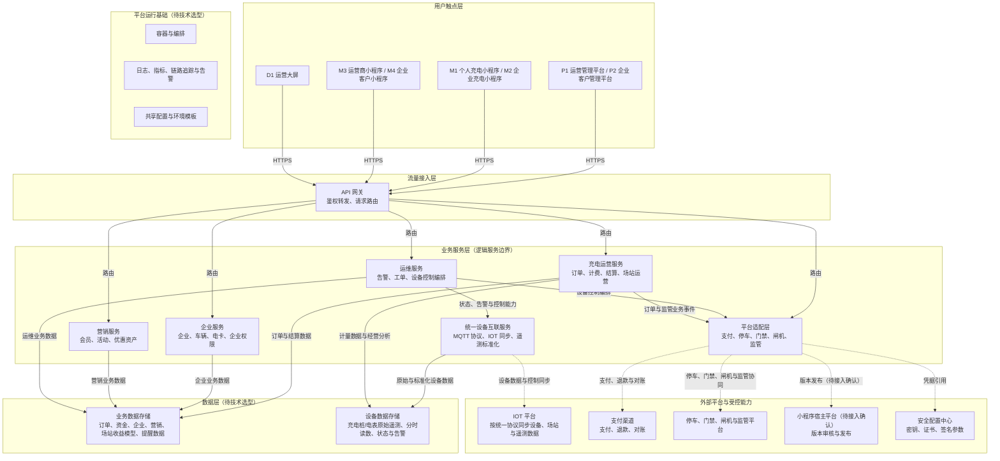

# 充电运营平台技术架构（逻辑基线）

> 版本：v4.1（逻辑架构基线）\
> 状态：待内部评审\
> 目的：将七应用菜单架构映射为逻辑技术边界，明确用户触点、网关、业务服务、数据与外部平台的协作关系。\
> 菜单来源：`../requirements/充电运营平台菜单架构-v4.1.md`（唯一菜单源）\
> 依据：`../requirements/充电运营平台业务规则基线-v4.1.md`、`../requirements/充电运营平台功能详细说明-v4.1.md`、`../standards/文档与代码输出归档规则.md`。
> 实施口径：本文保留菜单到逻辑边界的历史映射，不再定义当前部署、服务目录或技术产品。当前实现以《万台单机架构收敛与高可用演进决策 v1.1》《充电运营平台工程架构与数据分库设计 v1.3》《技术选型与单机演进方案 v1.10》为准。

## 1. 使用边界

- 本图是逻辑技术架构，不代表已部署拓扑；具体产品、6 个部署单元、schema 与运行资源已在后续架构决策中确定。
- 图中旧服务名称仅表达业务逻辑，不等同于当前工程目录；具体服务边界、数据归属、部署方式和接口契约以当前架构决策为准。
- P1 仅供平台工作人员及获授权租户人员访问；企业客户、企业管理员和企业成员使用 P2、M2 或 M4，不进入 P1。
- 实线表示同步 HTTPS / 内部调用；虚线表示经平台适配层访问外部平台或受控能力。密钥、证书和签名参数不进入普通业务服务或菜单页面。

## 2. 横向分层架构图

可编辑版：[充电运营平台技术架构 v4.1（FigJam）](https://www.figma.com/board/pVo3NgHbRtqFaglhEEpJuH?utm_source=other\&utm_content=edit_in_figjam\&oai_id=v1%2FxbVcRP1dJ4qtELBgi8qwXwxUzYhytt9jQA07jxv73h9yX3Kvfd2bLu\&request_id=25204ce9-ba7d-45da-a323-3ce417a6963e\&architecture=true)。

## 3. 菜单到技术边界的映射

| 菜单/应用范围                      | 主要逻辑服务        | 关键边界                                         |
| ---------------------------- | ------------- | -------------------------------------------- |
| P1 运营、交易、计费、资金、结算、监管、应用配置、收益分析 | 充电运营服务、统一设备互联服务、平台适配层 | P1 不向企业客户开放；经营分析从业务与设备数据存储组合读取，支付与监管的技术协议及凭据不在普通页面维护。 |
| P2、M2、M4 的企业组织、车辆、电卡、额度与企业订单 | 企业服务          | 企业权限受 P1 统一权限中心的上限校验；企业客户不访问 P1。             |
| M1 的会员、卡券、红包、积分与活动           | 营销服务          | 营销权益需保留核销与成本归属，不直接改写历史结算事实。                  |
| 设备管理、告警、工单、远程操作记录与企业定时充电      | 统一设备互联服务、运维服务、平台适配层 | 设备运行数据和控制只经统一 MQTT 上游互联协议进入独立设备互联服务；资产/权限管理仅在协同模式走 HTTP/HTTPS 同步。运营平台保留业务处置、审计与编排。 |
| 小程序管理、内容配置与发布                | 充电运营服务、平台适配层  | 业务侧管理应用档案、启停、版本与配置审计；AppID、密钥、证书由安全配置中心受控保管。 |
| D1 运营大屏                      | API 网关、充电运营服务 | D1 只读展示，仅读取 P1 发布的内容与指标范围。                   |

## 4. 待技术评审项

1. 业务数据存储与设备数据存储的逻辑分层已确定；具体 MySQL、Redis、Kafka、ClickHouse、本机 MinIO 及其单机/未来 HA 方案见当前技术选型，不再在本图重复。
2. 当前工程收敛为 6 个部署单元；本图中的旧服务目录名称不得用于新建代码。
3. 小程序宿主平台的发布、审核、灰度和回滚接口需在“小程序管理”需求进入接口设计后确定。
4. 监管可靠报送的任务调度、重试存储和可观测性实现待技术方案确定；现有业务规则只确认待报、重试、补推与回执闭环。
