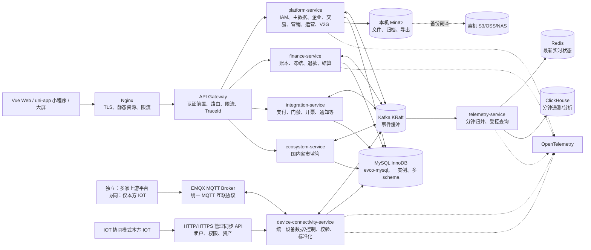

# 充电运营平台技术选型与单机演进方案

> 文档定位：技术选型、容量、灾备和演进参考。服务、数据、支付退款、Kafka 与 WebSocket 的实施依据为《[架构基线与服务边界](充电运营平台架构基线与服务边界-v2.md)》及《[Kafka 事件目录](../../contracts/events/README.md)》。

> 版本：v1.14（单机起步待验证版）
> 状态：待内部评审，未完成容量、恢复和设备互操作验收前不得承诺万台设备生产容量。
> 依据：现役 v4.1 菜单/规则、双模式独立部署与 IOT 协同架构决策 v1，以及“原始遥测周期由设备决定、分钟归并永久留存、8 核 32 GB 单机待验证部署、未来预留多节点/Kubernetes”的约束。
> 适用边界：本文选择当前单机形态可运行、未来可横向扩展的技术；单机不是高可用方案，不承诺硬件故障下持续服务。
> 架构口径：服务边界、目标工程目录和数据所有权以《万台单机架构收敛与高可用演进决策 v1.2》及《充电运营平台工程架构与数据分库设计 v1.7》为准。当前采用 7 个 Java 部署单元，不是 14 个进程级微服务；早期十万桩/256 GB 和全量微服务表述已废止。

## 1. 调研结论与不可突破的约束

本平台不是普通后台管理系统：现行 P1/P2/M1~M4/D1 覆盖充电交易、支付与企业资金、租户结算、告警工单、监管补推、V2G、永久分钟遥测和两种部署模式。监管由 `ecosystem-service` 在 W10 达到内部就绪；真实目标接入另以 C3-R 生产 Go；虚拟电厂等外部平台能力后置。系统必须把**交易事实、设备运行数据和分析查询**分开处理。

| 项目事实 | 技术影响 |
|---|---|
| 独立模式 | 平台维护平台/租户权限与资产；外部仅接收遥测、遥信、告警、控制及回执，不能导入资产。 |
| IOT 协同模式 | 仅本方 IOT 推送平台/租户/资产及运行数据；企业充电客户成员、角色、页面权限仍由平台本地管理。 |
| 待验证的设备规模、原始遥测周期可变 | MQTT 协议不规定固定上报周期，须按真实接入设备的最短周期、设备/枪口数和字段数压测。以 30 秒/设备仅作示例基准时约 **333 条/秒**；整点/网络恢复仍须按至少 3 倍突发吸收，不能同步写交易库。 |
| 分钟级永久遥测 | 仅按“10,000 设备 × 1 分钟”计算也约 **1,440 万设备分钟/日、52.56 亿/年**；枪口/更多维度会倍增。必须采用列式时序存储、宽表和冷热分层。 |
| 当前单机 | 所有组件可同机进程化运行，但 MySQL、Kafka、Redis、ClickHouse、对象存储和业务进程均为单点；必须能备份、恢复和扩容，不能声称高可用。 |

### 1.1 关键反对意见

“万台设备 + 永久分钟数据 + 8 核 32 GB 单一物理机”可以作为**起步部署**，但仍无法保证硬件故障零中断或无限历史热查询。选型通过 7 个受控进程、Kafka 事件边界、数据库隔离和对象存储接口为后续扩容/多节点做准备；容量、磁盘寿命与 RPO 必须在压测后写入合同级 SLA。

## 2. 总体选型结论



## 3. 详细技术选型

### 3.1 前端

| 领域 | 选择 | 为什么选它 / 优势 | 使用边界 |
|---|---|---|---|
| P1、P2、D1 | Vue 3 + TypeScript + Vite + Vue Router + Pinia | Vue 3 生态成熟，适合复杂表单、权限路由和数据大屏；官方建议不需要 SSR 时直接使用 Vite，降低多后台应用的工程复杂度。[Vue 官方指南](https://vuejs.org/guide/quick-start) | 每个应用独立构建与部署；不使用微前端作为一期前提。 |
| 管理端 UI | Element Plus + ECharts | 覆盖表格、表单、树、审批、权限矩阵；ECharts 满足多设备/多功能点曲线、地图和大屏。 | 封装统一查询表单、字典、导出、审计抽屉，不把业务逻辑放公共组件。 |
| 小程序 M1~M4 | uni-app（Vue 3 + TypeScript） | 多小程序复用登录、扫码、网络状态、埋点和 API 类型，同时保留独立小程序发布、审核和灰度。 | 支付、扫码、订阅消息必须封装宿主 SDK 适配层；不将后台权限只靠前端隐藏。 |
| 小程序 UI | wot-design-uni（Wot UI，DEC-20260820-010） | Vue3＋TypeScript 原生构建、70+ 组件、CSS 变量主题定制（与本项目 design-tokens 契合）、暗色模式支持、2026-08 仍活跃维护、unibest 等主流模板采用；经与 uni-ui（组件少更新慢）/uview-plus（无 TS 优势）比对后选定。 | 主题变量映射到 `--evco-*` Token；组件二次封装进入各 App `shared/`，不携带业务状态。 |
| 前端契约 | OpenAPI 3.1 生成 TypeScript 客户端 + TanStack Query Vue | 后端接口变更可在编译期暴露；查询缓存按应用、用户、租户、企业和授权版本隔离。 | 写操作统一携带幂等键；D1 只读取预聚合接口。 |
| 工程 | pnpm workspace + ESLint + Prettier + Vitest + GitHub Actions | 七端共享类型、设计令牌与通用控件，依赖安装、构建和 Pull Request 检查可重复。 | `frontend/packages` 与各 App 的 `shared/` 禁止收纳任一端的业务页面、状态和租户规则；业务资产位于 `modules/<module>/<feature>/`。 |

### 3.2 Java 后端

| 领域 | 选择 | 为什么选它 / 优势 | 使用边界 |
|---|---|---|---|
| 运行时 | JDK 21 LTS + Spring Boot 3.5.x + Maven | Java 21 提供长期稳定运行时；Spring Boot 3.5 支持 Java 17~25，便于安全补丁锁定和将来升级。[Spring Boot 系统要求](https://docs.spring.io/spring-boot/3.5/system-requirements.html) | 统一 BOM、依赖版本和构建镜像；不在当前阶段追逐 Spring Boot 4 的破坏性升级。 |
| 核心业务与持久层 | Spring MVC + Spring Security + **MyBatis-Plus** + Flyway | MyBatis-Plus 是本项目唯一引入的持久层框架，兼容原生 MyBatis Mapper XML/注解 SQL：基础资料可复用受控 CRUD、分页和乐观锁，关键业务仍可明确掌控 SQL；Flyway 保证数据库变更有版本。 | 不同时引入两套 ORM。订单、账本、结算、权限和复杂查询只写同一框架下的自定义 Mapper SQL；金额使用整数最小货币单位，所有写入有事务、乐观版本与幂等键。 |
| 设备互联 | Spring WebFlux + Reactor Netty，独立 `device-connectivity-service` | MQTT 上游互联属于高并发 I/O；非阻塞连接模型比把每条遥测占用业务线程更适合周期可变的持续输入。IOT 管理同步 API 与 MQTT 同属外部设备互联边界，但各自使用隔离执行器。30 秒/设备约 333 条/秒只是基准压测档。 | MQTT 仅解析/验签/标准化/限流/投递；IOT API 只持久化收件箱并提交受控主数据命令；两者都不得直接改订单、资金或资产权威表。 |
| 第三方适配 | `integration-service` + `ecosystem-service` + Spring MVC/WebClient + Resilience4j | `integration-service` 隔离支付、银行、门禁/道闸、开票和通知；`ecosystem-service` 隔离现行国内省市监管的协议、重试和证据。 | 每个适配器独立 bulkhead、超时、连接池、重试预算与原文审计；不得写资金账本或订单状态机。 |
| 入口网关 | Spring Cloud Gateway + Nginx | `api-gateway` 是所有前端 API 的统一 Java 网关，负责认证前置校验、路由、限流、TraceId、CORS 与统一错误边界；Nginx 仅负责 TLS、公网网络边界和静态资源。该组合与既定多服务访问方式一致。 | 网关不承载业务编排、资金校验或设备协议；单机使用 Docker DNS/静态路由，**不部署 Nacos**。 |
| 可靠性代码 | Resilience4j + Outbox + 幂等消费者 | 外部 IOT、支付、监管都会超时、重复、乱序；Outbox 将业务提交和事件投递解耦。 | 跨部署单元禁止共享数据库和链式同步 RPC；同一 `platform-service` 内模块也禁止绕过应用服务直接访问别的模块表。消息处理必须可重放。 |
| 调度 | 内置任务执行器：Spring `@Scheduled` 触发 + MySQL 任务表领取；Kafka 流式分钟归并 | 单机不额外部署 XXL-JOB Admin。结算、监管扫描和过期清理由各自任务表保存下一次执行时间、租约、尝试、死信与审计；分钟遥测归并连续消费事件，不为每台设备建定时任务。 | `@Scheduled` 只触发扫描，任务由 MySQL 事务领取并幂等执行；未来多节点以独立 `job-worker` 复用同一领取模型，不以调度日志保存唯一事实。 |

#### 3.2.1 MyBatis-Plus 使用边界（强制编码规约）

MyBatis-Plus 不是第二套技术，而是本项目唯一持久层依赖；自定义 XML/注解 SQL 是其底层 MyBatis 能力的一部分。通用 CRUD 能明显降低菜单、字典、角色、租户成员、场站、设备资产和配置等单表维护功能的样板代码；其通用 Mapper/Service 正是为插入、更新、删除、查询、分页等标准操作提供封装。[MyBatis-Plus 持久层接口](https://baomidou.com/en/guides/data-interface/)

| 数据类型/动作 | 允许的写法 | 明确禁止 |
|---|---|---|
| 字典、菜单、角色、租户成员、基础资产、受控配置 | `BaseMapper`、受限 Wrapper、分页、乐观锁、审计字段自动填充；仍需显式校验租户和数据范围。 | 依赖前端隐藏权限；无租户条件的批量更新/删除。 |
| 订单、支付回调、资金冻结/退款、账本、结算、监管任务、设备命令、资产迁移 | XML/注解自定义 SQL，`WHERE` 中显式写入租户、业务状态、版本号和幂等键；检查受影响行数。 | `saveOrUpdate`、`updateById`、默认逻辑删除或泛化 Wrapper 替代状态机/账务语义。 |
| 复杂权限范围、对账、运营报表、批量处理 | 自定义 Mapper SQL + 执行计划/索引测试；大分析转 ClickHouse。 | 以链式 Wrapper 拼接复杂多表 SQL；在 MySQL 扫描永久遥测。 |
| ClickHouse 分钟遥测/聚合 | 专用 Mapper 或 JDBC 批量写入。 | 将 ClickHouse 表纳入 MyBatis-Plus 通用实体 CRUD。 |

MyBatis-Plus 的多租户、数据权限、逻辑删除和自动填充插件只能作为便利或防呆层，不能作为唯一安全边界。服务层始终注入 `tenant_id`，关键 SQL 显式带条件，并以跨租户读写失败的集成测试兜底。所有关键表禁止无条件 `UPDATE`/`DELETE`；生产开启非法 SQL/全表更新拦截作为第二道防线。

#### 3.2.2 Nacos：当前不部署，未来也不是 Kubernetes 的必选项

“有多个 Java 服务”不等于必须上 Nacos。当前七个服务固定在同一台 Docker Compose 主机，服务名就是稳定的内部 DNS 名称，网关路由、服务地址和配置经版本化环境文件在发布时一起校验；动态注册、动态配置和健康摘除不会消除单主机、单 MySQL 或单 Kafka 的故障域。Nacos 官方将单实例定位为测试/单机试用，生产高可用推荐集群部署；在 8 核 32 GB 上增加单实例 Nacos，只会增加一个 JVM、端口、数据与故障点，而不会使本平台高可用。[Nacos 部署概览](https://nacos.io/en/docs/latest/manual/admin/deployment/deployment-overview/)

未来按部署形态选择，而不是预装：多台 VM、没有 Kubernetes、服务副本需要动态发现和统一动态配置时，部署经演练的 Nacos 集群（隔离内网、认证、外部数据库、备份）是合适选择；进入 Kubernetes 时优先使用 Kubernetes Service/DNS 与 ConfigMap/Secret，是否同时引入 Nacos 仅取决于跨集群动态配置/治理的明确需求。所有服务从现在起只依赖外部化配置和 HTTP/Kafka 契约，不把 Nacos SDK 的业务 API 写进业务代码，因此未来切换不改业务逻辑。

### 3.3 数据与中间件

| 领域 | 选择 | 为什么选它 / 优势 | 单机阶段配置与未来演进 |
|---|---|---|---|
| 交易关系库 | MySQL 8.4 LTS + InnoDB | InnoDB 提供 ACID、崩溃恢复、行锁与一致性读，适合订单、账本、权限、配置和任务。[MySQL InnoDB 文档](https://dev.mysql.com/doc/refman/8.4/en/innodb-introduction.html) | 当前单主库、独立 NVMe、binlog 与全量备份；未来主从/组复制或托管高可用。不要存分钟遥测。 |
| 实时缓存 | Redis 7+ 单实例，AOF `everysec` | 保存设备/枪口最后有效实时值、会话、限流和短期幂等，访问延迟低；AOF 可用于快速恢复，但实时状态仍可由事件和 ClickHouse 重建。[Redis 持久化文档](https://redis.io/docs/latest/operate/oss_and_stack/management/persistence/) | 不是订单、余额或遥测永久事实源；未来拆为 Redis Sentinel/Cluster。 |
| 内部事件总线 | Apache Kafka 4.x KRaft 单 broker/controller | 仅削峰、回放和隔离平台内部的订单/控制/遥测管道；不允许设备或第三方 IOT 直连 Kafka。Kafka 官方也指出 broker/controller 合并适合小型场景，不适合关键高可用部署。[Kafka KRaft 文档](https://kafka.apache.org/40/operations/kraft/) | 当前单节点只解决吞吐和解耦，不解决 HA；未来三 broker + 独立 controller quorum。Kafka 历史回放不得逐条更新 Redis。 |
| 分钟遥测与分析 | ClickHouse 单节点、MergeTree 宽表 | 列式压缩、按时间/设备范围扫描，适合永久分钟数据、设备曲线、站点分析和大屏；避免以“每个功能点一行”的长表膨胀。 | 热数据放 NVMe；冷数据可迁 S3 兼容对象存储。ClickHouse 支持查询 S3 数据及冷热分层思路。[ClickHouse S3 集成](https://clickhouse.com/integrations/amazon_s3) |
| 对象存储 | 本机 MinIO + 独立本地数据卷 | 优先存发票、回单、监管报文脱敏件、导出、附件与固件；S3 API 使应用不绑定本地文件系统，也便于未来迁云。 | MinIO 是默认组件和业务对象主存储；开启 Bucket 版本控制、服务端加密、配额与生命周期。**MySQL/ClickHouse 备份及 MinIO Bucket 备份必须复制到生产机之外的 NAS、云 OSS/S3 或独立对象存储**；本机 MinIO 不构成离机灾备。 |
| 全文检索 | 一期不部署；按需引入 OpenSearch | 当前菜单的订单、工单和审计可先用 MySQL 索引，减少单机内存与运维负担。 | 大规模全文检索、复杂日志检索确有性能证据后再独立部署。 |
| 密钥 | 客户受控 KMS/HSM 或受控 Vault | 支付、监管、IOT 证书不能进入数据库明文字段、镜像或 Git。 | 8 核 32 GB 单机不默认常驻 Vault；优先复用客户 KMS/HSM 或外部 Vault。仅在无外部能力且经安全评审时使用主机受控加密文件，不适用于支付主密钥。 |

### 3.4 决策记录：ClickHouse 为主遥测库，TDengine 不作为一期双写库

TDengine 是合格的设备遥测数据库，并非性能不足：它以“一个采集点一个子表、同类采集点一个超级表”的模型组织数据，天然适合单设备/单枪口的连续曲线和时间窗口计算。[TDengine 数据模型](https://docs.tdengine.com/basic/model/) 因此，不能笼统断言 ClickHouse 的每项时序写入性能都优于 TDengine；在单设备时间范围读写上，TDengine 往往是很有竞争力的候选。

但本平台不只做设备点位库。P1 的设备数据分析要按租户、站点、设备、枪口、功能点、质量、来源和时间组合查询，并与资产范围、运营统计、告警/工单和监管报表协同；同时要求万台级、分钟级永久留存、宽表、冷数据归档和单机可维护。基于这些约束，选 ClickHouse 作为一期唯一的永久分钟遥测库：

| 决策维度 | ClickHouse | TDengine | 本项目结论 |
|---|---|---|---|
| 单设备/枪口连续曲线 | 可胜任，需依赖排序键和分区设计。 | 超级表/子表就是面向采集点的原生模型。 | TDengine 略有模型优势，但不是当前决定因素。 |
| 多设备、场站、租户统计与大屏 | 宽表、列式扫描、物化视图/投影更契合多维聚合与预计算。 | 可以通过标签先筛子表再聚合，但查询模型更依赖超级表标签设计。 | ClickHouse 优先。 |
| 与运营维度联合分析 | 更适合作为分析库读取预投影、维表快照和导出的 Parquet 数据；不把交易库 JOIN 放进实时关键链路。 | 已支持 JOIN，但官方仍列出主键时间线、连接条件与分组等限制。[TDengine 查询限制](https://docs.tdengine.com/basic/query/) | ClickHouse 优先；资产/权限先由服务层过滤，避免任意跨库 JOIN。 |
| 协议字段治理 | 固定高频列 + 受控 Map/JSON，可按数据字典演进。 | 超级表要求同类子表共享结构；无模式写入会自动新增表、字段且只增不删，不适合作为外部协议的无治理入口。[TDengine 无模式写入](https://docs.tdengine.com/develop/schemaless/) | 统一报文先校验、归一化；ClickHouse 宽表更可控。 |
| 永久留存与冷热层 | 可查询 S3 上的数据，并可用对象存储承接冷数据。[ClickHouse S3](https://clickhouse.com/integrations/amazon_s3) | 也支持分层存储，但官方文档标明其对象存储/多层存储能力属于 Enterprise 特性。[TDengine 高级存储](https://docs.tdengine.com/operation/multi/) | ClickHouse 的开源单机交付和冷归档路径更符合客户私有化成本。 |
| 单机运维 | 一个服务即可承载列式遥测分析；与 Kafka、MinIO 的组合成熟。 | 也可单机，且纯时序场景很简洁。 | 两者都是单点；TDengine 不会消除单机故障风险。 |

**结论：一期不部署 TDengine，也不做 ClickHouse + TDengine 双写。** 双写会制造两套口径、补数、回放、权限过滤、备份恢复和故障排查链路，却没有解决任何当前必须解决的问题。应先将 ClickHouse 模型、压测、冷热归档和恢复演练做实。

只有同时满足以下条件，才启动 TDengine 的独立 POC，而非直接替换：需要永久保存未经分钟归并的高频原始点位；绝大多数查询是单设备/单枪口时序曲线且很少做跨站/运营分析；客户接受 TDengine Enterprise 的存储能力及许可成本；并且 POC 以真实协议字段、万台设备目标报文、乱序补传、冷热恢复和 P1 查询集验证后，得出明显优于 ClickHouse 的结果。

### 3.5 市场成熟度、稳定性与可靠性评估（2026-08 调研）

以下指标用来判断“可持续交付风险”，不把 GitHub Star、厂商案例或单项跑分误认为生产 SLA。它们只反映社区规模、维护活跃度和获得外部帮助的概率；真正稳定性仍须由本平台的版本锁定、压测、备份和恢复演练证明。

| 维度 | ClickHouse | TDengine | 对本项目的影响 |
|---|---|---|---|
| 市场覆盖 | 典型定位为实时分析，采用面覆盖分析、可观测性、BI、日志与事件数据；官方社区页列出 3,000+ 贡献者、800+ 发布版本和 100k+ 开发者。 | 核心定位是工业物联网、车联网和时序采集；仓库自述有 730k+ 运行实例，但这是厂商自述，不能等同于可验证客户数。 | 本平台同时有运营分析和 IoT 遥测，ClickHouse 更容易招聘、获得第三方教程/工具和处理非纯时序需求。 |
| 开源社区可核验信号 | GitHub 仓库约 48k Star、8.5k Fork、240k+ 提交、约 800 个发布版本，Apache-2.0 许可。 | GitHub 仓库约 25k Star、5k Fork、86k+ 提交；核心仓库为 AGPL-3.0。 | 两者都活跃，ClickHouse 社区规模更大；TDengine 也足以作为严肃候选，但平台交付须先完成 AGPL 合规评估。 |
| 版本与维护 | 有持续稳定版/LTS 发布；升级必须走预发兼容与回滚，不追最新功能版。 | 3.3/3.4 均持续发布补丁；版本迭代活跃，但 Enterprise 与 OSS 功能边界必须逐项确认。 | 不论选谁，生产锁定经压测验证的版本，禁止客户现场“顺手升级”。 |
| 单机故障 | 单机服务、数据盘、机房任一故障都会中断；依赖备份恢复。 | 同样如此。其官方 HA 文档的强一致高可用至少需要三副本/三节点；双副本也需要两个数据节点和仲裁节点。 | 客户只给一台服务器时，不能以换成 TDengine 宣称高可用；必须提供独立备份目标。 |
| 冷数据与许可风险 | 开源版可利用 S3 兼容对象存储实施冷热策略。 | 官方文档把对象存储/多层存储列为 Enterprise 能力；社区版构建也会关闭 S3 支持。 | 永久分钟遥测是硬约束，TDengine 路线需将许可、升级和客户成本写进商务合同。 |

证据链接：[ClickHouse 开源仓库](https://github.com/ClickHouse/ClickHouse)、[ClickHouse 社区规模](https://clickhouse.com/clickhouse)、[TDengine 开源仓库](https://github.com/taosdata/TDengine)、[TDengine 发布说明](https://docs.tdengine.com/releases/notes/)、[TDengine 高可用说明](https://docs.tdengine.com/operation/ha/)。许可证结论不是法律意见；在将 TDengine 随私有化产品分发、修改或以网络服务方式提供前，须由公司法务按实际分发方式确认 AGPL-3.0 义务与商业授权方案。

**最终推荐不变：** 本平台标准版选 ClickHouse。理由不是“TDengine 不稳定”，而是 ClickHouse 在运营分析 + 遥测混合场景的采用面、生态、对象存储路径和 Apache-2.0 许可上整体风险更低。TDengine 应保留为纯工业时序项目的备选，而非现阶段的第二套遥测库。

### 3.6 决策记录：业务关系库默认 MySQL，PostgreSQL 是受条件约束的替代方案

当前仓库尚没有 Java 源码、迁移脚本或既有数据库，MySQL 不是历史包袱，也不是 PostgreSQL 性能或可靠性不足的结论。二者都是成熟的生产级关系数据库；MySQL 8.4 InnoDB 和 PostgreSQL 都提供事务、MVCC、行级并发和备份恢复。MySQL 的选择是由**当前交付模型**决定：客户多为单机私有化，业务库只承载短事务事实而非永久分钟遥测，且一期需要可产品化安装、监控、备份和恢复的较低运维复杂度。

| 维度 | MySQL 8.4 + InnoDB | PostgreSQL | 本平台判断 |
|---|---|---|---|
| 订单、支付回调、冻结/释放、账本、权限 | ACID、行锁、一致性读、崩溃恢复、外键和主键聚簇索引均可满足。 | 同样满足，MVCC 并发控制能力很强。 | 平局。资金正确性来自不可变账本、唯一幂等键、短事务、确定性加锁顺序和失败重试，不来自某一数据库名称。 |
| 单机日常运维 | InnoDB + 全量备份 + binlog PITR 是清晰、常见的私有化交付路径。 | WAL/PITR 同样成熟；但高更新表必须监控并调优 autovacuum、膨胀和长事务。 | MySQL 略优：当前单机客户通常没有专职 PostgreSQL DBA。该判断必须由实际交付/运维团队能力验证。 |
| 复杂 SQL、可扩展类型 | 常规关系模型、JSON、空间类型、全文索引均支持。 | SQL 能力、扩展生态、复杂约束、窗口/递归查询、`jsonb` + GIN、PostGIS 通常更强。 | PostgreSQL 优势，但当前核心订单/权限/资产模型应保持规范化关系表，不应把复杂分析塞进业务库。 |
| 严格租户隔离的数据库兜底 | 无等价的内建行级安全策略；必须由服务层显式注入 `tenant_id` 条件、外键/唯一键包含租户维度，并以自动化测试兜底。 | 有 Row-Level Security（RLS），可按角色/会话策略限制行的读写；但表 owner、超级用户和策略设计仍须严谨处理。 | PostgreSQL 有明显的防御纵深优势。若客户要求“数据库层也必须阻止跨租户读取”，应改选 PostgreSQL 或在 MySQL 前明确接受服务层隔离模型。 |
| 动态配置/JSON 查询 | 原生 JSON 校验、二进制存储和 JSON 函数可满足少量受控扩展字段。 | `jsonb` 可建 GIN 索引，查询/索引表达力更强。 | PostgreSQL 优势；但计费、订单状态、权限、资产主关系不得藏在 JSON 中，因此一期不是决定因素。 |
| 地理空间 | 有空间类型及索引，普通站点坐标、范围筛选够用。 | 搭配 PostGIS 适合复杂围栏、道路/区域计算和空间分析。 | 若后续把复杂空间分析放在本地数据库，改选 PostgreSQL；当前地图/路线依赖地图服务，非刚需。 |
| 未来复制与数据分发 | binlog 复制、GTID 和基于全备 + binlog 的 PITR 路径明确。 | 物理复制与逻辑发布/订阅均成熟，逻辑复制可细粒度选择对象。 | 平局；当前一台服务器只能做备份恢复，不能凭复制功能声称 HA。 |
| Java 与私有化交付 | JDBC、MyBatis-Plus（含自定义 MyBatis SQL）、Flyway、监控和现场排障路径通用；MySQL 技能在常见 Java 私有化团队中更容易获得。 | 同样有成熟 JDBC/MyBatis-Plus/Flyway 生态；若团队熟悉 PostgreSQL，不应因 Java 而放弃。 | 团队现有能力是最终的非功能性决定项，不可凭假设决定。 |

选择 MySQL 的直接依据是 InnoDB 的 ACID、提交/回滚、崩溃恢复、行级锁和一致性读能力，以及 binlog 支持的时间点恢复。[InnoDB](https://dev.mysql.com/doc/refman/8.4/en/innodb-introduction.html) [PITR](https://dev.mysql.com/doc/refman/8.4/en/point-in-time-recovery.html)  PostgreSQL 并不逊色：其 MVCC 读写不互相阻塞，并提供原生 RLS、`jsonb`/GIN、逻辑复制和 WAL 归档恢复。[PostgreSQL MVCC](https://www.postgresql.org/docs/current/mvcc-intro.html) [RLS](https://www.postgresql.org/docs/current/ddl-rowsecurity.html) [JSONB](https://www.postgresql.org/docs/current/datatype-json.html)

**保持 MySQL 的前提：**

1. 业务数据严格限于订单、资金、权限、资产、规则、任务、审计索引和 Outbox；遥测、曲线和经营大查询仍进入 ClickHouse。
2. 所有租户业务表都有 `tenant_id`，DAO/SQL 统一自动注入租户条件；平台管理员跨租户访问必须使用显式审计入口；建立“跨租户读/写必失败”的集成测试。
3. 生产配置启用 binlog、全备、离机副本、恢复演练；交易配置以实际压测为准，例如 `sync_binlog=1` 与 `innodb_flush_log_at_trx_commit=1` 会提高宕机耐受性但也会影响写入性能。
4. 交付团队能负责 MySQL 的慢 SQL、锁等待、binlog 留存、备份和恢复；否则换数据库不会自动降低风险。

**应当改选 PostgreSQL 的触发条件：** 合同要求数据库层强制多租户隔离；路线/地理围栏/区域分析成为本地核心能力；业务大量依赖可索引 JSON 文档和复杂 SQL；或交付团队的 PostgreSQL 运维能力明显强于 MySQL。若触发任一条件，在尚未编码的当前阶段改库成本很低；一旦产生迁移脚本、支付对账和客户实例后再改，成本会显著上升。

PostgreSQL 的 autovacuum 是正常架构组成，不是不稳定缺陷；但官方明确要求周期性 vacuum，且高更新工作负载可能需要调参并产生额外 I/O。对没有 DBA 的单机客户，这是一项必须计入交付手册的运维责任。[PostgreSQL Routine Vacuuming](https://www.postgresql.org/docs/current/routine-vacuuming.html)

### 3.7 消息架构：MQTT 是唯一设备数据/控制平面，HTTP/HTTPS API 只同步 IOT 管理数据

Kafka 与 MQTT Broker 不是互斥替代品。MQTT 是面向低资源、网络不稳定设备的轻量连接协议；Kafka 是面向后端服务的持久事件日志。EMQX 官方也明确指出 Kafka 不适合边缘 IoT 通信，并给出 MQTT → Kafka → 后端处理的组合方式。[EMQX Kafka Bridge](https://docs.emqx.com/en/emqx/latest/data-integration/data-bridge-kafka.html)

**正式接入决策：** 平台自行部署和管理 EMQX MQTT Broker，并定义一套“上游设备平台/IOT 平台/厂商平台 ↔ 运营平台”的统一 MQTT 互联协议。**所有设备级数据（遥测、遥信、告警、订单上报、控制回执）和所有平台下行设备控制（启停、功率控制、二维码下发、固件升级等）在两种模式下都只走 MQTT。** 上游平台是 MQTT 客户端；它可以代理其下设备，平台不假设或要求实际充电桩直接连接平台 Broker。

HTTP/HTTPS 管理同步 API 与设备数据协议严格分离：它只在 IOT 协同模式开放给本方 IOT，用于推送平台管理员、角色/页面权限、租户/成员、场站与设备资产等管理主数据投影；该 API 不接收设备数据或控制回执。两种传输的 URL、报文、版本、幂等与签名规则相同；HTTPS 为默认通道，HTTP 为兼容通道。HTTP 必须启用 HMAC 签名、时间戳、nonce、请求幂等键、来源 IP 白名单和专用网络隔离，且报文不得含明文密码或其他可逆密钥；公网或跨不可信网络必须使用 HTTPS。独立模式中，平台本地配置和管理上述资产/权限对象，拒绝一切外部管理主数据写入。

| 模式 | MQTT 上行与下行 | HTTP/HTTPS 管理同步 API | 资产校验 |
|---|---|---|---|
| 独立模式 | 所有满足统一 MQTT 协议并完成接入认证的上游平台均可上报设备级数据、接收本平台控制命令。 | 禁止外部推送租户、权限、场站、设备等管理主数据。 | 平台本地已创建的设备编号是接入前提；未知设备编号直接拒绝，不创建资产、不保存原始设备报文。 |
| IOT 协同模式 | 仅本方 IOT 作为 MQTT 客户端上报设备级数据、接收并转发平台控制命令；不允许其他厂商接入。 | 仅本方 IOT 可通过 HTTP 或 HTTPS 推送管理/资产/权限主数据，平台保存投影并禁止本地配置。 | IOT 管理同步已创建的设备编号是接入前提；未知设备编号直接拒绝。 |

任何 MQTT 输入都先由 `device-connectivity-service` 校验 MQTT 客户端身份、统一 Schema、签名、模式、固定设备编号与平台资产库，再产生内部 Kafka 标准事件。外部平台不得获得 Kafka 地址或凭据；MQTT 协议也不包含资产新增、修改、删除或权限变更能力。

#### 3.7.1 MQTT Topic、QoS 与命令语义

Topic 是路由与隔离载体，不是授权依据；资产也不是 MQTT 协议对象。建议 topic 版本化：上行以固定设备编号定位，平台从资产库取得其配置的设备资源标识并用于下行控制路由。

```text
charge/v1/up/telemetry                 # 载荷包含固定 deviceCode、connectorCode
charge/v1/up/event
charge/v1/up/order
charge/v1/up/control-ack
charge/v1/down/{deviceResourceId}/control
```

Broker 根据上游平台凭据/证书绑定发布和订阅权限；接入服务从固定 `deviceCode` 查询平台资产，不信任载荷中自报的租户、角色、场站或资产归属。若同一设备被多来源异常上报，平台配置的 `deviceResourceId` 是唯一控制目标和有效资源标识，系统告警并拒绝形成第二个资产归属。遥测/事件/订单上报采用 QoS 1，因此允许重复，`event_id + source_sequence + source_time` 做幂等；控制下行也采用 QoS 1，但必须先把命令意图和授权审计写入 MySQL，再向配置资源标识对应的 topic 发布带 `command_id`、过期时间和幂等键的报文。命令 ACK 只是“收到”，`EXECUTED` 必须由上游平台转发的设备业务回执确认。Broker 会话过期、离线消息队列、单客户端未确认消息数和最大报文大小均须按压测配置，不能无限缓存拖垮单机磁盘；启停等命令禁止 MQTT retained message，避免重连后重复执行。

MQTT 接入规范必须要求上游平台在断连后使用**全抖动指数退避**重连（建议初始 1 秒、上限 5 分钟），并保持稳定 `clientId` 与会话语义；禁止紧密循环重连。EMQX 和接入服务分别设置新连接速率、认证并发、最大连接数、会话数、inflight 消息和离线队列上限，具体值由“最大上游连接数 + 最短遥测周期 + TLS 握手压测”确定。EMQX 重启时优先恢复控制回执、订单上报和心跳，遥测按反压速率恢复；不得为追求恢复速度跳过认证或 Schema 校验。

| 通道/Topic | 数据与优先级 | 消费规则 | Redis 规则 |
|---|---|---|---|
| MQTT 统一互联协议入口 | EMQX 接入并由接入服务共享订阅消费；承载遥测、遥信、告警、订单上报、控制回执及平台下行控制。IOT 协同模式只接受本方 IOT 客户端。 | 接入服务统一认证、验签、模式/资产校验、标准化、限流；按固定 `deviceCode`/`connectorCode` 生成事件键。已认证且已登记设备的原始报文异步归档至受控 MinIO；未知设备编号仍直接拒绝，只记录最小安全审计元数据。浏览器、设备和第三方均不直连 Redis/Kafka。 |
| `evco.device.telemetry.ingress.v1` | 周期由设备决定的原始遥测，低优先级、短期可回放 | 仅归并分钟记录、质量校验和 ClickHouse 写入；按设备/枪口分区保证局部有序。 | **禁止**历史回放逐条更新 Redis。 |
| `evco.device.state-latest.v1` | 每设备/枪口合并后的最新状态；以设备/枪口为 key，配置 `cleanup.policy=compact` | 状态合并器以“最后有效源时间/序号”生成；仅此流驱动实时状态与缓存快照。 | 使用无锁批量 `HSET`/pipeline 或带源时间比较的 Lua CAS；不使用 Redisson/分布式锁。 |
| `evco.device.order-report.v1`、`evco.device.control.command.v1`、`evco.device.control.reply.v1` | 订单上报、控制命令与回执，高优先级、不可丢 | 独立消费者、独立限额和幂等事务；订单状态机/控制审计永久落库。 | 允许更新展示缓存，但缓存失败不能阻塞订单或控制事实落库。 |
| `evco.telemetry.minute.v1` | 已归并的分钟级最后有效值 | 幂等写入 ClickHouse；补传/迟到数据按质量与版本规则处理。 | 不参与实时锁竞争。 |

#### 3.7.2 服务恢复时的反压与回放流程

此前“服务恢复后 Kafka 积压 → 每条历史遥测抢 Redis 锁”的实现是错误架构，必须禁止。正确流程如下：

1. 服务恢复后先恢复订单上报、控制命令/回执等高优先级消费者；它们与遥测使用不同 Topic、消费者组、线程池、限额和告警阈值，不能被遥测积压饿死。
2. 遥测消费者进入 `CATCH_UP` 模式：历史事件只进入分钟归并/ClickHouse，不写 Redis，不触发订单状态迁移，不发送通知。
3. 实时状态合并器维护每个 `device_id + connector_id` 的单个待刷写槽位；同一设备在一个短窗口内只保留源时间最新、质量有效的一条状态，按批次写 Redis。Kafka 使用该键分区，确保同一设备在单消费者内有序，无需分布式锁。
4. 只要事件的 `source_time` 早于 Redis 已存的 `last_source_time`，或早于“实时水位线”，便直接忽略其缓存写入；但仍保留其分钟历史处理。Redis 写入采用原子比较后写入（Lua CAS）或单线程分区消费者，禁止“先加锁、再读、再写”。
5. Redis 丢失或重启时，从 `evco.device.state-latest.v1` 的压缩状态快照（压缩是异步整理，需容忍短暂重复）或 ClickHouse 的最新有效值重建；完成前页面明确显示“实时状态重建中”。不能用 `evco.device.telemetry.ingress.v1` 全量回放重建缓存。
6. 当 Redis 延迟、内存、连接池或写入失败超过阈值，状态消费者暂停其分区、持续消费/落盘分钟链路并按速率恢复；Kafka Consumer 原生支持按分区 `pause`/`resume`，不必停止整个消费者组。[KafkaConsumer API](https://kafka.apache.org/21/javadoc/org/apache/kafka/clients/consumer/KafkaConsumer.html)

#### 3.7.3 单机保护阈值与验收

- 按功能隔离 `max.poll.records`、fetch 大小、消费者并发、每秒 Redis 写入上限和 Kafka lag 告警；这些值必须由万台设备目标报文压测确定，不能照搬默认值。
- `evco.device.telemetry.ingress.v1` 只保留支持迟到/补传/故障恢复所需的短周期，例如 72 小时；永久要求仅适用于分钟级最后有效遥测和控制/订单审计，不适用于任意上报周期的原始报文。
- Kafka offset 只能在分钟记录或订单/控制事实成功持久化后提交；消费端必须按 `event_id`、设备序号和源时间去重，允许重放。
- 现场验收必须演练：积压 6/24/72 小时后恢复、Redis 清空重建、ClickHouse 慢写、Kafka 磁盘水位、控制回执与订单上报优先恢复；验收指标包含订单/控制零丢失、历史分钟数据正确、Redis 无锁风暴、恢复期间页面降级可见。

### 3.8 协议、事件语义与设备安全：必须补齐的基础设施

统一设备 MQTT 报文不能只写“字段列表”。一期定义并版本化 JSON Schema 2020-12（MQTT 设备数据与控制）和 OpenAPI 3.1（仅 IOT 协同模式 HTTP/HTTPS 管理同步 API）；Kafka 内部事件也使用受控 schema。Schema 放入独立契约仓库或 Maven 制品，CI 强制做向后兼容校验；当前不额外部署 Schema Registry，待跨团队/多语言生产者显著增加后再评估。

所有输入事件必须具有 `event_id`、`source_system`、`source_sequence`、`source_time`、`received_at`、`schema_version`、`trace_id`、`tenant_id`、`station_lifecycle_id`、`device_lifecycle_id`、`connector_id`、`payload_hash` 与认证密钥/证书版本。交付语义只能承诺**至少一次投递 + 端到端幂等**，不得声称“端到端 exactly once”：MySQL 事实表、Outbox、命令表和分钟聚合表用唯一键/版本比较去重；外部支付、监管和控制等不可逆动作还须保存请求幂等键、原始回执和对账结果。

解析失败、验签失败、未知 schema、越界时间戳和持续失败事件必须进入隔离队列/DLQ，保存原因、原文摘要和关联 ID；对于已认证来源且已登记设备，隔离原文加密保存可配置审计期，仅授权运维人员可在修复后人工重放，并留下审计。**未在平台资产库登记的设备编号在 MQTT 入口直接拒绝，只记录最小安全审计元数据，不暂存或回放原始设备数据。** 禁止无限重试把坏报文重新打满 Kafka。

#### 3.8.1 原始设备数据、控制与同步的证据链

为定位“上游未上报、平台未接收、协议校验拒绝、归并裁决、缓存陈旧还是订单/控制处理错误”，已认证且已登记设备的每条 MQTT 输入都必须保留**可追溯原始证据**，但不把高频载荷永久写入 MySQL 或 ClickHouse。`device-connectivity-service` 生成统一 `event_id`，记录 MQTT Topic、客户端标识、QoS、接收时间、认证/签名结果、`source_sequence`、`payload_hash`、协议版本与处理结果；原始 payload 以压缩、加密的分段对象异步归档至本机 MinIO，MySQL 仅保存对象清单、偏移范围、哈希和状态。归档失败不得静默忽略：Kafka 72 小时恢复窗口内持续重试并告警，事件清单保持 `PENDING`/`ARCHIVED`/`FAILED` 状态。

| 数据类别 | 原始内容与关联 | 保留策略 |
|---|---|---|
| 已登记设备的遥测、遥信、告警 | 原 MQTT 报文、Topic、接收/来源时间、来源序号、签名结果、`event_id`、标准化结果和分钟记录 ID | 默认 **90 天** 可配置审计期；按时间分段压缩加密存入 MinIO，超过期限按数据分类策略删除。分钟级最后有效值永久保存。 |
| 已登记设备的订单上报 | 原 MQTT 报文与其解析订单、计量快照、状态迁移、`event_id` 关联 | 与订单审计同周期长期保存；至少不得早于订单及其售后/对账可追溯期限。 |
| 平台下发控制、ACK 和执行回执 | 业务命令意图、准确发布 payload、目标 Topic、MQTT 发布结果、ACK、设备业务回执、操作者和授权快照 | **永久保存**，可完整复盘“平台是否下发、上游是否收到、设备是否执行”。 |
| IOT 管理同步 API | 原请求/响应、签名、来源、收件箱、同步命令与主数据应用结果 | **长期保存**，与资产/权限审计同周期；不得只保留最终资产字段。 |
| 已认证但无效的报文 | 原文、失败原因、校验阶段和关联 ID | 默认 30 天可配置隔离审计期，受限访问；修复后可授权重放。 |
| 未认证或未知设备报文 | 仅来源、时间、大小、哈希、拒绝原因 | 不保存 payload，防止恶意流量占满对象存储或留存无授权数据。 |

排查接口必须按 `event_id`、`command_id`、`charging_order_id`、`device_code` 和时间范围查询一条完整链路：`raw_message → validation_result → normalized_event → minute_record/state_version → order_or_command_result`。原始 payload 不进入普通业务日志、导出或大屏；对象仅通过短期签名 URL、审计审批和脱敏权限访问，且必须离机复制。

本平台设备侧只实现这一套统一 MQTT 互联协议，不实现 OCPP、私有 TCP 或 HTTP 设备数据适配器；这些协议若存在，属于上游 IOT/厂商平台内部对设备的适配责任。每家接入方以其 MQTT 协议实现、消息顺序、重复投递、控制回执、固件升级与异常恢复通过互操作验收即可，平台不因其底层设备协议不同而扩展第二套数据平面。上游平台接入使用 mTLS 或等效双向认证、证书签发/轮换/吊销清单、来源限流和最小权限；平台与上游 IOT 均须使用 Chrony/NTP 保持时钟，记录时间偏差。

控制命令需明确 `INTENT → ACCEPTED → SENT → ACKNOWLEDGED → EXECUTED/FAILED/TIMED_OUT` 状态，按目标和命令类型设有效期。紧急停机、远程启停、参数发布均记录授权快照、双人审批（适用时）和设备回执；超时不是“失败已执行”，只能是“结果未知待核验”。计量结算保留计量点、单位/倍率、校验状态、`meter_epoch`、费率快照与来源；已结算订单只能通过冲正/调整单更正，不能用后到遥测覆写。

## 4. 万台单机容量与数据模型要求

### 4.1 必须采用宽表分钟模型

设备互联服务产生标准事件后，遥测服务按 `tenant_id + station_id + device_id + connector_id + minute` 归并，保留该分钟内每个字段的最后有效值、最后有效采样时间、来源和质量。指标不限于功率和电量：统一 `metric_definition` 将标准高频指标纳入固定宽列（状态、功率、电压、电流、SOC、正/反向累计电量等），将厂商差异或低频诊断指标写入类型化 `telemetry_metric_minute` 稀疏表；**不使用无边界 Map/JSON 作为长期指标仓库**。每个指标必须声明单位/倍率、值类型、瞬时/累计/状态/事件语义、质量规则、分钟归并规则与版本。

不推荐“设备 × 功能点 × 分钟一行”的完全长表：在万台设备、多个枪口和多个功能点下，行数将按功能点数量线性放大。也不允许把任意周期的原始遥测长期写入 MySQL 或 Redis。

### 4.2 分区、排序与容量治理

| 项目 | 选型规则 |
|---|---|
| ClickHouse 分区 | 按月分区，用于冷热迁移、备份、恢复和分区级运维；跨月/跨年查询只要包含时间范围，会裁剪到相关月份，但扫描量仍随时间跨度增加。分区不是主要查询加速器，更不能按租户/站点/设备分区。 |
| 明细排序键 | 主分钟表按 `(tenant_id, station_id, device_id, connector_id, minute)` 排序。设备迁站即新生命周期记录，查询设备明细必须携带站点范围，因此此键同时服务单枪、单桩和单站下的设备明细。稀疏指标表按 `(metric_code, tenant_id, station_id, object_id, minute)` 排序；未证实前不创建大而全投影，从 `system.query_log` 证实替代访问模式后再增建窄投影。 |
| 站级功率聚合 | `station_power_1m` 由增量物化视图写入 `AggregatingMergeTree`，键为 `(tenant_id, station_id, minute)`，保存总有功功率、上报枪口数、预期枪口数、缺失/失联数和质量状态。单站总功率曲线直接查此表，不扫描设备明细。 |
| 全站/租户功率聚合 | 高频“所有站点总功率/每站功率”读 `station_power_1m`；高频“租户或平台总功率”再建 `tenant_power_1m`。15 分钟、小时、日、月图表从分钟聚合表继续增量汇总，页面按时间跨度自动选择粒度。 |
| 实时功率 | 当前时刻的单站/全站功率由 Redis `station:live-power`/`tenant:live-power` 读取，状态合并器按同一设备/枪口分区顺序计算增量；不查询 ClickHouse 明细，也不以分布式锁累加。 |
| 数据质量 | 每条分钟记录带 `source_type`、`source_time`、`quality_code` 和 `aggregation_version`；失联/补传不能伪造连续曲线。 |
| 功率口径 | “总功率”只汇总该分钟质量合格且未过期的设备/枪口最后有效功率；必须同时返回数据覆盖率。缺失/失联不得被静默当作 0 或沿用旧值，页面须显示“数据不完整”。 |
| 永久保留 | 禁止 TTL 删除分钟遥测。设置热数据量阈值和磁盘水位告警；超过本地 NVMe 容量前，将历史分区迁至 S3/MinIO 冷层，仍可按需查询。 |
| 容量公式 | 年行数 = 设备/枪口数量 × 1,440 × 365。磁盘预算 = 年行数 × 压测实测的压缩后单行字节 × 副本/备份系数；不得用未压测的估算替代采购。 |
| 事件分区 | Kafka Topic 按 `device_id` 或 `connector_id` 分区，保证单设备局部有序；分区数以峰值事件率和消费者压测结果确定。 |

#### 4.2.1 冷热迁移、备份与 RPO 必须可执行

“永久分钟遥测”不能依赖单机 Kafka 的 72 小时保留。Kafka 只用于短期削峰和重放；分钟数据的灾难恢复必须同时依赖 ClickHouse 离机备份和上游 MQTT 平台的合同级重放能力。

| 数据域 | 离机副本基线 | 恢复依据与验收 |
|---|---|---|
| MySQL 订单、账本、控制意图、权限与资产 | 每日 XtraBackup 全备 + 连续/高频 binlog 归档至独立对象存储；目标 RPO 必须由实测归档延迟签约。 | 空白机器恢复全备并回放 binlog，核对账本平衡、订单、权限和命令审计。 |
| ClickHouse 分钟遥测 | 至少每小时执行增量/一致性 `BACKUP ... TO S3` 或等价方案；备份成功、对象可读和恢复耗时均监控。 | 从外部对象存储恢复分区并与分钟行数、覆盖率、日/月电量服务表抽样核对。 |
| 原始 MQTT 遥测 | 平台只短期保留；每个上游平台必须在合同/接入规范中承诺不少于 7 天的可按设备编号重放窗口，或接受其无法补齐备份间隔数据的 RPO。 | 模拟 ClickHouse 数据丢失后，从上游重放原始遥测，重新归并并验证分钟结果不重复、不越权、不改写已结算订单。 |

ClickHouse 冷热迁移采用受控 `storage_policy` 或分区迁移任务，禁止“磁盘满了再处理”：本地数据盘 **70%** 启动迁移，**85%** P1 告警并暂停非必要历史查询，**90%** 对低优先级分析查询限流、对上游遥测施加 MQTT 反压；订单、控制与管理同步优先保障。每次迁移按已验证批次执行，记录分区、对象校验和、开始/结束时间和回滚状态；迁移失败必须保留热副本并告警，不得删除唯一数据副本。

### 4.2.2 累计电量（正/反向有功）的首末值差分模型

电表正向/反向有功电量是**累计计量值**，不能对分钟值求和，也不能用功率曲线积分替代结算口径。分钟明细表永久保留每分钟最后有效的 `forward_active_energy`、`reverse_active_energy`、源采样时间、质量和计量点生命周期；数值统一换算为整数 Wh（或固定精度 Decimal），禁止使用二进制浮点数进行账务或报表差分。

| 口径 | 计算方法 | 服务表/返回字段 |
|---|---|---|
| 每日正/反向电量 | 在场站运营时区的 `[日初, 次日日初)` 内，分别取该累计值的**第一条有效读数**与**最后一条有效读数**，计算 `last - first`。 | `meter_energy_day`：首值/首时刻、末值/末时刻、正向差值、反向差值、样本数、覆盖率、质量、计算版本。 |
| 每月正/反向电量 | 在 `[月初, 次月初)` 内直接取首末有效累计值差；不得简单累加每日差值作为唯一月度口径。 | `meter_energy_month`：保留月初首值与月末末值及其时间，便于审计和重算。 |
| 单站/全站电量 | 先定义唯一计量范围：站总表、变压器表或枪口表只能选一种作为该报表的权威来源；若按枪口求和，只对同一计量范围的每个枪口分别差分后求和。 | 站/租户日月汇总表必须记录 `metering_scope`，禁止将站总表与枪口表混加造成双计量。 |

默认运营日以场站配置时区的自然日 `00:00` 切换；如合同规定电力日/结算日不是零点，必须作为站点版本化配置，并在所有日/月报表中统一使用。计算依据始终是 `source_time`，不是 Kafka 到达时间或数据库写入时间。

“日内第一点到最后一点”的差值仅代表有数据覆盖的区间。系统还必须检查首末读数距离日边界的偏差、最长采样间隙及有效样本数；超过阈值时仍可返回差值，但标记 `INCOMPLETE`，不得悄悄补 0、沿用陈旧读数或称为完整日电量。页面同时显示首读数时间、末读数时间、覆盖率和异常原因。

累计值发生回退时，`last < first` 不得取绝对值或直接归零。平台需按以下顺序处理：

1. 以 `meter_epoch`/设备生命周期识别设备更换、清表或计量复位；新生命周期重新起算，旧新读数不能直接相减。
2. 只有计量规约明确配置了满量程 `counter_max` 时，才允许按环绕公式 `(counter_max - first) + last` 计算，并记录该规则版本。
3. 无法确认复位或环绕时，标记 `COUNTER_RESET_OR_INVALID` 并进入异常处理，不生成可结算电量。

实现上，分钟表写入时以 `argMin/argMax` 聚合状态快速产生日/月候选首末值；首末选择必须采用稳定的字典序 `(source_time, source_sequence, received_at, event_id)`，其中 `source_sequence` 为同一来源的单调序号，`received_at` 与 `event_id` 仅作并列时的最终裁决，禁止同一 `source_time` 下出现不确定结果。任何迟到报文、质量修正或来源优先级变更都要将对应 `meter_id + 运营日/月` 标记为脏数据，由幂等重算任务写入带 `calculation_version` 的服务表。这样“最近一个月每天电量”只查询约 30 条日记录/计量点，而不是扫描几十亿分钟明细；月报也始终能追溯到月初首值和月末末值。

### 4.3 单机硬件基线

当前硬件基线是 Linux x86_64、8 逻辑核、32 GB 内存、独立系统盘，以及 MySQL、ClickHouse、Kafka、MinIO 的独立 NVMe 数据卷；另须具备可访问的离机 S3 兼容对象存储或 NAS 作为备份目标。资源上限和运行组件按《万台单机架构收敛与高可用演进决策 v1.2》的 7 服务预算执行；业务、Kafka、MySQL、ClickHouse、EMQX 与 MinIO 必须配置 cgroup v2 内存与 I/O 限额、CPU 权重；仅低优先级分析/批处理设置硬 CPU 限额，避免 ClickHouse 合并、Redis AOF rewrite、EMQX 会话膨胀、MinIO 大文件写入或 Kafka 积压拖垮订单服务。

必须在压测中注入以下级联场景并写入 Runbook：ClickHouse merge 高峰、Kafka 消费者 OOM、EMQX 内存水位、Redis AOF rewrite、数据盘接近 90%。每个场景必须定义“保留什么、限流什么、拒绝什么、如何恢复”：订单、控制和管理同步优先；分析查询和低优先级遥测先限流；不得为恢复吞吐跳过认证、Schema 校验、幂等或账务校验。

单机发生主板、磁盘、系统盘或机房故障时服务将整体不可用。最低限度必须有每日全备、MySQL binlog、ClickHouse 一致性备份、Kafka Topic 重放策略、离机副本和季度恢复演练；这降低数据丢失风险，不等于高可用。MySQL 采用 Percona XtraBackup 8.4 全备并持续向离机目标归档 binlog，ClickHouse 使用 `BACKUP ... TO S3` 或等价的一致性分区备份；仅做文件系统拷贝或同机快照不满足恢复要求。[Percona XtraBackup 8.4](https://docs.percona.com/percona-xtrabackup/8.4/index.html)

### 4.4 推荐交付形态：单机一体化运行包 + 独立备份目标

面对客户通常只能提供一台服务器的现实，推荐交付 **单机一体化运行包**，而不是伪装成高可用集群，也不是把消息队列、数据库和服务嵌进一个不可维护的大进程：

| 维度 | 推荐做法 | 原因与收益 |
|---|---|---|
| 业务服务 | `api-gateway`、`platform-service`、`finance-service`、`device-connectivity-service`、`integration-service`、`telemetry-service`、`ecosystem-service` | 当前运行 7 个 Java 进程；平台业务按模块/schema 受控合并，资金、设备 I/O、交易渠道适配、监管适配和遥测保持独立故障域。未来按明确阈值拆分，而不是预先部署空服务。 |
| 可靠事件缓冲 | 单节点 Kafka KRaft，保留短周期原始遥测和可靠消费位点 | 遥测突发、补传与 ClickHouse 写入解耦；单节点不提供 HA，但在进程重启、下游抖动时能保住待处理事件。禁止用 Redis List 代替。 |
| 热数据与历史 | Redis 保存实时最后有效值；ClickHouse 保存分钟宽表热数据；历史分区先归档至本机 MinIO 并复制到离机对象存储 | 同时满足本地优先访问、永久留存与本机磁盘受控。必须将“永久保存”理解为永久可恢复，不代表所有年份都常驻 NVMe 热盘。 |
| 备份目标 | 客户提供独立 NAS、对象存储或云 S3/OSS 账户；至少与生产机物理隔离 | 只有一台服务器时，这是最有价值的可靠性投入：主机故障仍能在新机恢复；同机备份不算备份。 |
| 发布 | 固定版本镜像 + Docker Compose + 维护窗口升级脚本 | 单机不承诺蓝绿/金丝雀或零停机。发布前执行备份、配置校验与兼容性检查；数据库只允许“扩展→兼容→收缩”前向迁移，Flyway 已执行迁移不自动回滚，失败时回滚代码并按预案修复 schema。 |
| 资源隔离 | cgroup/Compose 限额、独立 NVMe 卷、磁盘水位熔断 | 防止 ClickHouse 合并、Kafka 积压或日志暴涨抢占订单和登录资源。 |

该交付形态的产品边界应写入合同：**单机故障期间服务不可用；承诺的是可监控、可备份、可在目标 RTO/RPO 内恢复，不是零中断。** 订单/账本/控制事实以 MySQL 与离机 binlog 为恢复依据；分钟遥测的可接受 RPO 必须由“离机备份频率 + 上游可重放窗口”共同定义。Kafka、Redis 和同机 MinIO 都不是灾备副本。若客户拒绝提供任何离机备份位置，则只能明确接受“主机和本地磁盘同时损坏可能永久丢失数据”的风险，不能以软件机制消除。

## 5. 当前单机部署拓扑

| 层次 | 当前部署单元 | 说明 |
|---|---|---|
| 操作系统 | 受支持的 Linux LTS + Docker Engine/Compose | 所有组件以固定版本 OCI 镜像启动；Compose 只编排，不承载业务配置。 |
| 边缘 | Nginx；公网暴露时增加客户 WAF/托管 WAF | Nginx 做 TLS、静态文件、请求体限制、IP/接口限流、反向代理和访问日志；它不是完整 WAF。公网 P1/M1/API 须接入客户 WAF 或托管 WAF，内网私有化须按网络边界基线验收。 |
| Java 进程 | `api-gateway`、`platform-service`、`finance-service`、`device-connectivity-service`、`integration-service`、`telemetry-service`、`ecosystem-service` | 七个进程均在阶段 1 建立，未启用的业务只是不开放模块/菜单，不再新增 Java 进程。每个进程必须有独立资源限额、健康检查、线程池和连接池指标。 |
| 状态组件 | MySQL、Redis、Kafka、ClickHouse、EMQX、MinIO | 每个组件独立数据卷、用户、端口和资源限制。EMQX 是两种模式共用且唯一的设备数据/控制接入边界，Kafka 仍仅限平台内部。MinIO 优先保存业务对象，但其 Bucket 与所有关键数据库备份仍需离机复制。 |
| 运维组件 | Prometheus、Grafana、Alertmanager、node exporter、chrony | 8 核 32 GB 单机只常驻指标与告警；应用日志按容器标准输出和轮转文件保留，Loki/Tempo 按外部观测平台或未来规模再引入。告警须发送到离机渠道。 |

发布采用 GitHub Actions（构建、测试、SBOM、镜像扫描）→ 私有镜像仓库 → 单机维护窗口部署脚本。脚本必须实现发布前备份校验、配置校验、兼容性迁移、健康检查、停止/替换进程、代码回退和发布审计；不得承诺 Flyway schema 自动回退，也不得使用人工 SSH 改生产代码或配置作为发布手段。

## 6. 未来 Kubernetes 预留，不在当前引入

当前不部署 Kubernetes；W1 的单机交付目标要求服务提供 Dockerfile、健康探针、外部化配置、无状态会话和 Compose 资源限制。Helm values 模板仅在真正进入多节点阶段建立。Kubernetes 的 Deployment 支持声明式滚动更新、扩缩容和回滚；在该阶段再启用。[Kubernetes Deployment 文档](https://kubernetes.io/docs/reference/kubernetes-api/apps/deployment-v1/)

未来迁移顺序：先把 Kafka、ClickHouse、MySQL 和对象存储迁为独立多节点/托管能力，再迁无状态 Java 服务，最后再引入 HPA、PDB、NetworkPolicy 和 GitOps。不能先把单点数据库直接塞进 Kubernetes 就宣称完成云原生。

## 7. 可观测性、安全与测试

| 领域 | 选择 | 要求 |
|---|---|---|
| 可观测性 | OpenTelemetry Java + Prometheus/Grafana + Alertmanager；日志结构化输出与轮转 | OpenTelemetry Java 的 traces、metrics、logs 均为稳定能力。[官方文档](https://opentelemetry.io/docs/languages/java/) 当前将指标和告警常驻，trace/log 可导出到客户外部平台或短期本机文件，避免 Loki/Tempo 在 8 核 32 GB 上抢占业务资源。每个 API、设备报文、Kafka 事件、控制命令和监管任务传递 `traceId`；EMQX 新连接速率、会话数、认证拒绝、未确认消息、磁盘队列和重连耗时为 P1 指标。 |
| 安全 | Spring Security、Argon2id、JWT 短令牌、mTLS、Vault/KMS、Trivy/Semgrep、SBOM、镜像签名 | 平台/基础设施管理员强制 MFA；服务使用可轮换证书或短期凭据；特权紧急访问须审批和审计。镜像按 digest 固定、生成 SBOM、扫描漏洞并验证签名；离线交付提供受控镜像清单，不允许“latest”。 |
| 单元/架构测试 | JUnit 5、Mockito、ArchUnit、JaCoCo | 覆盖账本平衡、价格快照、字段优先级、模式硬拦截、权限越权和状态机。 |
| 集成/契约测试 | Testcontainers、WireMock、OpenAPI lint、Pact 或 Spring Cloud Contract | W1 起按模块逐步覆盖 MySQL/Kafka/Redis/ClickHouse、IOT 管理同步、MQTT 数据/控制协议、支付回调、监管补推和幂等重放；当前 W0 尚未具备这些运行时资产或覆盖证据。Topic 仅表达协议大版本，`schema_version` 管理该大版本内兼容演进；两者不匹配直接拒绝/DLQ。 |
| 端到端 | Playwright、uni-app 真机/云测 | 覆盖 P1/P2/M1~M4、独立/IOT 协同模式、企业权限例外、离线订单补传与退款。 |
| 性能/韧性 | k6 或 Gatling、Kafka 压测、故障注入、协议模拟器 | 必须验证客户设备实际最短上报周期下的常态与 3 倍突发；30 秒/设备、约 333 条/秒仅是起步基准档。另验证乱序/重复、ClickHouse 写入、Redis 重建、EMQX 重启后的连接限速与全抖动指数退避、磁盘水位、时间漂移和单机重启恢复。容量验收同时给出设备/枪口数、功能点数、站点数、最短/典型上报周期、订单量、查询并发、保留年限、RPO/RTO 与 8 核 32 GB 硬件配置；缺任一维度不签发“万台设备可用”结论。 |

## 8. 不在当前阶段选用的技术

| 不选项 | 原因 |
|---|---|
| Kubernetes、Service Mesh、Nacos | 当前单机约束下会增加控制面和运维复杂度，不能提升单机可用性；单机服务发现使用 Docker DNS。多 VM 非 Kubernetes 部署且需要动态发现/配置时，Nacos 集群是受条件选择；Kubernetes 使用 Service/DNS 与 ConfigMap/Secret，不默认再引入 Nacos。 |
| Redis 作为消息总线或资金账本 | Redis 可用于实时状态/缓存，但不是永久订单、资金或遥测事实源。 |
| MySQL 存永久分钟遥测 | 万台设备下长期表量、索引和分析负载同样会侵蚀交易性能。 |
| ClickHouse 存订单/余额主账 | 列式分析库不适合账户原子更新、冻结和事务约束。 |
| 微前端、服务网格、全量微服务拆分 | 当前不以微前端或 Service Mesh 为前提；8 核 32 GB 不部署 14 个进程级服务，采用 7 个部署单元 + 严格模块边界。单机的进程、内存和发布成本由资源限额、模块隔离和按阈值拆分控制。 |
| 直接把 IOT/第三方数据写入数据库 | 无法统一验签、版本、幂等、审计和模式校验，违反已确认双模式规则。 |

## 9. 分阶段实施清单

1. W0 仅建立 7 个服务的无业务 Maven 骨架、外部化配置、健康检查与服务隔离；pnpm monorepo、契约目录、Docker Compose、资源限额、环境模板、权限初始化和 `deployment_mode` 服务端拦截均从 W1 按计划建立。目录与边界以《工程架构与数据分库设计》现役版本为准，W0 不冻结 Java 包分层。
2. 先完成 MySQL 事务模型、Outbox、平台令牌与撤销降级（token version + MySQL 兜底）、独立/IOT 两种同步入口、统一设备协议契约、DLQ 和证书生命周期。
3. 落地 Kafka → 分钟归并 → ClickHouse 宽表 → Redis 实时状态链路，再建设 P1 实时监控与曲线分析。
4. 实现订单、计费、支付、企业资金、监管任务、设备控制与离线补传状态机；所有高风险操作接入审计。
5. 建立离机备份与恢复演练、冷热迁移 Runbook、EMQX 重连风暴规范、容量仪表盘、性能基线和万台设备模拟压测；以压测结果确定 Kafka 分区、ClickHouse 压缩率、冷存储、磁盘采购与可签约的 RPO/RTO。
6. 当单机 CPU、NVMe、Kafka lag、ClickHouse 合并或恢复时间达到阈值时，先拆状态组件，再迁 Kubernetes；不以“代码已容器化”作为扩容完成标准。

### 9.1 交付能力、TCO 与组件演进闸门

每个私有化项目在采购与上线前必须完成“技术栈 × 责任人 × 熟练度 × 外部支持 × Runbook”矩阵，至少覆盖 Vue/uni-app、Spring WebFlux、MySQL、Kafka、ClickHouse、EMQX、备份恢复和安全响应。客户仅具备基础 Linux 运维能力时，必须随交付包提供一键巡检、组件健康总览、容量报告、备份验证、日志采集与远程支持边界；否则不得承诺客户可自行排障。

TCO 评审至少列出服务器/NVMe、离机对象存储与带宽、备份保留、商业支持或许可证、监控告警出口、升级维护和运维人力。OpenSearch、Loki/Tempo、Kafka Streams、Kubernetes、Redis/Kafka/ClickHouse 集群均以量化触发条件评估，不能因“以后可能需要”在一期预装。

## 修订记录

| 时间 | 版本 | 修订原因 | 替代内容 |
| --- | --- | --- | --- |
| 2026-08-14 | v1.12 | 对齐 DEC-20260814-020。 | 将 pnpm、契约、Compose、CI 等工程跑道资产从 W0 更正为 W1；W0 不再冻结 Java 包分层。 |
| 2026-08-14 | v1.13 | 修复引用旧版工程设计和高可用决策。 | 引用更新为 v1.2/v1.7，工程分层以 DEC-20260814-021 为现役口径。 |
| 2026-08-14 | v1.14 | 用户批准只调整现役文档，收敛工程跑道事实。 | GitHub Actions、`frontend/packages` 与 W1 目标/现状表述统一；不宣称未实现的 Docker、集成测试或 CI 已覆盖。 |

## 10. 反对者最终审计：结论、漏洞与上线闸门

三种审计视角的结论一致：选型方向符合本项目，但若不落实本节闸门，不能称为“万台设备单机生产方案”。Martin Kleppmann 的数据一致性视角指出，单机 Kafka/Redis/ClickHouse 不能制造 exactly-once 或灾备；充电互操作视角指出，统一协议不等于桩厂互通，计量和命令状态不能含糊；Charity Majors 的 SRE 视角指出，单机可交付不等于可观测、可恢复或可无限扩容。

| 直接指出的漏洞 | 已补充的决定 | 不可绕过的上线闸门 |
|---|---|---|
| 把“万台设备”当作单一规模指标 | 容量按设备/枪口、功能点、站点、订单、查询并发、留存年限和硬件共同度量。 | 用 8 核 32 GB 目标硬件、真实字段和故障场景完成压测；持续 CPU/磁盘/合并/积压/恢复均未越阈值后才签发容量结论。 |
| 把 Kafka 的持久化误当备份，或把单机 MinIO 误当灾备 | 业务事实使用 MySQL 全备 + binlog 离机归档；ClickHouse 一致性备份到外部对象存储；遥测 RPO 与上游重放窗口同时约束。 | 从空白机器恢复并抽样核对订单、账本、命令审计、分钟遥测和权限；每季度演练并记录实际 RPO/RTO。 |
| 重放、重复、乱序会重复结算或错误刷新实时状态 | 至少一次 + 幂等、事件信封、Outbox、DLQ 和 CATCH_UP 已明确。 | 演练 72 小时积压、重复/乱序/毒消息、Redis 清空和支付/控制回执重放；不得产生重复扣款、重复命令或缓存锁风暴。 |
| 统一报文却没有协议治理和接入方验收 | Schema 版本治理、唯一 MQTT 数据平面、接入方互操作矩阵、mTLS 和时间同步已补齐。 | 每家上游平台通过连接、遥测、控制、断线、补传、计量与证书轮换测试，未通过不得接入生产。 |
| “永久保存”可能违法或成本失控 | 分钟遥测与控制审计永久；原始报文按审计期；PII、支付资料和导出按数据分类、法定/合同期限、脱敏与删除/匿名化策略管理。 | 建立数据分类和保留矩阵；导出审批、水印、短期签名 URL、访问审计及密钥轮换验收。 |
| 单机监控与业务同机，机器死了就看不见 | 同机观测只负责诊断；告警须发至离机渠道，节点与备份状态可从外部获知。 | 断网、磁盘满、整机宕机均能触发离机告警；值班、升级、恢复 Runbook 完成演练。 |

最终完整选型：**Vue 3 + TypeScript + Vite/Pinia/Element Plus/ECharts/uni-app；JDK 21 + Spring Boot 3.5 + Spring MVC/WebFlux + Spring Security + MyBatis-Plus（含自定义 Mapper SQL）+ Flyway；7 个 Java 部署单元（网关、平台、资金、设备互联、交易渠道适配、遥测、监管生态）；EMQX MQTT Broker（两种模式唯一设备数据/控制平面）+ HTTP/HTTPS 管理同步 API（仅 IOT 协同模式）；MySQL 8.4 + Redis 7 + Kafka KRaft + ClickHouse + **本机 MinIO 本地对象存储**；Nginx、Docker Compose、内置任务执行器、OpenTelemetry/Prometheus/Grafana/Alertmanager、KMS/受控 Vault、GitHub Actions、SBOM 与镜像扫描。** 当前以“单机一体化运行包 + 离机备份目标 + 容量准入”交付；不采用 TDengine 双写、Loki/Tempo 常驻、Kubernetes、Redis 锁式回放或单机伪高可用。客户无法提供离机备份或不接受经压测定义的 RPO/RTO 时，应降低服务承诺或拒绝以万台设备规模交付，而不是用技术名词掩盖风险。
