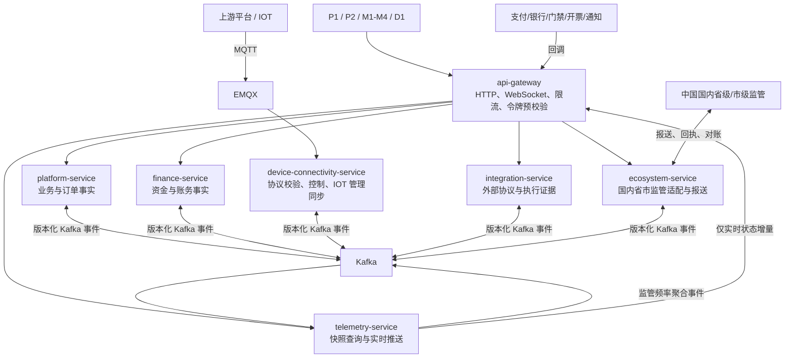
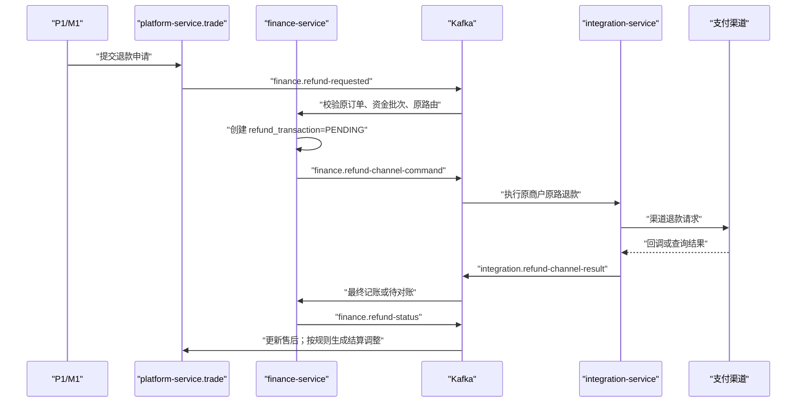
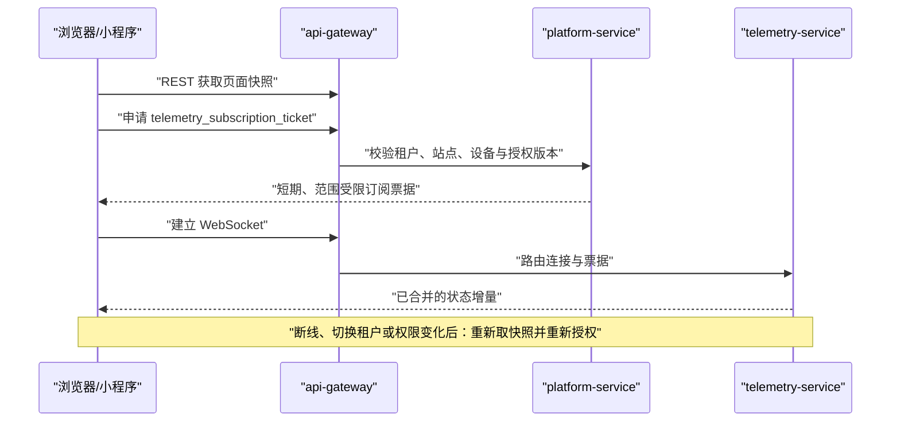

# 充电运营平台架构基线与服务边界

> 版本：v2.1
> 状态：**实施权威基线**
> 生效日期：2026-08-14
> 适用范围：现行 12 周计划的 W1–W12；8 核 32 GB 单机 Docker Compose 的**待验证起步形态**。10,000 台、RPO/RTO 不是当前能力承诺，须按《[容量与恢复验收方案](容量与恢复验收方案-v1.md)》以真实设备和目标负载/恢复演练签发。
> 上游业务事实：[需求基线 v4.1](../requirements/需求基线版本清单-v4.1.md)、[12 周实施计划 v3](../requirements/充电运营平台12周全功能交付实施计划-v3.md)。
> 本文优先级：服务边界、数据所有权、同步/异步协作和实时推送以本文为准；Kafka 的逐 Topic 合同以 [事件目录](../../contracts/events/README.md) 为准。

## 1. 先看结论

平台有 7 个 Java 部署单元。它们不是按菜单切分，而是按风险和运行特性切分：

1. `api-gateway`：唯一浏览器/小程序 HTTP 与 WebSocket 入口。
2. `platform-service`：用户、资产、订单、售后、营销、运营、V2G 等业务事实。
3. `finance-service`：所有资金与账务事实。
4. `device-connectivity-service`：唯一 MQTT/IOT 管理同步边界。
5. `integration-service`：支付、银行、门禁、开票、通知等第三方协议、回调和外部执行边界；不含监管。
6. `telemetry-service`：遥测投影、分析和实时状态推送。
7. `ecosystem-service`：国内省市监管的唯一协议适配、可靠上报和回执/对账边界；虚拟电厂及其他外部生态能力后续在本服务扩展。

**任何服务不得直接写另一服务的 schema。** 跨服务的业务结果用 Kafka 事件协作；只有用户必须立即得到的查询或授权票据可用受控同步 API。

图例：实线为 HTTP/MQTT 或持久化后的调用关系；Kafka 箭头只表示存在已登记的事件，具体发布者、消费者组和分区键必须查事件目录，不能从这张总图猜测。

## 2. 服务、数据与禁止事项

| 服务 | 唯一负责的业务事实或运行职责 | 自有数据 | 绝对禁止 |
| --- | --- | --- | --- |
| `api-gateway` | 路由、令牌预校验、限流、TraceId、WebSocket 路由 | 无领域事实 | 对象级授权、订单编排、资金决策、MQTT。 |
| `platform-service` | IAM、主数据、客户、充电交易、售后、营销、运营、V2G | `evco_iam`、`evco_master`、`evco_customer`、`evco_trade`、`evco_marketing`、`evco_operations`、`evco_v2g` | 账本写入、支付/银行协议 I/O、MQTT 长连接、分钟遥测写入。 |
| `finance-service` | 账户、分录、资金批次、冻结、支付意图、退款、结算、出款、财务对账、票据事实 | `evco_finance` | 直接调用支付渠道、接收第三方回调、修改订单状态、设备控制。 |
| `device-connectivity-service` | MQTT 验签/标准化、控制下发/回执、原始协议证据、协同模式 IOT 管理同步入口 | `evco_device_connectivity` | 写 `evco_master`、订单结算、资金事实、ClickHouse 分钟归并。 |
| `integration-service` | 支付/银行/门禁/开票/通知协议适配、回调验签、请求与回调证据、重试、渠道侧对账 | `evco_integration` | 账本、余额、退款资格判定、订单状态机、页面权限、监管适配。 |
| `telemetry-service` | Kafka 遥测消费、Redis 最后有效状态、ClickHouse 分钟归并、历史/大屏查询、WebSocket 扇出 | ClickHouse `evco_telemetry` 与受控 Redis key | 订单、资产、权限、资金事实写入。 |
| `ecosystem-service` | 国内省市监管的目标路由、字段映射、任务、报送、回执、漏推/补推和对账；后续扩展虚拟电厂/其他第三方生态连接 | `evco_ecosystem` | 订单、资产、设备、用户、账务或支付退款事实写入；直接 MQTT 设备控制；让监管拥有设备控制权。 |

所有拥有跨服务副作用的 schema 各自维护 `outbox_event` 与 `inbox_event`。同一 MySQL 物理实例只是单机资源取舍，不构成共享数据库授权。

## 3. 同步和异步的边界

| 场景 | 通道 | 原因 |
| --- | --- | --- |
| 客户端查询、提交命令、轮询支付/退款状态 | 客户端 → 网关 → 事实所有者 REST API | 用户需要立即获知“已受理”或当前状态。 |
| 对象级授权与实时订阅票据 | `platform-service` 签发短期票据 | 票据必须基于当前租户、站点、设备和授权版本。 |
| 设备遥测、订单上报、控制回执 | MQTT → 设备互联 → Kafka | 设备输入高频、可能重复/乱序，先校验和持久化证据。 |
| 冻结、结算、退款、支付回调、监管、通知 | Kafka + Outbox + Inbox | 跨服务、可重试、不可假设一次成功。 |
| 外部支付预支付参数 | `finance-service` 先持久化支付意图；`integration-service` 异步创建渠道单；客户端轮询意图状态 | 不采用 Kafka request/reply 或跨服务事务；超时不等于渠道未受理。 |

## 4. 支付、退款与对账：三种记录，不得混写

| 记录类型 | 所有者 | 允许保存 | 不允许保存或决定 |
| --- | --- | --- | --- |
| 业务资金事实 | `finance-service` | 支付意图、规范化渠道交易号/状态、退款交易、资金批次、冻结、账本、结算调整 | 原始回调正文、第三方签名细节、适配器重试状态。 |
| 外部执行证据 | `integration-service` | 渠道请求、幂等键、回调原文、验签结果、尝试次数、协议映射、外部错误 | 余额、分录、可退款额度、售后批准或订单状态。 |
| 订单与售后事实 | `platform-service.trade` | 充电订单、计费/结算快照、售后申请和审批、应生成的结算调整原因 | 支付最终成功、退款最终完成、账本分录。 |

因此，`payment_channel_transaction` 是财务侧的**规范化结果**，而 `channel_transaction_raw` 是集成侧的**原始证据**；它们以同一个业务关联 ID 追溯，不是两份可独立修改的支付事实。

退款只能按以下顺序完成：

1. `platform-service.trade` 接受并审批售后申请，发布退款请求；
2. `finance-service` 校验原订单、原支付路由、资金批次和可退款余额，创建唯一的 `refund_transaction`；
3. 现金/外部渠道退款由 `finance-service` 发布渠道命令，`integration-service` 执行原路退款；纯钱包恢复不经过支付适配器；
4. `integration-service` 验签并发布渠道结果；
5. 只有 `finance-service` 能最终记账、恢复资金批次并发布退款状态；
6. `platform-service.trade` 根据财务退款状态更新售后和订单；充电订单退款/补差产生租户结算调整，未消费充值退款绝不产生调整。

## 5. Kafka 使用规则

1. 一个 Topic 只有一个事实生产者；一个服务的多个业务模块仍使用该服务名作为生产者，但事件 `type` 必须说明模块和业务语义。
2. 消费组名使用 `evco.<consumer-domain>.<purpose>.v1`。同组多实例是分摊；不同投影、不同业务后果必须使用不同组，才能各自收到完整事件。
3. Topic 只承载大版本；`schemaVersion` 管理该大版本内的兼容演进。消息统一携带 `eventId`、`eventType`、`occurredAt`、`aggregateId`、`partitionKey`、`traceId`、`schemaVersion` 和业务幂等键。
4. 生产者在本地业务事务中写事实与 Outbox。Kafka 确认后才标记已发布；崩溃导致的重复投递由消费者 Inbox 和业务唯一键吸收。
5. 消费者先在本地事务写 Inbox 与自己的业务事实，再提交 offset。连续业务失败才进入生产领域的 DLQ；Outbox 发布失败持续重试和告警，不能把未发布事件当作 DLQ 成功处理。
6. Kafka 仅是短期可靠缓冲与重放窗口，不是账务、遥测或证据的灾备副本。

完整 Topic、发布消息、消费者组、分区键和 DLQ 责任见 [Kafka 事件目录](../../contracts/events/README.md)。

## 6. WebSocket 只服务于实时展示

WebSocket 不承载支付、退款、余额、订单结算、权限修改或控制命令。它只推送 `telemetry-service` 已完成裁决的设备/枪口状态和站点聚合；普通订单和资金状态由 REST 查询。

## 7. 实施前必须冻结的资料

W1 的架构门禁不是“服务目录已创建”，而是以下资料均可由开发、测试和运维读懂并执行：

- 本文的服务与数据所有权；
- Kafka 事件目录和每个 Topic 的 AsyncAPI/JSON Schema；
- MQTT Topic、报文 Schema、签名与回执规则；
- 支付、退款、结算、设备控制、IOT 同步和 WebSocket 的时序图；
- Outbox/Inbox、幂等、重试、DLQ、人工处置和对账验收用例；
- 每个服务的 README、健康检查、告警和 Runbook 入口。

任何新增 Topic、消费者组、跨服务同步调用或服务职责变化，都必须先更新本文和事件目录，并按执行台账的变更流程记录。

## 8. 已确认但延后的外部能源协同场景

国内省市监管是现行第七服务 `ecosystem-service` 的 W10 **内部就绪**内容：其实际 Topic、消费者组、Outbox/Inbox 和可靠上报合同以[事件目录](../../contracts/events/README.md)为准；真实目标接入另以 C3-R 生产 Go。虚拟电厂和其他第三方的授权数据共享、站点功率/计划调控则属于已确认的**W12 后扩展能力**；它们复用 `ecosystem-service`，但不改变当前监管边界或 Topic。服务边界、控制优先级、SOC/设备能力/订单约束、P1 配置和启动门禁见《[监管与外部生态能源协同方案](监管与外部生态能源协同方案-v1.md)。

在外部能源协同扩展获得单独排期和契约批准前，第三方不得直连设备、Kafka 或数据库，也不得向 `device-connectivity-service` 发送 MQTT 控制报文。
