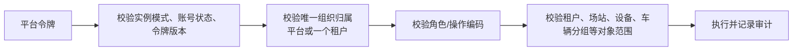
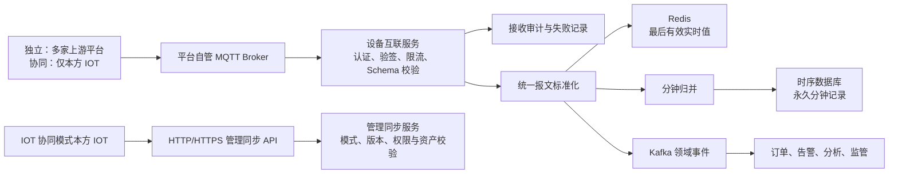
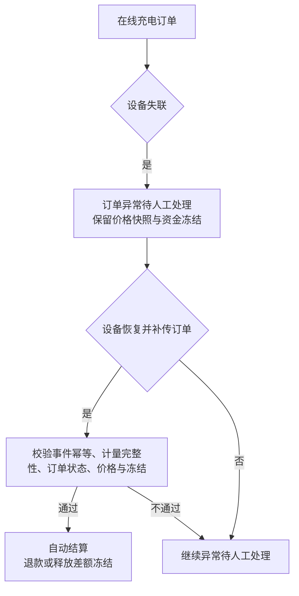

# 双模式独立部署与 IOT 协同架构决策

> 版本：v1.3（已确认决策；对齐万台单机收敛）  
> 状态：待将相关需求基线同步确认  
> 依据：用户确认的部署、权限、设备接入、遥测、离线订单和数据保留规则。  
> 关联：[万台单机架构收敛与高可用演进决策](万台单机架构收敛与高可用演进决策-v1.md)、[总体技术架构与实施蓝图](充电运营平台总体技术架构与实施蓝图-v1.md)、[菜单架构 v4.1](../requirements/充电运营平台菜单架构-v4.1.md)、[业务规则基线 v4.1](../requirements/充电运营平台业务规则基线-v4.1.md)。

## 1. 已确认的架构决策

| 编号 | 决策 |
|---|---|
| ADR-DUAL-01 | 平台支持实例级 `independent`（独立）与 `iot-collaborative`（IOT 协同）两种模式。安装初始化后模式永久锁定，不支持迁移、切换或按租户混用。 |
| ADR-DUAL-02 | 平台始终本地校验密码、签发并校验自己的短期访问令牌。IOT 协同模式中，IOT 仅通过管理同步协议供应账号、状态和不可逆密码校验凭据；平台 API 不直接信任 IOT 令牌，也不实时调用 IOT 校验密码。 |
| ADR-DUAL-03 | 独立模式中，平台本地维护平台管理员、租户、租户成员、页面/操作权限、场站、设备和接入配置；外部协议仅接收遥测、遥信、告警、命令/回执，不接收资产主数据。IOT 协同模式中，IOT 推送平台管理员、租户及其成员/角色/权限、场站和设备资产，平台不允许配置这些对象。 |
| ADR-DUAL-04 | 企业充电客户的成员、角色和页面权限始终由平台本地配置，不受部署模式影响。两种模式均由初始化脚本创建同一套权限目录、菜单/操作编码和标准角色模板。 |
| ADR-DUAL-05 | 字段级来源优先级仅在本模式允许的来源范围内生效：独立模式的资产主数据固定以平台为准，外部来源只可提供运行数据；IOT 协同模式的资产主数据固定以 IOT 为准，且不允许其他厂商设备接入。来源、原始值、有效值、优先级版本和审计必须可查。 |
| ADR-DUAL-06 | 设备迁站等同于新设备入新场站：旧设备停止/归档，新建设备记录从迁移时刻起计算，不继承旧设备订单、遥测、告警或工单历史。无业务记录的设备可物理删除；存在任一订单、遥测、告警或控制记录后只能停用/归档。 |
| ADR-DUAL-07 | 外部平台不得直写数据库。两种模式下，所有设备级运行数据、订单上报、控制回执和平台下行设备控制只允许通过平台自管 Broker 上的统一 MQTT 互联协议；独立模式可接入多家符合协议的上游平台，IOT 协同模式只允许本方 IOT。HTTP/HTTPS 仅在 IOT 协同模式承载管理、权限和资产同步，绝不承载设备数据或控制。 |
| ADR-DUAL-08 | Redis 只保存设备/枪口最后有效实时状态。永久保留设备/枪口的分钟级最后有效遥测；已认证且已登记设备的原始遥测/遥信/告警以压缩加密对象默认保留 90 天（可按合同调整），订单上报和 IOT 管理同步原文长期保留，控制请求/回执及其审计永久保留。未知设备或未认证输入不保存 payload，只留最小拒绝审计。 |
| ADR-DUAL-09 | 平台不支持离线启动。充电中设备失联，订单转“异常待人工处理”；设备恢复且补传订单后，经幂等、完整性、计费和冻结校验，自动结算、退款或释放冻结。 |
| ADR-DUAL-10 | 同一实例的租户之间实施默认拒绝的强隔离。一个后台用户只能归属平台或一个租户，不能跨租户，也不能同时拥有平台与租户身份。 |
| ADR-DUAL-11 | 当前私有化交付验收 10,000 台以内设备、8 核 32 GB 普通 Linux 虚拟机/物理机的单机运行包；当前采用网关、平台、资金、设备互联、第三方适配、遥测共 6 个 Java 部署单元。Kubernetes/多节点仅作为未来演进预留，不是一期运行时或验收要求。两种形态未来复用同一镜像、配置模型、数据库迁移与运维标准。 |
| ADR-DUAL-12 | `deployment_mode` 是数据库唯一事实、网关和服务端强制执行的模式开关，不是前端显示配置：只可在初始化阶段写入；每个服务启动读取为不可变值并在健康端点暴露摘要，由巡检比对。独立模式拒绝外部资产/管理同步；IOT 协同模式拒绝非本方 IOT 的设备接入及平台侧平台/租户/资产配置写请求。所有拒绝均记录审计。 |

## 2. 两种运行模式

| 能力 | 独立模式 | IOT 协同模式 |
|---|---|---|
| 身份与令牌 | 平台本地身份库认证、校验密码、签发令牌 | IOT 推送账号、状态和不可逆密码校验凭据；平台本地校验密码并签发令牌 |
| 平台/租户/用户/角色 | 平台可创建、编辑、停用 | IOT 通过统一管理数据报文推送，平台保存本地投影并只读展示 |
| 企业充电客户成员、角色、页面权限 | 平台本地配置 | 平台本地配置（固定例外） |
| 场站、设备与接入源 | 平台管理资产、接入源、映射及其生命周期；外部不得推送资产 | IOT 推送资产与范围；不允许其他厂商设备接入或平台编辑资产 |
| 设备遥测与命令 | 外部适配器仅转换运行数据和控制回执 | 仅本方 IOT 转换并推送管理/资产/运行数据 |
| 权限目录与 API | 相同编码、相同服务端授权规则 | 相同编码、相同服务端授权规则 |
| 反向同步 | 不适用 | 不向 IOT 回推身份、租户、权限或资产管理数据 |

模式在安装初始化时写入不可修改的 `deployment_mode`。如需另一种模式，必须新建平台实例并进行独立的数据迁移项目；同一实例内不提供模式迁移能力。

## 3. 权限与初始化

### 3.1 初始权限目录

安装脚本创建权限目录、菜单权限、操作权限、数据范围类型、标准角色模板和平台超级管理员。首次登录强制修改初始密码，并要求接入 MFA；初始凭据只能通过部署期密钥注入或一次性控制台读取，不写入仓库或日志。

标准角色模板至少包括：平台超级管理员、租户管理、场站资产运营、设备接入管理、充电交易运营、企业运营、营销运营、客服售后、财务结算、运维值班、监管专员和审计只读。角色是权限模板而非数据越权通道；用户必须先通过平台/租户归属和站点范围校验。

### 3.2 IOT 账号凭据同步

IOT 协同模式的账号供应报文至少包含 IOT 用户唯一标识、平台账号、账号状态、不可逆密码校验凭据、凭据算法和参数版本、凭据版本、创建/重置时间、角色/数据范围版本、事件 ID 与签名。IOT 只能推送 Argon2id、bcrypt 或经平台批准的不可逆校验凭据；不得推送明文、可逆加密密码、固定盐或可被平台解密的密钥材料。

平台以 mTLS/签名验证同步来源后，只保存凭据及其版本；用户提交密码时由平台本地比较并签发令牌。密码重置、停用和凭据版本变化必须使旧会话立即失效。IOT 无权获取平台已保存的密码校验结果、会话或令牌。

### 3.3 IOT 管理数据同步协议

IOT 协同模式的 HTTP/HTTPS 管理同步协议仅包括平台管理员/角色/权限、租户及租户成员、场站/设备/枪口资产等管理报文；设备运行数据、订单上报和控制回执不属于该 API，统一由 MQTT 互联协议承载。企业充电客户成员、角色和页面权限不在 IOT 覆盖范围内，平台接收此类对象的 IOT 写入请求时必须拒绝并审计。

每一类管理报文均至少包含：`eventId`、`sourceSystem`、`schemaVersion`、`entityType`、`operation`（新增/更新/停用/删除）、`externalId`、`entityVersion`、`sequenceNo`、`occurredAt`、`tenantScope`、事件签名和追踪 ID。平台按来源实体版本和事件 ID 幂等处理，乱序报文进入待重放队列；定期由 IOT 下发全量快照及水位线，平台对比本地投影后生成差异、补拉和告警。删除事件必须显式发送，禁止以“本次全量中未出现”直接物理删除已有资产或账号。

### 3.4 服务端授权顺序

前端只按权限目录决定入口显示；网关和每个领域服务均执行上述校验。付款、退款、余额调整、价格发布、监管补推、设备控制、策略发布和 V2G 提现还需二次确认、职责分离或审批策略。

## 4. 资产、来源与字段合并

### 4.1 资产记录与迁移

平台资产表使用内部主键，但该主键只代表“本次资产生命周期”，不是跨迁站永恒不变的设备身份。每个来源维护 `source_type + external_id` 映射；同一来源内唯一。迁站必须：关闭旧资产有效期 → 归档旧资产及其关系 → 创建新资产和新的生命周期 ID → 建立仅用于审计的迁移关联。旧资产的历史记录不展示为新资产历史。

### 4.2 字段优先级

平台管理员维护版本化全局规则。独立模式中资产字段固定优先平台，运行数据可按设备接入来源确定优先级；IOT 协同模式中资产字段固定优先 IOT。每次写入保留：对象、字段、来源、原值、来源时间、接收时间、规则版本、是否成为有效值和拒绝/覆盖原因。

默认合并规则如下：同一字段先按全局来源优先级取值；优先来源未提供该字段时才使用次级来源；优先来源数据陈旧时显示“数据陈旧”和来源健康状态，不自动以较低优先级伪造新鲜值。修改优先级发布后只影响后续有效值投影，历史来源记录不重写。

## 5. 统一设备数据与控制协议

### 5.1 接入链路

设备数据与控制协议只由 MQTT 承载，HTTP/HTTPS API 不得接收设备遥测、订单上报或控制回执。MQTT 以 TLS、上游平台凭据/证书、Topic ACL 和 QoS 1 接入；其统一报文至少包括：报文 ID、报文类型、协议版本、来源、固定设备编号/枪口标识、事件时间、接收时间、数据点、值/单位、质量标记、序列号、签名/认证信息和追踪 ID。平台只允许资产库中已存在的设备编号接入，未知编号直接拒绝。命令还包括命令 ID、幂等键、操作者、授权快照、有效期、目标、请求原文、回执原文和最终状态；平台根据自身配置的设备资源标识确定下行目标。MQTT retained message 不得用于启停等控制命令。HTTP/HTTPS API 仅在 IOT 协同模式承载 IOT 的管理、权限和资产同步；HTTP 必须使用 HMAC、时间戳、nonce、幂等键和网络白名单，公网必须使用 HTTPS。

### 5.2 分钟数据与实时状态

- 每个设备/枪口 × 功能点 × 分钟只保留一条分钟记录，取该分钟内**最后有效值**；质量标记、来源和最后有效采样时间随记录保存。
- Redis 保存同一维度最新有效实时值及来源时间，不是权威历史库；重启、缓存丢失或主从切换后从时序数据库和最新事件重建。
- 控制请求、控制回执、策略执行和人工操作的审计数据永久保存；无法解析或验签失败的原始输入保留可配置审计期并隔离访问。

## 6. 离线与订单恢复状态机

平台不允许离线启动。补传不得覆盖原订单事件或重复扣款；校验失败、订单矛盾、计量不足、重复报文和资金状态不一致都进入人工队列并保留全部尝试记录。

## 7. 私有化部署基线

| 场景 | 推荐方式 |
|---|---|
| Kubernetes | Helm/Kustomize + GitOps；Ingress、HPA、PDB、NetworkPolicy、External Secrets。 |
| 单机/普通 VM | Docker Compose 或 systemd 服务包；Nginx 反向代理；维护窗口部署脚本执行健康检查、备份、前向兼容数据库迁移和代码回退。Flyway 已执行的 schema 不承诺自动回滚。 |
| VM 高可用 | 至少两台应用节点 + 负载均衡/VIP；MySQL 高可用或主从受控切换；Redis/Kafka/时序库按实际 SLA 扩展。 |
| 所有环境 | 同一 OCI 镜像、同一配置 schema、同一迁移脚本、同一监控/日志字段；仅参数和基础设施实现不同。 |

## 8. 强制验收场景

1. 独立模式可离开 IOT 完成初始化、建租户、配用户/角色、配置场站/设备接入、接收遥测、控制设备和生成订单；外部提交资产主数据必须被拒绝。
2. 协同模式中仅本方 IOT 可推送平台用户、租户、权限、资产和运行数据并形成只读投影；平台本地校验 IOT 同步的不可逆凭据后签发令牌，平台不向 IOT 回写。
3. 两来源同字段冲突时，仅在当前模式允许的运行数据来源中按已发布全局优先级生成有效值且可审计；资产主数据不允许跨来源合并。
4. 设备迁站生成新设备生命周期，旧设备历史不合并；有历史设备无法物理删除。
5. 外部直写数据库被拒绝；API/MQ/文件接入均经过认证、校验、审计和幂等处理。
6. Redis 仅展示实时最后有效值；分钟遥测永久可查，分钟值始终为最后有效值。
7. 离线启动被拒绝；充电中离线进入异常，补传经校验后才自动结算或释放冻结。
8. 企业充电客户成员、角色和页面权限在两种模式下均可由平台本地配置；IOT 不得覆盖这一例外。租户之间的 API、消息、缓存、对象文件、检索与设备控制均不可越权；同一后台用户不能跨租户或同时拥有平台/租户身份。
