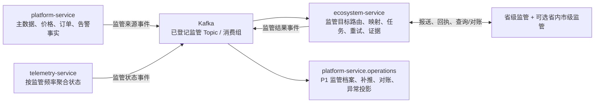
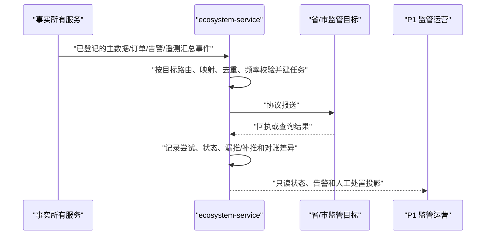

# 监管与外部生态能源协同方案

> 版本：v1.2
> 状态：**国内省市监管为现行 W10 监管内部就绪；真实目标接入为 C3-R 生产 Go；虚拟电厂及其他外部平台能力为 W12 后独立扩展。**
> 决策记录：`DEC-20260814-010`（覆盖 `DEC-20260814-009`）。
> 地域范围：中国大陆；一个站点最多关联一个省级监管目标，并可关联该省内市级目标；不建设跨境/海外监管能力。

## 1. 明确边界

`ecosystem-service` 是现行第七个服务，并在 W10 达到中国国内省市监管**内部就绪**。真实目标接入必须逐目标通过 C3-R 生产 Go。它有两条隔离线路：

1. **现行监管线**：省市目标路由、协议适配、字段映射、可靠上报、回执、漏推/补推、对账和证据；没有任何设备控制权。
2. **后续外部生态线**：虚拟电厂和其他第三方的授权数据共享、MQTT/HTTP 等协议接入、控制意图、站点功率计划和设备调控；此线必须等 W12 后另行排期和验收。

`integration-service` 只保留支付、银行、门禁/道闸、开票和通知等交易/运营渠道适配。`ecosystem-service` 不拥有订单、资产、设备主数据、用户、账务或支付退款事实，也不得直接连设备。

## 2. 当前监管架构与线路



| 当前责任 | 服务 | 不允许 |
| --- | --- | --- |
| 监管任务及外部执行证据 | `ecosystem-service` / `evco_ecosystem` | 写业务主库或控制设备。 |
| 监管来源事实与 P1 对象授权 | `platform-service` | 保存监管协议原文、回执尝试或控制设备。 |
| 监管频率状态聚合 | `telemetry-service` | 向监管发送原始遥测。 |
| 实际设备 MQTT 下发 | `device-connectivity-service` | 接受监管或第三方直连控制。 |

同一站点按“一个省级目标 + 可选省内市级目标”配置。每个目标独立维护协议版本、字段映射、认证、频率、任务和回执，不把各省市协议伪装成通用 MQTT 控制协议。国内公开资料也普遍体现“测试联调/白名单或认证/生产接入/日常推送”的独立对接方式：

- [江苏省接入说明](https://www.js.gov.cn/art/2024/12/27/art_90838_6618.html)
- [贵州省 T/CEC 102 接入流程](https://nyj.guizhou.gov.cn/zwgk/xxgkml/zcwj_2/jnwj/ptwj_2/202207/t20220701_75360941.html)
- [上海市监管接入数据示例](https://fgw.sh.gov.cn/cmsres/52/521abc1539c9473d82477e977cf6216a/a0b6a759a98b513409bee7e29e805547.pdf)

## 3. W10 监管内部就绪的可靠上报规则



- 每条上报独立成任务；同一业务事件按目标、映射版本和业务版本保证幂等。
- 上报失败不回写订单、资产、金额或账务事实，也不阻塞充电和支付；失败进入重试、DLQ 和 P1 人工处置。
- 补推只新增尝试/关联补推任务，绝不覆盖历史失败、回执或原因。
- 监管连接器没有设备控制权，不向 MQTT 下发任何控制报文。

## 4. W12 后外部生态与能源调控扩展

虚拟电厂等外部平台后续复用 `ecosystem-service`，但在单独批准前不创建外部协议入口、Topic、消费者组、P1 页面或调控代码。

```text
外部控制意图 → 验签/幂等/授权 → 资源投影是否新鲜
→ 安全与订单约束 → 可调能力/SOC/启动顺序分配
→ 计划版本 → 已裁决设备命令 → 设备回执与实际功率偏差 → 对外结果
```

- 仅 `device-connectivity-service` 执行设备协议和 MQTT 下发；外部平台不能直连设备、Kafka 或数据库。
- 同一 `partnerId + externalRequestId` 内容相同返回原状态、内容不同拒绝；站点计划按站点 ID 排序并采用版本、生效时间和过期时间。
- 优先级固定为：设备安全保护/紧急停机 > 充电会话必要停止与安全约束 > 平台人工紧急操作 > 平台自动策略 > 虚拟电厂调度 > 普通预约/计划任务。
- 订单电量以设备计量为准，金额以平台价格快照计算；外部上报金额只用于对账，更高修订只能产生调整，不能改写锁定账单或财务流水。

## 5. 数据、配置与启动门禁

`ecosystem-service` 独占 `evco_ecosystem`：当前监管使用连接器配置/密钥引用、监管目标、映射版本、任务、尝试、回执、对账和死信；后续外部生态才增加数据订阅、可调资源投影、控制意图、站点计划、设备分配和执行回执。

W10 的 P1 监管页面包括监管业务档案、报送与补推、监管对账与异常，以及 D1 监管专题。凭据只显示引用和校验状态。外部生态后续页面另行批准，至少包括外部平台档案、资源授权、数据订阅、可调资源策略和调控中心。

后续外部生态启动前，必须另行确认排期、资源、协议、网络隔离、数据最小化、AsyncAPI/Schema、Outbox/Inbox、幂等、DLQ、控制安全、仿真和设备实测；不得影响现行监管交付。

## 6. 修订记录

| 时间 | 版本 | 原因 | 替代内容 |
| --- | --- | --- | --- |
| 2026-08-14 | v1.0 | 用户确认虚拟电厂及其他第三方数据/调控为 W12 后独立场景，监管维持 W10。 | 新建。 |
| 2026-08-14 | v1.1 | 曾将 W10 国内省市监管迁入 W12 后 `ecosystem-service`。 | 已被 v1.2 覆盖。 |
| 2026-08-14 | v1.2 | 用户澄清：监管必须开发，外部平台能力才后置；监管纳入现行 `ecosystem-service`。 | 新增当前监管 Kafka/上报线路；外部能源调控保留为 W12 后扩展。 |
