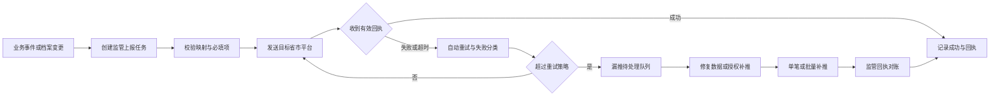

# 省市监管接入与可靠上报设计 v1

**状态**：W10 监管**内部就绪**的业务与适配实施参考；真实目标接入另以 C3-R 生产 Go 验收；事件消费关系以 [Kafka 事件目录](../../contracts/events/README.md) 为准。
**适用范围**：不同省级、市级充电监管平台的档案、状态、订单、安全等数据接入。
**状态与边界**：本文件定义现行 W10 国内省市监管的业务能力和后端适配要求；不在运营平台提供 IOT API、设备协议或 IOT 鉴权的配置页面。监管适配由现行 `ecosystem-service` 负责，业务事实仍属于相应领域服务；虚拟电厂及其他第三方数据/调控与监管共用该服务但走隔离线路，且仅后者属于 W12 后扩展，见[监管与外部生态能源协同方案](../design/监管与外部生态能源协同方案-v1.md)。

## 1. 设计目标

1. 支持多个运营商同时接入多个省市监管平台，并行使用不同协议版本、环境和字段字典。
2. 运营商身份、对端环境、密钥材料、开通功能、字段映射、运行策略均版本化管理。
3. 保证档案、状态、订单等监管报文可查询、可追踪、可自动重试、可人工补推、可与监管回执对账。
4. 监管推送失败不阻塞正常充电、支付或订单结算，但必须形成可处置的合规风险事件。

## 2. 参数与安全边界

省级平台入网资料显示，各地通常需要运营商标识、认证/加密/签名材料、测试与生产地址及已开通功能。真实密钥、初始化向量、证书和地址不得提交到仓库；仅在受控密钥库和部署环境中保存。

| 监管档案字段 | 说明 |
|---|---|
| 运营商身份 | 运营商名称、组织/运营商标识、省市、资质状态、生效期 |
| 对端平台 | 省市、平台名称、协议版本、测试/生产环境、负责人和启停状态 |
| 密钥引用 | 认证、加密、签名等密钥的密钥库引用、版本、脱敏指纹、轮换日期和状态 |
| 开通能力 | 档案查询/上报、状态推送、订单推送、安全数据等实际开通项；监管目标不配置设备控制权 |
| 映射版本 | 接口/Schema 版本、字段/枚举映射、必填规则、幂等键、批量大小和顺序规则 |
| 运行策略 | 超时、自动重试、补推窗口、人工补推权限、告警阈值、保存期限和对账周期 |

## 3. 监管数据范围

| 数据类别 | 典型业务事件 | 可靠性要求 |
|---|---|---|
| 运营商与场站档案 | 新增、变更、停运、撤销 | 必须保留档案版本与目标平台确认记录 |
| 设备与枪档案 | 新增、变更、停用 | 设备数据由 IOT 同步，监管适配读取运营平台审定的映射数据 |
| 价格信息 | 价格生效、变更、失效 | 记录价格模板版本、生效期与对应场站 |
| 运行状态与功率 | 状态变化、功率/安全遥测 | 按省市频率聚合、限流和保留最后成功时间 |
| 充电订单与明细 | 创建、启动、进行、结束、补单、退款 | 每笔业务事件独立状态，按接口幂等与顺序规则处理 |
| V2G 等扩展订单 | 放电、收益、结算 | 仅在目标省市协议、设备与业务范围确认后启用 |
| 安全与告警 | 告警触发、恢复、处置结果 | 记录原始事件、映射结果、回执和失败原因 |

## 4. 上报任务模型

每一条监管上报应独立形成任务，不依赖“查看一次日志”来判断是否已上报。

监管任务由 `ecosystem-service` 消费已登记的主数据、价格、订单、告警、遥测汇总和 V2G 事件后创建；它不直接读写交易、资产或财务 schema。任务结果通过 `evco.ecosystem.regulatory-result.v1` 回传运营可见投影，失败不回写原业务事实。

| 字段 | 说明 |
|---|---|
| 任务 ID | 平台全局唯一；用于审计、重试和补推 |
| 业务主键 | 场站、设备、枪、订单、价格版本或告警等业务对象 ID |
| 目标 | 运营商、省市监管平台、环境、接口名称、协议/映射版本 |
| 幂等与顺序 | 幂等键、业务版本、订单事件序号、批次号和关联原任务 |
| 生命周期 | 待校验、待发送、发送中、成功、可重试失败、待人工处理、已补推、已作废 |
| 运行记录 | 创建时间、尝试次数、最后发送时间、最后错误、HTTP/业务回执、回执时间 |
| 审计信息 | 触发来源、操作人、补推理由、审批记录、报文脱敏快照 |

## 5. 漏推与补推流程

### 5.1 漏推识别

- 定时扫描“应上报业务事件”与“成功上报任务”，识别未创建任务、长期待发送、超过阈值失败和回执缺失。
- 订单按创建、开始、结束、补单、退款等应有事件序列检查，不能仅检查订单是否存在一条成功日志。
- 档案按业务版本和目标监管平台检查；变更后未上报、版本不一致或回执不一致均为差异。
- 支持接入监管侧查询结果、回执文件或账单形成双向对账差异。

### 5.2 补推规则

1. 自动重试只针对确定可重试的网络、超时、服务端临时错误；字段校验、签名、映射和业务状态错误进入待人工处理。
2. 人工补推前必须校验当前业务状态、目标接口版本、幂等键、顺序、重复上报风险和操作者权限。
3. 补推只能创建新的尝试记录或关联补推任务，不得覆盖原失败任务、原回执和失败原因。
4. 单笔补推适合异常订单；批量补推须限制时间窗、目标省市、业务类型和最大数量，并保留审批和执行结果。
5. 补推成功后需要再次与目标平台回执或查询结果对账，不能仅以本方“发送成功”作为结论。

## 6. 运营管理平台菜单与权限

运营管理平台仅展示监管业务配置和上报运营能力，不展示 IOT API 配置。

| 菜单 | 能力 |
|---|---|
| 监管合规 - 运营商监管档案 | 运营商身份、资质、省市适用范围和状态 |
| 监管合规 - 省市平台档案 | 目标平台、协议版本、环境、开通能力、密钥引用与运行状态 |
| 监管合规 - 映射与校验规则 | 字段/枚举映射版本、必填校验、批量/顺序/幂等规则 |
| 监管合规 - 上报任务中心 | 任务查询、状态、回执、失败分类、最后成功时间和导出 |
| 监管合规 - 漏推与补推 | 漏推队列、数据修复、单笔/批量补推、审批与审计 |
| 监管合规 - 监管对账 | 监管侧回执/查询对账、差异下钻、关闭记录 |

权限的最终决策点是 `platform-service.iam`：独立部署与 IOT 协同部署均以平台角色、数据范围和授权版本强制过滤。IOT 协同模式可提供经验证的运营商范围事实，但不能替代平台授权、扩大权限或作为唯一权限来源。补推、密钥引用变更和映射发布属于高风险操作，需二次确认和审计。

## 7. 验收标准

1. 同一运营商可同时配置多个省市监管目标，不同目标的协议、环境、映射和密钥引用相互隔离。
2. 运营商身份、环境、密钥引用、开通能力和映射版本均可追溯；页面永不显示真实密钥内容。
3. 档案、状态、订单、退款等至少覆盖成功、可重试失败、不可重试失败、回执缺失和人工补推场景。
4. 同一业务事件重复发送不会在目标平台产生重复业务结果，或能通过对端协议的幂等机制识别。
5. 任意补推均可追溯到原任务、原失败原因、补推人员、理由、时间、报文版本和最终回执。
6. 监管失败不会阻断用户正常充电和支付，但会在漏推队列和告警中可见。
7. 本文件的模拟闭环只能标记为“监管内部就绪”；生产 Go 前必须为部署实际要求的每个目标完成 C3-R：白名单/网络、生产凭据、真实档案/状态/订单报送、有效回执及双向对账 E2E。
