# 七应用菜单目录架构图

> 版本：v4.1（与《充电运营平台菜单架构-v4.1.md》名称一致）  
> 呈现规则：Mermaid 源码采用横向分层；实线只表示菜单隶属关系；三级节点中的 `Tab：` 不构成独立菜单。
>
> 数据源：以《充电运营平台菜单架构-v4.1.md》为唯一菜单源；本图及交互预览为其派生展示。
>
> 交互预览：请打开同目录的 [`七应用菜单目录架构图-v4.1.html`](七应用菜单目录架构图-v4.1.html)。可切换应用、滚轮缩放、拖拽平移、单击任意菜单聚焦其分支；Markdown 中的 Mermaid 保留为正式、可评审的图表源。

## 1. P1 运营管理平台：一级菜单索引

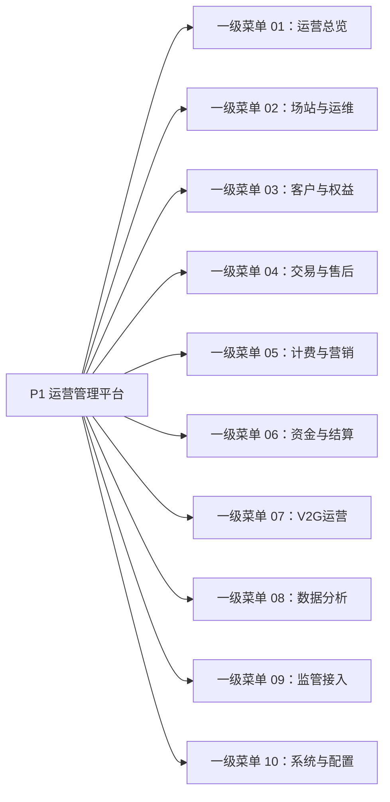
```mermaid
flowchart LR
    P1["P1 运营管理平台"]
    P1 --> A["一级菜单 01：运营总览"]
    P1 --> B["一级菜单 02：场站与运维"]
    P1 --> C["一级菜单 03：客户与权益"]
    P1 --> D["一级菜单 04：交易与售后"]
    P1 --> E["一级菜单 05：计费与营销"]
    P1 --> F["一级菜单 06：资金与结算"]
    P1 --> G["一级菜单 07：V2G运营"]
    P1 --> H["一级菜单 08：数据分析"]
    P1 --> I["一级菜单 09：监管接入"]
    P1 --> J["一级菜单 10：系统与配置"]
```

## 2. P1 → 运营总览

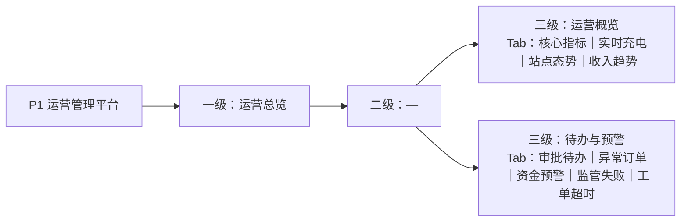
```mermaid
flowchart LR
    P1["P1 运营管理平台"] --> A["一级：运营总览"]
    A --> A1["二级：—"]
    A1 --> A11["三级：运营概览\nTab：核心指标｜实时充电｜站点态势｜收入趋势"]
    A1 --> A12["三级：待办与预警\nTab：审批待办｜异常订单｜资金预警｜监管失败｜工单超时"]
```

## 3. P1 → 场站与运维

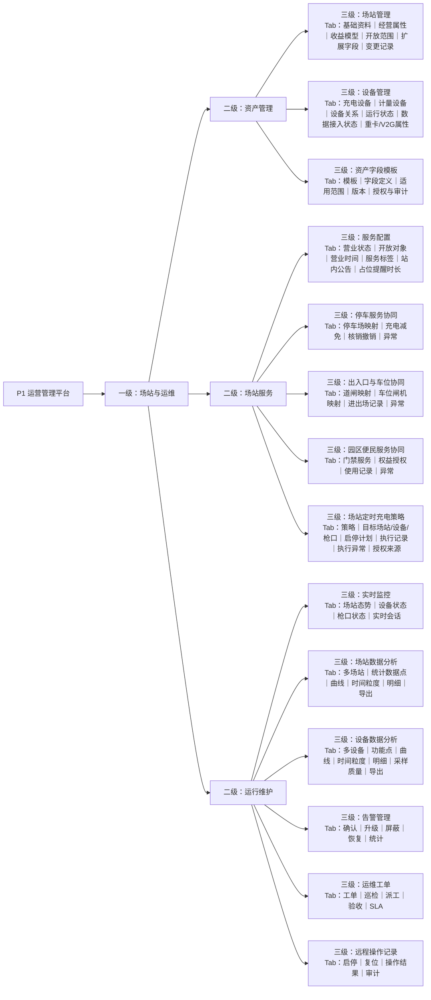
```mermaid
flowchart LR
    P1["P1 运营管理平台"] --> A["一级：场站与运维"]
    A --> A1["二级：资产管理"]
    A1 --> A11["三级：场站管理\nTab：基础资料｜经营属性｜收益模型｜开放范围｜扩展字段｜变更记录"]
    A1 --> A12["三级：设备管理\nTab：充电设备｜计量设备｜设备关系｜运行状态｜数据接入状态｜重卡/V2G属性"]
    A1 --> A13["三级：资产字段模板\nTab：模板｜字段定义｜适用范围｜版本｜授权与审计"]
    A --> A2["二级：场站服务"]
    A2 --> A21["三级：服务配置\nTab：营业状态｜开放对象｜营业时间｜服务标签｜站内公告｜占位提醒时长"]
    A2 --> A22["三级：停车服务协同\nTab：停车场映射｜充电减免｜核销撤销｜异常"]
    A2 --> A23["三级：出入口与车位协同\nTab：道闸映射｜车位闸机映射｜进出场记录｜异常"]
    A2 --> A24["三级：园区便民服务协同\nTab：门禁服务｜权益授权｜使用记录｜异常"]
    A2 --> A25["三级：场站定时充电策略\nTab：策略｜目标场站/设备/枪口｜启停计划｜执行记录｜执行异常｜授权来源"]
    A --> A3["二级：运行维护"]
    A3 --> A31["三级：实时监控\nTab：场站态势｜设备状态｜枪口状态｜实时会话"]
    A3 --> A32["三级：场站数据分析\nTab：多场站｜统计数据点｜曲线｜时间粒度｜明细｜导出"]
    A3 --> A33["三级：设备数据分析\nTab：多设备｜功能点｜曲线｜时间粒度｜明细｜采样质量｜导出"]
    A3 --> A34["三级：告警管理\nTab：确认｜升级｜屏蔽｜恢复｜统计"]
    A3 --> A35["三级：运维工单\nTab：工单｜巡检｜派工｜验收｜SLA"]
    A3 --> A36["三级：远程操作记录\nTab：启停｜复位｜操作结果｜审计"]
```

## 4. P1 → 客户与权益

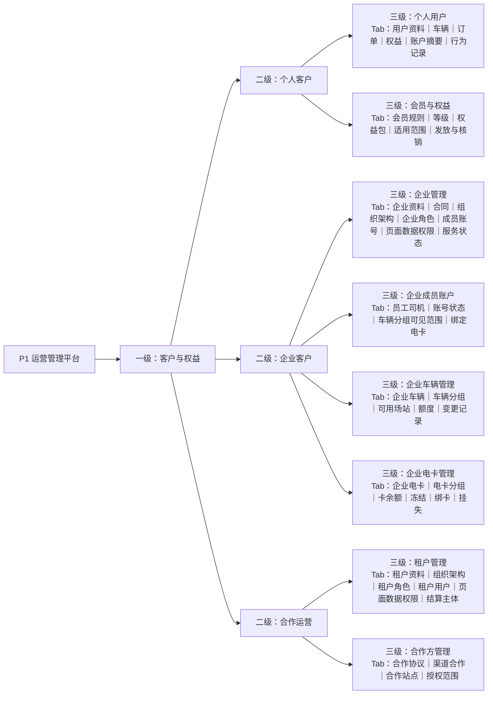
```mermaid
flowchart LR
    P1["P1 运营管理平台"] --> A["一级：客户与权益"]
    A --> A1["二级：个人客户"]
    A1 --> A11["三级：个人用户\nTab：用户资料｜车辆｜订单｜权益｜账户摘要｜行为记录"]
    A1 --> A12["三级：会员与权益\nTab：会员规则｜等级｜权益包｜适用范围｜发放与核销"]
    A --> A2["二级：企业客户"]
    A2 --> A21["三级：企业管理\nTab：企业资料｜合同｜组织架构｜企业角色｜成员账号｜页面数据权限｜服务状态"]
    A2 --> A22["三级：企业成员账户\nTab：员工司机｜账号状态｜车辆分组可见范围｜绑定电卡"]
    A2 --> A23["三级：企业车辆管理\nTab：企业车辆｜车辆分组｜可用场站｜额度｜变更记录"]
    A2 --> A24["三级：企业电卡管理\nTab：企业电卡｜电卡分组｜卡余额｜冻结｜绑卡｜挂失"]
    A --> A3["二级：合作运营"]
    A3 --> A31["三级：租户管理\nTab：租户资料｜组织架构｜租户角色｜租户用户｜页面数据权限｜结算主体"]
    A3 --> A32["三级：合作方管理\nTab：合作协议｜渠道合作｜合作站点｜授权范围"]
```

## 5. P1 → 交易与售后

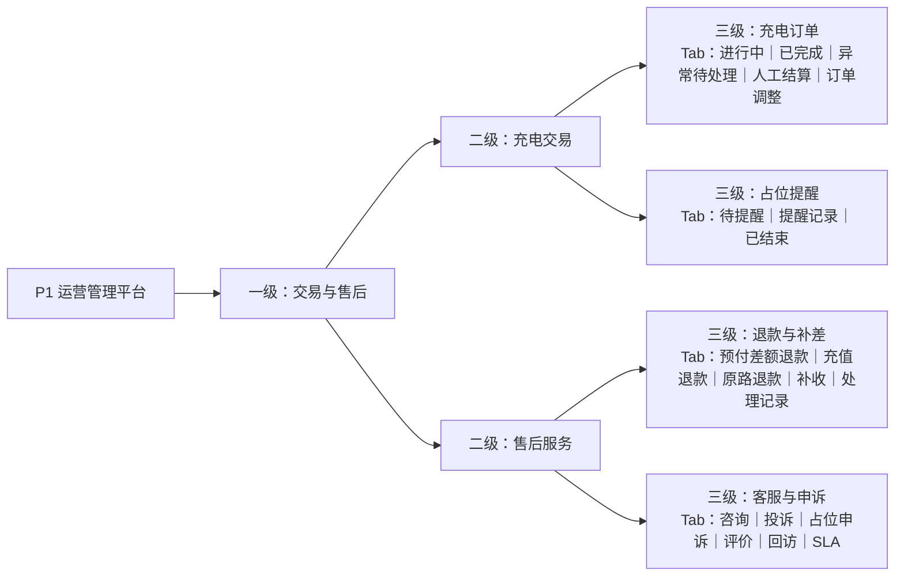
```mermaid
flowchart LR
    P1["P1 运营管理平台"] --> A["一级：交易与售后"]
    A --> A1["二级：充电交易"]
    A1 --> A11["三级：充电订单\nTab：进行中｜已完成｜异常待处理｜人工结算｜订单调整"]
    A1 --> A12["三级：占位提醒\nTab：待提醒｜提醒记录｜已结束"]
    A --> A2["二级：售后服务"]
    A2 --> A21["三级：退款与补差\nTab：预付差额退款｜充值退款｜原路退款｜补收｜处理记录"]
    A2 --> A22["三级：客服与申诉\nTab：咨询｜投诉｜占位申诉｜评价｜回访｜SLA"]
```

## 6. P1 → 计费与营销

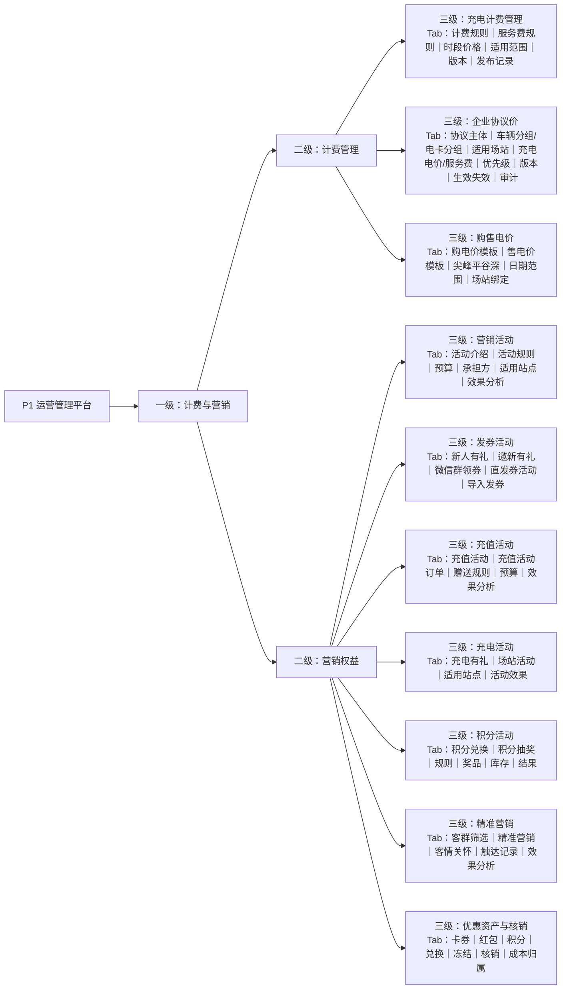
```mermaid
flowchart LR
    P1["P1 运营管理平台"] --> A["一级：计费与营销"]
    A --> A1["二级：计费管理"]
    A1 --> A11["三级：充电计费管理\nTab：计费规则｜服务费规则｜时段价格｜适用范围｜版本｜发布记录"]
    A1 --> A12["三级：企业协议价\nTab：协议主体｜车辆分组/电卡分组｜适用场站｜充电电价/服务费｜优先级｜版本｜生效失效｜审计"]
    A1 --> A13["三级：购售电价\nTab：购电价模板｜售电价模板｜尖峰平谷深｜日期范围｜场站绑定"]
    A --> A2["二级：营销权益"]
    A2 --> A21["三级：营销活动\nTab：活动介绍｜活动规则｜预算｜承担方｜适用站点｜效果分析"]
    A2 --> A22["三级：发券活动\nTab：新人有礼｜邀新有礼｜微信群领券｜直发券活动｜导入发券"]
    A2 --> A23["三级：充值活动\nTab：充值活动｜充值活动订单｜赠送规则｜预算｜效果分析"]
    A2 --> A24["三级：充电活动\nTab：充电有礼｜场站活动｜适用站点｜活动效果"]
    A2 --> A25["三级：积分活动\nTab：积分兑换｜积分抽奖｜规则｜奖品｜库存｜结果"]
    A2 --> A26["三级：精准营销\nTab：客群筛选｜精准营销｜客情关怀｜触达记录｜效果分析"]
    A2 --> A27["三级：优惠资产与核销\nTab：卡券｜红包｜积分｜兑换｜冻结｜核销｜成本归属"]
```

## 7. P1 → 资金与结算

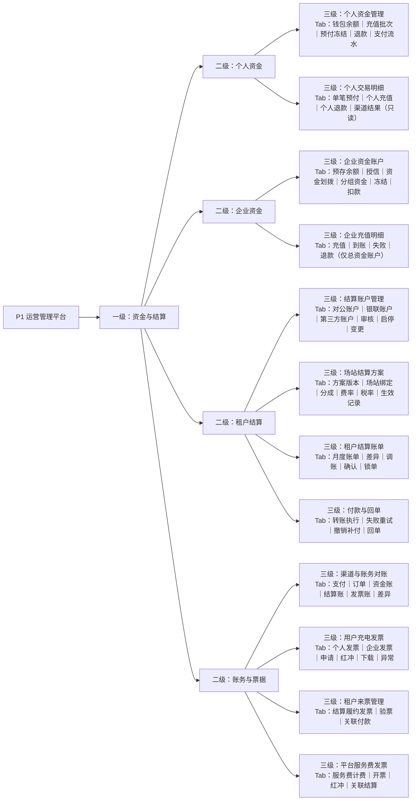
```mermaid
flowchart LR
    P1["P1 运营管理平台"] --> A["一级：资金与结算"]
    A --> A1["二级：个人资金"]
    A1 --> A11["三级：个人资金管理\nTab：钱包余额｜充值批次｜预付冻结｜退款｜支付流水"]
    A1 --> A12["三级：个人交易明细\nTab：单笔预付｜个人充值｜个人退款｜渠道结果（只读）"]
    A --> A2["二级：企业资金"]
    A2 --> A21["三级：企业资金账户\nTab：预存余额｜授信｜资金划拨｜分组资金｜冻结｜扣款"]
    A2 --> A22["三级：企业充值明细\nTab：充值｜到账｜失败｜退款（仅总资金账户）"]
    A --> A3["二级：租户结算"]
    A3 --> A31["三级：结算账户管理\nTab：对公账户｜银联账户｜第三方账户｜审核｜启停｜变更"]
    A3 --> A32["三级：场站结算方案\nTab：方案版本｜场站绑定｜分成｜费率｜税率｜生效记录"]
    A3 --> A33["三级：租户结算账单\nTab：月度账单｜差异｜调账｜确认｜锁单"]
    A3 --> A34["三级：付款与回单\nTab：转账执行｜失败重试｜撤销补付｜回单"]
    A --> A4["二级：账务与票据"]
    A4 --> A41["三级：渠道与账务对账\nTab：支付｜订单｜资金账｜结算账｜发票账｜差异"]
    A4 --> A42["三级：用户充电发票\nTab：个人发票｜企业发票｜申请｜红冲｜下载｜异常"]
    A4 --> A43["三级：租户来票管理\nTab：结算履约发票｜验票｜关联付款"]
    A4 --> A44["三级：平台服务费发票\nTab：服务费计费｜开票｜红冲｜关联结算"]
```

## 8. P1 → V2G运营

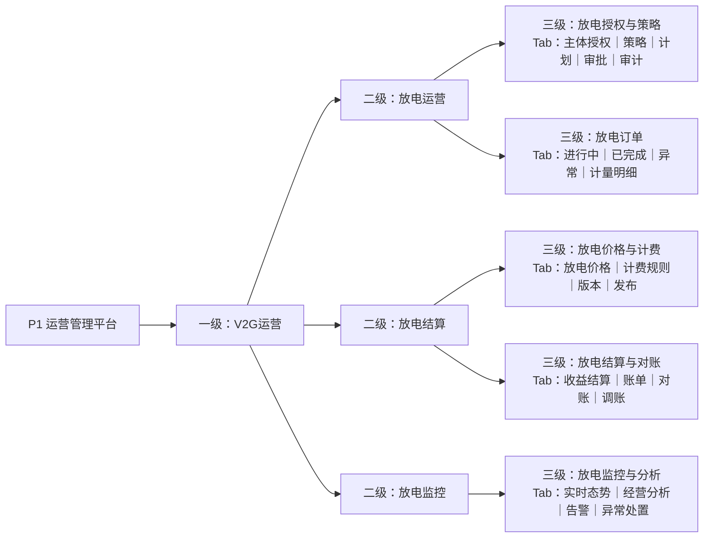
```mermaid
flowchart LR
    P1["P1 运营管理平台"] --> A["一级：V2G运营"]
    A --> A1["二级：放电运营"]
    A1 --> A11["三级：放电授权与策略\nTab：主体授权｜策略｜计划｜审批｜审计"]
    A1 --> A12["三级：放电订单\nTab：进行中｜已完成｜异常｜计量明细"]
    A --> A2["二级：放电结算"]
    A2 --> A21["三级：放电价格与计费\nTab：放电价格｜计费规则｜版本｜发布"]
    A2 --> A22["三级：放电结算与对账\nTab：收益结算｜账单｜对账｜调账"]
    A --> A3["二级：放电监控"]
    A3 --> A31["三级：放电监控与分析\nTab：实时态势｜经营分析｜告警｜异常处置"]
```

## 9. P1 → 数据分析

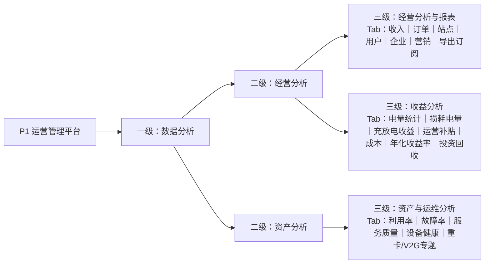
```mermaid
flowchart LR
    P1["P1 运营管理平台"] --> A["一级：数据分析"]
    A --> A1["二级：经营分析"]
    A1 --> A11["三级：经营分析与报表\nTab：收入｜订单｜站点｜用户｜企业｜营销｜导出订阅"]
    A1 --> A12["三级：收益分析\nTab：电量统计｜损耗电量｜充放电收益｜运营补贴｜成本｜年化收益率｜投资回收"]
    A --> A2["二级：资产分析"]
    A2 --> A21["三级：资产与运维分析\nTab：利用率｜故障率｜服务质量｜设备健康｜重卡/V2G专题"]
```

## 10. P1 → 监管接入

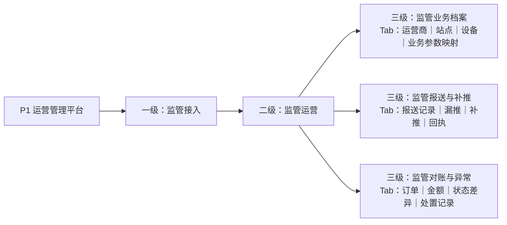
```mermaid
flowchart LR
    P1["P1 运营管理平台"] --> A["一级：监管接入"]
    A --> A1["二级：监管运营"]
    A1 --> A11["三级：监管业务档案\nTab：运营商｜站点｜设备｜业务参数映射"]
    A1 --> A12["三级：监管报送与补推\nTab：报送记录｜漏推｜补推｜回执"]
    A1 --> A13["三级：监管对账与异常\nTab：订单｜金额｜状态差异｜处置记录"]
```

## 11. P1 → 系统与配置

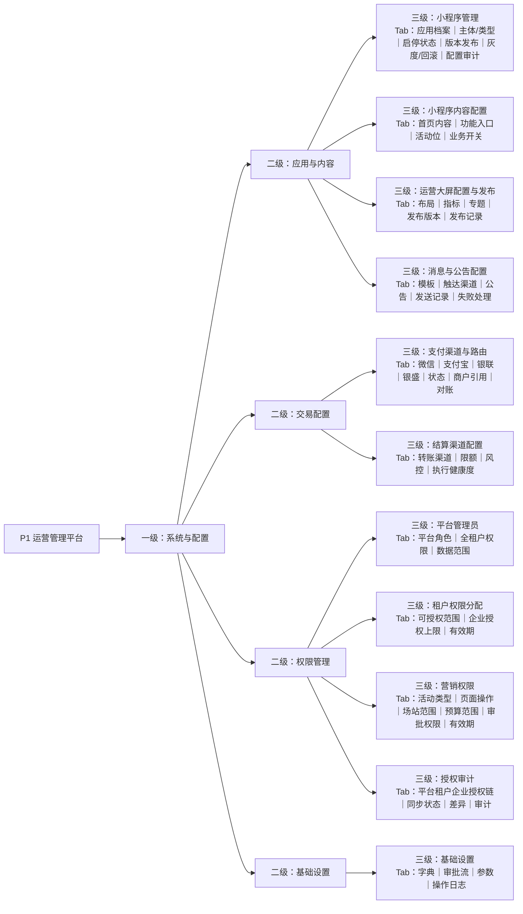
```mermaid
flowchart LR
    P1["P1 运营管理平台"] --> A["一级：系统与配置"]
    A --> A1["二级：应用与内容"]
    A1 --> A11["三级：小程序管理\nTab：应用档案｜主体/类型｜启停状态｜版本发布｜灰度/回滚｜配置审计"]
    A1 --> A12["三级：小程序内容配置\nTab：首页内容｜功能入口｜活动位｜业务开关"]
    A1 --> A13["三级：运营大屏配置与发布\nTab：布局｜指标｜专题｜发布版本｜发布记录"]
    A1 --> A14["三级：消息与公告配置\nTab：模板｜触达渠道｜公告｜发送记录｜失败处理"]
    A --> A2["二级：交易配置"]
    A2 --> A21["三级：支付渠道与路由\nTab：微信｜支付宝｜银联｜银盛｜状态｜商户引用｜对账"]
    A2 --> A22["三级：结算渠道配置\nTab：转账渠道｜限额｜风控｜执行健康度"]
    A --> A3["二级：权限管理"]
    A3 --> A31["三级：平台管理员\nTab：平台角色｜全租户权限｜数据范围"]
    A3 --> A32["三级：租户权限分配\nTab：可授权范围｜企业授权上限｜有效期"]
    A3 --> A33["三级：营销权限\nTab：活动类型｜页面操作｜场站范围｜预算范围｜审批权限｜有效期"]
    A3 --> A34["三级：授权审计\nTab：平台租户企业授权链｜同步状态｜差异｜审计"]
    A --> A4["二级：基础设置"]
    A4 --> A41["三级：基础设置\nTab：字典｜审批流｜参数｜操作日志"]
```

## 12. P2 企业客户管理平台

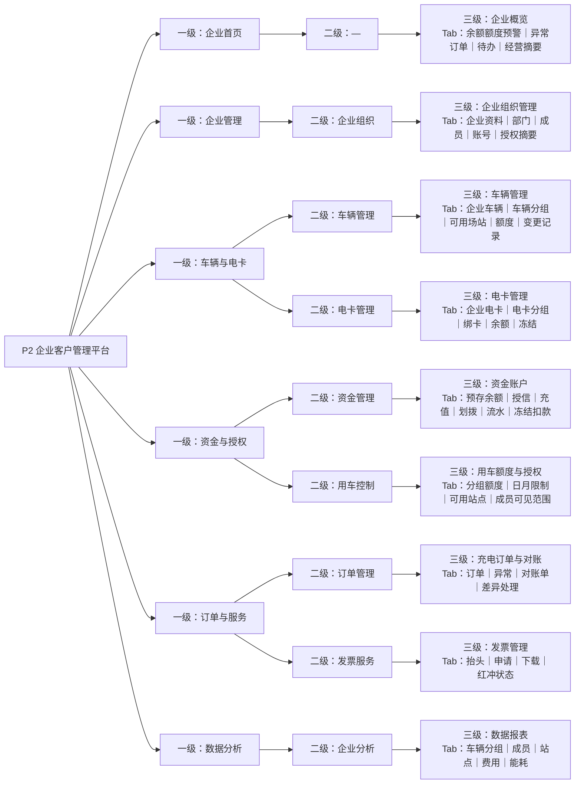
```mermaid
flowchart LR
    P2["P2 企业客户管理平台"]
    P2 --> A["一级：企业首页"]
    A --> A1["二级：—"]
    A1 --> A11["三级：企业概览\nTab：余额额度预警｜异常订单｜待办｜经营摘要"]
    P2 --> B["一级：企业管理"]
    B --> B1["二级：企业组织"]
    B1 --> B11["三级：企业组织管理\nTab：企业资料｜部门｜成员｜账号｜授权摘要"]
    P2 --> C["一级：车辆与电卡"]
    C --> C1["二级：车辆管理"]
    C1 --> C11["三级：车辆管理\nTab：企业车辆｜车辆分组｜可用场站｜额度｜变更记录"]
    C --> C2["二级：电卡管理"]
    C2 --> C21["三级：电卡管理\nTab：企业电卡｜电卡分组｜绑卡｜余额｜冻结"]
    P2 --> D["一级：资金与授权"]
    D --> D1["二级：资金管理"]
    D1 --> D11["三级：资金账户\nTab：预存余额｜授信｜充值｜划拨｜流水｜冻结扣款"]
    D --> D2["二级：用车控制"]
    D2 --> D21["三级：用车额度与授权\nTab：分组额度｜日月限制｜可用站点｜成员可见范围"]
    P2 --> E["一级：订单与服务"]
    E --> E1["二级：订单管理"]
    E1 --> E11["三级：充电订单与对账\nTab：订单｜异常｜对账单｜差异处理"]
    E --> E2["二级：发票服务"]
    E2 --> E21["三级：发票管理\nTab：抬头｜申请｜下载｜红冲状态"]
    P2 --> G["一级：数据分析"]
    G --> G1["二级：企业分析"]
    G1 --> G11["三级：数据报表\nTab：车辆分组｜成员｜站点｜费用｜能耗"]
```

## 13. M1 个人充电小程序

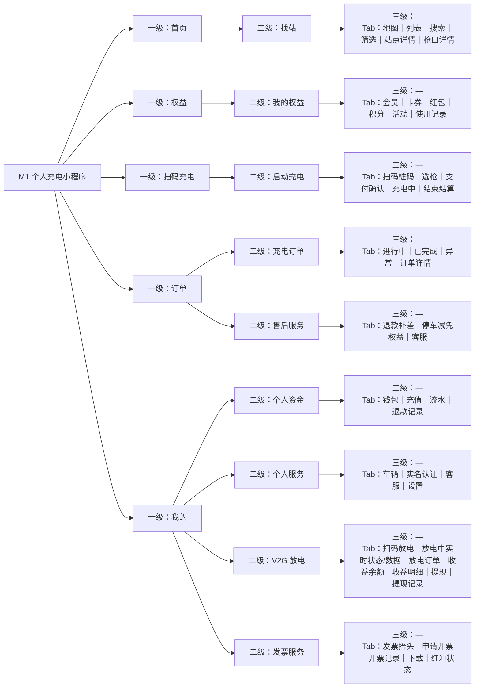
```mermaid
flowchart LR
    M1["M1 个人充电小程序"]
    M1 --> A["一级：首页"]
    A --> A1["二级：找站"]
    A1 --> A11["三级：—\nTab：地图｜列表｜搜索｜筛选｜站点详情｜枪口详情"]
    M1 --> B["一级：权益"]
    B --> B1["二级：我的权益"]
    B1 --> B11["三级：—\nTab：会员｜卡券｜红包｜积分｜活动｜使用记录"]
    M1 --> C["一级：扫码充电"]
    C --> C1["二级：启动充电"]
    C1 --> C11["三级：—\nTab：扫码桩码｜选枪｜支付确认｜充电中｜结束结算"]
    M1 --> D["一级：订单"]
    D --> D1["二级：充电订单"]
    D1 --> D11["三级：—\nTab：进行中｜已完成｜异常｜订单详情"]
    D --> D2["二级：售后服务"]
    D2 --> D21["三级：—\nTab：退款补差｜停车减免权益｜客服"]
    M1 --> E["一级：我的"]
    E --> E1["二级：个人资金"]
    E1 --> E11["三级：—\nTab：钱包｜充值｜流水｜退款记录"]
    E --> E2["二级：个人服务"]
    E2 --> E21["三级：—\nTab：车辆｜实名认证｜客服｜设置"]
    E --> E3["二级：V2G 放电"]
    E3 --> E31["三级：—\nTab：扫码放电｜放电中实时状态/数据｜放电订单｜收益余额｜收益明细｜提现｜提现记录"]
    E --> E4["二级：发票服务"]
    E4 --> E41["三级：—\nTab：发票抬头｜申请开票｜开票记录｜下载｜红冲状态"]
```

## 14. M2 企业充电小程序

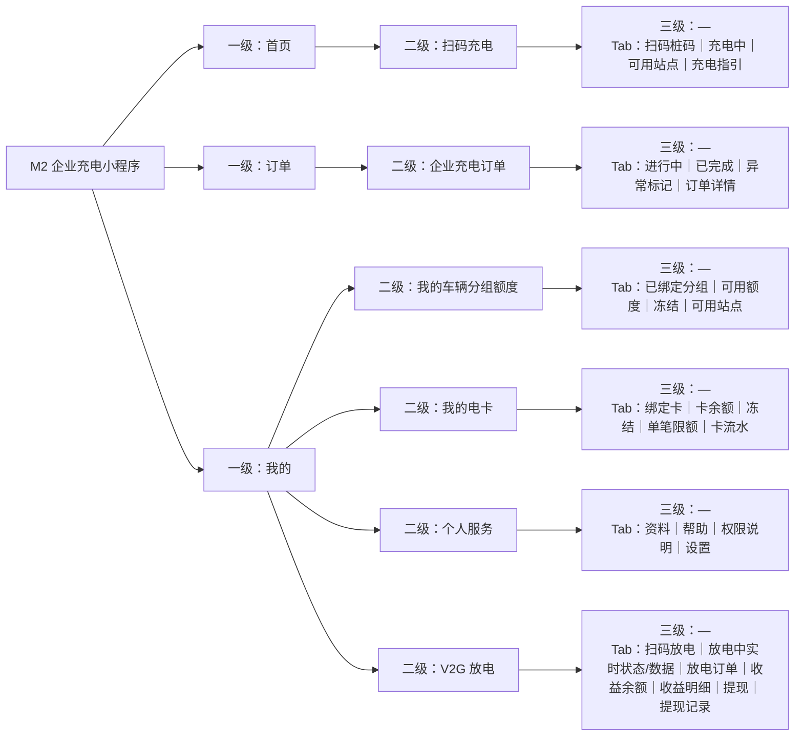
```mermaid
flowchart LR
    M2["M2 企业充电小程序"]
    M2 --> A["一级：首页"]
    A --> A1["二级：扫码充电"]
    A1 --> A11["三级：—\nTab：扫码桩码｜充电中｜可用站点｜充电指引"]
    M2 --> B["一级：订单"]
    B --> B1["二级：企业充电订单"]
    B1 --> B11["三级：—\nTab：进行中｜已完成｜异常标记｜订单详情"]
    M2 --> C["一级：我的"]
    C --> C1["二级：我的车辆分组额度"]
    C1 --> C11["三级：—\nTab：已绑定分组｜可用额度｜冻结｜可用站点"]
    C --> C2["二级：我的电卡"]
    C2 --> C21["三级：—\nTab：绑定卡｜卡余额｜冻结｜单笔限额｜卡流水"]
    C --> C3["二级：个人服务"]
    C3 --> C31["三级：—\nTab：资料｜帮助｜权限说明｜设置"]
    C --> C4["二级：V2G 放电"]
    C4 --> C41["三级：—\nTab：扫码放电｜放电中实时状态/数据｜放电订单｜收益余额｜收益明细｜提现｜提现记录"]
```

## 15. M3 运营商小程序

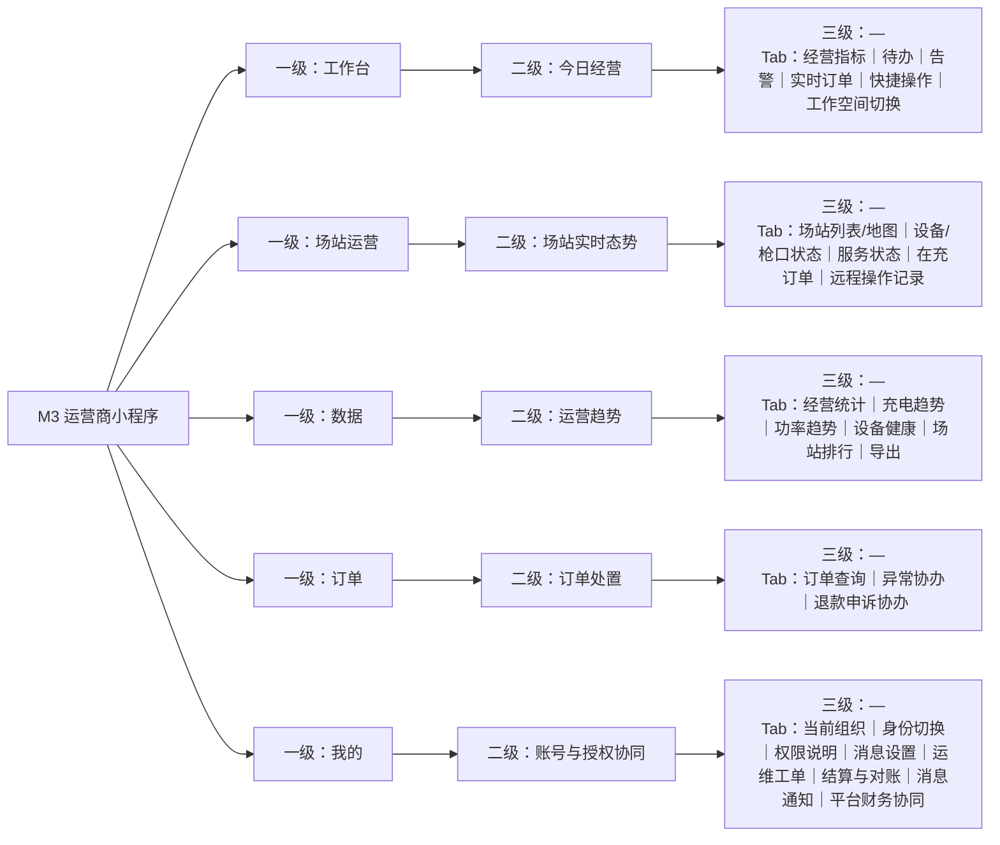
```mermaid
flowchart LR
    M3["M3 运营商小程序"]
    M3 --> A["一级：工作台"]
    A --> A1["二级：今日经营"]
    A1 --> A11["三级：—\nTab：经营指标｜待办｜告警｜实时订单｜快捷操作｜工作空间切换"]
    M3 --> B["一级：场站运营"]
    B --> B1["二级：场站实时态势"]
    B1 --> B11["三级：—\nTab：场站列表/地图｜设备/枪口状态｜服务状态｜在充订单｜远程操作记录"]
    M3 --> C["一级：数据"]
    C --> C1["二级：运营趋势"]
    C1 --> C11["三级：—\nTab：经营统计｜充电趋势｜功率趋势｜设备健康｜场站排行｜导出"]
    M3 --> D["一级：订单"]
    D --> D1["二级：订单处置"]
    D1 --> D11["三级：—\nTab：订单查询｜异常协办｜退款申诉协办"]
    M3 --> E["一级：我的"]
    E --> E1["二级：账号与授权协同"]
    E1 --> E11["三级：—\nTab：当前组织｜身份切换｜权限说明｜消息设置｜运维工单｜结算与对账｜消息通知｜平台财务协同"]
```

## 16. M4 企业客户管理小程序

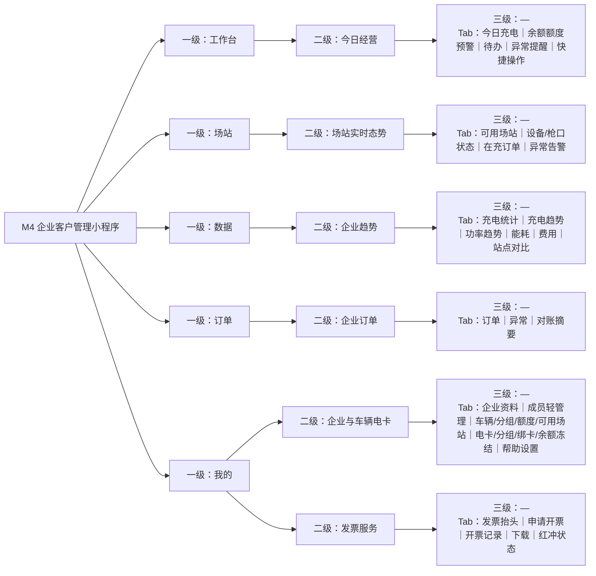
```mermaid
flowchart LR
    M4["M4 企业客户管理小程序"]
    M4 --> A["一级：工作台"]
    A --> A1["二级：今日经营"]
    A1 --> A11["三级：—\nTab：今日充电｜余额额度预警｜待办｜异常提醒｜快捷操作"]
    M4 --> B["一级：场站"]
    B --> B1["二级：场站实时态势"]
    B1 --> B11["三级：—\nTab：可用场站｜设备/枪口状态｜在充订单｜异常告警"]
    M4 --> C["一级：数据"]
    C --> C1["二级：企业趋势"]
    C1 --> C11["三级：—\nTab：充电统计｜充电趋势｜功率趋势｜能耗｜费用｜站点对比"]
    M4 --> D["一级：订单"]
    D --> D1["二级：企业订单"]
    D1 --> D11["三级：—\nTab：订单｜异常｜对账摘要"]
    M4 --> E["一级：我的"]
    E --> E1["二级：企业与车辆电卡"]
    E1 --> E11["三级：—\nTab：企业资料｜成员轻管理｜车辆/分组/额度/可用场站｜电卡/分组/绑卡/余额冻结｜帮助设置"]
    E --> E2["二级：发票服务"]
    E2 --> E21["三级：—\nTab：发票抬头｜申请开票｜开票记录｜下载｜红冲状态"]
```

## 17. D1 运营大屏

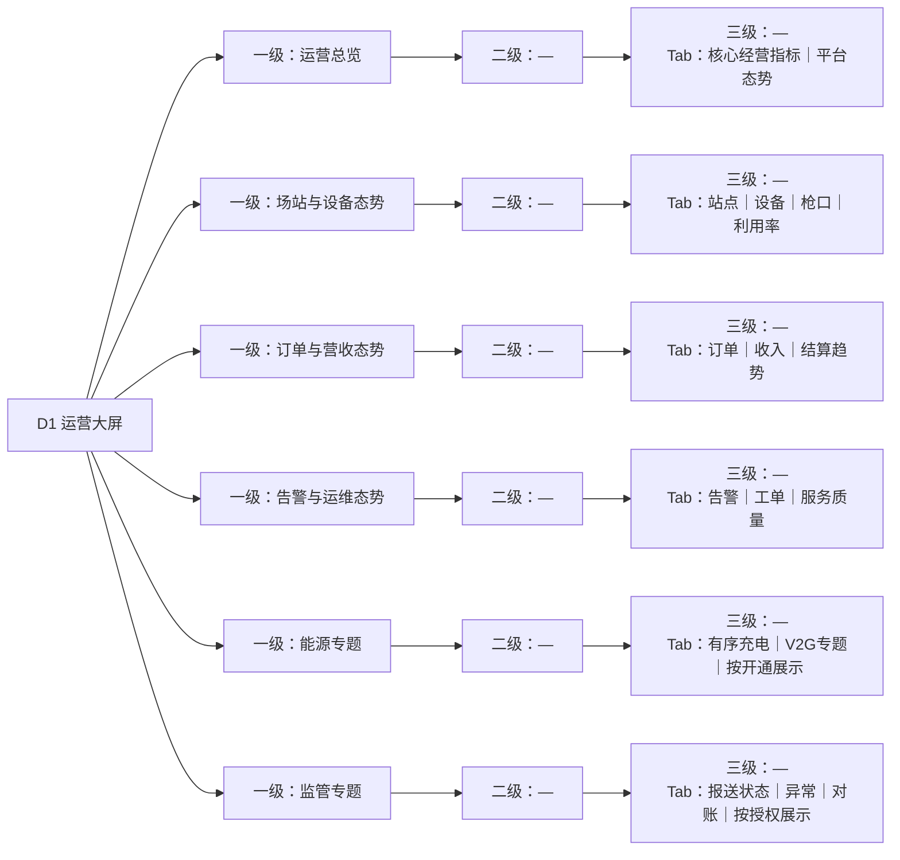
```mermaid
flowchart LR
    D1["D1 运营大屏"]
    D1 --> A["一级：运营总览"]
    A --> A1["二级：—"]
    A1 --> A11["三级：—\nTab：核心经营指标｜平台态势"]
    D1 --> B["一级：场站与设备态势"]
    B --> B1["二级：—"]
    B1 --> B11["三级：—\nTab：站点｜设备｜枪口｜利用率"]
    D1 --> C["一级：订单与营收态势"]
    C --> C1["二级：—"]
    C1 --> C11["三级：—\nTab：订单｜收入｜结算趋势"]
    D1 --> D["一级：告警与运维态势"]
    D --> D2["二级：—"]
    D2 --> D21["三级：—\nTab：告警｜工单｜服务质量"]
    D1 --> E["一级：能源专题"]
    E --> E1["二级：—"]
    E1 --> E11["三级：—\nTab：有序充电｜V2G专题｜按开通展示"]
    D1 --> F["一级：监管专题"]
    F --> F1["二级：—"]
    F1 --> F11["三级：—\nTab：报送状态｜异常｜对账｜按授权展示"]
```

> D1 为独立只读展示应用；内容设置和发布位于 P1“系统与配置 → 应用与内容 → 运营大屏配置与发布”。
