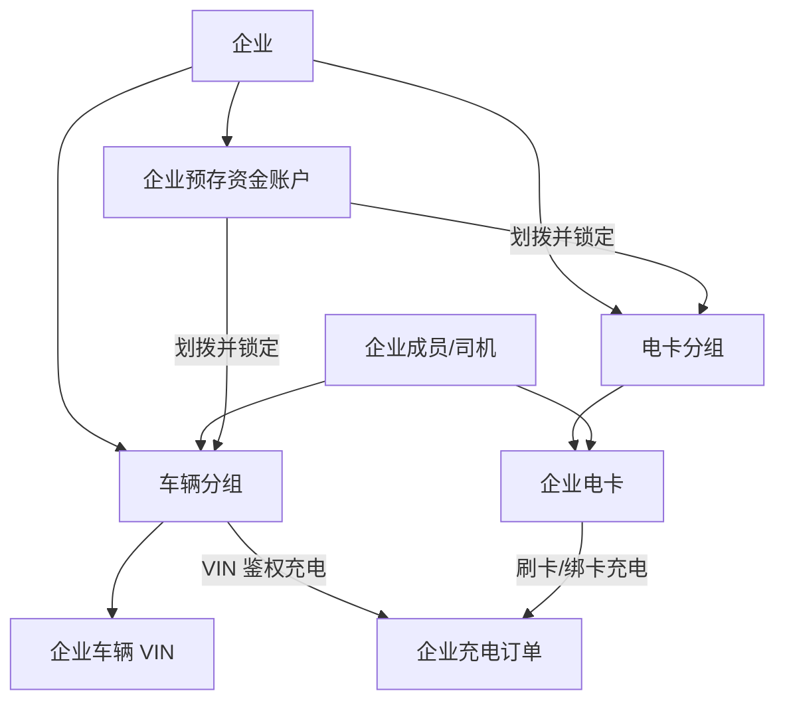

# 充电运营平台功能详细说明

> 版本：v4.1（评审基线）
> 菜单索引：见 `充电运营平台菜单架构-v4.1.md`。本文件不重复完整目录，只描述菜单族的功能、角色和闭环。

## 1. 应用与角色

| 应用 | 主要使用者 | 定位 |
|---|---|---|
| P1 运营管理平台 | 平台管理员、运营、财务、客服、运维、监管专员、获授权租户人员 | 平台业务运营、租户权限分配和统一治理后台。 |
| P2 企业客户管理平台 | 企业管理员、企业财务、车辆管理员、企业运维人员 | 企业自助经营、企业组织/角色/权限、资金、车辆、电卡和对账管理。 |
| M1 个人充电小程序 | 个人充电用户 | 找站、扫码充电、权益、订单与售后；在“我的”中提供独立 V2G 放电/收益闭环及发票服务。 |
| M2 企业充电小程序 | 企业员工/司机 | 企业扫码充电、订单和本人可见分组额度/电卡查询；在“我的”中提供独立 V2G 放电/收益闭环，不提供发票服务。 |
| M3 运营商小程序 | 平台移动运营人员、租户运营人员 | 面向商家端的移动经营工作台、场站运营、趋势数据、订单处置和受控协同。 |
| M4 企业客户管理小程序 | 企业管理员、现场运维人员 | 面向企业商家端的移动经营工作台、场站/设备实时查看、趋势数据、订单及轻量协同，不承担充电。 |
| D1 运营大屏 | 展示人员 | 独立只读展示应用，内容由 P1 发布。 |

## 2. P1 重点菜单功能

### 2.1 场站与运维

| 三级菜单 | 角色 | 核心操作 | 异常闭环与边界 |
|---|---|---|---|
| 场站管理 | 平台资产管理员、获授权租户 | 建档、补录经营资料、维护服务范围、收益模型、扩展字段、提交变更 | 收益模型维护设备/施工成本、固定建站补贴、运营补贴及租金、运营、运维成本；运营补贴和月度成本按生效区间管理，接入侧同步字段只读。 |
| 设备管理 | 平台资产管理员、运维 | 维护充电设备、场站总表/变压器表的运营归属与设备关系，查看分时读数、枪口/能力/V2G/重卡属性和数据接入状态 | 协议、密钥和通讯配置由统一设备接入服务维护；该服务可直连设备或接收 IOT 按统一协议同步的数据，设备数据存储为遥测优先来源。 |
| 服务配置 | 场站运营 | 配置营业与开放规则、服务标签、站内公告和充满未离场提醒时长 | 提醒时长仅控制提醒触发，不产生占位订单或自动收费。 |
| 停车服务协同 | 场站运营、停车协同专员 | 绑定停车场、配置充电减免、查询核销/撤销 | 第三方停车平台负责收款、退款、停车发票；P1 仅校验并传递优惠权益。 |
| 出入口与车位协同 | 场站运营 | 维护道闸、车位闸机与场站映射，查询进出记录 | 设备接入由 IOT/第三方平台负责；映射失效时记录异常并人工处理。 |
| 园区便民服务协同 | 场站运营 | 配置门禁服务权益、授权方式、查询使用记录 | 仅维护业务授权；厕所门禁等物理控制由 IOT/门禁平台执行。 |
| 场站定时充电策略 | 平台管理员、获授权租户管理员 | 配置每日、工作日、周末或自定义星期的执行时间、目标场站/设备/枪口、设备可充状态及可选分批参数 | 仅平台或租户可创建、修改、启停策略；按计划下发设备启用/停用控制，默认不强制中断进行中的订单。设备不支持、状态不允许、控制超时或执行失败均记录原因并告警。 |
| 场站数据分析 | 平台运营、获授权租户运营、运维 | 多选场站、统计数据点、时间范围和时/日/月粒度，查询充电量、订单量、营收、利用率、功率、设备状态等曲线并下钻/导出 | 每个“场站 × 统计数据点”组合对应一条曲线，选择多少组合即展示多少条曲线；仅查询授权场站历史聚合数据，不替代实时监控，指标计算时间、数据延迟和缺失区间须明确展示。 |
| 设备数据分析 | 平台运维、获授权租户运维 | 多选设备、枪口或电表及已接入功能点，查询电压、电流、功率、SOC、状态、正反向电量等曲线、明细和采样质量并导出 | 每个“设备 × 功能点”组合对应一条曲线，选择多少组合即展示多少条曲线；按设备数据访问范围过滤，展示采样时间、来源和质量标记，不提供协议、功能点定义或原始遥测修改。 |
| 占位提醒 | 平台/获授权租户运营人员 | 查看待提醒订单号、桩枪、手机号和占用时长；提供拨号入口并发送微信小程序提醒 | 电话为人工拨号，不要求系统通话记录；小程序提醒保留发送记录和回执。枪状态变为空闲后自动结束提醒。 |
| 告警管理 | 运维、值班人员 | 确认、升级、屏蔽、恢复、转工单 | 原始告警由统一设备接入服务优先提供，IOT 可按统一协议同步；屏蔽/恢复均需审计。 |
| 运维工单 | 运维主管、现场人员 | 派工、巡检、处理、验收、关闭 | 超 SLA 升级；未解决告警不能通过工单关闭绕过。 |

### 2.2 客户与权益

| 三级菜单 | 核心功能 | 关键规则 |
|---|---|---|
| 个人用户 | 统一个人用户主档、微信/支付宝渠道身份映射、用户 360°、订单、权益、车辆、账户摘要、行为记录 | M1 渠道授权登录时创建或更新个人用户主档；渠道身份映射唯一、同一经验证手机号复用既有用户，冲突不得自动合并。手机号变更及身份解绑/重绑仅由 P1 运营流程人工处置，M1 不提供自助绑定入口。个人用户可不绑定车辆；账户明细由个人资金管理承载。P1 不配置 M1 页面或功能权限。 |
| 会员与权益 | 会员、活动、券、红包、积分、核销 | 权益适用范围、有效期、成本承担方和订单核销必须可追溯。 |
| 企业管理/成员账户 | 企业主体、组织架构、角色、管理员、员工/司机账号和授权摘要 | 企业管理员在 P2 配置本企业组织、角色、用户及页面/数据权限；平台统一权限中心校验其不超出租户授权范围。 |
| 租户管理 | 租户组织、角色、用户、租户可授权范围和企业授权上限 | 平台管理员在 P1 为租户配置可授权权限包；租户只能管理本租户及其下属企业。 |
| 企业车辆管理 | VIN 车辆档案、车辆分组、站点范围、额度 | 一辆有效车辆只能属于一个车辆分组；变更不影响已开始、冻结、未结算或异常订单。 |
| 企业电卡管理 | 电卡、卡组、绑卡、余额、冻结、挂失 | 卡余额由企业总预存余额划拨并锁定；一张卡只属于一个有效卡组。 |

### 2.3 交易、计费与营销

| 三级菜单 | 核心功能 | 关键规则 |
|---|---|---|
| 充电订单 | 查询、订单调整、人工结算、异常标记 | 订单记录扣款主体、支付路由或钱包资金批次分配、站点结算方案快照、VIN/车辆分组/电卡信息及异常原因；收款商户不改变结算方案归属。 |
| 退款与补差 | 预付差额退款、充值退款、补收 | 微信/支付宝支付必须按原支付渠道、原平台商户退款；支付意图固化渠道、应用实例、商户引用和路由版本。未消费现金充值退款只按资金批次退款；充电订单退款/补差恢复对应钱包资金批次或走原交易退款，并生成租户结算调整。 |
| 充电计费管理 | 价格、服务费、时段、版本、发布 | 计费在启动前固化必要快照；计费模板不得归入财务结算。 |
| 企业协议价 | 企业专属充电电价/服务费、适用企业、车辆分组/电卡分组、适用场站、优先级、版本与生效期 | 属于计费规则，不得作为企业资金余额、营销权益或租户结算方案维护；订单启动时记录命中的协议价规则、版本和价格快照，后续改价不得重算历史订单。 |
| 购售电价 | 维护场站级购电价、售电价模板及尖峰平谷深分时单价，按日期范围绑定场站 | 仅用于经营核算，不下发至桩、不改变充放电订单计费；同类模板在同一场站的生效日期不得重叠，历史分析可按当前配置重新计算。 |
| 营销活动 | 维护活动介绍、规则、预算、承担方、站点范围与效果分析 | 活动介绍是已发布活动的小程序落地页，不单独建设内容管理系统。 |
| 发券/充值/充电/积分/精准营销 | 覆盖新人有礼、邀新有礼、微信群领券、直发券活动、导入发券、充值活动及订单、充电有礼、场站活动、积分兑换、积分抽奖、精准营销和客情关怀 | 优惠资产、发放、冻结、核销、积分/奖品库存与成本归属必须可追溯；权限由营销权限配置决定。 |
| 收益分析 | 按平台、租户、场站及日期范围查看电量、损耗、充放电收益、补贴、成本、年化收益率和投资回收 | 组合设备数据存储中的计量读数、订单、购售电价和场站收益模型计算；不承担实时设备监控。 |

### 2.4 资金、结算与票据

| 三级菜单 | 核心功能 | 关键规则 |
|---|---|---|
| 个人资金管理 | 钱包、充值资金批次、预付冻结、退款、渠道对账 | 每个现金充值批次记录原交易/商户路由、实收、消费/冻结/退款和可退款余额；赠送金、红包、积分独立建账。商户迁移后新商户只收新交易，旧商户保留历史退款和对账。用户充值与单笔预付均不是租户资金。 |
| 个人交易明细 | 个人单笔预付、充值、退款及原支付渠道结果查询 | 只读汇总交易结果；退款发起、审批和处理仍由退款与补差菜单负责。 |
| 企业资金账户 | 企业预存、授信、分组划拨、冻结、扣款 | 企业资金台账由平台管理，企业拥有使用权；租户无查看、划拨、冻结或扣款权限。 |
| 企业充值明细 | 企业总资金账户的充值、到账、失败和退款查询 | 不展示车辆分组/电卡分组之间的划拨、冻结、扣款，这些仍归企业资金账户。 |
| 结算账户管理 | 租户对公/银联/第三方账户的登记、审核、启停 | 收款账户与个人支付商户隔离；账户变更须保留版本与审核记录。 |
| 场站结算方案 | 结算账户、结算主体、分成、费率、税率、场站绑定、生效版本 | 一个场站任一时刻只能有一个生效方案；订单启动时固化方案快照。 |
| 租户结算账单 | 月结、差异、调账、确认、锁单 | 用户支付来源、收款商户和钱包资金批次均不改变租户结算归属；仅充电订单退款、补差或后续修正形成调整项。未锁账单可重算，锁单或付款后只追加调整、追补或追收记录，不回写历史账单。 |
| 付款与回单 | 转账、重试、补付、回单 | 付款执行和账单确认需职责分离；按受控渠道和限额执行。 |
| 用户充电发票 | 申请、开具、红冲、下载 | 平台统一面向个人和企业充电用户开票；半自动开票中，上传票据须扫描，下载只经授权的短时链接，上传/复核/邮件发送/下载/重试均留痕。 |
| 租户来票/平台服务费发票 | 验票、关联付款；服务费应收和开票 | 租户向平台开票与平台向租户开服务费票是两个相反方向的业务。 |

### 2.5 监管、V2G 与应用配置

> 排期说明：本节监管入口按 `DEC-20260814-010` 由现行 `ecosystem-service` 在 W10 实现。

| 菜单族 | 核心功能 | 关键规则 |
|---|---|---|
| 监管接入 | 监管档案、报送、漏推识别、补推、回执、对账 | 支持不同省市协议的业务参数映射与报送闭环；由后续 `ecosystem-service` 实现，协议/API/密钥归受控连接与安全配置。 |
| V2G运营 | 授权策略、放电订单、计费、结算、监控 | 放电订单和收益账务独立于普通充电订单、个人钱包、企业预存和电卡；M1/M2 的“我的 → V2G 放电”承载已授权用户的扫码放电、实时订单与收益余额/明细。首发仅结算至独立用户 V2G 收益余额，提现待定并关闭。 |
| 支付渠道与路由 | 微信、支付宝、银联、银盛等平台收款、退款及路由状态 | 普通页面只管理渠道能力和商户引用；证书、密钥、签名参数仅在安全配置中心。渠道配置须经服务端不回显校验并记录绑定/连通状态；每笔支付保存路由快照。商户迁移时，新商户承接新交易，旧商户仅保留历史查询、原路退款和对账，直至历史风险清零或按批准方案处置。 |
| 结算渠道配置 | 平台向租户付款通道、限额、风控、健康状态 | 技术凭据受控，运营人员不可直接编辑。 |
| 小程序管理 | M1、M2、M3、M4 的应用档案、主体/类型、启停、版本发布、灰度/回滚和配置审计 | 管理应用生命周期，不配置小程序页面或功能权限；AppID、密钥、证书等敏感凭据仅由安全配置中心受控保管。 |
| 小程序内容配置 | 首页内容、功能入口、活动位、业务开关 | 仅管理内容与已批准能力的可见性；不替代应用发布治理，也不形成角色权限。 |
| 运营大屏配置与发布 | 指标、布局、专题、版本发布 | 大屏独立运行，只读取已发布版本。 |

### 2.6 平台—租户—企业权限配置

| 配置层级 | 配置入口 | 配置内容 | 权限边界 |
|---|---|---|---|
| 平台 | P1 `系统与配置 → 权限管理` | 平台管理员、租户可授权范围、授权审计 | 平台管理员拥有全租户权限，向租户分配页面、功能和数据范围上限。 |
| 租户 | P1 `客户与权益 → 合作运营 → 租户管理` | 租户组织、角色、用户、租户内权限、企业授权上限 | 租户只能管理本租户及其下属企业，不能超出平台授予范围。 |
| 企业 | P2 `企业管理 → 企业组织 → 企业组织管理` | 企业组织、企业角色、成员账号、P2 页面权限、数据范围、授权审计 | 企业管理员只能在租户授予的上限内配置本企业权限。 |

P2 是企业管理员的权限配置界面；权限数据、上级范围校验和审计记录统一由平台权限中心维护。P1 仅向平台工作人员及获授权租户人员开放，不向企业客户或企业成员提供登录与访问；企业业务管理统一在 P2 与 M4。当前不配置任何小程序页面或功能权限。

营销权限作为 P1 `系统与配置 → 权限管理 → 营销权限` 的专用配置，按角色授予活动类型、页面操作、场站范围、预算范围、审批权限和有效期；不在营销菜单中预设平台或租户的唯一归属。

## 3. 企业分组体系

- 车辆分组：企业车辆的核算、额度、站点范围和固定单笔启动金额单元；重卡仅通过车辆类型和站点/设备“支持重卡”属性适配，不另建车队模型。
- 电卡分组：企业电卡的资金、限额和站点范围单元；可与允许使用的车辆分组建立关系。
- 企业成员可绑定多个车辆分组和电卡；M2 仅展示其已绑定车辆分组的额度，分组不汇总展示。

## 4. 小程序功能说明

| 应用 | 核心闭环 | 不承载的能力 |
|---|---|---|
| M1 | 微信或未来支付宝渠道授权登录 → 统一个人用户主档创建/更新 → 找站 → 扫码 → 支付/预付 → 充电 → 结算/退款 → 售后；我的 → 发票服务，或我的 → V2G 扫码放电 → 实时状态/数据 → 放电订单 → 收益余额/明细 | 个人用户不配置页面或功能权限；公开浏览与交易资格由业务规则控制。V2G 收益账户独立于个人充电钱包；提现功能待定并关闭；发票入口独立于订单；不展示租户结算或企业资金。 |
| M2 | 企业账号登录 → 扫码/VIN/电卡鉴权 → 企业充电 → 订单查询；我的 → V2G 扫码放电 → 实时状态/数据 → 放电订单 → 收益余额/明细 | V2G 收益账户独立于企业资金和电卡；提现功能待定并关闭；不提供发票入口，企业充电发票由企业管理侧与平台对接；不提供个人充值、个人钱包或手工展示预充金额。 |
| M3 | 工作空间确认 → 工作台待办 → 场站实时状况 → 经营/充电/功率趋势 → 订单/工单处置 → 结算协同 | 租户空间不可查看平台商户、个人资金、企业资金或完整用户发票。 |
| M4 | 工作台经营待办 → 场站/设备实时状况 → 充电/功率趋势 → 订单协同 → 我的中的车辆/电卡轻量管理与发票服务 | 不提供充电、不提供高风险资金划拨和批量操作，也不提供定时充电策略配置。 |
