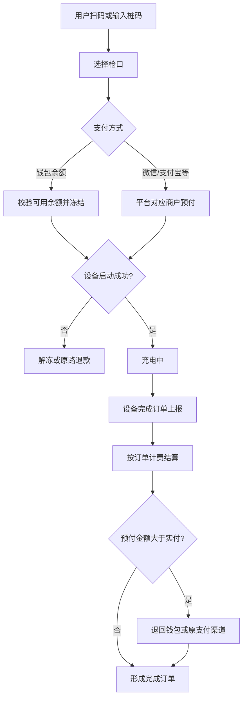
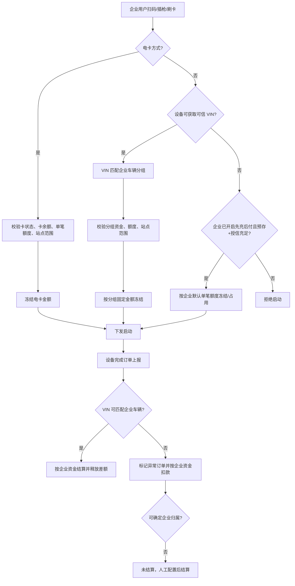
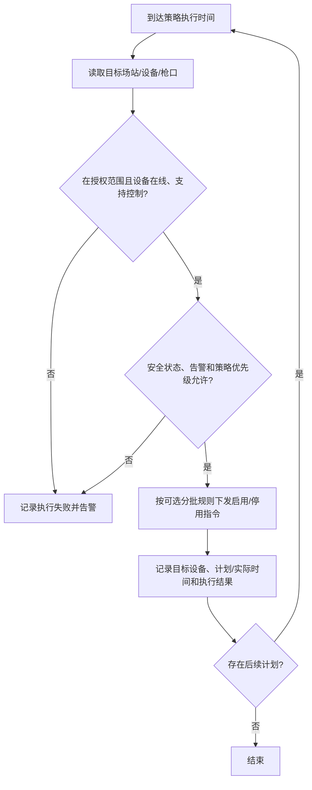
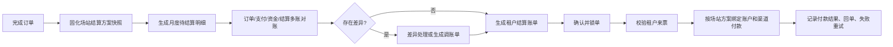
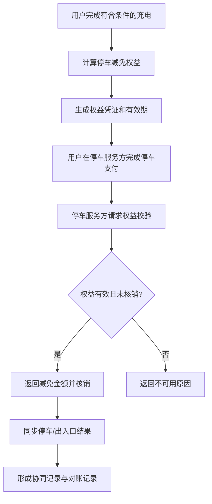
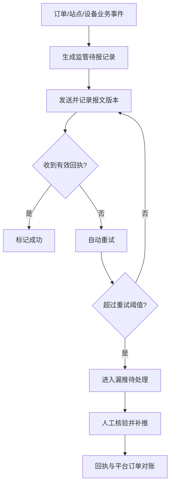
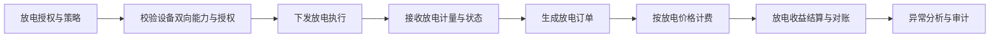
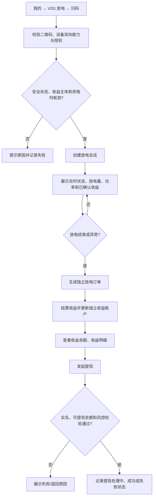
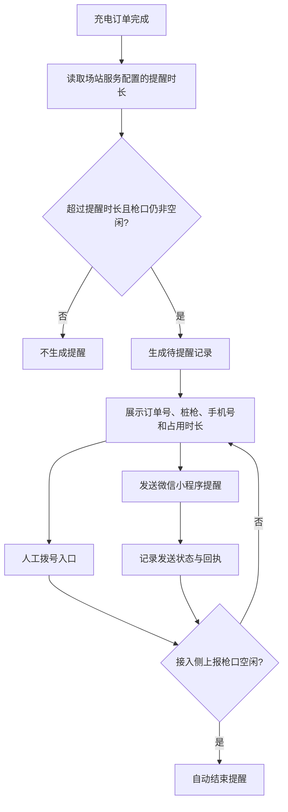
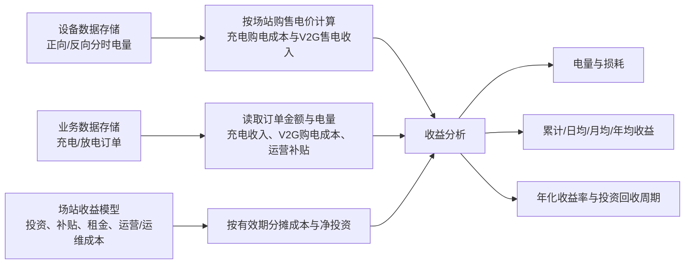

# 充电运营平台场景与流程图集

> 版本：v4.1（评审基线）  
> 关联规则：`充电运营平台业务规则基线-v4.1.md`

## 1. 个人用户扫码、预付及原路退款

适用：M1 个人用户，不要求绑定车辆或办理会员。

异常：启动失败、订单漏报、结算金额异常、退款失败均进入订单异常/退款补差；退款渠道必须与原支付渠道一致。

## 2. 企业 VIN、电卡与无 VIN 充电

异常：VIN 缺失、VIN 不在企业车辆分组、资金/额度不足、电卡冻结失败、订单晚到均记录原因；不能确定企业归属的订单不自动转入租户结算。

## 3. 场站定时充电策略

适用：由平台或获授权租户预先配置的场站、设备或枪口策略。企业客户不在 P2 或 M4 配置策略。

策略只改变设备后续可充状态，默认不停止进行中的充电订单；设备离线、不支持控制、告警拦截或控制超时均记录原因。中断在充订单须通过独立的紧急停机或获授权远程操作流程处理。

## 4. 平台对租户月度结算与付款

个人微信/支付宝收款、企业预存扣款、电卡扣款均不决定租户结算账户；订单只按启动时固化的场站结算方案参与结算。

## 5. 停车减免与出入口协同

停车服务方负责停车费支付、退款和停车发票；P1 不代替其收款，仅保留充电优惠与协同记录。

## 6. 监管报送、漏推与补推

补推只补发监管记录，不改写原始订单；监管协议、签名和传输密钥不在 P1 页面维护。

## 7. V2G 放电订单

放电订单、计量、收益和结算独立建模，不能以充电负金额、个人钱包或企业电卡余额替代。

## 8. M1/M2 用户 V2G 扫码放电与收益提现

适用：M1 或 M2 中已实名、具备有效 V2G 授权和可提现资格的用户。

放电订单、收益余额和提现记录均独立于充电订单、个人充电钱包、企业预存资金与电卡余额。实时数据异常、遥测延迟和控制失败需显式提示，不能用估算值覆盖设备上报事实。

## 9. 充满未离场占位提醒

占位提醒仅用于提醒与人工处置，不自动生成占位订单、收费或违约处罚；电话由人员自行拨打，系统不记录通话结果。

## 10. 场站收益与投资回收分析

购售电价、补贴和月度成本按查询日期范围的当前有效配置重新计算；充电订单金额与桩上报的放电订单金额不被后台购售电价改写。
