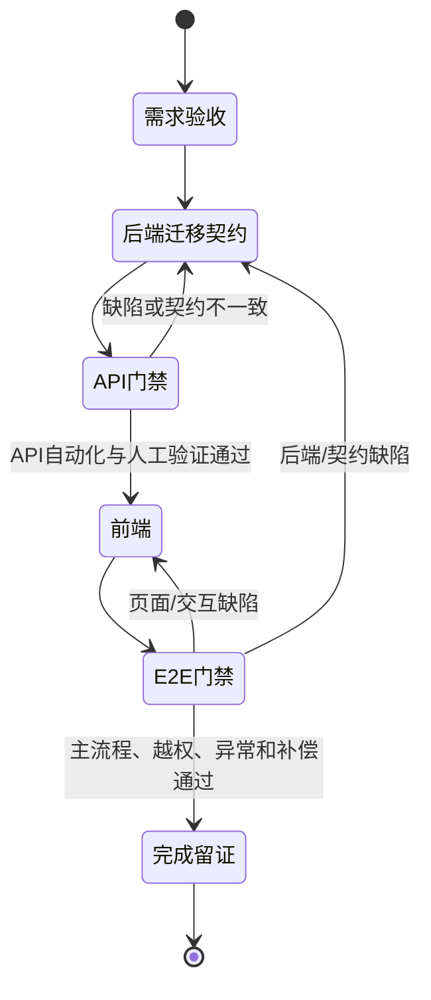

# 充电运营平台全功能交付执行手册（Codex）

> 版本：v1.1 
> 状态：现行执行 Runbook 
> 更新：2026-08-14 
> 适用：`charge-ai` 充电运营平台 W1–W12 的全部 106 个菜单/入口。 
> 授权边界：本手册将已批准范围转成可连续执行的作业流；不新增范围、不提前启用外部能力、不改变排期，也不替代用户对变更、延期、加班、真实外部启用和上线的决定。

## 1. 连续执行方式

收到一次“按本手册开始/继续执行”后，Codex 自动完成当前模块内全部已批准且不依赖外部决定的作业：恢复状态、实现、测试、修复本模块缺陷、留证、提交，并在通过出口后衔接下一模块。用户不需要为每一个小任务重新描述或确认。

当前基线：2026-08-17 至 2026-11-20、60 个承诺工作日、P1/P2/M1–M4/D1 共 106 项；2026-09-25 至 2026-10-07 不开发。W0 已验证工程骨架，不等于 W1 已开始。

Codex 可自行决定已冻结范围内的实现顺序、测试补齐、本模块缺陷修复、文档同步、Git/SVN 提交和既有草稿 PR 更新；只有第 4 节出现时才停下请求用户决定。

## 2. 固定恢复与实施规则

每次新会话、模块切换或出现不一致时，必须按顺序阅读：根 `AGENTS.md` → [12 周实施计划](../requirements/充电运营平台12周全功能交付实施计划-v3.md) → [总控台账](../../delivery/execution/00-执行总控台账.md) → [依赖矩阵](../../delivery/execution/01-模块路线图与依赖矩阵.md) → 改动时的[审批日志](../../delivery/execution/02-变更与审批日志.md) → 完成判断时的[完成记录](../../delivery/execution/03-模块完成记录.md)、[一致性核对](../../delivery/execution/04-一致性核对清单.md)、[SVN 待同步](../../delivery/execution/05-SVN待同步清单.md)。随后执行 `git status -sb`、`svn update`、`svn status` 并检查本次范围。

需求以 [需求基线版本清单](../requirements/需求基线版本清单-v4.1.md)、菜单架构、功能说明、业务规则和场景图集为准；服务/数据边界以[架构基线](../design/充电运营平台架构基线与服务边界-v2.md)，事件以 [Kafka 事件目录](../../contracts/events/README.md) 为准。`archive/` 资料不得用作实现依据。

所有模块严格循环：

- 业务模块采用传统 `controller → service → mapper/entity` 分层，全部代码、测试、契约与配置写中文注释；高风险 Service 用状态机、策略、计算器、校验器加强。
- 迁移只前向新增；服务只写自己的 Schema；跨服务协作只经受控 client 或已登记的事件、Outbox/Inbox 和消费者组。
- 契约先登记、后实现；API 含统一响应、错误码、`traceId`、幂等与数据范围。前端只在 API 门禁通过后开始，且具备加载、空、错误、无权限、关闭/降级态。
- 每个功能至少验证正常、边界、重复/幂等、越权、异常、补偿和审计。Mock 只完成内部门禁，不能替代真实微信、真实监管或真实 V2G。
- 模块出口自动更新台账、完成记录、核对清单、契约、Runbook/API/用户文档；内网可用时先最小范围提交 SVN，再 Git 提交、推送分支和更新既有草稿 PR。

## 3. W1–W12 主作业队列

### W1 工程跑道（8/17–8/21）

1. 冻结并评审个人主档/渠道身份/隐私会话、充值资金批次、支付路由、订单结算快照、锁单后调整、V2G 独立收益余额、`evco_ecosystem` 监管任务，以及 Kafka Topic/消费者组/幂等/DLQ 的 DDL、OpenAPI、AsyncAPI、MQTT 和错误码。
2. 建设 GitHub Actions、Compose、Flyway、统一 API、传统分层/中文注释、前端与测试 workspace、格式/静态分析、Mockito 显式 agent、依赖/密钥/文档链接检查。
3. 建设 TraceId、审计、幂等、数据治理、受控配置引用、脱敏 Mock/夹具、Testcontainers、架构/契约/迁移测试底座、风险和缺陷记录。

出口：所有评审资料可审查且无未决冲突；流水线可重复运行并阻止不合格合入；尚不创建业务页面、空端点、空 Topic 或空消费者。

### W2 IAM、个人身份与配置（8/24–8/28）

1. 实现平台→租户→企业的用户、角色、页面/数据范围、授权上限、审计与 M3 工作空间重鉴权；P1 不向企业客户开放。
2. 实现微信/支付宝渠道抽象、个人主档、唯一身份映射、服务端授权码校验、验证手机号、会话失效/限流/防重放、隐私同意、冲突人工处置。
3. 实现小程序生命周期、内容/业务开关、支付与结算渠道引用、受控配置健康校验，以及 P1/P2/M1–M4/D1 的会话、路由、错误和关闭态应用壳。

出口：个人身份幂等、冲突拒绝、越权与审计通过；M1 按“应用→渠道→开关→场站→用户资格”可用，未验证手机号只可浏览；C1-Mock 通过，C1-W 待真实资料。

### W3 资产主数据（8/31–9/4）

1. 实现租户、合作方、场站、设备、枪口、计量/变压器/总表关系、经营属性、开放范围、收益模型、资产字段模板及审计。
2. 实现场站营业、服务标签、公告、停车减免、出入口/车位、园区门禁的业务映射与异常记录。
3. 完成统一设备接入/IOT 同步的资产引用、状态、冲突和差异处理。

出口：业务资产与接入侧只读事实边界清晰；数据范围、审计、V2G/重卡属性及独立/IOT 模式 E2E 通过；不接管第三方协议、密钥、收款、退款或发票。

### W4 设备、遥测与实时运营（9/7–9/11）

1. 实现设备认证、MQTT 契约、原始证据、标准化遥测、Redis/ClickHouse 投影、质量标记、归档、告警与协议追溯。
2. 实现远程启停/复位的授权快照、命令状态机、有效期、超时/未知、回执、重试/DLQ，以及 WebSocket 短期票据、断线重连。
3. 交付 P1 实时监控、设备协议追溯、告警、远程记录、场站/设备多选分析，及 M1/M3/M4 授权实时状态。

出口：遥测迟到/重复、命令幂等/越权/过期、断线恢复、来源/质量/延迟展示通过；只有设备业务回执可以标记已执行。

### W5 个人交易（9/14–9/18）

1. 实现计费、服务费、时段价格、价格快照、充电会话、个人订单状态机、扫码启停、设备补报和人工异常。
2. 实现占位提醒时长、提醒记录、通知事件与 Mock、回执/频控、枪口空闲自动结束和人工拨号入口。
3. 交付 P1 充电订单/占位提醒/计费管理，M1 找站、扫码、充电与订单主链路。

出口：M1 找站→扫码→启动→充电→结束，连同失败、重复、漏报、异常和审计 E2E 通过；占位提醒不创建订单或自动收费。

### W6 个人资金与用户 360°（9/21–9/24、10/8）

1. 实现现金资金批次、钱包余额/冻结/释放、支付意图/路由快照、微信/支付宝 Mock、重复回调、原路退款、对账与补偿。
2. 实现商户迁移、退款补差、客服申诉、个人交易明细，以及 P1 用户 360°（订单、权益、车辆、账户、行为）。
3. 交付 M1 钱包/充值、车辆、认证、客服、收藏、设置和发票服务入口。

出口：正常、重复、超时、失败、部分退款、旧/新商户混合余额通过；未消费充值退款不进入租户结算；C2-Mock 通过、C2-W 待真实资料。

### W7 企业管理（10/9–10/15）

1. 实现企业资料、合同、组织、角色、成员、授权上限，P2/M4 企业管理。
2. 实现 VIN、车辆分组、电卡/卡组、绑卡、挂失、额度、冻结、站点范围与跨分组标记。
3. 实现企业扫码、VIN/电卡/授信路径、企业异常订单、企业协议价版本/价格快照与 P2/M2/M4 入口。

出口：一车/一卡唯一有效分组；VIN、电卡、资金/额度、授信、无 VIN、晚到订单与协议价冲突均可验证、可审计、可处置。

### W8 企业资金与租户结算（10/16–10/22）

1. 实现企业预存、授信、分组划拨/锁定、冻结、扣款、充值/退款与流水。
2. 实现结算账户、场站结算方案及快照、月账单、对账差异、锁单、来票、付款、回单、补付与重试；交付 M3 协同。
3. 建立收款商户、个人资金批次、充电订单、租户账单四账对账与调整。

出口：企业资金与租户隔离；一个场站仅一个有效方案；未消费充值退款不入结算；订单退款/补差产生调整；锁单/付款后只追加调整，不回写历史。

### W9 运营营销（10/23–10/29）

1. 交付 P1 运营概览、待办预警、告警工单、场站定时充电策略、停车/门禁/道闸协同，以及 M3 运营工作台。
2. 交付会员权益、活动介绍、发券、充值/充电/积分活动、精准营销、优惠资产核销、营销权限、消息公告与内容投放。
3. 交付 M1 权益、M3 运营协同、M4 工作台/订单协同。

出口：策略默认不打断在充订单；告警→工单→SLA→验收闭环；权益、预算、成本承担、库存、触达、核销和订单关系可追溯；条件连接器关闭态明确。

### W10 分析、票据与监管内部就绪（10/30–11/5）

1. 实现购售电价、经营/收益/资产运维分析，D1 运营、场站设备、订单营收、告警和监管专题，以及 P1 大屏配置发布。
2. 实现个人/企业充电发票、租户来票、平台服务费发票、申请/复核/邮件/红冲/下载/重试；M1/M4 有发票入口、M2 无入口。
3. 由 `ecosystem-service` 实现监管档案、目标路由、任务状态机、模拟报送、回执、漏推、补推、对账、异常及 P1/D1 入口。

出口：指标口径、质量、延迟、授权导出通过；票据扫描、短时链接和审计通过；监管 Schema/Topic/消费者/DLQ 与内部 E2E 通过，状态只能是“内部就绪”，C3-R 待真实接入。

### W11 V2G 模拟与关闭态（11/6–11/12）

1. 实现放电授权/策略、双向计量模拟、`SIMULATED` 会话/订单、放电价格、模拟风控、监控和分析。
2. 交付 M1/M2 V2G 扫码、实时提示、模拟订单以及独立收益余额/明细；P1/D1 专题。
3. 对条件渠道仅执行已获批准的联调；未获资料时维持未配置/测试中/待联调/关闭状态。

出口：模拟记录与真实设备、真实资金账本、监管事实隔离；不得用负数充电订单建模；真实放电、真实收益、提现申请/付款/回单/记录一律不创建。

### W12 发布就绪（11/13–11/19）与上线（11/20）

1. 跑全菜单回归、API/E2E、性能、安全、依赖扫描、Kafka 积压恢复、WebSocket 断线恢复、备份恢复、迁移/回滚演练与 UAT。
2. 完成真实微信登录/支付/结果通知/原路退款、至少一种真实 MQTT 上游/设备、目标省市监管真实报送/回执/对账 C3-R；未完成即形成 No-Go。
3. 完成生产配置核验、迁移/Runbook、告警、备份、培训、首周值守、日报、回滚预案和签字材料。

出口：106 项逐项有证据，P0/P1 为零，R6 候选包齐全；只有用户明确批准才能上线或延期。

## 4. 不可回退的跨模块验收

| 领域 | 必须持续成立的事实 |
| --- | --- |
| M1 身份 | 主档和渠道映射幂等；冲突不合并；P1 不配置个人页面/功能权限；未验证手机号不可交易。 |
| 资金与商户 | 现金批次可追溯，非现金不可退款；退款走原路由；旧商户保留历史退款/对账。 |
| 租户结算 | 只依订单场站结算快照；未消费充值退款不入结算；锁单/付款后只追加调整。 |
| 企业 | 企业资金与租户隔离；车辆/电卡唯一分组；VIN/电卡/授信异常可处置。 |
| 设备 | 控制有授权、幂等、有效期、回执与未知结果处理；遥测来源/质量/延迟可见。 |
| 监管与 V2G | 监管无设备控制权；真实监管须 C3-R；V2G 默认模拟/关闭，提现关闭。 |
| 安全与数据 | 数据范围、审计、脱敏、留存、导出、短时链接、密钥引用和告警均可验证。 |

## 5. 唯一需要用户决定的硬停止

| 触发事实 | Codex 必须停止并提交的材料 |
| --- | --- |
| 范围、菜单、服务边界、数据模型或已验收模块需改变 | 影响、兼容/迁移、回归、日期影响和审批日志草案。 |
| 提前启动、周末开发、延期、加班或缩减范围 | 不改变日历，提交可选排期。 |
| 真实微信/商户、监管、设备、V2G 环境/资料不足 | 继续 Mock/关闭态，列出真实门禁；不索取或记录秘密值。 |
| 现役规则/契约冲突 | 冲突事实、受影响范围和可选方案。 |
| P0/P1、资金不一致、越权、数据泄露、不可恢复迁移 | 隔离与证据、根因、修复/回归方案；阻止后续模块。 |
| 上线、回滚、真实渠道启用、真实 V2G 试点 | 已完成材料和明确的生产操作清单。 |

## 6. 完成判定与日常报告

每次工作结束，Codex 应报告：当前模块与状态、已完成事实、验证命令和结果、修复中的缺陷、外部真实门禁、Git/SVN 状态、下一个自动动作。未触发第 5 节时，下个会话直接从该动作继续，不要求用户重述任务。

只有以下全部满足，才能报告“全功能交付完成、可提交上线决定”：106 项及子项均有需求/契约/迁移/API/前端/E2E/权限异常/文档证据；W1–W11 完成记录齐全；W12 质量、安全、性能和恢复演练通过且 P0/P1 为零；真实微信、设备与 C3-R 门禁独立留证；Git/SVN 无未解决待同步；上线决定已由用户记录。

## 7. 权威引用

- [项目恢复与版本库规则](../../../AGENTS.md)
- [12 周实施计划](../requirements/充电运营平台12周全功能交付实施计划-v3.md)
- [需求基线版本清单](../requirements/需求基线版本清单-v4.1.md)
- [菜单架构](../requirements/充电运营平台菜单架构-v4.1.md)、[功能说明](../requirements/充电运营平台功能详细说明-v4.1.md)、[业务规则](../requirements/充电运营平台业务规则基线-v4.1.md)、[场景图集](../requirements/充电运营平台场景与流程图集-v4.1.md)
- [工程规范](全栈研发工程规范-v1.md)、[协作治理](单人AI协作开发与变更治理规范-v1.md)、[架构基线](../design/充电运营平台架构基线与服务边界-v2.md)、[事件目录](../../contracts/events/README.md)

## 修订记录

| 时间 | 版本 | 修订原因 |
| --- | --- | --- |
| 2026-08-14 | v1.0 | 新增 Codex 辅助执行资料。 |
| 2026-08-14 | v1.1 | 用户要求从提示语模板改为 W1–W12 全功能连续执行 Runbook；覆盖作业队列、自动衔接、硬停止和上线判定，不改变现行范围、日期或审批结论。 |
